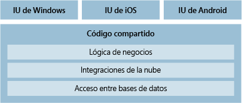
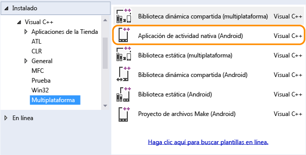
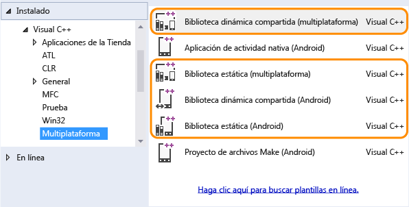

# Desarrollo móvil multiplataforma en Visual Studio
Puede crear aplicaciones para dispositivos Android, iOS y Windows con Visual Studio.  Al diseñar la aplicación, use las herramientas de Visual Studio para agregar fácilmente servicios conectados, como Office 365, Azure App Service y Application Insights.

 Crear aplicaciones mediante C# y .NET Framework, HTML y JavaScript o C++. Comparta código, cadenas, imágenes y, en algunos casos, incluso la interfaz de usuario.

 Si quiere compilar un juego o una aplicación gráfica inmersiva, instale Visual Studio Tools para Unity y disfrute de las eficaces características de productividad de Visual Studio con Unity, el popular entorno de desarrollo y motor multiplataforma de juegos y gráficos para aplicaciones que se ejecuta en iOS, Android, Windows y otras plataformas.

 **En este artículo:**

-   [Compilar una aplicación para Android, iOS y Windows (.NET Framework)](#NET)

    -   [Tener como destino Android, iOS y Windows desde una sola base de código](../cross-platform/cross-platform-mobile-development-in-visual-studio.md#AndroidHTML)

    -   [Tener como destino dispositivos Windows 10](../cross-platform/cross-platform-mobile-development-in-visual-studio.md#WindowsHTML)

-   [Compilar una aplicación para Android, iOS y Windows (HTML/JavaScript)](#HTML)

-   [Compilar una aplicación para Android y Windows (C++)](#CPP)

-   [Compilar un juego multiplataforma para Android, iOS y Windows con Visual Studio Tools para Unity](#Unity)

##   Compilar una aplicación para Android, iOS y Windows (.NET Framework)
 

 Con Xamarin, puede tener como destino Android, iOS y Windows en la misma solución, compartir código e incluso la interfaz de usuario.

|**Más información**|
|--------------------|
|[Instalar Visual Studio](http://www.visualstudio.com/products/visual-studio-community-vs) (VisualStudio.com)|
|[Obtener información acerca de Xamarin en Visual Studio](http://www.visualstudio.com/explore/xamarin-vs) (VisualStudio.com)|
|[Visual Studio y Xamarin](../cross-platform/visual-studio-and-xamarin.md) (MSDN Library)|
|[Administración del ciclo de vida de las aplicaciones (ALM) con aplicaciones de Xamarin](../cross-platform/application-lifecycle-management-alm-with-xamarin-apps.md) (MSDN Library)|
|[Obtener información sobre las aplicaciones Windows universales en Visual Studio](https://www.visualstudio.com/vs/universal-windows-platform/) (VisualStudio.com)|
|[Obtener información acerca de las similitudes entre Swift y C#](http://aka.ms/scposter) (download.microsoft.com)|
|[Obtener información acerca del emulador de Visual Studio para Android](http://www.visualstudio.com/explore/msft-android-emulator-vs) (VisualStudio.com)|

###   Tener como destino Android, iOS y Windows desde una sola base de código
 Puede compilar aplicaciones nativas para Android, iOS y Windows usando C# o F# (Visual Basic no se admite en este momento).  Para empezar, instale Visual Studio 2015, seleccione la opción **Personalizado** en el instalador y active la casilla bajo **Desarrollo móvil multiplataforma > C#/.NET (Xamarin)**. También puede comenzar con el [Instalador de Xamarin](https://www.xamarin.com/download), que es necesario para instalar Xamarin para Visual Studio 2013.

 Si ya tiene instalado Visual Studio 2015, ejecute el instalador desde **Panel de Control > Programas y características** y seleccione la misma opción **Personalizado** de Xamarin como antes.

 Cuando termine, las plantillas de proyecto aparecen en el cuadro de diálogo **Nuevo proyecto**. La manera más fácil de encontrar las plantillas de Xamarin es buscar por "Xamarin".

 Xamarin expone la funcionalidad nativa de Android, iOS y Windows como objetos .NET. Por tanto, las aplicaciones tienen acceso total a las API nativas y a los controles de usuario nativos, y tienen la misma capacidad de respuesta que las aplicaciones escritas en los lenguajes nativos de la plataforma.

 Después de crear un proyecto, podrá aprovechar todas las características de productividad de Visual Studio. Por ejemplo, podrá usar un diseñador para crear páginas y usar IntelliSense para explorar las API nativas de las plataformas móviles. Cuando esté listo para ejecutar la aplicación y ver su aspecto, puede usar el emulador de Visual Studio para Android o el emulador del SDK de Android que seleccione, ejecutar aplicaciones Windows de manera nativa o ejecutar aplicaciones Windows en el emulador de Windows Phone. También puede usar directamente dispositivos Android y Windows anclados a red. Para los proyectos de iOS, conéctese a un Mac en red e inicie el emulador de Mac desde Visual Studio, o conéctese a un dispositivo anclado a red.

#### Diseñar un conjunto de páginas que se representan en todos los dispositivos mediante Xamarin.Forms
 Según la complejidad del diseño de las aplicaciones, puede considerar la posibilidad de compilarlas usando plantillas *Xamarin.Forms* en el grupo **Aplicaciones móviles** de plantillas de proyecto. Xamarin.Forms es un kit de herramientas de interfaz de usuario que permite crear una única interfaz de usuario que puede compartir entre Android, iOS y Windows.  Al compilar una solución Xamarin.Forms, obtendrá una aplicación Android, una aplicación iOS y una aplicación Windows. Para obtener más detalles, vea [Más información sobre el desarrollo móvil con Xamarin](../cross-platform/learn-about-mobile-development-with-xamarin.md).

####   Compartir código entre aplicaciones de Android, iOS y Windows
 Si no está usando Xamarin.Forms y opta por un diseño individual para cada plataforma, puede compartir la mayor parte del código que no sea de interfaz de usuario entre los proyectos de plataforma (Windows, iOS y Android). Esto incluye cualquier lógica de negocios, la integración en la nube, el acceso a bases de datos o cualquier otro código que tenga como destino .NET Framework. El único código que no se puede compartir es el código que tiene como destino una plataforma específica.

 

 El código se puede compartir mediante un proyecto compartido, un proyecto de Biblioteca de clases portable o ambos. Posiblemente verá que algunos códigos encajan mejor en un proyecto compartido y que otros tienen más sentido dentro de un proyecto de Biblioteca de clases portable.

|**Más información**|
|--------------------|
|Decida si va compartir el código mediante proyectos compartidos, proyectos de Biblioteca de clases portable o ambos   [Compartir código entre plataformas](http://blogs.msdn.com/b/dotnet/archive/2014/04/21/sharing-code-across-platforms.aspx) (blog de .NET Framework)   [Sharing Code Options (Opciones de uso compartido de código)](http://developer.xamarin.com/guides/cross-platform/application_fundamentals/building_cross_platform_applications/sharing_code_options/) (Xamarin)   [Opciones de uso compartido de código con .NET Framework](http://msdn.microsoft.com/library/dn720832.aspx) (MSDN Library)|

###   Tener como destino dispositivos Windows 10
 

 Si quiere crear una única aplicación que tenga como destino la gran variedad de dispositivos de Windows 10, cree una aplicación de Windows universal. Podrá diseñar la aplicación usando un solo proyecto y las páginas se representarán correctamente en cualquier dispositivo que se use para verlas.

 Comience con una plantilla de proyecto de aplicación de Windows universal. Diseñe visualmente las páginas y, después, ábralas en una ventana de vista previa para ver cómo se ven en diversos tipos de dispositivos. Si no le gusta cómo se muestra una página en un dispositivo, puede optimizar la página para ajustarla mejor al tamaño de pantalla, la resolución o las distintas orientaciones, como el modo vertical o el horizontal. Puede hacer todo eso con opciones de menú de fácil acceso y ventanas de herramientas intuitivas en Visual Studio. Cuando esté listo para ejecutar la aplicación y recorrer el código, encontrará todos los emuladores de dispositivos y los simuladores de diferentes tipos de dispositivos en una lista desplegable que se encuentra en la barra de herramientas **Estándar**.

 Windows 10 es bastante nuevo, por lo que también encontrará plantillas de proyecto que tienen como destino Windows 8.1. Puede usar esas plantillas de proyecto también y la aplicación se ejecutará en teléfonos, tabletas y equipos de Windows 10. En cambio, todos los dispositivos que ejecutan Windows 8.1 recibirán una actualización automática Windows 10, así que, a menos que tenga razones específicas para elegir Windows 8.1 como destino, se recomienda que use las plantillas de proyecto para Windows 10.

|**Más información**|
|--------------------|
|[Obtener información acerca de las aplicaciones Windows universales](https://msdn.microsoft.com/library/windows/apps/dn894631.aspx) (Centro de desarrollo de Windows)|
|[Compilar por primera vez](http://msdn.microsoft.com/library/windows/apps/dn609832.aspx) (Centro de desarrollo de Windows)|
|[Desarrollar aplicaciones para la Plataforma universal de Windows (UWP)](../cross-platform/develop-apps-for-the-universal-windows-platform-uwp.md)|
|[Migrar aplicaciones a la Plataforma universal de Windows (UWP)](https://msdn.microsoft.com/en-us/library/mt148501.aspx)|

##   Compilar una aplicación para Android, iOS y Windows (HTML/JavaScript)
 

 Si es un desarrollador web familiarizado con HTML y JavaScript, puede usar Visual Studio Tools para Apache Cordova para crear una aplicación que tenga como destino iOS, Android y Windows. Estas aplicaciones pueden destinarse a las tres plataformas y puede crearlas con las habilidades y los procesos con los que esté más familiarizado.

 Apache Cordova es un marco que incluye un modelo de complementos. Este modelo de complementos proporciona una única API de JavaScript que puede usar para tener acceso a las características de dispositivo nativas de las tres plataformas (Android, iOS y Windows).

 Como estas API son multiplataforma, puede compartir la mayor parte de lo que escriba entre las tres plataformas. Esto reduce los costos de desarrollo y mantenimiento. Además, no es necesario empezar desde cero. Si creó otros tipos de aplicaciones web, puede compartir esos archivos con la aplicación Cordova sin tener que modificarlas ni rediseñarlas de manera alguna.

 

 Para empezar, instale Visual Studio 2015 y elija la característica **HTML/JavaScript (Apache Cordova)** durante la instalación. Si usa Visual Studio 2013, instale la extensión de Visual Studio Tools para Apache Cordova. En cualquier caso, las herramientas de Cordova instalan automáticamente todo el software de terceros necesario para crear una aplicación multiplataforma.

 Después de instalar la extensión, abra Visual Studio y cree un proyecto **Aplicación vacía (Apache Cordova)** . Después, desarrolle la aplicación usando JavaScript o TypeScript. También puede agregar complementos para ampliar la funcionalidad de la aplicación; a medida que escriba código, aparecerán las API de los complementos en IntelliSense.

 Cuando esté listo para ejecutar la aplicación y recorrer el código, seleccione un emulador, como el emulador Apache Ripple o el emulador de Visual Studio (Android o Windows Phone), un explorador o un dispositivo que esté conectado directamente al equipo. Después, inicie la aplicación. Si está desarrollando su aplicación en un equipo con Windows, puede incluso ejecutarla en él. Todas estas opciones están integradas en Visual Studio como parte de Visual Studio Tools para Apache Cordova.

 Las plantillas de proyecto para crear aplicaciones universales de Windows siguen estando disponibles en Visual Studio, así que no dude en usarlas si solo tendrá como destino dispositivos de Windows. Si más adelante decide tener como destino Android e iOS, siempre puede trasladar el código a un proyecto de Cordova. Existen versiones de código abierto de las API de WinJS, de modo que se puede reutilizar cualquier código que use esas API. Es decir, si tiene previsto tener como destino otras plataformas en el futuro, es recomendable que comience con Visual Studio Tools para Apache Cordova.

|**Más información**|
|--------------------|
|[Instalar Visual Studio](http://www.visualstudio.com/products/visual-studio-community-vs) (VisualStudio.com)|
|[Introducción a Visual Studio Tools para Apache Cordova](https://docs.microsoft.com/visualstudio/cross-platform/tools-for-cordova/) (docs.microsoft.com)|
|[Obtener información acerca del emulador de Visual Studio para Android](http://www.visualstudio.com/explore/msft-android-emulator-vs) (VisualStudio.com)|

##   Compilar una aplicación para Android y Windows (C++)
 

 En primer lugar, instale Visual Studio 2015 y las herramientas de Visual C++ para desarrollo móvil multiplataforma. Después, puede compilar una aplicación de actividad nativa para Android o una aplicación que tenga como destino Windows. Todavía no están disponibles las plantillas de C++ que tienen como destino iOS. Puede tener como destino Android y Windows en la misma solución si quiere y, después, compartir código entre ellos mediante una biblioteca compartida estática o dinámica multiplataforma.

 Si necesita compilar una aplicación para Android que requiere algún tipo de manipulación de gráficos avanzada, como un juego, puede hacerlo con C++. Comience con el proyecto **Aplicación de actividad nativa (Android)** . Este proyecto es totalmente compatible con la cadena de herramientas Clang.

 

 Cuando esté listo para ejecutar la aplicación y ver su aspecto, use el emulador de Visual Studio para Android. Es rápido, fiable y fácil de instalar y configurar.

 Además puede crear una aplicación que tenga como destino la gran variedad de dispositivos de Windows 10 usando C++ y una plantilla de proyecto de aplicación de Windows universal. Obtenga más información sobre este punto en la sección [Tener como destino dispositivos Windows 10](#WindowsHTML), anteriormente en este tema.

 Puede compartir código de C++ entre Android y Windows mediante la creación de una biblioteca compartida estática o dinámica.

 

 Puede usar dicha biblioteca en un proyecto  de Windows o Android, como los descritos anteriormente en esta sección. Puede también usarla en una aplicación compilada con Xamarin, Java o cualquier lenguaje que permite invocar funciones en una DLL no administrada.

 A medida que escribe código en estas bibliotecas, puede usar IntelliSense para explorar las API nativas de las plataformas de Android y Windows. Estos proyectos de biblioteca están totalmente integrados con el depurador de Visual Studio para que pueda establecer puntos de interrupción, recorrer el código y buscar y corregir problemas mediante todas las características avanzadas del depurador.

|**Más información**|
|--------------------|
|[Descargar Visual Studio.](http://www.visualstudio.com/products/visual-studio-community-vs) (VisualStudio.com)|
|[Instalar Visual C++ para obtener herramientas de desarrollo móvil multiplataforma.](https://msdn.microsoft.com/library/dn872463\(v=vs.140\).aspx) (MSDN Library)|
|[Obtener información acerca de cómo usar C++ para múltiples plataformas de destino.](https://www.visualstudio.com/vs/cplusplus-mdd/) (VisualStudio.com)|
|[Instalar lo necesario y crear una aplicación de actividad nativa para Android](https://msdn.microsoft.com/library/dn872463\(v=vs.140\).aspx) (MSDN Library)|
|[Obtener información acerca del emulador de Visual Studio para Android](http://www.visualstudio.com/explore/msft-android-emulator-vs) (VisualStudio.com)|
|[Más información sobre cómo compartir código de C++ con aplicaciones Android y Windows](https://www.visualstudio.com/vs/cplusplus-mdd/) (VisualStudio.com)|
|[Ejemplos de desarrollo móvil multiplataforma para C++](https://msdn.microsoft.com/library/dn707596.aspx) (MSDN Library)|
|[Ejemplos adicionales de desarrollo móvil multiplataforma para C++](https://code.msdn.microsoft.com/site/search?f%5B0%5D.Type=SearchText&f%5B0%5D.Value=android&f%5B1%5D.Type=ProgrammingLanguage&f%5B1%5D.Value=C%2B%2B&f%5B1%5D.Text=C%2B%2B) (code.msdn)|

##   Compilar un juego multiplataforma para Android, iOS y Windows con Visual Studio Tools para Unity
 Visual Studio Tools para Unity es una extensión gratuita para Visual Studio que integra las eficaces herramientas de edición de código, productividad y depuración de Visual Studio con *Unity*, el popular motor y entorno de desarrollo multiplataforma de juegos y gráficos para aplicaciones inmersivas destinadas a Windows, iOS, Android y otras plataformas, incluida la Web.

 

 Con Visual Studio Tools para Unity (VSTU), puede usar Visual Studio para escribir scripts de editor y juegos en C# y, a continuación, usar su eficaz depurador para buscar y corregir errores. La versión más reciente de VSTU aporta compatibilidad con Unity 5 e incluye colores de sintaxis del lenguaje de sombreado de ShaderLab de Unity, una mejor sincronización con Unity, una depuración más completa y una generación de código mejorada para el asistente de MonoBehavior. VSTU también integra los archivos de proyecto de Unity, los mensajes de la consola y la capacidad de iniciar el juego en Visual Studio, de modo que pueda dedicar menos tiempo a conmutar con el editor de Unity al escribir código.

 Empiece hoy mismo a crear su juego con Unity y Visual Studio Tools para Unity.

|**Más información**|
|--------------------|
|[Obtener información acerca de la compilación de juegos Unity con Visual Studio](https://www.visualstudio.com/en-us/features/unitytools-vs.aspx)|
|[Obtener más información sobre Visual Studio Tools para Unity](../cross-platform/visual-studio-tools-for-unity.md) (MSDN Library)|
|[Comenzar a usar Visual Studio Tools para Unity](../cross-platform/getting-started-with-visual-studio-tools-for-unity.md) (MSDN Library)|
|[Obtener más información acerca de las mejoras más recientes de Visual Studio Tools para Unity 2.0 Preview](http://blogs.msdn.com/b/visualstudio/archive/2014/12/03/visual-studio-tools-for-unity-2-0-preview.aspx) (blog de Visual Studio)|
|[Ver un vídeo de introducción a Visual Studio Tools para Unity 2.0 Preview](http://www.bing.com/videos/search?q=visual+studio+tools+for+unity&qs=n&form=QBVLPG&pq=visual+studio+tools+for+unity&sc=6-29&sp=-1&sk=#view=detail&mid=0A13177F0BC7463A24080A13177F0BC7463A2408) (vídeo)|
|[Obtener información acerca de Unity](http://unity3d.com/) (sitio web de Unity)|

## Vea también
 - [Agregar la API de Office 365 a un proyecto de Visual Studio](http://msdn.microsoft.com/library/office/dn605899\(v=office.15\).aspx)
 - [Azure App Services: aplicaciones móviles](https://azure.microsoft.com/en-us/services/app-service/mobile/)
 - [HockeyApp para móviles](https://azure.microsoft.com/en-us/services/hockeyapp/)
