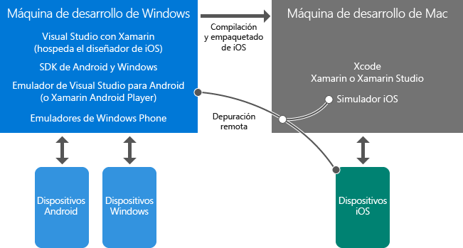

# Más información sobre el desarrollo móvil con Xamarin

En este artículo se enumeran diversas introducciones que pueden ayudarlo a entender a desarrollar aplicaciones móviles multiplataforma con Xamarin. Si aún no tiene instalado Visual Studio y Xamarin, inicie primero el proceso [Configuración e instalación](../cross-platform/setup-and-install.md) y, después, regrese aquí para trabajar con estos recursos mientras se ejecutan los instaladores.

> [!NOTE]
> A menos que se indique lo contrario, es posible que inicialmente solo le interese leer aquellas páginas vinculadas directamente desde aquí y no páginas subsidiarias. Si el proceso de instalación sigue ejecutándose después de completar esta lista, puede volver atrás y explorar otros temas.
>
> También puede consultar los temas marcados como "Conceptos básicos" y volver a los temas "En profundidad" más adelante.

## Conceptos básicos: introducción a Xamarin

*10-20 minutos*

1.  [Aplicaciones móviles en Visual Studio con Xamarin](https://visualstudio.microsoft.com/xamarin/) (visualstudio.com) ofrece un breve resumen de las características principales de Xamarin.

2.  [Build Cross-Platform Mobile Apps using C# and Visual Studio](https://channel9.msdn.com/Events/Visual-Studio/Visual-Studio-2015-Final-Release-Event/Building-cross-platform-mobile-apps-using-C-and-Visual-Studio-2015) (Compilación de aplicaciones móviles multiplataforma con C# y Visual Studio) en Channel 9, 15 m 16 s, con el predicador de Xamarin, James Montemagno. Los primeros tres minutos son una introducción a Xamarin, seguida de demostraciones de código.

## Conceptos básicos: información general del entorno de Visual Studio y Xamarin

*5-15 minutos*

-   Realizará la mayor parte del trabajo en el equipo Windows con Visual Studio y Xamarin instalados. En este equipo se compilan directamente las aplicaciones de Windows y Android, que se ejecutan y depuran en el equipo de escritorio, en dispositivos o en emuladores. Las aplicaciones de iOS también se pueden compilar, ejecutar y depurar de forma remota a través del Mac. Visual Studio en el equipo Windows también se puede conectar al diseñador de guiones gráficos de iOS y al simulador de iOS.

-   El Mac con Xcode y Visual Studio para Mac instalados actúa como el host de compilación, el host de firma y el entorno en tiempo de ejecución para las aplicaciones de iOS. El equipo Windows delega las compilaciones de iOS en este equipo Mac. La aplicación se ejecuta en un simulador de iOS en el Mac o directamente en un dispositivo anclado a red conectado al Mac. Puede interactuar con la aplicación en el equipo Mac, pero puede llevar a cabo la experiencia de depuración en Visual Studio.

Estas relaciones se ilustran a continuación.

> [!NOTE]
> El Windows Phone se muestra en este diagrama para fines de integridad. Cuando se usa la plataforma Xamarin, la opción recomendada para compartir el código es una biblioteca estándar de .NET 2.0, que no es compatible con dispositivos Windows Phone o Windows 10 Mobile.

Puede obtener más información sobre el uso de aplicaciones de iOS en [Introduction to Xamarin.iOS for Visual Studio](/xamarin/ios/get-started/installation/windows/introduction-to-xamarin-ios-for-visual-studio/) (Introducción a Xamarin.iOS con Visual Studio).

## Conceptos básicos: cómo se estructuran los proyectos

*10-30 minutos*

1.  [Sharing Code Options (Opciones de uso compartido de código)](/xamarin/cross-platform/app-fundamentals/code-sharing/). Para las aplicaciones nuevas, debe utilizar una biblioteca estándar de .NET para compartir código. La mayoría del código de lógica empresarial residirá en la biblioteca estándar de .NET, incluidos el acceso a las bases de datos, las llamadas a las API de REST y las llamadas a componentes de Xamarin portables. (Consulte [En profundidad: componentes de Xamarin](#components) al final de este artículo). El código de interfaz de usuario común escrito con Xamarin.Forms también reside en una biblioteca estándar de .NET.

2.  (Opcional) En [Case Study: Tasky](/xamarin/cross-platform/app-fundamentals/building-cross-platform-applications/case-study-tasky/) (Caso práctico: Tasky) se describen algunos procedimientos recomendados para el diseño y la estructura de una aplicación completa, como la estructura del proyecto con código compartido que separa los datos, el acceso a datos y las capas de negocio.

## Conceptos básicos: capas de la interfaz de usuario de Xamarin.Forms y Native

*10-40 minutos*

Xamarin ofrece dos formas de compilar aplicaciones magníficas: Xamarin Native y Xamarin.Forms.

Con Xamarin Native, puede escribir código de interfaz de usuario independiente para cada plataforma de destino: iOS, Android y Windows.  Con este enfoque tiene acceso directo a API específicas de la plataforma para diseñar una experiencia de interfaz de usuario personalizada para cada plataforma.  También tendrá acceso total al diseñador y los controles nativos de cada plataforma como ayuda en la creación de la interfaz de usuario correspondiente.

Xamarin.Forms ofrece un conjunto generalizado de API que permiten escribir una capa de interfaz de usuario compartida para todas las plataformas de una biblioteca estándar de .NET.  Xamarin.Forms se representa en controles nativos en cada plataforma de destino para ofrecer una apariencia nativa.  En lugar de utilizar un diseñador, la interfaz de usuario se compila con C# y XAML.

La mayoría de los desarrolladores utiliza Xamarin.Forms. Esta es la ruta recomendada para los desarrolladores que comienzan con Xamarin. El enfoque de Xamarin Native es más difícil y requiere un conocimiento más detallado de las plataformas de destino.

No es necesario decidir por adelantado qué método se seguirá; las aplicaciones se pueden implementar con una combinación de Xamarin.Forms y Xamarin Native:

-   Utilice Xamarin.Forms para compilar pantallas de uso general. Estas pantallas ofrecen interfaces de usuario y funcionalidades similares entre plataformas, como los inicios de sesión, los formularios de contacto y los resultados de búsqueda.

-   Use una variedad de funcionalidades de personalización de Xamarin.Forms para ajustar la interfaz de usuario según la plataforma. La opción de personalización más sencilla implica la API de `OnPlatform`. También puede generar vistas personalizadas, extender representadores existentes y crear representadores personalizados.

-   Si fuera necesario, utilice Xamarin Native para compilar pantallas que usen características de interfaz de usuario únicas de cada plataforma. Un ejemplo es una pantalla que utilice la captura de cámara nativa y la manipulación de imágenes.

Por lo general, debe comenzar con una solución de Xamarin.Forms para configurar el uso compartido del código de interfaz de usuario entre plataformas. Utilice las capacidades de personalización y, a continuación, realice ajustes específicos de plataforma. En los casos en que necesite pantallas completamente específicas de la plataforma, puede agregarlas individualmente con Xamarin Native.

Para más información:

1.  [Xamarin.Forms](/xamarin/xamarin-forms/) proporciona una breve introducción, así como las ventajas y desventajas de Xamarin.Forms frente a las capas de interfaz de usuario nativa (es decir, Xamarin.iOS y Xamarin.Android).

2.  Los primeros tres minutos del vídeo de James Montemagno [Xamarin.Forms: aplicaciones nativas de iOS, Android y Windows con C# y XAML](https://channel9.msdn.com/events/Visual-Studio/Connect-event-2015/704) (Channel9, 13 m 3 s) ofrecen otra visión general y permiten ver otras demostraciones.

3.  (Opcional) [Introducción a Xamarin.Forms](/xamarin/xamarin-forms/get-started/introduction-to-xamarin-forms/)

4.  (Opcional) Vea ejemplos del uso de `OnPlatform` para la personalización en la documentación de [Device Class](/xamarin/xamarin-forms/platform/device/) (Clase Device)

5.  (Opcional) [Multiplataforma: compartir código de la interfaz de usuario en plataformas móviles con Xamarin.Forms](https://msdn.microsoft.com/magazine/dn904669.aspx) por Jason Smith (MSDN Magazine) es un artículo en el que se describen las distintas opciones de personalización de Xamarin.Forms, cuyos detalles se tratan en [Custom Renderers](/xamarin/xamarin-forms/app-fundamentals/custom-renderer/) (Representadores personalizados).

## En profundidad: depuración con emuladores

*10-15 minutos*

Para depurar las aplicaciones entre plataformas sin tener que usar un dispositivo físico, necesitará utilizar los emuladores que se tratan aquí:

### Emulador Android de Microsoft

Se recomienda que use el [emulador de Microsoft Visual Studio para Android](visual-studio-emulator-for-android.md), que se instala con Visual Studio.  En el vídeo [Visual Studio Emulator for Android](https://channel9.msdn.com/events/Visual-Studio/Connect-event-2015/711) (Emulador de Visual Studio para Android) de Channel9 (5 m 55 s), se ofrece información general y una demostración.

### Simulador de iOS de Apple

Para obtener más información, lea [Getting Started with the iOS Simulator](https://developer.apple.com/library/prerelease/content/documentation/IDEs/Conceptual/iOS_Simulator_Guide/GettingStartedwithiOSSimulator/GettingStartedwithiOSSimulator.html#//apple_ref/doc/uid/TP40012848-CH5-SW1) (Introducción al simulador de iOS) en apple.com.

### Emulador de Microsoft Windows Phone

Para obtener más información, consulte [Pruebas con el emulador de Microsoft para Windows 10 Mobile](/windows/uwp/debug-test-perf/test-with-the-emulator).

<a name="components" />

## Deeper Dive: Xamarin Components

*10 minutos*

Muchas de las capacidades extendidas están disponibles para aplicaciones de Xamarin a través de los componentes de Xamarin. Puede encontrar el catálogo completo disponible para descargar en [http://components.xamarin.com/](http://components.xamarin.com/), que incluye componentes para los controles de interfaz de usuario adicionales, autenticación, una variedad de servicios en la nube, como Microsoft Azure, y mucho más.