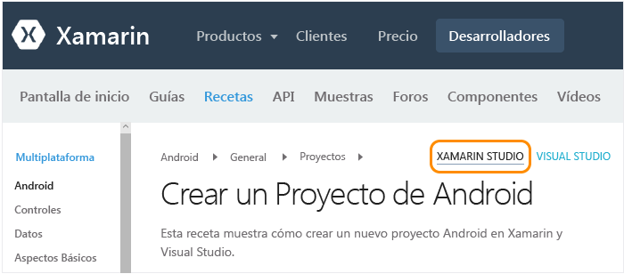
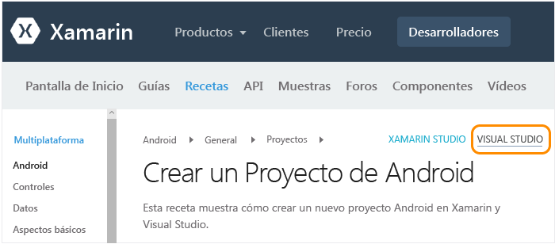
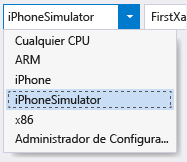
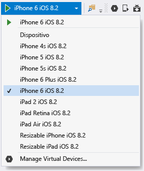

# Configuración, instalación y comprobaciones para usuarios de Mac
Este tema está destinado a los desarrolladores que trabajan principalmente con Mac y que, opcionalmente, usan Visual Studio en una máquina virtual de Windows en el Mac. Si es un desarrollador que trabaja principalmente en un equipo Windows y necesita configurar un Mac secundario para iOS, vea el tema [Configuración e instalación](../cross-platform/setup-and-install.md) principal.

 Para trabajar con Xamarin en un Mac, necesitará lo siguiente:

-   Mac con macOS Sierra 10.12 o versiones posteriores con Xcode y Xamarin instalados.

-   Una de las siguientes configuraciones:

    -   **Para ejecutar Xamarin Studio directamente en el Mac:** Xamarin Studio es el entorno de desarrollo de Xamarin, que admite la compilación de aplicaciones para Android, iOS y Windows con C#.  Para obtener una introducción rápida de Xamarin Studio, consulte la [información general de Xamarin Studio](https://xamarin.com/studio) (xamarin.com).

    -   **Si ya tiene Parallels o VMWare configurado en el Mac:** ejecute Windows con Visual Studio 2017 y Xamarin en Parallels o VMWare.  Con esta configuración, Xamarin es una extensión que se instala con Visual Studio y que ofrece la posibilidad de usar Visual Studio como entorno de desarrollo para compilar aplicaciones para Android, iOS y Windows con C#.  Tenga en cuenta que puede obtener una suscripción gratuita de 3 meses de Parallels como parte del programa Visual Studio Developer Essentials. Consulte [Microsoft Visual Studio Dev Essentials Will Include Parallels Desktop Pro and Parallels Access](http://blog.parallels.com/blog/2015/11/18/visual-studio-dev-essentials/) (Microsoft Visual Studio Dev Essentials incluirá Parallels Desktop y Parallels Access ) en el blog de Parallels.

 En este tema se ofrecen instrucciones para estos requisitos.  Mientras se ejecuta el proceso de instalación, puede revisar el tema [Más información sobre el desarrollo móvil con Xamarin](../cross-platform/learn-about-mobile-development-with-xamarin.md) para leer y consultar el material de referencia necesario.

##   Configuración de Mac (ID de Apple, Xcode y Xamarin)

1.  Cree un ID de Apple gratuito en [Mi ID de Apple](https://appleid.apple.com/) si aún no tiene uno. Este paso es necesario para la instalación y el inicio de sesión en Xcode.

2.  Descargue e instale Xcode desde [https://developer.apple.com/xcode/](https://developer.apple.com/xcode/).

3.  Descargue e instale Xamarin siguiendo las instrucciones de [Installing and Configuring Xamarin.iOS](http://developer.xamarin.com/guides/ios/getting_started/installation/mac/) (Instalación y configuración de Xamarin.iOS) en xamarin.com.

4.  Cuando complete la instalación de Xamarin en los equipos Windows y Mac, siga las instrucciones de [Connecting to the Mac](http://developer.xamarin.com/guides/ios/getting_started/installation/windows/#Connecting_to_the_Mac_Using_XMA) (Conexión al Mac con XMA) en xamarin.com para poder trabajar con iOS y Mac desde Visual Studio en el equipo Windows.

##   Configuración de Windows en Parallels (Visual Studio y Xamarin)

1.  Use el escritorio de Windows configurado en Parallels/VMWare para [descargar e iniciar el instalador de cualquier edición de Visual Studio 2017](https://www.visualstudio.com/downloads/) (Community, Professional o Enterprise). Visual Studio 2017 Community es la edición gratuita; existe una versión de prueba gratuita de 30 días de las ediciones Professional y Enterprise.

2.  En el programa de instalación, haga clic en el botón **Opciones adicionales** (icono de tres barras) _junto a_ **Iniciar** y elija **Modificar**.  
  
       
  
3.  Active las siguientes casillas:

    1.  **Aplicaciones móviles y juegos > Desarrollo móvil con .NET**. Al hacerlo, también se seleccionarán automáticamente las distintas herramientas de Android en Kits de desarrollo de software y herramientas comunes. Esta opción también debe actualizar cualquier instalación de Xamarin existente.  
  
           
  
    2. (Opcional) **Windows > Desarrollo de plataforma universal de Windows**. Se incluyen opciones para instalar imágenes de emuladores que tardarán más tiempo en descargarse; siempre puede volver al instalador de Visual Studio para agregarlos más adelante.  

4.  Haga clic en el botón **Modificar** y deje que se ejecute el proceso. De nuevo, este proceso tardará algo de tiempo en completarse, durante el cual puede continuar con las instrucciones de configuración del Mac y repasar [Más información sobre el desarrollo móvil con Xamarin](../cross-platform/learn-about-mobile-development-with-xamarin.md).

5.  Una vez completada la instalación, inicie Visual Studio e inicie sesión con su cuenta de Microsoft si se le solicita (es decir, la misma cuenta que usa con Windows).

6.  Cuando complete la instalación de Xamarin en los equipos Windows y Mac, siga las instrucciones de [Connecting to the Mac using XMA](http://developer.xamarin.com/guides/ios/getting_started/installation/windows/#Connecting_to_the_Mac_Using_XMA) (Conexión al Mac mediante XMA) en xamarin.com para poder trabajar con iOS desde Visual Studio.

##   Comprobar el entorno
 Una vez completados los instaladores, dedique unos minutos a comprobar que todo está listo para la experiencia de desarrollo de Xamarin.

### Xamarin Studio
 En primer lugar, al navegar a los vínculos proporcionados, asegúrese de que **Xamarin Studio** esté seleccionado en la esquina superior derecha para ver la versión correcta de la documentación de Xamarin:

 

**Android**

1.  Valide la creación de un proyecto de Android siguiendo las instrucciones de [Create an Android Project](http://developer.xamarin.com/recipes/android/general/projects/create_an_android_project/) (Crear un proyecto de Android) en xamarin.com.

2.  Valide la depuración en el emulador de Android a través de la [documentación de Android Player > Integration with Xamarin Studio](https://developer.xamarin.com/guides/android/getting_started/installation/android-player/#Integration_with_Xamarin_Studio) (Android Player > Integración con Xamarin Studio) en xamarin.com.

**iOS**

1.  Valide la creación de un proyecto de iOS siguiendo las instrucciones de [Create an iOS Project](http://developer.xamarin.com/recipes/ios/general/projects/create_an_ios_project/) (Crear un proyecto de iOS) en xamarin.com.

2.  Valide la depuración en el simulador de iOS a través de la [documentación de Debugging in the Simulator](https://developer.xamarin.com/guides/ios/deployment,_testing,_and_metrics/debugging_in_xamarin_ios/#Debugging_on_the_Simulator) (Depuración en el simulador) en xamarin.com.

### Programa para la mejora
 En primer lugar, al navegar a los vínculos proporcionados, asegúrese de que **Visual Studio** esté seleccionado en la esquina superior derecha para ver la versión correcta de la documentación de Xamarin:

 

**Android**

1.  Valide la creación de un proyecto de Android siguiendo las instrucciones de [Create an Android Project](http://developer.xamarin.com/recipes/android/general/projects/create_an_android_project/) (Crear un proyecto de Android) en xamarin.com.

2.  Valide el diseñador de Android: en el proyecto de Android en el Explorador de soluciones, abra el archivo **Recursos > Diseño > Main.axml**.

    -   Si se muestra un error similar a "El SDK de Android instalado es demasiado antiguo", haga clic en **Abrir el SDK de Android** en dicho mensaje y seleccione la versión del SDK más reciente disponible. Tenga en cuenta que debe estar ejecutando Visual Studio como administrador para actualizar el SDK.

3.  Compruebe que puede conectarse desde Visual Studio al emulador que está instalado en el Mac.  El resultado de esto es que verá el reproductor de Xamarin en la lista de los emuladores que seleccione en Visual Studio para la depuración.  To do this, follow the instructions on [Connecting Visual Studio to the Xamarin Android Player](http://developer.xamarin.com/guides/android/deployment,_testing,_and_metrics/android-player-with-visual-studio-in-vm/) (Conexión de Visual Studio a Xamarin Android Player) en xamarin.com.

**iOS**

1.  Asegúrese de que el Mac esté disponible en la red y emparejado con Visual Studio como se describe en [Connecting to the Mac](https://developer.xamarin.com/guides/ios/getting_started/installation/windows/#Connecting_to_the_Mac) (Conexión al Mac) en xamarin.com.

2.  Valide la creación de un proyecto de iOS siguiendo las instrucciones de [Create an iOS Project](http://developer.xamarin.com/recipes/ios/general/projects/create_an_ios_project/) (Crear un proyecto de iOS) en xamarin.com.

3.  Valide el diseñador del guión gráfico: en el proyecto de iOS en el Explorador de soluciones, abra el archivo **MainStoryboard.storyboard** . En este caso, Visual Studio hospeda el diseñador que se ejecuta de manera remota en el dispositivo Mac.

4.  Valide la compilación y la depuración:

    1.  Haga clic con el botón derecho en el proyecto de iOS en el Explorador de soluciones y seleccione **Establecer como proyecto de inicio**.

    2.  Seleccione el destino **iPhoneSimulator** del menú desplegable de la compilación de Visual Studio, como se muestra a continuación. Si no aparece ningún simulador, inicie Xcode en el Mac, seleccione **Xcode -> Preferencias** y haga clic en **Descargar**. Bajo **Componentes** debería ver las versiones del simulador que están disponibles para descargar. Encontrará instrucciones adicionales para la depuración en la página [Depuración](https://developer.xamarin.com/guides/ios/deployment,_testing,_and_metrics/debugging_in_xamarin_ios/#Debugging_on_the_Simulator) de Xamarin en xamarin.com.

         

    3.  Seleccione un destino de iPhone del menú desplegable de depuración de Visual Studio, tal como se muestra a continuación y presione F5 para iniciar el depurador. Se inicia el simulador en el Mac, donde podrá interactuar con la aplicación mientras se realiza la depuración en Visual Studio.

         