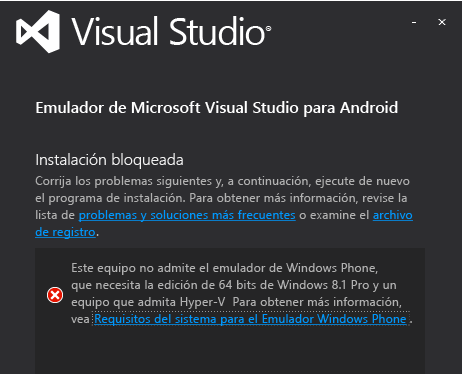
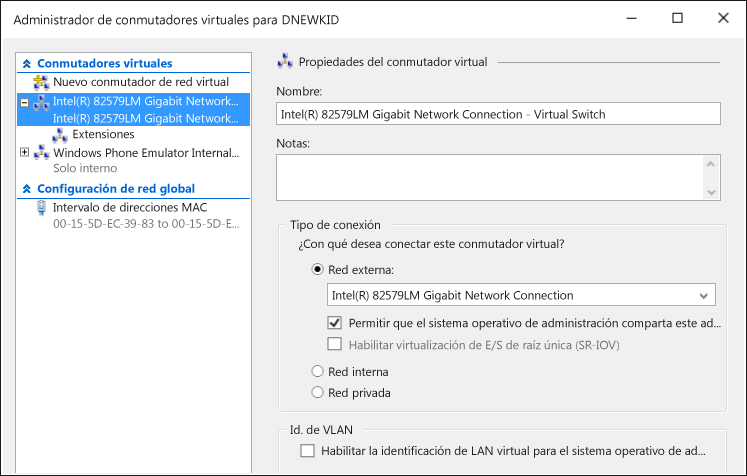

# Solución de problemas del emulador de Visual Studio para Android
Este tema contiene información para ayudarle a resolver problemas que puede experimentar cuando usa el Emulador de Visual Studio para Android.  
  
> [!WARNING]
>  Cuando se instala el emulador, el programa de instalación comprueba los requisitos previos para ejecutar el software. Si estos requisitos no se cumplen se muestra una serie de advertencias, pero no se solicita su instalación.  
  
 Este tema contiene las siguientes secciones:  
  
-   [Antes de empezar](#BeforeYouStart)  
  
-   [El emulador no se instala](#NoInstall)  
  
-   [No se puede conectar a destinos de red en un dominio o una red corporativa](#DomainNetwork)  
  
-   [No se puede conectar a destinos de red cuando la configuración de red requiere configuración manual](#ManualNetworkConfig)  
  
-   [El emulador se inicia lentamente, no puede iniciarse por excederse el tiempo de espera o se produce un error de implementación de aplicaciones](#SlowStart)  
  
-   [El emulador no se inicia](#NoStart2)  
  
-   [Emulator fails to start (first use)](#NoStart)  
  
-   [El equipo no arranca después de instalar el emulador](#NoBoot)  
  
-   [Visual Studio se queda bloqueado al intentar implementar la aplicación en el emulador o el emulador no aparece como destino de depuración en otros IDE.](#ADB)  
  
-   [El emulador deja de responder porque no pudo configurar el puerto UDP.](#XamarinPlayer)  
  
-   [No se puede conectar el depurador a un proyecto Xamarin](#Skylake)  
  
-   [El emulador no puede ejecutar la aplicación que usa Google Play Services](#GooglePlay)  
  
-   [La función de arrastrar y soltar un archivo, un archivo APK o un archivo zip con memoria Flash no funciona](#DragAndDrop)  
  
-   [La resolución de captura de pantalla es incorrecta](#Resolution)  
  
-   [El emulador no representa el contenido OpenGL](#OpenGL)  
  
-   [El emulador no responde a los movimientos multitáctiles](#Multitouch)  
  
-   [Recursos de soporte técnico](#Support)  
  
##   Antes de empezar  
 Antes de empezar a solucionar problemas, puede ser útil revisar los temas siguientes:  
  
-   [System Requirements for the Visual Studio Emulator for Android](../cross-platform/system-requirements-for-the-visual-studio-emulator-for-android.md)  
  
##   El emulador no se instala  
 Si no tiene instalado Hyper-V, verá el siguiente mensaje cuando intente instalar el emulador. Debe tener una máquina que admita Hyper-v y debe estar habilitada.  
  
   
  
> [!NOTE]
>  Este mensaje se aplica al emulador de Visual Studio para Android y al emulador de Windows Phone. Windows 8.1 y Windows 10 son compatibles con el emulador.  
  
 Si ve este mensaje, consulte [System Requirements for the Visual Studio Emulator for Android](../cross-platform/system-requirements-for-the-visual-studio-emulator-for-android.md) para ver si puede ejecutar el emulador.  
  
##   No se puede conectar a destinos de red en un dominio o una red corporativa  
 El Emulador de Visual Studio para Android aparece en la red como un dispositivo independiente, con su propia dirección IP. No se ha unido a un dominio de Windows y no comparte las credenciales de dominio o grupo de trabajo con el equipo host.  
  
 Si la red requiere autorización de dominio o grupo de trabajo para disfrutar de una conectividad básica, póngase en contacto con el administrador de TI para pedir una excepción. Esta excepción permite a su equipo de desarrollo actuar como máquina de frontera y aceptar conexiones de dispositivos de red que no estén unidos al dominio, como el emulador.  
  
 El Emulador de Visual Studio para Android también usa su propio conjunto de direcciones MAC. Si no puede acceder a recursos de red o de Internet desde el emulador, consulte con el administrador de TI para asegurarse de que las direcciones MAC del emulador están autorizadas en la red.  
  
#### Para ver las direcciones MAC del emulador  
  
1.  Inicie el emulador.  
  
2.  En la barra de herramientas del emulador, haga clic en el botón de comillas angulares (>>) para abrir la ventana Herramientas adicionales.  
  
3.  En la ventana Herramientas adicionales, haga clic en la pestaña Red.  
  
4.  En la página Red, busque las entradas de Dirección física.  
  
##   No se puede conectar a destinos de red cuando la configuración de red requiere configuración manual  
 Para conectarse a destinos de red desde el emulador, la red debe cumplir los siguientes requisitos:  
  
-   DHCP. El emulador requiere DHCP porque se configura automáticamente como un dispositivo independiente en la red, con su propia dirección IP.  
  
-   Configuración automática de puerta de enlace y DNS. No es posible definir manualmente la configuración DNS y de puerta de enlace.  
  
 Si la red requiere una configuración manual, consulte al administrador de TI para determinar cómo se puede habilitar la conectividad de red para el emulador.  
  
##   El emulador se inicia lentamente, no puede iniciarse por excederse el tiempo de espera o se produce un error de implementación de aplicaciones  
 En ciertas condiciones, el emulador tarda varios minutos en iniciarse o no se puede iniciar por exceder el tiempo de espera. Si el emulador no se puede iniciar, verá el mensaje siguiente: `App deployment failed. Please try again`. Las condiciones siguientes pueden producir este error.  
  
-   Ejecutar el Emulador de Visual Studio para Android desde un VHD de arranque. Esta configuración no se admite.  
  
-   Un disco duro defectuoso. Considere la posibilidad de ejecutar el programa chkdsk.  
  
-   Un disco duro que necesita desfragmentación. Considere la desfragmentación de la unidad.  
  
-   Un disco duro casi lleno. Compruebe el espacio disponible en la unidad.  
  
-   No hay suficiente memoria disponible debido a otras aplicaciones en ejecución. Reduzca el número de aplicaciones que consumen memoria o aumente la cantidad de memoria.  
  
-   En general, cualquier factor que contribuya a un rendimiento deficiente del sistema. Empiece a solucionar problemas con el componente que tenga la puntuación más baja en la evaluación de la experiencia de Windows. Puede ver este valor en la página Información de rendimiento y herramientas del Panel de control.  
  
##   El emulador no se inicia  
 Si el emulador estaba funcionando, pero ahora no funciona, debe realizar las siguientes tareas. Si está usando el emulador por primera vez, consulte [Emulator fails to start (first use)](#NoStart) antes de seguir estos pasos.  
  
-   Quite cualquier otra instancia de Hyper-V del emulador.  
  
    1.  Cierre Visual Studio.  
  
    2.  Abra el Administrador de Hyper-V y detenga cualquier instancia de Hyper-V del emulador (máquinas virtuales) que se esté ejecutando y que podría estar dañada.  
  
    3.  En el Administrador de Hyper-V, elimine cualquier otra máquina virtual del emulador.  
  
    4.  Reinicie la máquina.  
  
-   Asegúrese de que tiene al menos 4 GB de memoria de sistema y de que no la consumen otros programas y procesos con un gran consumo de recursos (por ejemplo, intente cerrar las ventanas del explorador).  
  
-   En el Administrador de Hyper-V, abra el administrador de conmutadores virtuales y compruebe que tiene dos conmutadores de red; compruebe que el primero es un conmutador interno y el segundo es externo.  
  
       
  
     Si la instalación no es correcta y está usando Windows 10, debería intentar el paso [Vuelve a instalar los dispositivos de red mediante el comando netcfg –d](http://windows.microsoft.com/en-us/windows-10/fix-network-connection-issues) (sección 6).  
  
-   Si estos pasos no resuelven el problema, consulte [Emulator fails to start (first use)](#NoStart) para obtener información sobre software de terceros que puede interferir con el emulador.  
  
##   Emulator fails to start (first use)  
 Si el emulador no se inicia, realice los siguientes procedimientos para identificar y solucionar el problema.  
  
-   Asegúrese de que se cumplen los requisitos mínimos de hardware y de que la configuración de la BIOS es correcta.  
  
     El emulador e Hyper-V de Windows 8 requieren un procesador de 64 bits con traducción de direcciones de segundo nivel (SLAT). En el caso de Intel, necesita un procesador Core i3, i5 o i7 (o uno de los muchos Xeon). Encontrará una lista de los chips AMD [aquí](http://support.amd.com/en-us).  
  
    1.  Asegúrese de que su equipo cumple los [requisitos del sistema](../cross-platform/system-requirements-for-the-visual-studio-emulator-for-android.md).  
  
    2.  Compruebe que la [herramienta SLAT](https://slatstatuscheck.codeplex.com/) indica que su equipo es compatible con SLAT.  
  
    3.  En la configuración de la BIOS de su equipo, asegúrese de que todas las tecnologías de virtualización están habilitadas. Las descripciones exactas de la BIOS varían mucho de un fabricante de hardware a otro. En general, habilite características como:  
  
        -   SLAT (Traducción de direcciones de segundo nivel)  
  
        -   EPT (Tablas de página extendida) (Intel)  
  
        -   NPT (Tablas de página anidada) (AMD)  
  
        -   RVI (Indización de virtualización rápida) (AMD)  
  
        -   VMX (un acrónimo de Intel que indica compatibilidad con la virtualización asistida por hardware)  
  
        -   SVM (un acrónimo de AMD que indica compatibilidad con la virtualización asistida por hardware)  
  
        -   XD (Execute Disable) (Intel); debe habilitarse  
  
        -   NX (No Execute)(AMD); debe habilitarse  
  
    4.  Si las siguientes opciones están presentes en la BIOS, deshabilítelas.  
  
        -   Deshabilitar Intel VT-d  
  
        -   Deshabilitar Trusted Execution  
  
         Para obtener más información, vea este artículo: Technet: Hyper-V: Cómo corregir errores de BIOS habilitando Hyper-V.  
  
    5.  Asegúrese de que tiene al menos 4 GB de memoria de sistema y de que no la consumen otros programas y procesos con un gran consumo de recursos.  
  
    6.  Asegúrese de que está ejecutando Windows 8 Professional o superior (Windows Server 2008 no es compatible). Windows Server 2012 sí es compatible, pero debe habilitar la Experiencia de escritorio.  
  
     Puede inspeccionar el Visor de eventos para ver si hay algún error de hipervisor. Para ello, abra el Visor de eventos (tecla Inicio + R y luego escriba `eventvwr`) y elija **Registros de Windows**, **Sistema**. Después, filtre el registro por origen de eventos y establezca el origen en **Hipervisor de Hyper-V**. Compruebe si hay errores para ayudar a identificar la causa.  
  
     Si el procesador cumple los requisitos mínimos pero el hipervisor sigue fallando, considere la posibilidad de buscar si hay disponible una actualización de la BIOS de su equipo. Si la hay y decide actualizarla, cumpla durante este proceso todas las precauciones indicadas por el fabricante (como asegurarse de que la actualización del firmware de la BIOS no se interrumpa por una pérdida de corriente, lo que podría dañar la BIOS de forma permanente).  
  
-   Asegúrese de que tiene al menos 4 GB de memoria de sistema y de que no la consumen otros programas y procesos con un gran consumo de recursos.  
  
-   Quite o deshabilite los controladores o software de terceros que pueda estar interfiriendo con las funciones de la red virtual.  
  
     Existen problemas conocidos con determinados productos de terceros instalados en Windows 8, como controladores o protocolos de red que no son totalmente compatibles con la pila de red de Hyper-V.  
  
     En general, depende de los desarrolladores de esos productos actualizar su software para que sea compatible con Windows 8 e Hyper-V.  
  
     Los siguientes productos pueden requerir una actualización de compatibilidad con Windows 8: VirtualBox, Virtual PC 7, VMWare, algunos clientes VPN, firewalls de software, algunas versiones de los clientes VPN de Cisco y otros sistemas de virtualización. Póngase en contacto con los desarrolladores del software de virtualización de funcionamiento dudoso para animarlos a actualizarlo, de modo que sea compatible con Windows 8 e Hyper-V.  
  
     Como **solución alternativa**, puede deshabilitar todos los controladores y aplicaciones de terceros que puedan interferir con la red virtual usada por el emulador para comunicarse con Visual Studio. Entre estas aplicaciones pueden estar:  
  
    -   Aplicaciones antivirus (que se conectan con la pila de red)  
  
    -   Herramientas de supervisión de red  
  
    -   Herramientas de inicio de sesión en red  
  
    -   Otro software de supervisión del sistema  
  
     Otra posible solución, aparte de desinstalar los productos en cuestión (y solicitar a su desarrollador que publique una versión actualizada), es realizar los pasos siguientes.  
  
    1.  Inicie el Administrador de conexiones de red (desde la pantalla de inicio, escriba `View Network Connections` y elija esta opción para ver las conexiones de red).  
  
    2.  Para el adaptador vEthernet (conmutador interno del emulador de Windows Phone para el puerto Ethernet interno), elija **Propiedades** en el menú contextual.  
  
           
  
         Aquí se muestran las propiedades del adaptador.  
  
           
  
    3.  Para este adaptador, los únicos elementos que deberían estar seleccionados en **Esta conexión usa los siguientes elementos** son:  
  
        -   Cliente para redes Microsoft  
  
        -   Programador de paquetes QoS  
  
        -   Compartir impresoras y archivos para redes Microsoft  
  
        -   Controlador de protocolo LLDP de Microsoft  
  
        -   Controlador de E/S del asignador de detección de topologías de nivel de vínculo  
  
        -   Respondedor de detección de topologías de nivel de vínculo  
  
        -   Protocolo de Internet versión 6 (TCP/IPv6)  
  
        -   Protocolo de Internet versión 4 (TCP/IPv4)  
  
    4.  Desmarque cualquier otro elemento.  
  
     La desventaja de esta técnica es que deberá repetir estos pasos cada vez un nuevo producto de terceros instale controladores no compatibles, o cada vez que instale el emulador.  
  
     Después de desinstalar productos de terceros, es posible que necesite restaurar el conmutador interno del emulador de Windows Phone. Siga estos pasos:  
  
    -   Abra Hyper V y vaya al Administrador de conmutadores virtuales. Crear un conmutador virtual denominado "Conmutador interno del emulador de Windows Phone" y establezca su tipo de conexión en **Red interna**.  
  
           
  
     Ahora, inicie el emulador. Debería funcionar.  
  
##   El equipo no arranca después de instalar el emulador  
 Este problema puede ocurrir cuando las condiciones siguientes son ciertas:  
  
-   El equipo tiene una placa base Gigabyte.  
  
-   USB3 está habilitado en la placa base.  
  
 Para solucionar este problema, deshabilite USB3 en la configuración de la BIOS de la placa base y reinicie el equipo. Después, compruebe si Gigabyte ha publicado una actualización para la BIOS de su placa base.  
  
 Para obtener más información, consulte el siguiente artículo de Knowledge Base: [Error de arranque después de instalar el rol Hyper-V en sistemas Gigabyte](https://support.microsoft.com/en-us/kb/2693144).  
  
##   Visual Studio se queda bloqueado al intentar implementar la aplicación en el emulador o el emulador no aparece como destino de depuración en otros IDE.  
 Si el emulador se está ejecutando, pero no parece estar conectado a ADB (Android Debug Bridge) o no aparece en las herramientas de Android que usan ADB (por ejemplo, Android Studio o Eclipse), puede que necesite ajustar la ubicación en la que el emulador busca ADB. El emulador usa una clave de registro para identificar la ubicación base del SDK de Android y busca el archivo \platform-tools\adb.exe en ese directorio. Para modificar la ruta de acceso del SDK de Android usada por el emulador:  
  
-   Abra el Editor del registro seleccionando **Ejecutar** en el menú contextual de los botones de Inicio. Luego, escriba `regedit` en el cuadro de diálogo y elija **Aceptar**.  
  
-   Vaya a HKEY_LOCAL_MACHINE\SOFTWARE\Wow6432Node\Android SDK Tools en el árbol de carpetas de la izquierda.  
  
-   Modifique la variable del registro **Path** para que coincida con la ruta de acceso del SDK de Android.  
  
 Reinicie el emulador; ahora debería verlo conectado a ADB y a las herramientas Android asociadas.  
  
##   El emulador deja de responder porque no pudo configurar el puerto UDP.  
 Puede experimentar este problema debido a una incompatibilidad con Xamarin Player. Si el emulador parece que deja de responder o ve este mensaje de error: "El emulador no puede conectarse al sistema operativo del dispositivo: No se pudo configurar el puerto UDP".  Some functionality might be disabled", es posible que esté experimentando este problema. Realice las acciones siguientes:  
  
1.  Desinstale Xamarin Player.  
  
2.  Compruebe que ese cuadro virtual se quitó (Xamarin Player se ejecuta en la parte superior del cuadro virtual).  
  
3.  Vaya al Administrador de dispositivos, seleccione la opción para mostrar dispositivos ocultos y después elimine todo excepto las tarjetas de red física.  
  
4.  Puede intentar desinstalar o volver a instalar Hyper-V después de quitar los adaptadores de red no físicos.  
  
##   No se puede conectar el depurador a un proyecto Xamarin  
 Si está ejecutando Windows 10 con procesadores Skylake de Intel, es posible que las aplicaciones de Xamarin no se ejecuten en el emulador o que el depurador de Visual Studio no pueda conectarse a ellas. Esto es debido a un problema con Hyper-V y los procesadores Skylake. Realice los pasos siguientes para solucionar este problema.  
  
1.  Abra el Administrador de Hyper-V y seleccione la máquina virtual del perfil de emulador que está usando.  
  
2.  Seleccione **Eliminar estado guardado** (esquina inferior derecha).  
  
3.  Seleccione **Configuración...**  
  
4.  Expanda el nodo del procesador y elija **Compatibilidad**.  
  
5.  Habilite **Migrar a un equipo físico con una versión de procesador distinta**.  
  
6.  Reinicie el servicio (en **Acciones**) e inténtelo de nuevo.  
  
##   El emulador no puede ejecutar la aplicación que usa Google Play Services  
 El emulador no se distribuye con las bibliotecas de los servicios de Google Play. Sin embargo, el emulador no admite la instalación de archivos zip con memoria Flash mediante arrastrar y soltar.  
  
##   La función de arrastrar y soltar un archivo, un archivo APK o un archivo zip con memoria Flash no funciona  
 El emulador utiliza ADB.exe para facilitar la transferencia de archivos cuando arrastra y coloca un archivo en la pantalla. Si se produce un error al intentar arrastrar y colocar un archivo, probablemente se debe a que el emulador no está conectado a ADB.exe. Para resolverlo, siga los pasos descritos en [Visual Studio se queda bloqueado al intentar implementar la aplicación en el emulador o el emulador no aparece como destino de depuración en otros IDE](#ADB).  
  
##   La resolución de captura de pantalla es incorrecta  
 Si realiza una captura mediante la pestaña Captura de pantalla de la ventana **Herramientas adicionales** y la imagen resultante tiene un tamaño inesperado, puede que necesite ajustar el nivel de zoom de la pantalla antes de elegir **Capturar**. El emulador realiza capturas de pantalla con la resolución del monitor de su equipo host.  
  
##   El emulador no representa el contenido OpenGL  
 El emulador representa el contenido OpenGL con la GPU de su equipo host y usa el proyecto ANGLE para convertir estas llamadas a y desde DirectX. Si la aplicación se representa correctamente en un dispositivo pero de forma incorrecta en el emulador, es probable que el dispositivo esté realizando una llamada OpenGL incorrecta (por ejemplo, usando variables de sombreador que no coincidan).  
  
##   El emulador no responde a los movimientos multitáctiles  
 En algunos casos, el emulador se inicia y no responde al movimiento multitáctil, ni por interacción directa con la pantalla táctil, ni al usar la herramienta multitáctil de la barra de herramientas del emulador. En este caso elija el botón **Girar** de la barra de herramientas del emulador e intente usar de nuevo el movimiento multitáctil. Si el problema persiste, consulte [El emulador no representa el contenido OpenGL](#OpenGL) .  
  
##   Recursos de soporte técnico  
 Si el equipo host cumple los requisitos del sistema y detecta un problema que no se trata en esta guía de solución de problemas:  
  
-   Formule una pregunta en StackOverflow con las etiquetas [android-emulator](http://stackoverflow.com/questions/tagged/android-emulator) y visual-studio.  
  
-   Notifique un problema con la herramienta Enviar una sonrisa en Visual Studio o en el administrador del emulador.