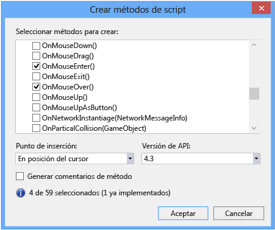
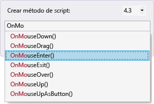
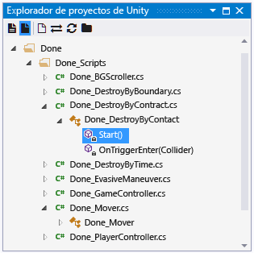
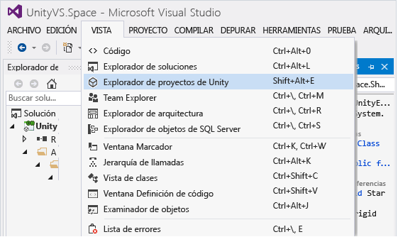
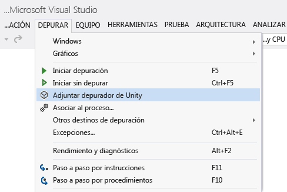
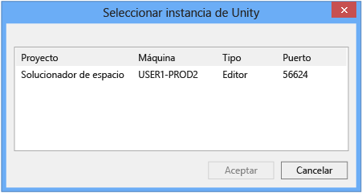
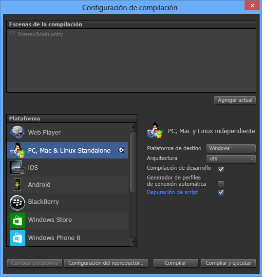
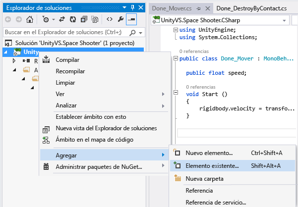

# Uso de Visual Studio Tools para Unity
En esta sección aprenderá a utilizar las características de productividad e integración de Visual Studio Tools para Unity y cómo utilizar al depurador de Visual Studio para el desarrollo en Unity.  

## Productividad e integración de Unity  
 Visual Studio Tools para Unity se integra con el Editor de Unity para ayudarle a ser más productivo. Estas características de mejora de la productividad automatizan tareas comunes de scripting y envían información de Unity a Visual Studio para que no tenga que cambiar al Editor de Unity para encontrarla.  

### Acceso a la documentación de Unity  
 Puede acceder rápidamente a la documentación de creación de scripts de Unity desde Visual Studio. Si Visual Studio Tools para Unity no encuentra localmente la documentación de la API, intentará encontrarla en línea.  

##### Para acceder a la documentación de Unity  

-   En Visual Studio, resalte o coloque el cursor sobre la API de Unity sobre la que quiere obtener información y, después, presione **Ctrl+Alt+M, Ctrl+H**  

### Asistente de scripting de MonoBehavior de Unity  
 En Unity la mayoría de los scripts se implementan derivando a partir de la clase MonoBehavior y reemplazando algunos de sus métodos. Puede utilizar al Asistente de MonoBehavior para crear rápidamente definiciones vacías de los métodos de MonoBehavior que desee sobrecargar. Con este asistente puede especificar uno o varios métodos que desee sobrecargar de la lista de métodos disponibles, elegir dónde se insertará en el código y decidir si desea incluir comentarios acerca de cómo se utilizan.  

   

##### Para crear definiciones de métodos MonoBehavior vacíos con el asistente de MonoBehavior  

1.  En Visual Studio coloque el cursor donde quiera que se inserten los métodos y, después, presione **Ctrl+Mayús+M** para iniciar el asistente de MonoBehavior. O si quiere insertar los nuevos métodos después de uno que ya se haya implementado, puede especificarlo más adelante. Solo tiene que presionar **Ctrl+Mayús+M**.  

2.  Seleccione los métodos que desee sobrecargar. En la ventana **Crear métodos de script**, en **Seleccionar métodos a crear**, marque la casilla que hay junto al nombre de cada método que quiere sobrecargar.  

3.  Asegúrese de que la versión de Framework que se muestra en la lista desplegable **Versión de Framework** coincida con la versión que está usando. Si no coincide, cambie el valor de la lista desplegable a la versión que quiera usar.  

4.  Elija dónde se van a insertar los métodos. De forma predeterminada, los métodos se insertan en la posición del cursor; si desea insertarlos en otro lugar, puede elegir insertarlos después de cualquier método que ya se haya implementado en la clase. Para elegir una de estas ubicaciones, cambie el valor de la lista desplegable **Punto de inserción** por la ubicación que quiera.  

5.  Si quiere que el asistente genere los comentarios de los métodos que ha seleccionado, marque la casilla **Generar comentarios de métodos**. Estos comentarios están diseñados para ayudarlo a entender cuando se llama al método y cuáles son sus responsabilidades generales.  

6.  Seleccione el botón **Aceptar** para salir del asistente e insertar los métodos en el código.  

 El asistente de MonoBehavior es especialmente útil si todavía se está aprendiendo la API de Unity o si necesita sobrecargar un método con el que no esté familiarizado. Puede que, a medida que vaya ganando experiencia con la API de Unity, prefiera el asistente rápido de MonoBehavior para crear rápidamente métodos con los que ya está familiarizado.  

#### Asistente rápido de scripting de MonoBehavior  
 Cuando ya esté familiarizado con la API de Unity, puede implementar los métodos de sobrecarga aún más rápidamente mediante el asistente rápido de MonoBehavior. Con este asistente puede especificar solo un método que se inserte sin comentarios en la ubicación del cursor.  

   

###### Para crear una definición vacía de método MonoBehavior con el asistente rápido de MonoBehavior  

1.  En Visual Studio, coloque el cursor donde quiera que se inserte el método y, después, presione **Ctrl+Mayús+Q** para iniciar el asistente rápido de MonoBehavior. Al contrario que el otro asistente de MonoBehavior, debe colocar el cursor intencionadamente al utilizar este asistente porque el nuevo método siempre se inserta en esa posición.  

2.  Asegúrese de que la versión de Framework que se muestra en la esquina superior derecha de la ventana **Crear método de script** coincide con la versión que está usando. Si no coincide, cambie el valor de la lista desplegable a la versión que quiera usar.  

3.  Busque el método que desee sobrecargar. En la ventana Crear método de script, comience a escribir el nombre del método en el cuadro de texto. Se mostrará una lista de los métodos cuyos nombres coincidan con lo que ha escrito.  

4.  Seleccione el método que desee sobrecargar. Cuando se muestre el método que quiera en la lista, selecciónelo con el mouse o las teclas de flecha y, después, presione **Entrar**. Si es el único método de la lista, puede simplemente presionar **Entrar**. El método se inserta en el código.  

### Explorador de proyectos de Unity  
 Puede utilizar el Explorador de proyectos de Unity para navegar por el proyecto de Unity dentro de Visual Studio.  

   

##### Para ver el Explorador de proyectos de Unity  

-   En el menú principal de Visual Studio, seleccione **Vista**, **Explorador de proyectos de Unity**. Teclado: **Alt+Mayús+E**  

       

 El Explorador de proyectos de Unity muestra todos los archivos y directorios del proyecto de Unity de la misma manera que el Editor de Unity. No es lo mismo que navegar por los scripts de Unity con el Explorador de soluciones, que solo contiene sus archivos de script y los muestra como los proyectos, mientras que la solución generada por Visual Studio Tools para Unity los organiza. Especialmente en proyectos grandes, a menudo resulta más fácil encontrar el script que desee modificar mediante el Explorador del proyectos de Unity. También facilita la modificación de otros tipos de archivos (como, por ejemplo, archivos de configuración basados en texto) en Visual studio sin agregarlos a uno de los proyectos de la solución de Visual Studio.  

### Lista de errores de Unity  
 Puede ver los mensajes desde la consola de Unity dentro de Visual Studio cuando esté conectado a una instancia de Unity. Esto incluye los errores y advertencias de Unity. Los mensajes se muestran en la ventana **Lista de errores** de Visual Studio; los mensajes de error de Unity se muestran en la pestaña **Errores**, los mensajes de advertencia en la pestaña **Advertencias** y el resto de los mensajes (como, por ejemplo, los mensajes enviados mediante la API Debug.Log de Unity) se muestran en la pestaña **Mensajes**.  

 Para ver los mensajes, el proyecto de Unity debe [depurar el proyecto en un Reproductor de Unity](#debugging-your-project-in-a-unity-player) para admitir la depuración de scripts y para importar el paquete de Visual Studio Tools para Unity adecuado para su versión de Visual Studio. Además, Visual Studio debe estar [conectado a Unity](#connecting-visual-studio-to-unity).  

 Si no quiere ver errores, advertencias ni mensajes de Unity en la ventana **Lista de errores** de Visual Studio, puede deshabilitarlos en el menú Configuración.  

### Métodos abreviados de teclado  
 Puede acceder rápidamente a las herramientas de Unity para la funcionalidad de Visual Studio mediante el uso de los métodos abreviados de teclado. Este es un resumen de los métodos abreviados disponibles.  

|Comando|Acceso directo|Nombre de comando de acceso directo|  
|-------------|--------------|---------------------------|  
|Abrir el asistente de MonoBehavior|**Ctrl+Mayús+M**|**EditorContextMenus.CodeWindow.ImplementMonoBehaviours**|  
|Abrir el asistente rápido de MonoBehavior|**Ctrl+Mayús+Q**|**EditorContextMenus.CodeWindow.QuickMonoBehaviours**|  
|Abrir el Explorador de proyectos de Unity|**Alt+Mayús+E**|**View.UnityProjectExplorer**|  
|Acceder a la documentación de Unity|**Ctrl+Alt+M, Ctrl+H**|**Help.UnityAPIReference**|  
|Adjuntar a depurador de Unity (reproductor o editor)|***sin valor predeterminado***|**Debug.AttachUnityDebugger**|  

 Si no le gusta el valor predeterminado, puede cambiar las combinaciones de teclas de método abreviado. Para obtener información sobre cómo cambiarlo, vea [Identificar y personalizar métodos abreviados de teclado en Visual Studio](https://msdn.microsoft.com/en-us/library/5zwses53.aspx).  

## Depuración de Unity  
 Visual Studio Tools para Unity permite depurar scripts de editor y juego del proyecto de Unity mediante el potente depurador de Visual Studio.  

###   Conectar Visual Studio a Unity  
 Visual Studio Tools para Unity se comunica con Unity a través de una conexión UDP. Esto significa que puede conectarse a una instancia de Unity que se ejecute de forma local o en cualquier parte de la red exactamente de la misma manera. Puede conectarse a cualquiera de las instancias de Unity que puede ver en la red mediante el cuadro de diálogo **Seleccionar instancia de Unity**.  

##### Para abrir el diálogo Seleccionar instancia de Unity  

-   En el menú principal de Visual Studio seleccione **Depurar**, **Adjuntar depurador de Unity**.  

       

-   *O* en la barra de estado en Visual Studio seleccione el icono con forma de enchufe que se muestra en la esquina inferior derecha de Visual Studio.  

       

> [!TIP]
>  Si el icono con forma de enchufe muestra una marca de verificación, ya está conectado a una instancia de Unity.  

 En el cuadro de diálogo **Seleccionar instancia de Unity** se muestra información sobre cada instancia de Unity a la que puede conectarse.  

   

 **Proyecto**  
 El nombre del proyecto de Unity que se está ejecutando en esta instancia de Unity.  

 **Machine**  
 El nombre del equipo o dispositivo en el que se está ejecutando esta instancia de Unity.  

 **Type**  
 **Editor** si esta instancia de Unity se está ejecutando como parte del Editor de Unity; **Reproductor** si esta instancia de Unity es un reproductor independiente.  

 **Puerto**  
 El número de puerto del socket UDP a través del cual se está comunicando esta instancia de Unity.  

> [!IMPORTANT]
>  Puesto que Visual Studio Tools para de Unity y la instancia de Unity se están comunicando a través de un socket de red UDP, el firewall podría preguntarle al respecto. Si esto sucede, tendrá que autorizar la conexión para que VSTU y Unity puedan comunicarse.  

###   Depuración del proyecto en un Reproductor de Unity  
 Puede conectar Visual Studio Tools para Unity directamente a la aplicación de Unity que se está ejecutando en un reproductor independiente si no está ejecutando el Editor de Unity o para depurar problemas específicos de la plataforma.  

##### Para habilitar la depuración de scripts en un reproductor de Unity  

-   Asegúrese de que está creando una compilación de desarrollo con la depuración de scripts habilitada. En la configuración de compilación del proyecto de Unity, marque las casillas **Compilación de desarrollo** y **Depuración de scripts**.  

   

 Además, para depurar una aplicación de Unity que se ejecuta en el **Reproductor web de Unity**, también tendrá que configurarlo para que use el **Canal de versión de desarrollo**.  

##### Para configurar el Canal de versión de desarrollo en el Reproductor Web de Unity  

-   En el menú contextual del Reproductor web de Unity, seleccione **Canal de versión** y asegúrese de que esté habilitada la opción **Desarrollo**.  

    > [!IMPORTANT]
    >  En Unity 4.2 y versiones posteriores, el elemento de menú contextual **Canal de versión** solo está disponible en el menú contextual del Reproductor web cuando se pulsa la tecla **Alt** al abrirse el menú contextual. Si el Reproductor de Web se ejecuta en Mac OS X, pulse la tecla **Opción** en su lugar.  

 Por último, asegúrese de que está conectado a la instancia de Unity que desea depurar. Para obtener información sobre cómo hacerlo, vea la sección [Conectar Visual Studio a Unity](#connecting-visual-studio-to-unity).  

### Depurar un archivo DLL en un proyecto de Unity  
 Muchos desarrolladores de Unity están escribiendo componentes de código como archivos DLL externos para que la funcionalidad que desarrollan pueda compartirse fácilmente con otros proyectos. Visual Studio Tools para Unity facilita la depuración sin problemas del código de estos archivos DLL con otro código de su proyecto de Unity.  

> [!NOTE]
>  En este momento, Visual Studio Tools para Unity solo admite archivos DLL administrados. No admite la depuración de archivos DLL de código nativo, como los escritos en C++.  

 Tenga en cuenta que el escenario descrito aquí supone que tiene el código fuente, es decir, que está desarrollando o reutilizando su propio código o que tiene el código fuente de una biblioteca de terceros y planea implementarlo en su proyecto de Unity como un archivo DLL. Este escenario no describe la depuración de un archivo DLL del que usted no dispone el código fuente.  

##### Para depurar un proyecto de archivo DLL administrado utilizado en su proyecto de Unity  

1.  Agregue su proyecto DLL existente a la solución de Visual Studio generada por Visual Studio Tools para Unity. Con menor frecuencia, puede que inicie un nuevo proyecto DLL administrado para que contenga componentes de código en su proyecto de Unity. De ser así, puede agregar un nuevo proyecto DLL administrado a la solución de Visual Studio en su lugar. Para obtener más información sobre cómo agregar un proyecto nuevo o existente a una solución, vea [Cómo: Agregar proyectos a una solución](https://msdn.microsoft.com/en-us/library/vstudio/ff460187.aspx).  

       

     En ambos casos, Visual Studio Tools para Unity mantiene la referencia del proyecto, aunque tenga que volver a generar los archivos de proyecto y solución, para que solo tenga que realizar estos pasos una vez.  

2.  Haga referencia al perfil de .NET Framework de Unity correcto en el proyecto DLL. En Visual Studio, en las propiedades del proyecto DLL, establezca la propiedad **Framework de destino** en la versión de .NET Framework de Unity que esté usando. Esta es la Biblioteca de clases base de Unity que coincide con la compatibilidad con la API que su proyecto tiene definido como destino, como las bibliotecas de clases base completas, micro o web de Unity. Esto impide que el archivo DLL llame a métodos de .NET Framework que existan en otros niveles de compatibilidad o marcos de trabajo, pero que podrían no existir en la versión de .NET Framework de Unity que esté utilizando.  

       

3.  Copie el archivo DLL en la carpeta Activos del proyecto de Unity. En Unity, son activos los archivos que se empaquetan e implementan junto con la aplicación de Unity para que se puedan cargar en tiempo de ejecución. Puesto que los archivos DLL se vinculan en tiempo de ejecución, se deben implementar como activos. Para que los archivos DLL se implementen como activos, el Editor de Unity necesita que se coloquen en la carpeta Activos del proyecto Unity. Puede hacer esto de dos formas:  

    -   Modificar la configuración de compilación del proyecto DLL para que incluya una tarea integrada a posteriori que copie los archivos DLL y PDB de salida de la carpeta de salida en la carpeta **Activos** del proyecto de Unity.  

    -   Modificar la configuración de compilación del proyecto DLL para establecer la carpeta de salida como la carpeta **Activos** del proyecto de Unity. Tanto los archivos DLL como PDB se colocarán en la carpeta **Activos**.  

     Los archivos PDB son necesarios para la depuración porque contienen símbolos de depuración de los archivos DLL y asignan el código del archivo DLL a su forma de código fuente. Visual Studio Tools para Unity usará información de los archivos DLL y PDB para crear un archivo DLL.MDB, que es el formato de símbolo de depuración utilizado por el motor de scripting de Unity.  

4.  Depure el código que ha creado. Ahora puede depurar el código fuente de archivos DLL junto con el código fuente del proyecto de Unity y utilizar todas las características de depuración a las que está acostumbrado, como los puntos de interrupción y ejecutar código paso a paso.
