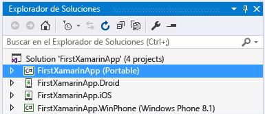
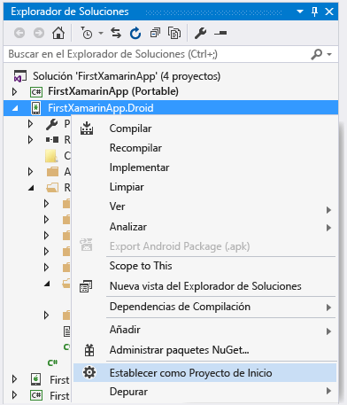
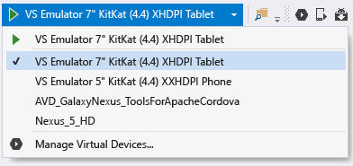
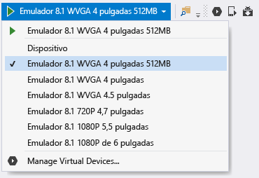
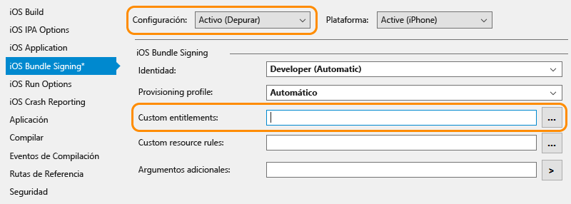

# Comprobar el entorno de Xamarin
Una vez completados los instaladores (vea [Configuración e instalación](../cross-platform/setup-and-install.md)), dedique unos minutos a comprobar que todo esté listo para la experiencia de desarrollo de Xamarin.  
  
 Cuando haya completado estas comprobaciones, puede realizar uno o ambos de los siguientes tutoriales:  
  
-   [Información sobre los conceptos básicos de la compilación de aplicaciones con Xamarin.Forms en Visual Studio](../cross-platform/learn-app-building-basics-with-xamarin-forms-in-visual-studio.md)  
  
-   [Compilar aplicaciones con interfaz de usuario nativa mediante Xamarin en Visual Studio](../cross-platform/build-apps-with-native-ui-using-xamarin-in-visual-studio.md)  
  
## Todas las plataformas  
 En primer lugar, seleccione **Herramientas > Opciones**, expanda **Xamarin > Otros** y haga clic en el vínculo **Comprobar ahora** para las actualizaciones. Debe usar Xamarin 4.0.3.214 o una versión posterior para evitar problemas de licencias anteriores.  
  
 Después, cree una nueva solución de Xamarin en Visual Studio mediante **Archivo > Nuevo proyecto**. Luego, en el cuadro de diálogo, expanda **Plantillas > Otros lenguajes > Visual C# > Multiplataforma**, seleccione **Aplicación en blanco (nativa portátil)** y haga clic en Aceptar. Se crea una solución con un proyecto de biblioteca de clases portable compartida y proyectos individuales de Android, iOS y Windows:  
  
   
  
> [!NOTE]
>  Si las plantillas no están, vea [¿Faltan las plantillas de proyecto de Xamarin? Pruebe esto](#missing) en la parte inferior de esta página.  
  
## Android  
  
1. Compruebe que dispone de las últimas herramientas del SDK de Android instaladas, vaya a **Herramientas > Android > Android SDK Manager** e instale la versión más reciente de las herramientas del SDK de Android, las herramientas de plataforma del SDK de Android y los componentes de herramientas de compilación del SDK de Android. Tenga en cuenta que no es necesario instalar siempre el nivel de API de Android más reciente; la API que necesita depende del nivel de la plataforma de destino. En general, la instalación de Xamarin instalará el nivel de plataforma que requiere.  

2.  Valide el diseñador de Android: en el proyecto de Android en el Explorador de soluciones, abra el archivo **Recursos > Diseño > Main.axml**. (Si no ve este archivo directamente, intente buscarlo en el Explorador de soluciones; solo existe en el proyecto de Android y no en el proyecto de iOS).  
  
    - Si se muestra un error similar a "El SDK de Android instalado es demasiado antiguo", haga clic en **Abrir el SDK de Android** en dicho mensaje para seleccionar e instalar las herramientas de la versión del SDK más reciente disponible, como en el paso 1 anterior. 
  
3.  Valide la compilación y la depuración en el emulador (o el dispositivo):  
  
    -   Haga clic con el botón derecho en el proyecto de Android en el Explorador de soluciones y seleccione **Establecer como proyecto de inicio**.  
  
           
  
    -   Seleccione un emulador adecuado según la versión de Android de destino. Si tiene un dispositivo de desarrollo de Android conectado a su equipo, verá que también se muestra aquí, junto con los emuladores:  
  
        -   Windows 8 y versiones posteriores: seleccione un destino de **VS Emulator** en el menú desplegable de depuración de Visual Studio, tal como se muestra a continuación, y presione **F5**para iniciar el depurador. Para obtener más información, vea [Introducing Visual Studio’s Emulator for Android](http://blogs.msdn.com/b/visualstudioalm/archive/2014/11/12/introducing-visual-studio-s-emulator-for-android.aspx) (Presentación del emulador de Visual Studio para Android) en el blog de Visual Studio ALM. Si tiene problemas al hacer que funcione el emulador, consulte [Troubleshooting the Visual Studio Emulator for Android](../cross-platform/troubleshooting-the-visual-studio-emulator-for-android.md). También puede crear nuevos perfiles de dispositivo para el emulador seleccionando **Herramientas > Emulador de Visual Studio para Android...**.  
  
               
  
             Nota: Si no ve la opción de menú **Herramientas > Emulador de Visual Studio para Android...** , puede que no tenga instalado el propio emulador. Vaya a **Panel de Control > Programas y características**, seleccione **Microsoft Visual Studio** y haga clic en **Cambiar** para volver a ejecutar el programa de instalación. Haga clic en **Modificar** en el programa de instalación, active la casilla **Desarrollo móvil multiplataforma > Emulador de Microsoft Visual Studio para Android** y haga clic en **Actualizar**.  
  
        -   Para Windows 7 y versiones anteriores: seleccione Xamarin Player para Android en el menú desplegable y presione F5 para ejecutarlo. Para obtener detalles sobre Xamarin Player, su administrador de dispositivos y sugerencias para la solución de problemas, lea [Xamarin Android Player](http://developer.xamarin.com/guides/android/getting_started/installation/android-player/) (xamarin.com).  
  
> [!NOTE]
>  En Visual Studio, es posible que observe la presencia del botón Administrador del emulador de Android (AVD) en la barra de herramientas (se muestra a continuación), que abre el Administrador de dispositivos que se utiliza específicamente para configurar el emulador de Google Android.  Esto no influye en el emulador de Visual Studio para Android ni en Xamarin Player, cada uno de los cuales tiene su propio administrador de dispositivos para configurar los perfiles.  Vea [Introducing Visual Studio’s Emulator for Android](http://blogs.msdn.com/b/visualstudioalm/archive/2014/11/12/introducing-visual-studio-s-emulator-for-android.aspx) (Presentación del emulador de Visual Studio para Android) en el blog de Visual Studio ALM y [Xamarin Android Player](http://developer.xamarin.com/guides/android/getting_started/installation/android-player/) en xamarin.com para obtener más información.  
>   
  
## Windows Phone  
  
1.  Valide el diseñador de Windows Phone: en el proyecto de Windows Phone en el Explorador de soluciones, abra el archivo **MainPage.xaml** .  
  
2.  Valide la compilación y la depuración en el emulador o en un dispositivo (nota: Deberá instalar el emulador de Windows Phone a través del programa de instalación de Visual Studio para este paso o disponer de un dispositivo anclado a red):  
  
    -   Haga clic con el botón derecho en el proyecto de Windows Phone en el Explorador de soluciones y seleccione **Establecer como proyecto de inicio**.  
  
    -   Seleccione un destino de **Emulator 8.1** o un dispositivo conectado en el menú desplegable de depuración de Visual Studio, tal como se muestra a continuación, y presione F5 para iniciar el depurador.  
  
           
  
    -   Si tiene problemas para conseguir que el emulador funcione, lea [Troubleshooting the Windows Phone 8 Emulator](https://msdn.microsoft.com/library/windows/apps/jj681694.aspx)(Solución de problemas del emulador de Windows Phone 8).  
  
## iOS  
  
1.  Asegúrese de que el Mac esté disponible en la red y emparejado con Visual Studio como se describe en [Connecting to the Mac](http://developer.xamarin.com/guides/ios/getting_started/installation/windows/xamarin-mac-agent/) (Conexión al Mac) en xamarin.com.  
  
2.  Valide el diseñador del guión gráfico: en el proyecto de iOS del Explorador de soluciones, abra el archivo **Main.storyboard** . En este caso, Visual Studio hospeda el diseñador que se ejecuta de manera remota en el dispositivo Mac.  
  
3.  Valide la compilación y la depuración:  
  
    1.  Haga clic con el botón derecho en el proyecto de iOS en el Explorador de soluciones y seleccione **Establecer como proyecto de inicio**.  
  
    2.  Seleccione el destino de **iPhoneSimulator** en el menú desplegable de la compilación de Visual Studio como se muestra a continuación, o el destino de **iPhone** si tiene un dispositivo anclado a red. Si no aparece ningún simulador, inicie Xcode en el Mac, seleccione **Xcode -> Preferencias** y haga clic en **Descargar**. Bajo **Componentes** debería ver las versiones del simulador que están disponibles para descargar. Encontrará instrucciones adicionales para la depuración en la página [Depuración](https://developer.xamarin.com/guides/ios/deployment,_testing,_and_metrics/debugging_in_xamarin_ios/#Debugging_on_the_Simulator) de Xamarin en xamarin.com.  
  
           
  
    3.  Seleccione un destino de iPhone del menú desplegable de depuración de Visual Studio, tal como se muestra a continuación y presione F5 para iniciar el depurador. Se inicia el simulador en el Mac, donde podrá interactuar con la aplicación mientras se realiza la depuración en Visual Studio. Si tiene un iPhone o iPad físico conectado al Mac, aparecerá aquí y puede seleccionarlo en su lugar. Si no ve que aparezcan en la lista dispositivos o simuladores, para comprobar la conexión al Mac, revise el tema vinculado en el paso 1 anterior o vaya a **Herramientas** >**iOS** >**Xamarin Mac Agent**  
  
           
  
    4.  Si tiene problemas para conectarse al equipo Mac, lea [Connection Troubleshooting](http://developer.xamarin.com/guides/ios/getting_started/installation/windows/xamarin-mac-agent/xma-troubleshooting/) (Solución de problemas de conexión) en xamarin.com.  
  
    5.  Si ve un error que indica "No hay perfiles de aprovisionamiento instalados que coincidan con las claves de firma de iOS instaladas", haga lo siguiente:  
  
        -   Compruebe que la cuenta de Id. de Apple está agregada Xcode en el equipo Mac, como se describe en [Adding Your Account to Xcode](https://developer.apple.com/library/content/documentation/IDEs/Conceptual/AppStoreDistributionTutorial/AddingYourAccounttoXcode/AddingYourAccounttoXcode.html#//apple_ref/doc/uid/TP40013839-CH40-SW1) (Agregar una cuenta a Xcode) en apple.com.  Después de agregar la cuenta, asegúrese de reiniciar Visual Studio y Xcode.  
  
               
  
        -   En las propiedades de iOS, en la pestaña de firmas de agrupaciones de iOS, compruebe que el campo de derecho personalizado esté vacío para la configuración de depuración activa.  Nota: Solo debe intentar quitar esta configuración si ha aparecido el mensaje de error anterior.  
  
##   ¿Faltan las plantillas de proyecto de Xamarin? Pruebe esto  
 Es posible que falten plantillas si instala Xamarin directamente desde el sitio web de Xamarin y tiene Visual Studio 2013 y Visual Studio 2015 instalados al mismo tiempo. Se corrige fácilmente: habilite la característica **Xamarin para Visual Studio 2015** en el programa de instalación de Xamarin.  
  
1.  En el Panel de Control, abra **Programas y características**, elija el elemento **Xamarin** y, después, haga clic en **Cambiar**.  
  
2.  En el Asistente para la instalación de Xamarin que aparece, haga clic en **Siguiente** y, luego, en **Cambiar**.  
  
3.  En la lista de características opcionales para instalar, expanda **Xamarin para Visual Studio 2015**, elija **Se instalará en la unidad local**y haga clic en **Siguiente** para agregar la característica.
