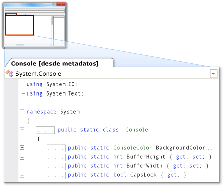

# Metadatos como origen
Metadatos como origen permite ver metadatos que aparecen como código fuente de C# en un búfer de solo lectura. Esto permite una vista de las declaraciones de los tipos y miembros (sin implementaciones). Para ver los metadatos como origen, ejecute el comando **Ir a definición** para los tipos o miembros cuyo código fuente no esté disponible en el proyecto o la solución.  
  
> [!NOTE]
>  Al intentar ejecutar el comando **Ir a definición** para tipos o miembros marcados como internos, el entorno de desarrollo integrado (IDE) no muestra sus metadatos como origen, independientemente de si el ensamblado de referencia es de confianza o no.  
  
 Puede ver los metadatos como origen en el Editor de código o la ventana **Definición de código** .  
  
## Ver metadatos como origen en el Editor de código  
 Al ejecutar el comando **Ir a definición** para un elemento cuyo código fuente no está disponible, un documento con pestañas que contiene una vista de los metadatos de ese elemento, que se muestra como origen, aparece en el Editor de código. El nombre del tipo, seguido de **[desde metadatos]**, aparece en la pestaña del documento.  
  
 Por ejemplo, si ejecuta el comando **Ir a definición** comando para <xref:System.Console>, los metadatos de <xref:System.Console> aparecen en el Editor de código como código fuente de C# similar a su declaración, pero sin una implementación.  
  
   
  
## Ver metadatos como origen en la ventana Definición de código  
 Si la ventana **Definición de código** está activa o visible, el IDE ejecuta automáticamente el comando **Ir a definición** para los elementos que se encuentran bajo el cursor en el Editor de código y para los elementos seleccionados en la **Vista de clases** o en el **Examinador de objetos**. Si el código fuente no está disponible para ese elemento, el IDE muestra los metadatos del elemento como origen en la ventana **Definición de código** .  
  
 Por ejemplo, si coloca el cursor dentro de la palabra <xref:System.Console> en el Editor de código, los metadatos de <xref:System.Console> aparecen como origen en la ventana **Definición de código** . El origen se parece a la declaración <xref:System.Console> , pero sin una implementación.  
  
 Si desea ver la declaración de un elemento que aparece en la ventana **Definición de código** , haga clic con el botón derecho en el elemento y seleccione **Ir a definición**.