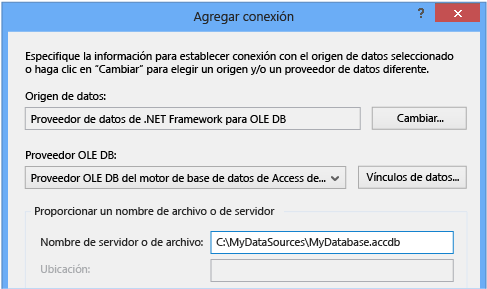
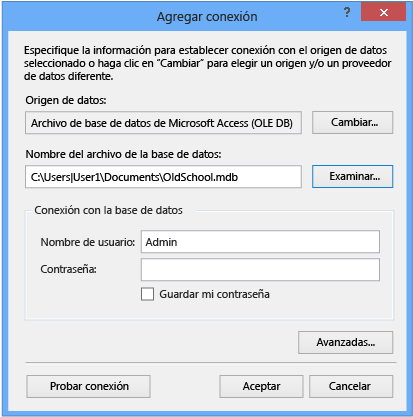

# Conectarse a los datos en una base de datos de Access (formularios Windows Forms)
Puede conectarse a una base de datos de Access (un archivo .mdf o un archivo .accdb) mediante Visual Studio. Después de definir la conexión, los datos aparecen en la **orígenes de datos** ventana. Desde esta ventana, puede arrastrar las tablas o vistas a los formularios.

## Requisitos previos
 Para utilizar estos procedimientos, necesita un proyecto de aplicación de Windows Forms y una base de datos de Access (archivo .accdb) o una base de datos de Access 2000-2003 (archivo .mdb). Siga el procedimiento que corresponde al tipo de archivo.

## Crear el conjunto de datos para un archivo .accdb
 Puede conectarse a bases de datos creadas mediante Access 2013, Office 365, Access 2010 o Access 2007 mediante el procedimiento siguiente.

#### Para crear el conjunto de datos

1.  Abra la aplicación de formularios Windows Forms a la que desea conectar datos.

2.  En el **vista** menú, seleccione **otras ventanas** > **orígenes de datos**.

     

3.  En la ventana **Orígenes de datos** , seleccione **Agregar nuevo origen de datos**.

     El **Asistente para configuración de orígenes de datos** se abre.

4.  Seleccione **base de datos** en el **elegir un tipo de origen de datos** página y, a continuación, seleccione **siguiente**.

5.  Seleccione **conjunto de datos** en el **elegir un modelo de base de datos** página y, a continuación, seleccione **siguiente**.

6.  En el **elegir la conexión de datos** página, seleccione **nueva conexión** para configurar una nueva conexión de datos.

     El **Agregar conexión** abre el cuadro de diálogo.

7.  Seleccione el **cambio** situado junto a la **origen de datos** cuadro de texto.

     El **cambiar origen de datos** abre el cuadro de diálogo.

8.  En la lista de orígenes de datos, elija  **\<otros\>**. En el **proveedor de datos** lista desplegable, seleccione **proveedor de datos de .NET Framework para OLE DB**, a continuación, elija **Aceptar**.

9. En el **Agregar conexión** cuadro de diálogo, seleccione **Microsoft Office 12.0 Access Database Engine OLE DB Provider** desde el **proveedor OLE DB** lista desplegable.

     

     > [!NOTE]
     >  Si no ve **Microsoft Office 12.0 Access Database Engine OLE DB Provider** en la lista desplegable del proveedor de OLE DB, puede que necesite instalar la [2007 Office System Driver: Data Connectivity Components](https://www.microsoft.com/download/confirmation.aspx?id=23734).

9. En el **servidor o nombre de archivo** cuadro de texto, especifique la ruta de acceso y el archivo de nombre de archivo .accdb al que desea conectarse a y, a continuación, seleccione **Aceptar**. (Si el archivo de base de datos tiene un nombre de usuario y una contraseña, especifíquelos antes de seleccionar **Aceptar**.)

10. Seleccione **siguiente** en el **elegir la conexión de datos** página.

     Puede obtener un cuadro de diálogo que le indica que el archivo de datos no está en el proyecto actual. Seleccione **Sí** o **No**.

11. Seleccione **siguiente** en el **Guardar cadena de conexión en el archivo de configuración de la aplicación** página.

12. Expanda el **tablas** nodo en el **elija los objetos de base de datos** página.

13. Seleccione las tablas o vistas que desee en el conjunto de datos y, a continuación, seleccione **finalizar**.

     El conjunto de datos se agrega al proyecto y las tablas y vistas aparecen en la **orígenes de datos** ventana.

## Crear el conjunto de datos para un archivo .mdb
 Crear el conjunto de datos mediante la ejecución de la **Asistente para configuración de orígenes de datos**.

#### Para crear el conjunto de datos

1.  Abra la aplicación de formularios Windows Forms a la que desea conectar datos.

2.  En el **vista** menú, seleccione **otras ventanas** > **orígenes de datos**.

     

3.  En la ventana **Orígenes de datos** , seleccione **Agregar nuevo origen de datos**.

     El **Asistente para configuración de orígenes de datos** se abre.

4.  Seleccione **base de datos** en el **elegir un tipo de origen de datos** página y, a continuación, seleccione **siguiente**.

5.  Seleccione **conjunto de datos** en el **elegir un modelo de base de datos** página y, a continuación, seleccione **siguiente**.

6.  En el **elegir la conexión de datos** página, seleccione **nueva conexión** para configurar una nueva conexión de datos.

7.  Si el origen de datos no es **archivo de base de datos de Microsoft Access (OLE DB)**, seleccione **cambio** para abrir el **cambiar origen de datos** cuadro de diálogo y seleccione **Microsoft Obtener acceso a archivos de base de datos**y, a continuación, seleccione **Aceptar**.

8.  En el **nombre de archivo de base de datos**, especifique la ruta de acceso y el nombre del archivo .mdb que desea conectarse y, a continuación, seleccione **Aceptar**.

     

9. Seleccione **siguiente** en el **elegir la conexión de datos** página.

10. Seleccione **siguiente** en el **Guardar cadena de conexión en el archivo de configuración de la aplicación** página.

11. Expanda el **tablas** nodo en el **elija los objetos de base de datos** página.

12. Seleccione las tablas o vistas que desee en el conjunto de datos y, a continuación, seleccione **finalizar**.

     El conjunto de datos se agrega al proyecto y las tablas y vistas aparecen en la **orígenes de datos** ventana.

## Seguridad
 Almacenar información confidencial, como una contraseña, puede afectar la seguridad de la aplicación. El uso de la autenticación de Windows (también conocida como seguridad integrada) es un modo más seguro de controlar el acceso a una base de datos. Para más información, consulte [Proteger la información de conexión](/dotnet/framework/data/adonet/protecting-connection-information).

## Pasos siguientes
 Ahora está disponible en el conjunto de datos que acaba de crear el **orígenes de datos** ventana. Ahora puede realizar cualquiera de las siguientes tareas:

-   Seleccione los elementos en el **orígenes de datos** ventana y arrástrelos hasta el formulario (vea [enlazar controles formularios Windows Forms a datos en Visual Studio](../data-tools/bind-windows-forms-controls-to-data-in-visual-studio.md)).

-   Abra el origen de datos en el **Diseñador de Dataset** para agregar o editar los objetos que componen el conjunto de datos.

-   Agregar lógica de validación para el <xref:System.Data.DataTable.ColumnChanging> o <xref:System.Data.DataTable.RowChanging> eventos de las tablas de datos en el conjunto de datos (vea [validar los datos en conjuntos de datos](../data-tools/validate-data-in-datasets.md)).

## Vea también

- [Adición de conexiones](../data-tools/add-new-connections.md)