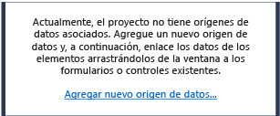
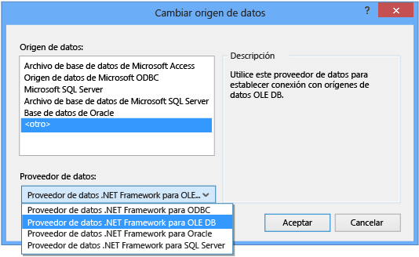

# Tutorial: Conectar a los datos en una base de datos de Access (Windows Forms)
Puede conectarse a una base de datos de Access \(un archivo .mdf o un archivo .accdb\) mediante Visual Studio.  Después de definir la conexión, los datos aparecen en la ventana **Orígenes de datos**.  Desde esta ventana, puede arrastrar las tablas o vistas a los formularios.  Para comprender cómo el sistema de proyectos de Visual Studio administra estos archivos de base de datos local, vea [Cómo: Administrar archivos de datos locales en los proyectos](../data-tools/how-to-manage-local-data-files-in-your-project.md).  
  
## Requisitos previos  
 Para utilizar estos procedimientos, se necesita un proyecto de aplicación de Windows Forms, y una base de datos de Access \(archivo .accdb\) o una base de datos de Access 2000\-2003 \(archivo .mdb\).  Siga el procedimiento que corresponde al tipo de archivo.  
  
## Crear el conjunto de datos para un archivo .accdb  
 Puede conectarse a bases de datos creadas con Access 2013, Office 365, Access 2010 o Access 2007 mediante el procedimiento siguiente.  
  
#### Para crear el conjunto de datos  
  
1.  Abra la aplicación de Windows Forms para la que desea crear una conexión de datos.  
  
2.  En el menú **Ver**, elija **Otras ventanas** \> **Orígenes de datos**.  
  
       
  
3.  En la ventana **Orígenes de datos**, seleccione **Agregar nuevo origen de datos**.  
  
       
  
4.  Elija **Base de datos** en la página **Elegir un tipo de origen de datos** y luego elija **Siguiente**.  
  
5.  Elija **Conjunto de datos** en la página **Elegir un modelo de base de datos** y, después, elija **Siguiente**.  
  
6.  En la página **Elegir la conexión de datos**, seleccione **Nueva conexión** para configurar una nueva conexión de datos.  
  
7.  Cambie **Origen de datos** a **Proveedor de datos .NET Framework para OLE DB**.  
  
       
  
    > [!IMPORTANT]
    >  Aunque un origen de datos de **archivo de base de datos de Microsoft Access \(OLE DB\)** puede parecer la opción adecuada, solo debe usar ese tipo de origen de datos para los archivos de base de datos .mdb.  
  
8.  En **Proveedor OLE DB**, elija **Proveedor OLE DB del motor de base de datos de Access de Microsoft Office 12.0**.  
  
       
  
9. En **Servidor o nombre de archivo**, especifique la ruta y el nombre del archivo .accdb al que desea conectarse y elija **Aceptar**.  
  
    > [!NOTE]
    >  Si el archivo de base de datos tiene un nombre de usuario y una contraseña, especifíquelos antes de elegir **Aceptar**.  
  
10. Elija **Siguiente** en la página **Elegir la conexión de datos**.  
  
11. Elija **Siguiente** en la página **Guardar la cadena de conexión en el archivo de configuración de la aplicación**.  
  
12. Expanda el nodo **Tablas** en la página **Elija los objetos de base de datos**.  
  
13. Elija las tablas o vistas que desee en el conjunto de datos y, a continuación, elija **Finalizar**.  
  
     El conjunto de datos se agrega al proyecto y las tablas y las vistas aparecen en la ventana **Orígenes de datos**.  
  
## Crear el conjunto de datos para un archivo .mdb  
 Cree el conjunto de datos ejecutando el **Asistente para la configuración de orígenes de datos**.  
  
#### Para crear el conjunto de datos  
  
1.  Abra la aplicación de Windows Forms para la que desea crear una conexión de datos.  
  
2.  En el menú **Ver**, elija **Otras ventanas** \> **Orígenes de datos**.  
  
       
  
3.  En la ventana **Orígenes de datos**, seleccione **Agregar nuevo origen de datos**.  
  
       
  
4.  Elija **Base de datos** en la página **Elegir un tipo de origen de datos** y luego elija **Siguiente**.  
  
5.  Elija **Conjunto de datos** en la página **Elegir un modelo de base de datos** y, después, elija **Siguiente**.  
  
6.  En la página **Elegir la conexión de datos**, seleccione **Nueva conexión** para configurar una nueva conexión de datos.  
  
7.  Si el **Origen de datos** no es un **Archivo de base de datos de Microsoft Access \(OLE DB\)**, elija **Cambiar** para abrir el cuadro de diálogo **Cambiar origen de datos**, elija **Archivo de base de datos de Microsoft Access** y, después, **Aceptar**.  
  
8.  En **Nombre del archivo de la base de datos**, especifique la ruta y el nombre del archivo .mdb con el que desea realizar la conexión y, después, elija **Aceptar**.  
  
       
  
9. Elija **Siguiente** en la página **Elegir la conexión de datos**.  
  
10. Elija **Siguiente** en la página **Guardar la cadena de conexión en el archivo de configuración de la aplicación**.  
  
11. Expanda el nodo **Tablas** en la página **Elija los objetos de base de datos**.  
  
12. Elija las tablas o vistas que desee en el conjunto de datos y, a continuación, elija **Finalizar**.  
  
     El conjunto de datos se agrega al proyecto y las tablas y las vistas aparecen en la ventana **Orígenes de datos**.  
  
## Seguridad  
 Almacenar información confidencial, como una contraseña, puede afectar la seguridad de la aplicación.  El uso de la autenticación de Windows \(también conocida como seguridad integrada\) es un modo más seguro de controlar el acceso a una base de datos.  Para obtener más información, vea [Proteger la información de conexión](../Topic/Protecting%20Connection%20Information.md).  
  
## Pasos siguientes  
 El conjunto de datos que acaba de crear estará disponible en la ventana **Orígenes de datos**.  Ahora puede realizar cualquiera de las tareas siguientes  
  
-   Seleccione los elementos en la ventana **Orígenes de datos** y arrástrelos hasta un formulario \(vea [Enlazar controles de Windows Forms a datos en Visual Studio](../data-tools/bind-windows-forms-controls-to-data-in-visual-studio.md)\).  
  
-   Abra el origen de datos en el [Diseñador de DataSet](../data-tools/creating-and-editing-typed-datasets.md) para agregar o editar los objetos que constituyen el conjunto de datos.  
  
-   Agregue la lógica de validación al evento <xref:System.Data.DataTable.ColumnChanging> o <xref:System.Data.DataTable.RowChanging> de las tablas de datos en el conjunto de datos \(vea [Validar los datos en conjuntos de datos](../data-tools/validate-data-in-datasets.md)\).  
  
## Vea también  
 [Conectarse a datos en Visual Studio](../data-tools/connecting-to-data-in-visual-studio.md)   
 [Preparar la aplicación para recibir datos](../Topic/Preparing%20Your%20Application%20to%20Receive%20Data.md)   
 [Buscar datos en la aplicación](../data-tools/fetching-data-into-your-application.md)   
 [Enlazar controles a los datos en Visual Studio](../data-tools/bind-controls-to-data-in-visual-studio.md)   
 [Modificar datos en la aplicación](../data-tools/editing-data-in-your-application.md)   
 [Validar datos](../Topic/Validating%20Data.md)   
 [Guardar datos](../data-tools/saving-data.md)   
 [Tutoriales sobre datos](../Topic/Data%20Walkthroughs.md)