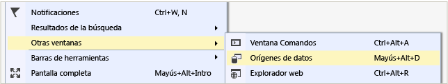

# Conectar a datos de una base de datos de Access

Puede conectarse a una base de datos de Access (ya sea un archivo *. mdb* o *. accdb* ) mediante Visual Studio. Después de definir la conexión, los datos aparecen en la ventana **Orígenes de datos**. Desde allí, puede arrastrar tablas o vistas a la superficie de diseño.

## Requisitos previos

Para usar estos procedimientos, necesita un proyecto Windows Forms o WPF y una base de datos de Access (archivo *. accdb* ) o una base de datos de Access 2000-2003 (archivo *. mdb* ). Siga el procedimiento que corresponde al tipo de archivo.

## Crear un conjunto de información para un archivo. accdb

Conéctese a las bases de datos creadas con Office 365, Access 2013, Access 2010 o Access 2007 mediante el procedimiento siguiente.

1. Abra un proyecto de aplicación de Windows Forms o WPF en Visual Studio.

2. Para abrir la **ventana orígenes de datos** , en el menú **Ver** , seleccione **otras ventanas**  > **orígenes de datos**.

   

3. En la ventana **Orígenes de datos** , seleccione **Agregar nuevo origen de datos**.

   Se abrirá el **Asistente para configuración de orígenes de datos**.

4. Seleccione **base** de datos en la página **elegir un tipo de origen de datos** y, a continuación, seleccione **siguiente**.

5. Seleccione **conjunto** de datos en la página **elegir un modelo de base de datos** y, a continuación, seleccione **siguiente**.

6. En la página **Elegir la conexión de datos**, seleccione **Nueva conexión** para configurar una nueva conexión de datos.

   Se abrirá el cuadro de diálogo **Agregar conexión**.

7. Si el **origen de datos** no está establecido en el archivo de base de datos de **Microsoft Access (OLE DB)** , seleccione el botón **cambiar** .

   Se abrirá el cuadro de diálogo **cambiar origen de datos** . En la lista de orígenes de datos, elija Archivo de base de datos de **Microsoft Access**. En el menú desplegable **proveedor de datos** , seleccione **.NET Framework proveedor de datos para OLE DB**y, después, elija **Aceptar**.

8. Elija **examinar** junto a **nombre de archivo de base de datos**y, a continuación, navegue hasta el archivo *. accdb* y elija **abrir**.

9. Escriba un nombre de usuario y una contraseña (si es necesario) y, a continuación, elija **Aceptar**.

10. Seleccione **siguiente** en la página **elegir la conexión de datos** .

    Es posible que aparezca un cuadro de diálogo que le indica que el archivo de datos no está en el proyecto actual. Seleccione **Sí** o **No**.

11. Seleccione **siguiente** en la página **Guardar cadena de conexión en el archivo de configuración de la aplicación** .

12. Expanda el nodo **Tablas** en la página **Elija los objetos de base de datos**.

13. Seleccione las tablas o vistas que desea incluir en el conjunto de DataSet y, a continuación, seleccione **Finalizar**.

    El conjunto de datos se agrega al proyecto y las tablas y las vistas aparecen en la ventana **Orígenes de datos**.

## Crear un conjunto de archivos para un archivo. mdb

Conéctese a las bases de datos creadas con Access 2000-2003 mediante el procedimiento siguiente.

1. Abra un proyecto de aplicación de Windows Forms o WPF en Visual Studio.

2. En el menú **Ver** , seleccione **otras ventanas**  > **orígenes de datos**.

   

3. En la ventana **Orígenes de datos** , seleccione **Agregar nuevo origen de datos**.

    Se abrirá el **Asistente para configuración de orígenes de datos**.

4. Seleccione **base** de datos en la página **elegir un tipo de origen de datos** y, a continuación, seleccione **siguiente**.

5. Seleccione **conjunto** de datos en la página **elegir un modelo de base de datos** y, a continuación, seleccione **siguiente**.

6. En la página **Elegir la conexión de datos**, seleccione **Nueva conexión** para configurar una nueva conexión de datos.

7. Si el origen de datos no es un archivo de base de datos de **Microsoft Access (OLE DB)** , seleccione **cambiar** para abrir el cuadro de diálogo **cambiar origen de datos** y seleccione Archivo de base de datos de **Microsoft Access**y, a continuación, seleccione **Aceptar**.

8. En el **nombre del archivo de base de datos**, especifique la ruta de acceso y el nombre del archivo *. mdb* al que desea conectarse y, a continuación, seleccione **Aceptar**.

   

9. Seleccione **siguiente** en la página **elegir la conexión de datos** .

10. Seleccione **siguiente** en la página **Guardar cadena de conexión en el archivo de configuración de la aplicación** .

11. Expanda el nodo **Tablas** en la página **Elija los objetos de base de datos**.

12. Seleccione las tablas o vistas que desee en el conjunto de DataSet y, a continuación, seleccione **Finalizar**.

    El conjunto de datos se agrega al proyecto y las tablas y las vistas aparecen en la ventana **Orígenes de datos**.

## Pasos siguientes

El conjunto de datos que acaba de crear está disponible en la ventana **orígenes de datos** . Ahora puede realizar cualquiera de las tareas siguientes:

- Seleccione elementos en la ventana **orígenes de datos** y arrástrelos hasta el formulario o la superficie de diseño (vea [enlazar Windows Forms controles a datos en Visual Studio](../data-tools/bind-windows-forms-controls-to-data-in-visual-studio.md) o [información general sobre el enlace de datos de WPF](/dotnet/framework/wpf/data/data-binding-overview)).

- Abra el origen de datos en el **Diseñador de DataSet** para agregar o editar los objetos que constituyen el conjunto de datos.

- Agregue la lógica de validación al <xref:System.Data.DataTable.ColumnChanging> o <xref:System.Data.DataTable.RowChanging> evento de las tablas de datos en el conjunto de datos (vea [Validate Data in](../data-tools/validate-data-in-datasets.md)datasets).

## Vea también

- [Adición de conexiones](../data-tools/add-new-connections.md)
- [Información general sobre el enlace de datos de WPF](/dotnet/framework/wpf/data/data-binding-overview)
- [Windows Forms data binding](/dotnet/framework/winforms/data-binding-and-windows-forms) (Enlace de datos de Windows Forms)
