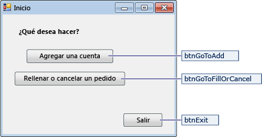
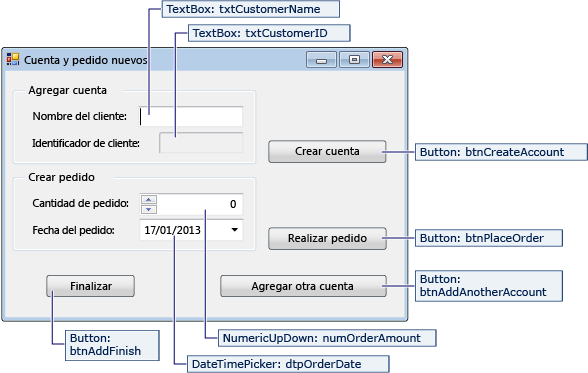
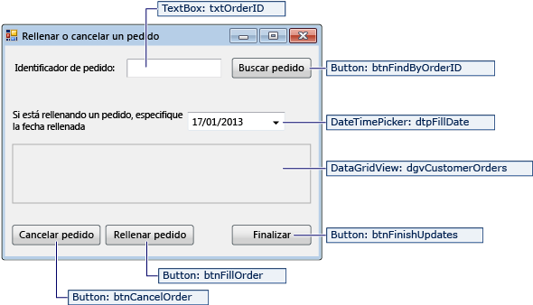

# <a name="create-a-simple-data-application-by-using-adonet"></a>Creación de una aplicación de datos sencilla mediante ADO.NET

Al crear una aplicación que manipula datos en una base de datos, se realizan tareas básicas tales como definir cadenas de conexión, insertar datos y ejecutar procedimientos almacenados. Siguiendo este tema, puede detectar cómo interactuar con una base de datos desde una sencilla Windows Forms aplicación "Forms over Data" mediante Visual C# o Visual Basic y ADO.NET.  Todas las tecnologías de datos de .NET, incluidos los conjuntos de datos, LINQ to SQL y Entity Framework, en última instancia realizan pasos muy similares a los que se muestran en este artículo.

En este artículo se muestra una forma sencilla de obtener datos de una base de datos de una manera rápida. Si la aplicación necesita modificar datos de formas no triviales y actualizar la base de datos, debe considerar el uso de Entity Framework y el uso del enlace de datos para sincronizar automáticamente los controles de interfaz de usuario con los cambios en los datos subyacentes.

> [!IMPORTANT]
> Para mantener el código sencillo, no se incluye el control de excepciones listo para producción.

## <a name="prerequisites"></a>Requisitos previos

Para crear la aplicación, necesitará:

- Visual Studio.

- SQL Server Express LocalDB. Si no tiene SQL Server Express LocalDB, puede instalarlo desde la página de [descarga de SQL Server Express](https://www.microsoft.com/sql-server/sql-server-editions-express).

En este tema se da por supuesto que está familiarizado con la funcionalidad básica del IDE de Visual Studio y puede crear una aplicación Windows Forms, agregar formularios al proyecto, colocar botones y otros controles en los formularios, establecer las propiedades de los controles y codificar eventos simples. Si no está familiarizado con estas tareas, le recomendamos que complete el tema [Introducción a Visual C# y Visual Basic](../ide/quickstart-visual-basic-console.md) antes de comenzar este tutorial.

## <a name="set-up-the-sample-database"></a>Configurar la base de datos de ejemplo

Cree la base de datos de ejemplo siguiendo estos pasos:

1. En Visual Studio, abra la ventana **Explorador de servidores** .

2. Haga clic con el botón derecho en **conexiones de datos** y elija **crear nueva SQL Server base** de datos.

3. En el cuadro de texto **nombre del servidor** , escriba **(LocalDB) \mssqllocaldb**.

4. En el cuadro de texto nombre de la **nueva base de datos** , escriba **sales** y elija **Aceptar**.

     La base de datos de **ventas** vacía se crea y se agrega al nodo conexiones de datos en explorador de servidores.

5. Haga clic con el botón derecho en la conexión de datos de **ventas** y seleccione **nueva consulta**.

     Se abre una ventana del editor de consultas.

6. Copie el [script Transact-SQL de ventas](https://github.com/MicrosoftDocs/visualstudio-docs/raw/master/docs/data-tools/samples/sales.sql) en el portapapeles.

7. Pegue el script T-SQL en el editor de consultas y, a continuación, elija el botón **Ejecutar** .

     Tras un breve período de tiempo, la consulta termina de ejecutarse y se crean los objetos de base de datos. La base de datos contiene dos tablas: Customer y Orders. Estas tablas no contienen datos inicialmente, pero puede agregar datos al ejecutar la aplicación que va a crear. La base de datos también contiene cuatro procedimientos almacenados simples.

## <a name="create-the-forms-and-add-controls"></a>Crear los formularios y agregar controles

1. Cree un proyecto para una aplicación de Windows Forms y, a continuación, asígnele el nombre **SimpleDataApp**.

    Visual Studio crea el proyecto y varios archivos, incluido un formulario de Windows vacío denominado **Form1**.

2. Agregue dos formularios de Windows al proyecto para que tenga tres formularios y, a continuación, asígneles los siguientes nombres:

   - **Navegación**

   - **NewCustomer**

   - **FillOrCancel**

3. Para cada formulario, agregue los cuadros de texto, botones y otros controles que aparecen en las siguientes ilustraciones. Para cada control, establezca las propiedades que se describen en las tablas.

   > [!NOTE]
   > El cuadro de grupo y los controles de etiquetas agregan claridad pero no se utilizan en el código.

   **Formulario Navigation**

   

|Controles del formulario Navigation|Propiedades|
| - |----------------|
|Botón|Nombre = btnGoToAdd|
|Botón|Nombre = btnGoToFillOrCancel|
|Botón|Nombre = btnExit|

**Formulario NewCustomer**



|Controles del formulario NewCustomer|Propiedades|
| - |----------------|
|TextBox|Nombre = txtCustomerName|
|TextBox|Nombre = txtCustomerID<br /><br /> De solo lectura = True|
|Botón|Nombre = btnCreateAccount|
|NumericUpDown|Posiciones decimales = 0<br /><br /> Máximo = 5000<br /><br /> Nombre = numOrderAmount|
|DateTimePicker|Formato = Abreviado<br /><br /> Nombre = dtpOrderDate|
|Botón|Nombre = btnPlaceOrder|
|Botón|Nombre = btnAddAnotherAccount|
|Botón|Nombre = btnAddFinish|

**Formulario FillOrCancel**



|Controles del formulario FillOrCancel|Propiedades|
| - |----------------|
|TextBox|Nombre = txtOrderID|
|Botón|Nombre = btnFindByOrderID|
|DateTimePicker|Formato = Abreviado<br /><br /> Nombre = dtpFillDate|
|DataGridView|Nombre = dgvCustomerOrders<br /><br /> De solo lectura = True<br /><br /> Encabezados de filas visibles = False|
|Botón|Nombre = btnCancelOrder|
|Botón|Nombre = btnFillOrder|
|Botón|Nombre = btnFinishUpdates|

## <a name="store-the-connection-string"></a>Almacenar la cadena de conexión
Cuando la aplicación intenta abrir una conexión a la base de datos, la aplicación debe tener acceso a la cadena de conexión. Para evitar escribir la cadena manualmente en cada formulario, almacene la cadena en el archivo *App.config* del proyecto y cree un método que devuelva la cadena cuando se llame al método desde cualquier formulario de la aplicación.

Para encontrar la cadena de conexión, haga clic con el botón derecho en la conexión de datos de **ventas** en **Explorador de servidores** y elija **propiedades**. Busque la propiedad **ConnectionString** y, a continuación, use **Ctrl** + **a**, **Ctrl** + **C** para seleccionar y copiar la cadena en el portapapeles.

1. Si usa C#, en **Explorador de soluciones**, expanda el nodo **propiedades** en el proyecto y, a continuación, abra el archivo **Settings. Settings** .
    Si está utilizando Visual Basic, en **Explorador de soluciones**, haga clic en **Mostrar todos los archivos**, expanda el nodo **mi proyecto** y, a continuación, abra el archivo **Settings. Settings** .

2. En la columna **nombre** , escriba `connString` .

3. En la lista **tipo** , seleccione **(cadena de conexión)**.

4. En la lista **ámbito** , seleccione **aplicación**.

5. En la columna **valor** , escriba la cadena de conexión (sin comillas exteriores) y, a continuación, guarde los cambios.

> [!NOTE]
> En una aplicación real, debe almacenar la cadena de conexión de forma segura, como se describe en [cadenas de conexión y archivos de configuración](/dotnet/framework/data/adonet/connection-strings-and-configuration-files).

## <a name="write-the-code-for-the-forms"></a>Escribir el código para los formularios

Esta sección contiene información general breve de lo que hace cada formulario. También proporciona el código que define la lógica subyacente cuando se hace clic en un botón del formulario.

### <a name="navigation-form"></a>Formulario Navigation

El formulario Navigation se abre cuando se ejecuta la aplicación. El botón **Agregar una cuenta** abre el formulario NewCustomer. El botón **Rellenar o cancelar órdenes** abre el formulario FillOrCancel. El botón **Salir** cierra la aplicación.

#### <a name="make-the-navigation-form-the-startup-form"></a>Hacer que el formulario Navigation sea el formulario de inicio

Si usa C#, en el **Explorador de soluciones**, abra **Program.cs** y, a continuación, cambie la línea `Application.Run` a esta: `Application.Run(new Navigation());`

Si está utilizando Visual Basic, en **Explorador de soluciones**, abra la ventana **propiedades** , seleccione la pestaña **aplicación** y, a continuación, seleccione **asígnele simpledataapp. Navigation** en la lista **formulario de inicio** .

#### <a name="create-auto-generated-event-handlers"></a>Crear controladores de eventos generados automáticamente

Haga doble clic en los tres botones del formulario de navegación para crear métodos de control de eventos vacíos. Al hacer doble clic en los botones, también se agrega código generado automáticamente en el archivo de código del diseñador que permite hacer clic en un botón para generar un evento.

#### <a name="add-code-for-the-navigation-form-logic"></a>Agregar código para la lógica del formulario de navegación

En la página de códigos del formulario de navegación, complete los cuerpos del método para los tres controladores de eventos de clic de botón, tal y como se muestra en el código siguiente.

:::code language="csharp" source="../data-tools/codesnippet/CSharp/SimpleDataApp/Navigation.cs" id="Snippet1":::
:::code language="vb" source="../data-tools/codesnippet/VisualBasic/SimpleDataApp/Navigation.vb" id="Snippet1":::

### <a name="newcustomer-form"></a>Formulario NewCustomer

Al escribir un nombre de cliente y, a continuación, seleccionar el botón **crear cuenta** , el formulario NewCustomer crea una cuenta de cliente y SQL Server devuelve un valor de identidad como el nuevo identificador de cliente. A continuación, puede realizar un pedido para la nueva cuenta especificando una cantidad y una fecha de pedido y seleccionando el botón **realizar pedido** .

#### <a name="create-auto-generated-event-handlers"></a>Crear controladores de eventos generados automáticamente

Cree un controlador de eventos Click vacío para cada botón del formulario NewCustomer; para ello, haga doble clic en cada uno de los cuatro botones. Al hacer doble clic en los botones, también se agrega código generado automáticamente en el archivo de código del diseñador que permite hacer clic en un botón para generar un evento.

#### <a name="add-code-for-the-newcustomer-form-logic"></a>Agregar código para la lógica del formulario NewCustomer

Para completar la lógica del formulario NewCustomer, siga estos pasos.

1. Coloque el `System.Data.SqlClient` espacio de nombres en el ámbito para que no tenga que calificar totalmente los nombres de sus miembros.

     ```csharp
     using System.Data.SqlClient;
     ```

     ```vb
     Imports System.Data.SqlClient
     ```

2. Agregue algunas variables y métodos auxiliares a la clase, tal y como se muestra en el código siguiente.

     :::code language="csharp" source="../data-tools/codesnippet/CSharp/SimpleDataApp/NewCustomer.cs" id="Snippet1":::
     :::code language="vb" source="../data-tools/codesnippet/VisualBasic/SimpleDataApp/NewCustomer.vb" id="Snippet1":::

3. Complete los cuerpos de método para los cuatro controladores de eventos de clic de botón, tal y como se muestra en el código siguiente.

     :::code language="csharp" source="../data-tools/codesnippet/CSharp/SimpleDataApp/NewCustomer.cs" id="Snippet2":::
     :::code language="vb" source="../data-tools/codesnippet/VisualBasic/SimpleDataApp/NewCustomer.vb" id="Snippet2":::

### <a name="fillorcancel-form"></a>Formulario FillOrCancel

El formulario FillOrCancel ejecuta una consulta para devolver un pedido cuando se escribe un identificador de pedido y, a continuación, se hace clic en el botón **Buscar pedido** . La fila devuelta aparece en una cuadrícula de datos de solo lectura. Puede marcar el pedido como cancelado (X) Si selecciona el botón **Cancelar pedido** o puede marcar el pedido como relleno (F) Si selecciona el botón **rellenar pedido** . Si vuelve a seleccionar el botón **Buscar pedido** , aparece la fila actualizado.

#### <a name="create-auto-generated-event-handlers"></a>Crear controladores de eventos generados automáticamente

Cree controladores de eventos Click vacíos para los cuatro botones del formulario FillOrCancel haciendo doble clic en los botones. Al hacer doble clic en los botones, también se agrega código generado automáticamente en el archivo de código del diseñador que permite hacer clic en un botón para generar un evento.

#### <a name="add-code-for-the-fillorcancel-form-logic"></a>Agregar código para la lógica del formulario FillOrCancel

Para completar la lógica del formulario FillOrCancel, siga estos pasos.

1. Incorpore los dos espacios de nombres siguientes en el ámbito para que no tenga que calificar totalmente los nombres de sus miembros.

     ```csharp
     using System.Data.SqlClient;
     using System.Text.RegularExpressions;
     ```

     ```vb
     Imports System.Data.SqlClient
     Imports System.Text.RegularExpressions
     ```

2. Agregue una variable y un método auxiliar a la clase, tal y como se muestra en el código siguiente.

     :::code language="csharp" source="../data-tools/codesnippet/CSharp/SimpleDataApp/FillOrCancel.cs" id="Snippet1":::
     :::code language="vb" source="../data-tools/codesnippet/VisualBasic/SimpleDataApp/FillOrCancel.vb" id="Snippet1":::

3. Complete los cuerpos de método para los cuatro controladores de eventos de clic de botón, tal y como se muestra en el código siguiente.

     :::code language="csharp" source="../data-tools/codesnippet/CSharp/SimpleDataApp/FillOrCancel.cs" id="Snippet2":::
     :::code language="vb" source="../data-tools/codesnippet/VisualBasic/SimpleDataApp/FillOrCancel.vb" id="Snippet2":::

## <a name="test-your-application"></a>Prueba de la aplicación

Seleccione la tecla **F5** para compilar y probar la aplicación después del código de cada controlador del evento Click y, a continuación, después de haber terminado la programación.

## <a name="see-also"></a>Vea también

- [Visual Studio Data Tools para .NET](../data-tools/visual-studio-data-tools-for-dotnet.md)
