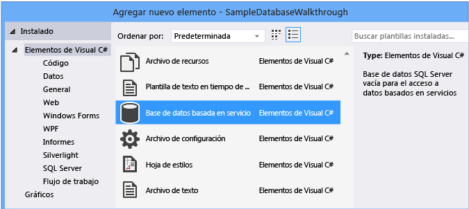

# <a name="create-a-database-and-add-tables-in-visual-studio"></a>Crear una base de datos y agregar las tablas en Visual Studio

Puede usar Visual Studio para crear y actualizar un archivo de base de datos local en SQL Server Express LocalDB. También puede crear una base de datos mediante la ejecución de instrucciones Transact-SQL en la ventana de herramientas de **Explorador de objetos de SQL Server** en Visual Studio. En este tema, vamos a crear un archivo *. MDF* y a agregar tablas y claves mediante el diseñador de tablas.

## <a name="prerequisites"></a>Requisitos previos

Para completar este tutorial, necesitará las cargas de trabajo **desarrollo de escritorio de .net** y almacenamiento de **datos y procesamiento** instaladas en Visual Studio. Para instalarlos, Abra **instalador de Visual Studio** y elija **modificar** (o **más**  >  **modificar**) junto a la versión de Visual Studio que desea modificar.

> [!NOTE]
> Los procedimientos descritos en este artículo solo se aplican a proyectos de Windows Forms de .NET Framework, no a proyectos de Windows Forms de .NET Core.

## <a name="create-a-project-and-a-local-database-file"></a>Crear un proyecto y un archivo de base de datos local

1. Cree un nuevo proyecto de **Windows Forms App (.NET Framework)** y asígnele el nombre **SampleDatabaseWalkthrough**.

2. En la barra de menús, seleccione **proyecto**  >  **Agregar nuevo elemento**.

3. En la lista de plantillas de elementos, desplácese hacia abajo y seleccione **base de datos basada en servicio**.

   

4. Asigne un nombre a la base de datos **SampleDatabase**y haga clic en **Agregar**.

### <a name="add-a-data-source"></a>Agregar un origen de datos

1. Si la ventana **orígenes de datos** no está abierta, ábrala; para ello, presione **MAYÚS** + **Alt** + **D** o seleccione **Ver**  >  **otros**  >  **orígenes de datos** de Windows en la barra de menús.

1. En la ventana **orígenes de datos** , seleccione **Agregar nuevo origen de datos**.

   

   Se abre el **Asistente para la configuración de orígenes de datos** .

1. En la página **elegir un tipo de origen de datos** , elija **base** de datos y, a continuación, elija **siguiente**.

1. En la página **elegir un modelo de base de datos** , elija **siguiente** para aceptar el valor predeterminado (conjunto de datos).

1. En la página **elegir la conexión de datos** , seleccione el archivo **SampleDatabase. MDF** en la lista desplegable y, a continuación, elija **siguiente**.

1. En la página **guardar la cadena de conexión en el archivo de configuración de la aplicación** , elija **siguiente**.

1. En la página **Elija los objetos de base de datos** , verá un mensaje que indica que la base de datos no contiene ningún objeto. Elija **Finalizar**.

### <a name="view-properties-of-the-data-connection"></a>Ver las propiedades de la conexión de datos

Puede ver la cadena de conexión para el archivo *SampleDatabase. MDF* ; para ello, abra el ventana Propiedades de la conexión de datos:

- Seleccione **Ver**  >  **Explorador de objetos de SQL Server** para abrir la ventana de **Explorador de objetos de SQL Server** . Expanda **(LocalDB) \MSSQLLocalDB**  >  **bases de datos**y, a continuación, haga clic con el botón derecho en *SampleDatabase. MDF* y seleccione **propiedades**.

- Como alternativa, puede seleccionar **Ver**  >  **Explorador de servidores**si la ventana no está abierta. Para abrir el ventana Propiedades, expanda el nodo **conexiones de datos** , haga clic con el botón secundario en *SampleDatabase. MDF*y, a continuación, seleccione **propiedades**.

  > [!TIP]
  > Si no puede expandir el nodo conexiones de datos o no aparece la conexión SampleDatabase. MDF, seleccione el botón **conectar con base** de datos en la barra de herramientas explorador de servidores. En el cuadro de diálogo **Agregar conexión** , asegúrese de que **Microsoft SQL Server archivo de base** de **datos**está seleccionado en origen de datos y, a continuación, busque y seleccione el archivo SampleDatabase. MDF. Termine de agregar la conexión seleccionando **Aceptar**.

## <a name="create-tables-and-keys-by-using-table-designer"></a>Crear tablas y claves mediante Diseñador de tablas

En esta sección, creará dos tablas, una clave principal en cada tabla y algunas filas de datos de ejemplo. También creará una clave externa para especificar cómo se corresponden los registros de una tabla con los registros de la otra tabla.

### <a name="create-the-customers-table"></a>Crear la tabla customers

1. En **Explorador de servidores**, expanda el nodo **conexiones de datos** y, a continuación, expanda el nodo **SampleDatabase. MDF** .

   Si no puede expandir el nodo conexiones de datos o no aparece la conexión SampleDatabase. MDF, seleccione el botón **conectar con base** de datos en la barra de herramientas explorador de servidores. En el cuadro de diálogo **Agregar conexión** , asegúrese de que **Microsoft SQL Server archivo de base** de **datos**está seleccionado en origen de datos y, a continuación, busque y seleccione el archivo SampleDatabase. MDF. Termine de agregar la conexión seleccionando **Aceptar**.

2. Haga clic con el botón derecho en **tablas** y seleccione **Agregar nueva tabla**.

   El Diseñador de tablas se abre y muestra una cuadrícula con una fila predeterminada que representa una columna única de la tabla que está creando. Al agregar filas a la cuadrícula, agregará columnas en la tabla.

3. En la cuadrícula, agregue una fila para cada una de las entradas siguientes:

   |Nombre de la columna|Tipo de datos|Permitir valores NULL|
   |-----------------|---------------|-----------------|
   |`CustomerID`|`nchar(5)`|False (desactivada)|
   |`CompanyName`|`nvarchar(50)`|False (desactivada)|
   |`ContactName`|`nvarchar (50)`|True (seleccionada)|
   |`Phone`|`nvarchar (24)`|True (seleccionada)|

4. Haga clic con el botón derecho en la `CustomerID` fila y seleccione **establecer clave principal**.

5. Haga clic con el botón derecho en la fila predeterminada ( `Id` ) y, a continuación, seleccione **eliminar**.

6. Asigne un nombre a la tabla Customers actualizando la primera línea del panel de script para que coincida con el ejemplo siguiente:

   ```sql
   CREATE TABLE [dbo].[Customers]
   ```

   Deberíamos ver algo parecido a lo siguiente:

   

7. En la esquina superior izquierda de **Diseñador de tablas**, seleccione **Actualizar**.

8. En el cuadro de diálogo **vista previa de actualizaciones de base de datos** , seleccione **Actualizar base de datos**.

   La tabla Customers se crea en el archivo de base de datos local.

### <a name="create-the-orders-table"></a>Crear la tabla Orders

1. Agregue otra tabla y, después, agregue una fila para cada entrada de la tabla siguiente:

   |Nombre de la columna|Tipo de datos|Permitir valores NULL|
   |-----------------|---------------|-----------------|
   |`OrderID`|`int`|False (desactivada)|
   |`CustomerID`|`nchar(5)`|False (desactivada)|
   |`OrderDate`|`datetime`|True (seleccionada)|
   |`OrderQuantity`|`int`|True (seleccionada)|

2. Establezca **OrderID** como la clave principal y, a continuación, elimine la fila predeterminada.

3. Asigne un nombre a la tabla Orders actualizando la primera línea del panel de script para que coincida con el ejemplo siguiente:

   ```sql
   CREATE TABLE [dbo].[Orders]
   ```

4. En la esquina superior izquierda del **Diseñador de tablas**, seleccione **Actualizar**.

5. En el cuadro de diálogo **vista previa de actualizaciones de base de datos** , seleccione **Actualizar base de datos**.

   La tabla Orders se crea en el archivo de base de datos local. Si expande el nodo **tablas** en explorador de servidores, verá las dos tablas:

   

### <a name="create-a-foreign-key"></a>Crear una clave externa

1. En el panel de contexto de la derecha de la cuadrícula de Diseñador de tablas para la tabla Orders, haga clic con el botón derecho en **claves externas** y seleccione **Agregar nueva clave externa**.

   

2. En el cuadro de texto que aparece, reemplace el texto **ToTable** por **Customers**.

3. En el panel T-SQL, actualice la última línea para que coincida con el ejemplo siguiente:

   ```sql
   CONSTRAINT [FK_Orders_Customers] FOREIGN KEY ([CustomerID]) REFERENCES [Customers]([CustomerID])
   ```

4. En la esquina superior izquierda del **Diseñador de tablas**, seleccione **Actualizar**.

5. En el cuadro de diálogo **vista previa de actualizaciones de base de datos** , seleccione **Actualizar base de datos**.

   Se crea la clave externa.

## <a name="populate-the-tables-with-data"></a>Rellenar las tablas con datos

1. En **Explorador de servidores** o **Explorador de objetos de SQL Server**, expanda el nodo de la base de datos de ejemplo.

2. Abra el menú contextual del nodo **tablas** , seleccione **Actualizar**y, a continuación, expanda el nodo **tablas** .

3. Abra el menú contextual para la tabla Customers y, a continuación, seleccione **Mostrar datos de tabla**.

4. Agregue los datos que desee a algunos clientes.

    Puede especificar los cinco caracteres que desee como identificadores de cliente, pero elija al menos uno que pueda recordar para usarlo posteriormente en este procedimiento.

5. Abra el menú contextual de la tabla Orders y, a continuación, seleccione **Mostrar datos de tabla**.

6. Agregar datos para algunos pedidos.

    > [!IMPORTANT]
    > Asegúrese de que todos los ID. de pedido y las cantidades de pedido son enteros y que cada identificador de cliente coincide con un valor especificado en la columna **CustomerID** de la tabla customers.

7. En la barra de menús, seleccione **archivo**  >  **guardar todo**.

## <a name="see-also"></a>Consulte también

- [Obtener acceso a datos en Visual Studio](accessing-data-in-visual-studio.md)
