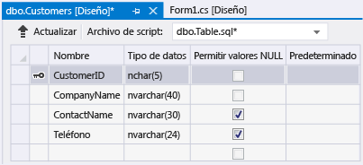

# Tutorial: Crear un archivo de base de datos local en Visual Studio
Puede explorar tareas básicas, tales como agregar tablas y definir columnas, utilizando Visual Studio para crear y actualizar un archivo de base de datos local en SQL Server Express LocalDB, como se describe en [Información general de datos locales](../data-tools/local-data-overview.md).  Después de finalizar este tutorial, puede explorar las funciones más avanzadas usando la base de datos local como punto de partida para otros tutoriales que la necesiten.  
  
 Para obtener información sobre cómo crear una base de datos mediante SQL Server Management Studio o Transact\-SQL, vea [Create a Database](http://msdn.microsoft.com/es-es/4c4beea2-6cbc-4352-9db6-49ea8130bb64).  
  
 Durante este tutorial explorará las tareas siguientes:  
  
-   [Crear un proyecto y un archivo de base de datos local](../data-tools/create-a-sql-database-by-using-a-designer.md#BKMK_CreateNewSQLDB).  
  
-   [Crear tablas, columnas, claves principales y claves externas](../data-tools/create-a-sql-database-by-using-a-designer.md#BKMK_CreateNewTbls).  
  
-   [Rellenar las tablas con datos](../data-tools/create-a-sql-database-by-using-a-designer.md#BKMK_Populating).  
  
## Requisitos previos  
 Para completar este tutorial, instale [!INCLUDE[vs_dev12_expwin](../data-tools/includes/vs_dev12_expwin_md.md)], Visual Studio Professional 2013, Visual Studio Premium 2013 o Visual Studio Ultimate 2013.  Estas versiones de Visual Studio incluyen SQL Server Data Tools.  
  
##  <a name="BKMK_CreateNewSQLDB"></a> Crear un proyecto y un archivo de base de datos local  
  
#### Para crear un proyecto y un archivo de base de datos  
  
1.  Cree un proyecto de formularios Windows Forms denominado `SampleDatabaseWalkthrough`.  
  
     Vea [Crear soluciones y proyectos](../ide/creating-solutions-and-projects.md).  
  
2.  En la barra de menús, elija **Proyecto**, **Agregar nuevo elemento**.  
  
     Aparece el cuadro de diálogo **Agregar nuevo elemento** para que pueda agregar los elementos adecuados a un proyecto de formularios Windows Forms.  
  
3.  En la lista de plantillas de elemento, desplácese hacia abajo hasta que aparezca **Base de datos basada en servicio** y elíjala.  
  
       
  
4.  Asigne un nombre a la base de datos SampleDatabase y elija el botón **Agregar**.  
  
5.  Si la ventana Orígenes de datos no está abierta, ábrala eligiendo las teclas Mayús\-Alt\-D o, en la barra de menús, elija **Ver**, **Otras ventanas**, **Orígenes de datos**.  
  
6.  En la ventana Orígenes de datos, elija el vínculo **Agregar nuevo origen de datos**.  
  
7.  En el **Asistente para configuración de orígenes de datos**, elija el botón **Siguiente** cuatro veces para aceptar la configuración predeterminada y, después, elija el botón **Finalizar**.  
  
 Abra la ventana de propiedades de la base de datos para ver la cadena de conexión y la ubicación del archivo .mdf principal.  
  
-   En Visual Studio Express, elija **Ver**, **Otras ventanas**, **Explorador de bases de datos** si esa ventana no está abierta todavía.  Para abrir la ventana de propiedades, expanda el nodo **Conexiones de datos**, abra el menú contextual de SampleDatabase.mdf y, después, elija **Propiedades**.  
  
-   En otras versiones de Visual Studio, elija **Ver**, **Explorador de servidores** si esta ventana no está abierta todavía.  Para abrir la ventana de propiedades, expanda el nodo **Conexiones de datos**, abra el menú contextual de SampleDatabase.mdf y, después, elija **Propiedades**.  
  
##  <a name="BKMK_CreateNewTbls"></a> Crear tablas, columnas, claves principales y claves externas  
 En esta sección, creará un par de tablas, una clave principal en cada tabla y algunas filas de datos de ejemplo.  En el siguiente tutorial, obtendrá una idea de cómo puede aparecer esa información en una aplicación.  También creará una clave externa para especificar cuántos registros de una tabla pueden corresponder a registros de la otra tabla.  
  
#### Para crear la tabla Customers  
  
1.  En el **Explorador de servidores** o **Explorador de bases de datos**, expanda el nodo **Conexiones de datos** y, a continuación, expanda el nodo **SampleDatabase.mdf**.  
  
     Si el explorador para su versión de Visual Studio no está abierto, elija **Ver**, **Explorador de servidores** o **Ver**, **Otras ventanas**, **Explorador de bases de datos** en la barra de menús.  
  
2.  Abra el menú contextual para **Tablas** y, a continuación, elija **Agregar nueva tabla**.  
  
     El **Diseñador de tablas** se abre y muestra una cuadrícula con una fila predeterminada que representa una columna única de la tabla que está creando.  Al agregar filas a la cuadrícula, agregará columnas en la tabla.  
  
3.  En la cuadrícula, agregue una fila para cada una de las entradas siguientes:  
  
    |Nombre de columna|Tipo de datos|Permitir valores NULL|  
    |-----------------------|-------------------|---------------------------|  
    |`CustomerID`|`nchar(5)`|False \(desactivada\)|  
    |`CompanyName`|`nvarchar(40)`|False \(desactivada\)|  
    |`ContactName`|`nvarchar (30)`|True \(seleccionada\)|  
    |`Phone`|`nvarchar (24)`|True \(seleccionada\)|  
  
4.  Abra el menú contextual para la fila `CustomerID` y, a continuación, elija **Establecer clave principal**.  
  
5.  Abra el menú contextual para la fila predeterminada y, a continuación, elija **Eliminar**.  
  
6.  Asigne un nombre a la tabla Customers actualizando la primera línea del panel de script para que coincida con el ejemplo siguiente:  
  
    ```  
    CREATE TABLE [dbo].[Customers]  
    ```  
  
7.  En la esquina superior izquierda del diseñador de tablas, elija el botón **Actualizar**, tal como se muestra la ilustración siguiente.  
  
       
  
8.  En el cuadro de diálogo **Vista previa de actualizaciones de base de datos**, elija el botón **Actualizar base de datos**.  
  
     Los cambios realizados se guardarán en el archivo de base de datos local.  
  
#### Para crear la tabla Orders  
  
1.  Agregue otra tabla y, después, agregue una fila para cada entrada de la tabla siguiente:  
  
    |Nombre de columna|Tipo de datos|Permitir valores NULL|  
    |-----------------------|-------------------|---------------------------|  
    |`OrderID`|`int`|False \(desactivada\)|  
    |`CustomerID`|`nchar(5)`|False \(desactivada\)|  
    |`OrderDate`|`datetime`|True \(seleccionada\)|  
    |`OrderQuantity`|`int`|True \(seleccionada\)|  
  
2.  Establezca **OrderID** como la clave principal y después elimine la fila predeterminada.  
  
3.  Asigne un nombre a la tabla Orders actualizando la primera línea del panel de script para que coincida con el ejemplo siguiente:  
  
    ```  
    CREATE TABLE [dbo].[Orders]  
    ```  
  
4.  En la esquina superior izquierda del Diseñador de tablas, elija el botón **Actualizar**.  
  
5.  En el cuadro de diálogo **Vista previa de actualizaciones de base de datos**, elija el botón **Actualizar base de datos**.  
  
     Los cambios realizados se guardarán en el archivo de base de datos local.  
  
#### Para crear una clave externa  
  
1.  En el panel de contexto de la derecha de la cuadrícula, abra el menú contextual **Claves externas** y, a continuación, elija **Agregar nueva clave externa**, como muestra la siguiente ilustración.  
  
       
  
2.  En el cuadro de texto que aparece, reemplace **ToTable** por `Clientes`.  
  
3.  En el panel de script, actualice la última línea para que coincida con el ejemplo siguiente:  
  
    ```  
    CONSTRAINT [FK_Orders_Customers] FOREIGN KEY ([CustomerID]) REFERENCES [Customers]([CustomerID])  
    ```  
  
4.  En la esquina superior izquierda del Diseñador de tablas, elija el botón **Actualizar**.  
  
5.  En el cuadro de diálogo **Vista previa de actualizaciones de base de datos**, elija el botón **Actualizar base de datos**.  
  
     Los cambios realizados se guardarán en el archivo de base de datos local.  
  
##  <a name="BKMK_Populating"></a> Rellenar las tablas con datos  
  
#### Para rellenar las tablas con datos  
  
1.  En el **Explorador de servidores** o el **Explorador de bases de datos**, expanda el nodo de la base de datos de ejemplo.  
  
2.  Abra el menú contextual del nodo Tablas, elija **Actualizar** y expanda el nodo Tablas.  
  
3.  Abra el menú contextual para la tabla Customers y, a continuación, elija **Mostrar datos de tabla**.  
  
4.  Agregue los datos que desee de al menos tres clientes.  
  
     Puede especificar los cinco caracteres que desee como identificadores de cliente, pero elija al menos uno que pueda recordar para usarlo posteriormente en este procedimiento.  
  
5.  Abra el menú contextual para la tabla Orders y, a continuación, elija **Mostrar datos de tabla**.  
  
6.  Agregue datos para al menos tres pedidos.  
  
    > [!IMPORTANT]
    >  Asegúrese de que todos los identificadores y cantidades de pedidos sean números enteros y que cada identificador de cliente coincida con el valor que especificó en la columna de la tabla Customers.  
  
7.  En la barra de menús, elija **Archivo**, **Guardar todo**.  
  
8.  En la barra de menús, elija **Archivo**, **Cerrar solución**.  
  
    > [!NOTE]
    >  Como procedimiento recomendado, puede hacer una copia de seguridad del archivo de base de datos que acaba de crear, copiándolo y luego pegando la copia en otra ubicación o dando a la copia un nombre diferente.  
  
## Pasos siguientes  
 Ahora que tiene un archivo de base de datos local con algunos datos de ejemplo, puede completar [Tutorial: Conectar con los datos de un archivo de base de datos local \(Windows Forms\)](../data-tools/walkthrough-connecting-to-data-in-a-local-database-file-windows-forms.md), además de otros tutoriales que muestran tareas de base de datos.  
  
## Vea también  
 [Cómo: Administrar archivos de datos locales en los proyectos](../data-tools/how-to-manage-local-data-files-in-your-project.md)   
 [Información general de datos locales](../data-tools/local-data-overview.md)   
 [Enlazar controles de Windows Forms a datos en Visual Studio](../data-tools/bind-windows-forms-controls-to-data-in-visual-studio.md)   
 [Información general de las aplicaciones de datos en Visual Studio](../data-tools/overview-of-data-applications-in-visual-studio.md)   
 [Conectarse a datos en Visual Studio](../data-tools/connecting-to-data-in-visual-studio.md)   
 [Preparar la aplicación para recibir datos](../Topic/Preparing%20Your%20Application%20to%20Receive%20Data.md)   
 [Buscar datos en la aplicación](../data-tools/fetching-data-into-your-application.md)   
 [Enlazar controles a los datos en Visual Studio](../data-tools/bind-controls-to-data-in-visual-studio.md)   
 [Modificar datos en la aplicación](../data-tools/editing-data-in-your-application.md)   
 [Validar datos](../Topic/Validating%20Data.md)   
 [Guardar datos](../data-tools/saving-data.md)