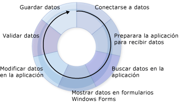

# Crear aplicaciones de datos
Visual Studio proporciona muchas herramientas en tiempo de diseño para crear aplicaciones que tienen acceso a datos.  Esta introducción proporciona información general sobre los procesos básicos relacionados con la creación de aplicaciones que funcionan con datos.  Se han omitido muchos detalles a fin de ofrecer una fuente de información general y punto de partida de las muchas otras páginas de la Ayuda relacionadas con la creación de una aplicación de datos.  
  
 A medida que desarrolla aplicaciones que tienen acceso a datos en [!INCLUDE[vsprvs](../code-quality/includes/vsprvs_md.md)], deberá cumplir con diferentes requisitos.  En algunos casos, puede que simplemente desee mostrar datos en un formulario.  En otros, quizá necesite idear un modo de compartir información con otras aplicaciones o procesos.  
  
 Independientemente de lo que haga con los datos, hay ciertos conceptos fundamentales que debe entender.  Es posible que nunca use ciertos detalles sobre manipulación de datos, por ejemplo, tal vez nunca cree una base de datos mediante programación, pero es muy útil comprender los conceptos básicos sobre datos, así como las herramientas de datos \(asistentes y diseñadores\) disponibles en [!INCLUDE[vsprvs](../code-quality/includes/vsprvs_md.md)].  
  
 Una aplicación de datos típica utiliza la mayoría de los procesos que se ilustran en el diagrama siguiente:  
  
   
El ciclo de datos  
  
 A medida que crea la aplicación, piense en la tarea que intenta lograr.  Utilice las secciones siguientes que le servirán de ayuda en la búsqueda de las herramientas y los objetos de [!INCLUDE[vsprvs](../code-quality/includes/vsprvs_md.md)] que tiene a su disposición.  
  
> [!NOTE]
>  [!INCLUDE[vsprvs](../code-quality/includes/vsprvs_md.md)] proporciona asistentes para simplificar varios de los procesos que aparecen en el diagrama anterior.  Al ejecutar el **Asistente para la configuración de orígenes de datos**, por ejemplo, se proporciona bastante información a la aplicación para conectarse a los datos, crear un conjunto de datos con tipo para recibir los datos y llevar los datos a la aplicación.  
  
 Para ver rápidamente cómo ayuda [!INCLUDE[vsprvs](../code-quality/includes/vsprvs_md.md)] en el desarrollo de aplicaciones de datos, vea [Tutorial: Crear una aplicación de datos sencilla](../Topic/Walkthrough:%20Creating%20a%20Simple%20Data%20Application.md).  
  
## Conectarse a datos  
 Para llevar datos a la aplicación \(y devolver los cambios al origen de datos\), debe establecerse algún tipo de comunicación bidireccional.  Esta comunicación bidireccional la controlan, por lo general, los objetos de su modelo de datos.  
  
 Por ejemplo, `TableAdapter` conecta las aplicaciones que usan conjuntos de datos a una base de datos y <xref:System.Data.Objects.ObjectContext> conecta las entidades de Entity Framework a una base de datos.  [!INCLUDE[vsprvs](../code-quality/includes/vsprvs_md.md)] proporciona varias herramientas para ayudar para crear conexiones que pueden ser utilizadas por su aplicación.  Para obtener más información sobre cómo conectar la aplicación a los datos, vea [Conectarse a datos en Visual Studio](../data-tools/connecting-to-data-in-visual-studio.md).  
  
 Para obtener información sobre cómo usar los conjuntos de datos para conectar la aplicación a los datos en una base de datos, vea [Tutorial: Conectar a los datos en una base de datos \(Windows Forms\)](../Topic/Walkthrough:%20Connecting%20to%20Data%20in%20a%20Database%20\(Windows%20Forms\).md).  
  
## Preparara la aplicación para recibir datos  
 Si la aplicación usa un modelo de datos desconectado, necesita almacenar temporalmente los datos en la aplicación mientras trabaja con ella.  Visual Studio proporciona herramientas de ayuda para crear los objetos que la aplicación usa para almacenar temporalmente datos: conjuntos de datos, entidades y objetos [!INCLUDE[vbtecdlinq](../data-tools/includes/vbtecdlinq_md.md)].  
  
> [!NOTE]
>  Una aplicación que usa un modelo de datos desconectado se conectará normalmente a una base de datos, ejecutará una consulta que lleva los datos a la aplicación, se desconectará de la base de datos y, a continuación, manipulará los datos "sin conexión" antes de volver a conectar y actualizar la base de datos.  
  
 Para obtener más información sobre cómo crear los conjuntos de datos con tipo en su aplicación, vea [Preparar la aplicación para recibir datos](../Topic/Preparing%20Your%20Application%20to%20Receive%20Data.md).  Para obtener información adicional sobre cómo usar los conjuntos de datos en aplicaciones con n niveles, vea [Cómo: Separar conjuntos de datos y TableAdapters en proyectos diferentes](../data-tools/separate-datasets-and-tableadapters-into-different-projects.md).  
  
 Para obtener información sobre cómo crear un conjunto de datos, finalice los procedimientos del [Tutorial: Crear un conjunto de datos con el Diseñador de Dataset](../data-tools/walkthrough-creating-a-dataset-with-the-dataset-designer.md).  
  
 Para obtener información sobre cómo crear objetos [!INCLUDE[vbtecdlinq](../data-tools/includes/vbtecdlinq_md.md)], complete los procedimientos en [Tutorial: Crear clases de LINQ to SQL \(Object Relational Designer\)](../Topic/Walkthrough:%20Creating%20LINQ%20to%20SQL%20Classes%20\(O-R%20Designer\).md).  
  
## Buscar datos en la aplicación  
 Independientemente de que la aplicación utilice un modelo de datos desconectado, necesitará obtener datos.  Lleve los datos a la aplicación mediante la ejecución de consultas o procedimientos almacenados de una base de datos.  Las aplicaciones que almacenan datos en conjuntos de datos ejecutan las consultas y los procedimientos almacenados mediante objetos `TableAdapter`, mientras que las aplicaciones que almacenan datos en entidades ejecutan las consultas mediante [LINQ to Entities](../Topic/LINQ%20to%20Entities.md) o conectando las entidades directamente con los procedimientos almacenados.  Para obtener más información sobre cómo crear y modificar consultas que usan TableAdapters, vea [Cómo: Crear consultas de TableAdapter](../data-tools/how-to-create-tableadapter-queries.md) y [Cómo: Editar consultas de TableAdapter](../data-tools/how-to-edit-tableadapter-queries.md).  
  
 Para obtener más información sobre cómo cargar datos en conjuntos de datos y cómo ejecutar consultas y procedimientos almacenados, vea [Buscar datos en la aplicación](../data-tools/fetching-data-into-your-application.md).  
  
 Para obtener información sobre cómo cargar datos en un conjunto de datos, finalice los procedimientos del [Tutorial: Mostrar datos en Windows Forms](../data-tools/walkthrough-displaying-data-on-a-windows-form.md) y examine el código del controlador de eventos de carga del formulario.  
  
 Para obtener información sobre cómo cargar datos en objetos [!INCLUDE[vbtecdlinq](../data-tools/includes/vbtecdlinq_md.md)], complete los procedimientos en [Tutorial: Crear clases de LINQ to SQL \(Object Relational Designer\)](../Topic/Walkthrough:%20Creating%20LINQ%20to%20SQL%20Classes%20\(O-R%20Designer\).md).  
  
 Para obtener información sobre cómo crear y ejecutar una consulta SQL, vea [Cómo: Crear y ejecutar una instrucción SQL que devuelva filas](../Topic/How%20to:%20Create%20and%20Execute%20an%20SQL%20Statement%20that%20Returns%20Rows.md).  
  
 Para obtener información sobre cómo ejecutar un procedimiento almacenado, vea [Cómo: Ejecutar un procedimiento almacenado que devuelve filas](../Topic/How%20to:%20Execute%20a%20Stored%20Procedure%20that%20Returns%20Rows.md).  
  
## Mostrar datos en formularios  
 Después de introducir los datos en la aplicación, los mostrará en un formulario para que los usuarios los vean o los modifiquen.  [!INCLUDE[vsprvs](../code-quality/includes/vsprvs_md.md)] proporciona una [Orígenes de datos \(ventana\)](../Topic/Data%20Sources%20Window.md), donde puede arrastrar elementos a formularios para crear automáticamente controles enlazados a datos que muestran datos.  Para obtener más información sobre cómo enlazar datos y mostrarlos a los usuarios, vea [Enlazar controles a los datos en Visual Studio](../data-tools/bind-controls-to-data-in-visual-studio.md).  
  
 Para saber cómo presentar datos a los usuarios, complete los procedimientos de los tutoriales, prestando particular atención al proceso de arrastrar los elementos desde la ventana **Orígenes de datos**:  
  
-   [Tutorial: Mostrar datos en Windows Forms](../data-tools/walkthrough-displaying-data-on-a-windows-form.md).  
  
-   [Tutorial: Enlazar controles de WPF a un servicio de datos de WCF](../data-tools/bind-wpf-controls-to-a-wcf-data-service.md)  
  
-   [Tutorial: Enlazar controles de Silverlight a un servicio de datos de WCF](../Topic/Walkthrough:%20Binding%20Silverlight%20Controls%20to%20a%20WCF%20Data%20Service.md)  
  
## Modificar datos en la aplicación  
 Cuando ya ha presentado los datos a los usuarios, es probable que los modifiquen agregando, cambiando y eliminando registros antes de devolverlos a la base de datos.  
  
 Para obtener más información sobre cómo trabajar con los datos cuando éstos ya están cargados en el conjunto de datos, vea [Modificar datos en la aplicación](../data-tools/editing-data-in-your-application.md).  
  
## Validar datos  
 Al realizar cambios en los datos, es posible que desee comprobar los cambios antes de permitir que los valores sean aceptados de regreso en la base de datos o que éstos se escriban en ella.  *Validación* es el nombre del proceso de comprobar que estos nuevos valores son aceptables para los requisitos de la aplicación.  Puede agregar lógica para comprobar los valores de la aplicación a medida que se modifican.   Visual Studio proporciona herramientas de ayuda para agregar código que valida los datos durante los cambios de columnas y filas.  Para obtener más información, vea [Validar datos](../Topic/Validating%20Data.md).  
  
 Para obtener información sobre cómo agregar validación de datos a la aplicación, vea [Tutorial: Agregar validación a un conjunto de datos](../Topic/Walkthrough:%20Adding%20Validation%20to%20a%20Dataset.md).  
  
 Para obtener información sobre cómo agregar validación a un conjunto de datos que se separa en una aplicación de n niveles, vea [Cómo: Agregar validación a un conjunto de datos con n niveles](../data-tools/add-validation-to-an-n-tier-dataset.md).  
  
## Guardar datos  
 Después de realizar los cambios en la aplicación \(y validarlos\), es posible que desee enviar los cambios a la base de datos.  Las aplicaciones que almacenan datos en conjuntos de datos normalmente usan un TableAdapterManager para guardar los datos.  Para obtener más información, vea [Información general sobre TableAdapterManager](../Topic/TableAdapterManager%20Overview.md).  Las aplicaciones de Entity Framework usan el método <xref:System.Data.Objects.ObjectContext.SaveChanges%2A> para guardar los datos.  
  
 Para obtener más información sobre cómo devolver los datos actualizados a una base de datos, vea [Guardar datos](../data-tools/saving-data.md).  
  
 Para obtener información sobre cómo enviar datos actualizados de un conjunto de datos a una base de datos, finalice los procedimientos del [Tutorial: Guardar datos de tablas de datos relacionadas \(actualización jerárquica\)](../Topic/Walkthrough:%20Saving%20Data%20from%20Related%20Data%20Tables%20\(Hierarchical%20Update\).md).  
  
## Temas relacionados  
 [Información general de las aplicaciones de datos en Visual Studio](../data-tools/overview-of-data-applications-in-visual-studio.md)  
 Proporciona vínculos a temas en los que se aborda la creación de aplicaciones que trabajan con datos.  
  
 [Conectarse a datos en Visual Studio](../data-tools/connecting-to-data-in-visual-studio.md)  
 Proporciona vínculos a temas sobre el uso de [!INCLUDE[vsprvs](../code-quality/includes/vsprvs_md.md)] para conectar una aplicación a datos y crear orígenes de datos para las aplicaciones.  
  
 [Preparar la aplicación para recibir datos](../Topic/Preparing%20Your%20Application%20to%20Receive%20Data.md)  
 Proporciona vínculos a temas que explican cómo trabajar con modelos de datos en una aplicación, incluidos los conjuntos de datos y Entity Data Model.  
  
 [Buscar datos en la aplicación](../data-tools/fetching-data-into-your-application.md)  
 Proporciona vínculos a temas que describen cómo cargar datos en la aplicación.  
  
 [Enlazar controles a los datos en Visual Studio](../data-tools/bind-controls-to-data-in-visual-studio.md)  
 Proporciona vínculos a temas que explican cómo enlazar controles de Windows Forms, WPF y Silverlight a orígenes de datos.  
  
 [Modificar datos en la aplicación](../data-tools/editing-data-in-your-application.md)  
 Proporciona vínculos a temas que describen cómo cambiar datos en la aplicación.  
  
 [Validar datos](../Topic/Validating%20Data.md)  
 Proporciona vínculos a temas que describen cómo agregar validación a los cambios de datos.  
  
 [Guardar datos](../data-tools/saving-data.md)  
 Proporciona vínculos a temas que explican cómo enviar datos actualizados de una aplicación a una base de datos o cómo guardarlos en otros formatos, por ejemplo, XML.  
  
 [Herramientas para trabajar con orígenes de datos en Visual Studio](../Topic/Tools%20for%20Working%20with%20Data%20Sources%20in%20Visual%20Studio.md)  
 Proporciona vínculos a temas sobre las herramientas que puede utilizar para trabajar con orígenes de datos en Visual Studio, como la ventana **Orígenes de datos** y ADO.NET Entity Data Model Designer.