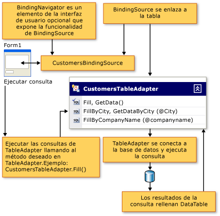
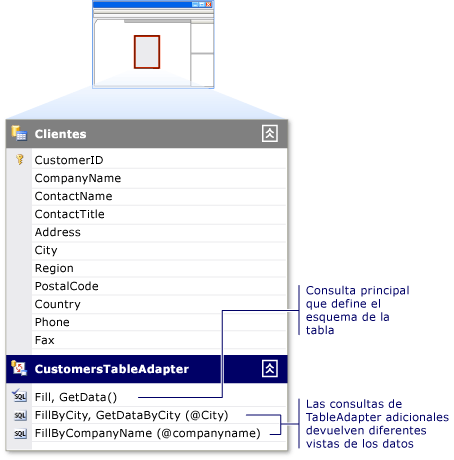

# Rellenar conjuntos de datos mediante TableAdapters

Un componente de TableAdapter rellena un dataset con los datos de la base de datos, en función de una o varias consultas o procedimientos almacenados que especifique. También puede llevar a cabo los TableAdapters agrega, actualiza y elimina la base de datos para conservar los cambios realizados en el conjunto de datos. También puede emitir comandos globales que están relacionados con una tabla específica.

> [!NOTE]
> Los TableAdapters son generados por los diseñadores de Visual Studio. Si va a crear conjuntos de datos mediante programación, a continuación, usar DataAdapter, que es una clase de .NET Framework.

Para obtener información detallada acerca de las operaciones de TableAdapter, puede ir directamente a uno de estos temas:

|Tema|Descripción|
|-----------|-----------------|
|[Crear y configurar TableAdapters](../data-tools/create-and-configure-tableadapters.md)|Cómo utilizar los diseñadores para crear y configurar TableAdapters|
|[Crear consultas parametrizadas de TableAdapter](../data-tools/create-parameterized-tableadapter-queries.md)|Cómo habilitar usuarios proporcionar argumentos a las consultas o procedimientos de TableAdapter|
|[Obtener acceso directamente a la base de datos con un TableAdapter](../data-tools/directly-access-the-database-with-a-tableadapter.md)|Cómo usar los métodos Dbdirect de TableAdapter|
|[Desactivar restricciones al llenar un conjunto de datos](../data-tools/turn-off-constraints-while-filling-a-dataset.md)|Cómo trabajar con restricciones foreign key durante la actualización de datos|
|[Cómo extender la funcionalidad de un TableAdapter](../data-tools/fill-datasets-by-using-tableadapters.md)|Cómo agregar código personalizado a los TableAdapters|
|[Leer datos XML en un conjunto de datos](../data-tools/read-xml-data-into-a-dataset.md)|Cómo trabajar con XML|

## Introducción a TableAdapter

Los TableAdapters son componentes generados por diseñador que se conectan a una base de datos, ejecutar consultas o procedimientos almacenados y completar su DataTable con los datos devueltos. Los TableAdapters también enviar datos actualizados desde la aplicación a la base de datos. Puede ejecutar tantas consultas como desee en un TableAdapter, siempre se devuelven los datos que se ajustan al esquema de la tabla que está asociado al TableAdapter. El siguiente diagrama muestra cómo interactúan los TableAdapters con bases de datos y otros objetos en memoria:

Aunque los TableAdapters están diseñados con la **Diseñador de Dataset**, las clases TableAdapter no se generan como clases anidadas de <xref:System.Data.DataSet>. Se encuentran en espacios de nombres independientes que son específicas de cada conjunto de datos. Por ejemplo, si tiene un conjunto de datos denominado `NorthwindDataSet`, los TableAdapters asociadas <xref:System.Data.DataTable>s en el `NorthwindDataSet` estaría en el `NorthwindDataSetTableAdapters` espacio de nombres. Para tener acceso a un TableAdapter determinado mediante programación, debe declarar una nueva instancia del TableAdapter. Por ejemplo:

[!code-csharp[VbRaddataTableAdapters#7](../data-tools/codesnippet/CSharp/fill-datasets-by-using-tableadapters_1.cs)]
[!code-vb[VbRaddataTableAdapters#7](../data-tools/codesnippet/VisualBasic/fill-datasets-by-using-tableadapters_1.vb)]

## Esquema de DataTable asociado

Al crear un TableAdapter, utilice la consulta inicial o procedimiento almacenado para definir el esquema del TableAdapter asociado a la <xref:System.Data.DataTable>. Ejecute esta consulta inicial o procedimiento almacenado mediante una llamada del TableAdapter `Fill` método (que rellena el TableAdapter asociado <xref:System.Data.DataTable>). Los cambios realizados en la consulta principal del TableAdapter se reflejan en el esquema de la tabla de datos asociada. Por ejemplo, al quitar una columna de la consulta principal también quita la columna de la tabla de datos asociados. Si alguna consulta adicional del TableAdapter utiliza instrucciones SQL que devuelven columnas que no están en la consulta principal, el diseñador intenta sincronizar los cambios de columna entre la consulta principal y las consultas adicionales.

## Comandos de actualización de TableAdapter

La funcionalidad de actualización de un objeto TableAdapter depende de la cantidad de información está disponible en la consulta principal en el **Asistente de TableAdapter**. Por ejemplo, los TableAdapter configurados para capturar los valores de varias tablas (utilizando un `JOIN`), los valores escalares, vistas o los resultados de las funciones de agregado no se crean inicialmente con la capacidad de enviar actualizaciones a la base de datos subyacente. Sin embargo, puede configurar el `INSERT`, `UPDATE`, y `DELETE` comandos manualmente en el **propiedades** ventana.

## consultas TableAdapter

Los TableAdapter pueden contener varias consultas que rellenan las tablas de datos asociados. Puede definir tantas consultas para un TableAdapter como requiera la aplicación, con tal de que cada consulta devuelva datos que cumplan el mismo esquema que la tabla de datos asociada. Esta funcionalidad permite a un TableAdapter cargar los resultados diferentes según distintos criterios.

Por ejemplo, si la aplicación contiene una tabla con los nombres de cliente, puede crear una consulta que rellena la tabla con todos los nombres de cliente comienza con una letra determinada y otra que rellena la tabla con todos los clientes que se encuentran en el mismo estado. Para rellenar un `Customers` tabla con los clientes en un estado determinado, puede crear un `FillByState` consulta que toma un parámetro para el valor de estado como sigue: `SELECT * FROM Customers WHERE State = @State`. Ejecute la consulta mediante una llamada a la `FillByState` como este método y pasando el valor del parámetro: `CustomerTableAdapter.FillByState("WA")`.

Además de agregar consultas que devuelven datos del mismo esquema como tabla de datos del TableAdapter, puede agregar consultas que devuelven los valores escalares (únicos). Por ejemplo, una consulta que devuelve un recuento de clientes (`SELECT Count(*) From Customers`) es válida para un `CustomersTableAdapter,` , aunque los datos que se devuelven no se ajustan al esquema de la tabla.

## Propiedad ClearBeforeFill

De forma predeterminada, cada vez que ejecute una consulta para rellenar la tabla de datos de un TableAdapter, se borran los datos existentes y se cargan solamente los resultados de la consulta en la tabla. Establecer el TableAdapter `ClearBeforeFill` propiedad `false` si desea agregar o combinar los datos que se devuelven de una consulta a los datos existentes en una tabla de datos. Independientemente de si borra los datos, deberá enviar explícitamente las actualizaciones a la base de datos, si desea guardarlos. Así que recuerde guardar los cambios a los datos en la tabla antes de ejecutar otra consulta que rellena la tabla. Para obtener más información, consulte [actualizar datos mediante un TableAdapter](../data-tools/update-data-by-using-a-tableadapter.md).

## Herencia de TableAdapter

Los TableAdapter amplían la funcionalidad de los adaptadores de datos estándar encapsulando un <xref:System.Data.Common.DataAdapter> clase. De forma predeterminada, el objeto TableAdapter hereda el <xref:System.ComponentModel.Component> clase y no puede convertirse el <xref:System.Data.Common.DataAdapter> clase. Convertir un TableAdapter a la <xref:System.Data.Common.DataAdapter> clase da como resultado un <xref:System.InvalidCastException> error. Para cambiar la clase base de un TableAdapter, puede especificar una clase que derive de <xref:System.ComponentModel.Component> en el **clase Base** propiedad del TableAdapter en el **Diseñador de Dataset**.

## Métodos y propiedades de TableAdapter

La clase TableAdapter no es parte de la [!INCLUDE[dnprdnshort](../code-quality/includes/dnprdnshort_md.md)]. Esto significa que no puede buscarla en la documentación o **Examinador de objetos**. Se crea en tiempo de diseño cuando se usa uno de los asistentes que se ha mencionado anteriormente. El nombre que se asigna a un TableAdapter al crearlo se basa en el nombre de la tabla que está trabajando. Por ejemplo, cuando se crea un TableAdapter basado en una tabla en una base de datos denominada `Orders`, lo TableAdapter se denomina `OrdersTableAdapter`. Se puede cambiar el nombre de clase del TableAdapter utilizando la propiedad **Name** en el **Diseñador de DataSet**.

Siguiente es las propiedades de los TableAdapters y los métodos más utilizados:

|Miembro|Descripción|
|------------|-----------------|
|`TableAdapter.Fill`|Rellena la tabla de datos asociada del TableAdapter con los resultados de lo TableAdapter `SELECT` comando.|
|`TableAdapter.Update`|Envía los cambios a la base de datos y devuelve un entero que representa el número de filas afectadas por la actualización. Para obtener más información, consulte [actualizar datos mediante un TableAdapter](../data-tools/update-data-by-using-a-tableadapter.md).|
|`TableAdapter.GetData`|Devuelve un nuevo <xref:System.Data.DataTable> que se rellena con datos.|
|`TableAdapter.Insert`|Crea una nueva fila en la tabla de datos. Para obtener más información, consulte [insertar nuevos registros en una base de datos](../data-tools/insert-new-records-into-a-database.md).|
|`TableAdapter.ClearBeforeFill`|Determina si se vacía una tabla de datos antes de llamar a uno de los métodos `Fill`.|

## Método de actualización de TableAdapter

Los TableAdapter utilizan comandos de datos para leer y escribir en la base de datos. Usar inicial del TableAdapter `Fill` consulta (principal) como base para crear el esquema de la tabla de datos asociada, así como el `InsertCommand`, `UpdateCommand`, y `DeleteCommand` comandos que están asociados con el `TableAdapter.Update` método. Una llamada a un TableAdapter `Update` método ejecuta las instrucciones que se crearon cuando se configuró originalmente el TableAdapter, no uno de la consulta que ha agregado con el **TableAdapter Query Configuration Wizard**.

Cuando se utiliza un TableAdapter, realiza eficazmente las mismas operaciones con los comandos que realizaría normalmente. Por ejemplo, cuando se llama el adaptador `Fill` método, el adaptador ejecuta el comando de datos su `SelectCommand` propiedad y utiliza un lector de datos (por ejemplo, <xref:System.Data.SqlClient.SqlDataReader>) para cargar el conjunto de resultados en la tabla de datos. De forma similar, cuando se llama el adaptador `Update` método, ejecuta el comando adecuado (en el `UpdateCommand`, `InsertCommand`, y `DeleteCommand` propiedades) para cada registro modificado de la tabla de datos.

> [!NOTE]
> Si hay bastante información en la consulta principal, se crean los comandos `InsertCommand`, `UpdateCommand` y `DeleteCommand` de manera predeterminada cuando se genera el TableAdapter. Si el TableAdapter principal de la consulta es mayor que una sola tabla `SELECT` instrucción, es posible que el diseñador no podrá generar `InsertCommand`, `UpdateCommand`, y `DeleteCommand`. Si no se generan estos comandos, podría recibir un error cuando ejecute el `TableAdapter.Update` método.

## TableAdapter GenerateDbDirectMethods

Además `InsertCommand`, `UpdateCommand`, y `DeleteCommand`, los TableAdapters se crean con métodos que se pueden ejecutar directamente en la base de datos. Puede llamar a estos métodos (`TableAdapter.Insert`, `TableAdapter.Update`, y `TableAdapter.Delete`) directamente para manipular los datos en la base de datos. Esto significa que puede llamar a estos métodos individuales desde el código en lugar de llamar `TableAdapter.Update` para controlar las inserciones, actualizaciones y eliminaciones que están pendientes de la tabla de datos asociados.

Si no desea crear estos métodos directos, establezca el TableAdapter **GenerateDbDirectMethods** propiedad `false` (en el **propiedades** ventana). Las consultas adicionales que se agregan al objeto TableAdapter son consultas independientes, que no generan estos métodos.

## Compatibilidad del objeto TableAdapter con los tipos que aceptan valores NULL

Los TableAdapters admiten tipos que aceptan valores NULL `Nullable(Of T)` y `T?`. Para más información sobre los tipos que aceptan valores NULL en Visual Basic, vea [Tipos que admiten valores null](/dotnet/visual-basic/programming-guide/language-features/data-types/nullable-value-types). Para obtener más información acerca de los tipos que aceptan valores NULL en C#, vea [utilizar tipos que aceptan valores NULL](/dotnet/csharp/programming-guide/nullable-types/using-nullable-types).

## Referencia de TableAdapterManager

De forma predeterminada, una clase TableAdapterManager genera cuando se crea un conjunto de datos que contiene las tablas relacionadas. Para evitar que la clase que se está generando, cambie el valor de la `Hierarchical Update` propiedad del conjunto de datos en false. Cuando se arrastra una tabla que tiene una relación a la superficie de diseño de un formulario de Windows o la página de WPF, Visual Studio declara una variable de miembro de la clase. Si no usa el enlace de datos, deberá declarar la variable de forma manual.

La clase TableAdapterManager no es parte de la [!INCLUDE[dnprdnshort](../code-quality/includes/dnprdnshort_md.md)]. Por lo tanto, no puede buscarla en la documentación. Se crea en tiempo de diseño como parte del proceso de creación del conjunto de datos.

Los siguientes son los métodos usados con frecuencia y propiedades de la `TableAdapterManager` clase:

|Miembro|Descripción|
|------------|-----------------|
|Método `UpdateAll`|Guarda todos los datos de todas las tablas de datos.|
|Propiedad`BackUpDataSetBeforeUpdate` |Determina si se debe crear una copia de seguridad del conjunto de datos antes de ejecutar el `TableAdapterManager.UpdateAll` método. Valor booleano.|
|*tableName* `TableAdapter` propiedad|Representa un TableAdapter. TableAdapterManager generado contiene una propiedad para cada `TableAdapter` lo administra. Por ejemplo, se genera un conjunto de datos con una tabla de clientes y pedidos con un TableAdapterManager que contiene `CustomersTableAdapter` y `OrdersTableAdapter` propiedades.|
|Propiedad`UpdateOrder` |Controla el orden de los individual insert, update y los comandos delete. Establezca esta opción a uno de los valores de la `TableAdapterManager.UpdateOrderOption` enumeración.   De forma predeterminada, el `UpdateOrder` está establecido en **InsertUpdateDelete**. Esto significa que se inserta, a continuación, actualizaciones y eliminaciones, a continuación, se realizan para todas las tablas del conjunto de datos.|

## Seguridad

Cuando utilice comandos de datos con una propiedad CommandType establecida en <xref:System.Data.CommandType.Text>, cuidadosamente Compruebe la información que se envía desde un cliente antes de pasarla a la base de datos. Usuarios con malas intenciones podrían intentar enviar (inyectar) instrucciones de SQL modificadas o adicionales con el fin de obtener acceso no autorizado o dañar la base de datos. Antes de transferir la entrada del usuario a una base de datos, compruebe siempre que la información es válida. Una práctica recomendada es usar siempre las consultas parametrizadas o procedimientos almacenados cuando sea posible.

## Vea también

- [Herramientas de conjunto de datos](../data-tools/dataset-tools-in-visual-studio.md)
