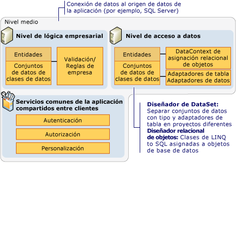
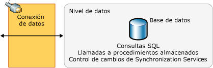

# Introducción a las aplicaciones de datos de n niveles
Las aplicaciones *de datos con N niveles* son aplicaciones de datos que se dividen en varios *niveles*. Las aplicaciones con n niveles, también denominadas "aplicaciones distribuidas" o "aplicaciones multinivel", dividen el procesamiento en niveles independientes que se distribuyen entre el cliente y el servidor. Al desarrollar aplicaciones que tienen acceso a datos, se debe realizar una separación clara entre los distintos niveles que constituyen la aplicación.

Una aplicación típica con n niveles incluye un nivel de presentación, un nivel intermedio y una capa de datos. La manera más fácil de separar los distintos niveles de una aplicación con n niveles es creando proyectos independientes para cada nivel que se desee incluir en la aplicación. Por ejemplo, el nivel de presentación podría ser una aplicación de formularios Windows Forms, mientras que la lógica de acceso a datos podría ser una biblioteca de clases ubicada en el nivel intermedio. Además, el nivel de presentación podría comunicarse con la lógica de acceso a datos en el nivel intermedio a través de un servicio como, por ejemplo, un servicio Web. Al separar los componentes de la aplicación en niveles independientes, se aumenta la facilidad de  mantenimiento y la escalabilidad de la aplicación. Esto se consigue mediante una integración más sencilla de nuevas tecnologías, que se pueden aplicar a un solo nivel sin necesidad de volver a diseñar la solución completa. Además, las aplicaciones con n niveles almacenan normalmente la información confidencial en el nivel intermedio, lo cual mantiene su aislamiento respecto del nivel de presentación.

Visual Studio contiene varias características que ayudan a los programadores a crear aplicaciones con n niveles:

- El DataSet proporciona una propiedad de **proyecto DataSet** que permite separar el conjunto de datos (capa de entidad de datos) y TableAdapters (capa de acceso a datos) en proyectos discretos.

- Las [herramientas de LINQ to SQL de Visual Studio](../data-tools/linq-to-sql-tools-in-visual-studio2.md) proporcionan valores para generar las clases DataContext y Data en espacios de nombres independientes. Con ello se habilita la separación lógica del acceso a datos y los niveles de entidad de datos.

- [LINQ to SQL](/dotnet/framework/data/adonet/sql/linq/index) proporciona el método de <xref:System.Data.Linq.Table%601.Attach%2A> que permite reunir el DataContext de distintos niveles de una aplicación. Para obtener más información, vea [aplicaciones de N niveles y remotas con LINQ to SQL](/dotnet/framework/data/adonet/sql/linq/n-tier-and-remote-applications-with-linq-to-sql).

## Nivel de presentación
El *nivel de presentación* es el nivel en el que los usuarios interactúan con una aplicación. Normalmente, contiene también la lógica adicional de la aplicación. Los componentes típicos del nivel de presentación son los siguientes:

- Los componentes de enlace de datos, tales como <xref:System.Windows.Forms.BindingSource> y <xref:System.Windows.Forms.BindingNavigator>.

- Representaciones de objetos de datos, como [LINQ to SQL](/dotnet/framework/data/adonet/sql/linq/index) clases de entidad para su uso en el nivel de presentación.

Normalmente, el nivel de presentación tiene acceso al nivel intermedio mediante una referencia de servicio (por ejemplo, un [Windows Communication Foundation servicios y WCF Data Services en la aplicación de Visual Studio](../data-tools/windows-communication-foundation-services-and-wcf-data-services-in-visual-studio.md) ). El nivel de presentación no obtiene acceso directamente a la capa de datos. El nivel de presentación se comunica con la capa de datos por medio del componente de acceso a datos en el nivel intermedio.

## Nivel intermedio
El *nivel intermedio* es la capa que el nivel de presentación y la capa de datos utilizan para comunicarse entre sí. Los componentes típicos del nivel intermedio son los siguientes:

- La lógica empresarial (reglas empresariales, validación de datos, etc.).

- La lógica y los componentes de acceso a datos, como los siguientes:

  - [TableAdapters](create-and-configure-tableadapters.md) y [DataAdapters y DataReader](/dotnet/framework/data/adonet/dataadapters-and-datareaders).

  - Representaciones de objetos de datos, como [LINQ to SQL](/dotnet/framework/data/adonet/sql/linq/index) clases de entidad.

  - Los servicios de aplicación comunes, como autenticación, autorización y personalización.

Las ilustraciones siguientes muestran las características y tecnologías que se encuentran disponibles en Visual Studio y dónde podrían integrarse en el nivel intermedio de una aplicación con n niveles.

componentes del nivel  nivel intermedio

El nivel intermedio se conecta normalmente con la capa de datos mediante una conexión de datos. Esta conexión de datos está almacenada normalmente en el componente de acceso a datos.

## Capa de datos
La *capa de datos* es básicamente el servidor que almacena los datos de una aplicación (por ejemplo, un servidor que ejecuta SQL Server).

Las ilustraciones siguientes muestran las características y tecnologías que se encuentran disponibles en Visual Studio y dónde podrían integrarse en la capa de datos de una aplicación con n niveles.

componentes del nivel  capa de datos

No se puede obtener acceso a la capa de datos directamente desde el cliente en el nivel de presentación. En su lugar, el componente de acceso a datos en el nivel intermedio se utiliza para la comunicación entre las capas de datos y la presentación.

## Ayuda para el desarrollo con n niveles
En los temas siguientes se ofrece información sobre cómo trabajar con aplicaciones de n niveles.

[Separar conjuntos de datos y TableAdapters en proyectos diferentes](../data-tools/separate-datasets-and-tableadapters-into-different-projects.md)

[Tutorial: Crear una aplicación de datos con n niveles](../data-tools/walkthrough-creating-an-n-tier-data-application.md)

[Aplicaciones de n niveles y remotas con LINQ to SQL](/dotnet/framework/data/adonet/sql/linq/n-tier-and-remote-applications-with-linq-to-sql)

## Vea también

- [Tutorial: Crear una aplicación de datos con n niveles](../data-tools/walkthrough-creating-an-n-tier-data-application.md)
- [Actualización jerárquica](../data-tools/hierarchical-update.md)
- [Herramientas de conjunto de datos en Visual Studio](../data-tools/dataset-tools-in-visual-studio.md)
- [Obtener acceso a los datos en Visual Studio](../data-tools/accessing-data-in-visual-studio.md)
