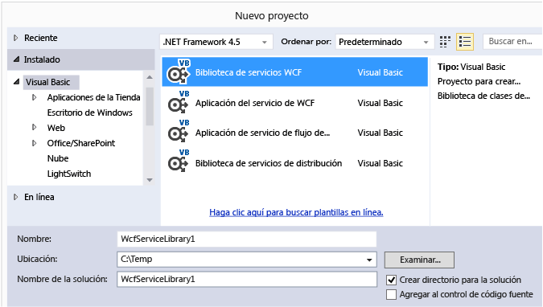

# Walkthrough: Creating and Accessing WCF Services
Este tutorial muestra cómo se crea un sencillo servicio de [!INCLUDE[vsindigo](../data-tools/includes/vsindigo_md.md)]. A continuación, se probará y se tendrá acceso a él desde una aplicación de Windows Forms.  
  
 [!INCLUDE[note_settings_general](../data-tools/includes/note_settings_general_md.md)]  
  
## Crear el servicio web  
  
#### Para crear un servicio WCF  
  
1.  En el menú **Archivo**, elija **Nuevo** y haga clic en **Proyecto**.  
  
2.  En el cuadro de diálogo **Nuevo proyecto**, expanda los nodos **Visual Basic** o  **Visual C\#**. Después, haga clic en **WCF** y **Biblioteca de servicios WCF**.  Haga clic en **Aceptar** para abrir el proyecto.  
  
       
  
    > [!NOTE]
    >  Se creará un servicio de trabajo que puede probar y acceder a él.  Los dos pasos siguientes muestran cómo puede modificar el método predeterminado para utilizar un tipo de datos diferente.  En una aplicación real, también agregaría sus propias funciones al servicio.  
  
3.    
  
     En el **Explorador de soluciones**, haga doble clic en IService1.vb o IService1.cs y busque la línea siguiente:  
  
     [!code-cs[WCFWalkthrough#4](../data-tools/codesnippet/CSharp/walkthrough-creating-a-simple-wcf-service-in-windows-forms_1.cs)]
     [!code-vb[WCFWalkthrough#4](../data-tools/codesnippet/VisualBasic/walkthrough-creating-a-simple-wcf-service-in-windows-forms_1.vb)]  
  
     Cambiar el tipo del parámetro `value` a `String`:  
  
     [!code-cs[WCFWalkthrough#1](../data-tools/codesnippet/CSharp/walkthrough-creating-a-simple-wcf-service-in-windows-forms_2.cs)]
     [!code-vb[WCFWalkthrough#1](../data-tools/codesnippet/VisualBasic/walkthrough-creating-a-simple-wcf-service-in-windows-forms_2.vb)]  
  
     En el código anterior, observe los atributos `<OperationContract()>` o `[OperationContract]`.  Estos atributos son obligatorios para cualquier método expuesto por el servicio.  
  
4.    
  
     En el **Explorador de soluciones**, haga doble clic en Service1.vb o Service1.cs y busque la siguiente línea:  
  
     [!code-vb[WCFWalkthrough#5](../data-tools/codesnippet/VisualBasic/walkthrough-creating-a-simple-wcf-service-in-windows-forms_3.vb)]
     [!code-cs[WCFWalkthrough#5](../data-tools/codesnippet/CSharp/walkthrough-creating-a-simple-wcf-service-in-windows-forms_3.cs)]  
  
     Cambiar el tipo del parámetro de valor a `String`:  
  
     [!code-cs[WCFWalkthrough#2](../data-tools/codesnippet/CSharp/walkthrough-creating-a-simple-wcf-service-in-windows-forms_4.cs)]
     [!code-vb[WCFWalkthrough#2](../data-tools/codesnippet/VisualBasic/walkthrough-creating-a-simple-wcf-service-in-windows-forms_4.vb)]  
  
## Probar el servicio  
  
#### Para probar un servicio WCF  
  
1.  Presione **F5** para ejecutar el servicio.  Se mostrará un formulario **Cliente de prueba WCF** y cargará el servicio.  
  
2.  En el formulario **Cliente de prueba WCF**, haga doble clic en el método **GetData\(\)** en **IService1**.  Se mostrará la pestaña **GetData**.  
  
       
  
3.  En el cuadro **Solicitar**, seleccione el campo **Valor** y escriba `Hello`.  
  
       
  
4.  Haga clic en el botón **Invocar**.  Si aparece un cuadro de diálogo **Advertencia de seguridad**, haga clic en **Aceptar**.  El resultado se mostrará en el cuadro **Respuesta**.  
  
       
  
5.  En el menú **Archivo**, haga clic en **Salir** para cerrar el formulario de prueba.  
  
## Acceso al servicio  
  
#### Para hacer referencia a un servicio WCF  
  
1.  En el menú **Archivo**, apunte a **Agregar** y, a continuación, haga clic en **Nuevo proyecto**.  
  
2.  En el cuadro de diálogo **Nuevo proyecto**, expanda el nodo **Visual Basic** o **Visual C\#**, seleccione **Windows** y, a continuación, seleccione **Aplicación de Windows Forms**.  Haga clic en **Aceptar** para abrir el proyecto.  
  
       
  
3.  Haga clic con el botón derecho en **WindowsApplication1** y haga clic en **Agregar referencia de servicio**.  Aparecerá el cuadro de diálogo **Agregar referencia de servicio**.  
  
4.  En el cuadro de diálogo **Agregar referencia de servicio**, haga clic en **Detectar**.  
  
       
  
     **Service1** se mostrará en el panel **Servicios**.  
  
5.  Haga clic en **Aceptar** para agregar la referencia del servicio.  
  
#### Para compilar una aplicación cliente  
  
1.  En el **Explorador de soluciones**, haga doble clic en **Form1.vb** o **Form1.cs** para abrir el Diseñador de Windows Forms, si no está ya abierto.  
  
2.  Desde el **Cuadro de herramientas**, arrastre un control `TextBox`, un control `Label` y un control `Button` al formulario.  
  
       
  
3.  Haga doble clic en `Button` y agregue el código siguiente al controlador de eventos `Click`:  
  
     [!code-cs[WCFWalkthrough#3](../data-tools/codesnippet/CSharp/walkthrough-creating-a-simple-wcf-service-in-windows-forms_5.cs)]
     [!code-vb[WCFWalkthrough#3](../data-tools/codesnippet/VisualBasic/walkthrough-creating-a-simple-wcf-service-in-windows-forms_5.vb)]  
  
4.  En el **Explorador de soluciones**, haga clic con el botón derecho en **WindowsApplication1** y haga clic en **Establecer como proyecto de inicio**.  
  
5.  Presione **F5** para ejecutar el proyecto.  Escriba algún texto y haga clic en el botón.  La etiqueta mostrará "Escribió:" y el texto que escribió.  
  
       
  
## Vea también  
 [Ejemplo Consuming ASMX and WCF Services](http://msdn.microsoft.com/es-es/788ddf2c-2ac1-416b-8789-2fbb1e29b8fe)