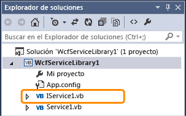
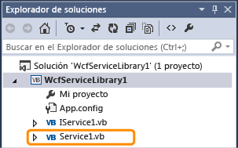
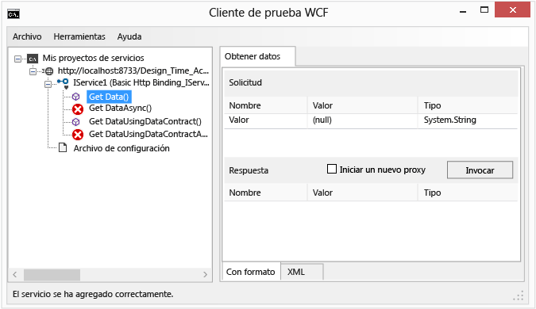
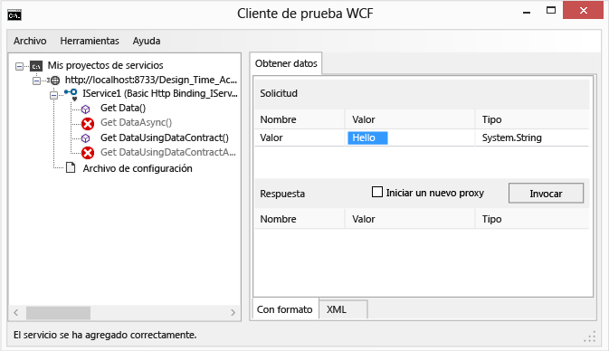
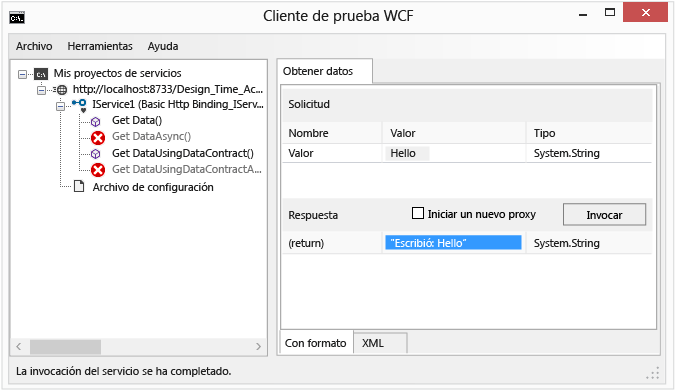
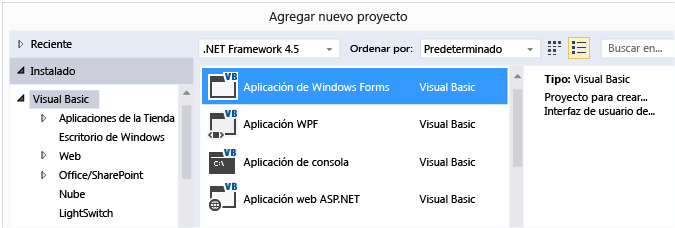
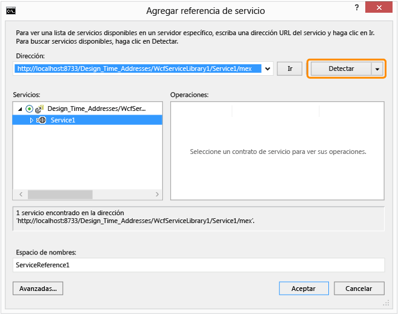
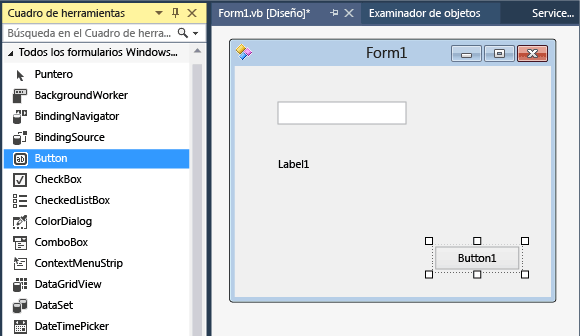
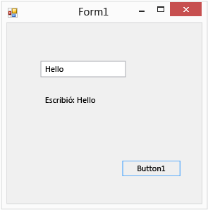

# Tutorial: Crear un servicio WCF sencillo en Windows Forms

Este tutorial muestra cómo crear un simple servicio de Windows Communication Foundation (WCF), pruébela y, a continuación, acceder a ella desde una aplicación de Windows Forms.

[!INCLUDE[note_settings_general](../data-tools/includes/note_settings_general_md.md)]

## Creación de un servicio

1. Abra Visual Studio.

::: moniker range="vs-2017"

2. En el menú **Archivo** , elija **Nuevo** > **Proyecto**.

3. En el **nuevo proyecto** cuadro de diálogo, expanda el **Visual Basic** o **Visual C#**  nodo y elija **WCF**, seguido de **Biblioteca de servicios WCF**.

4. Haga clic en **Aceptar** para crear el proyecto.

   

::: moniker-end

::: moniker range=">=vs-2019"

2. En la ventana de inicio, elija **Crear un proyecto nuevo**.

3. Tipo **biblioteca de servicios wcf** en el cuadro de búsqueda en el **crear un nuevo proyecto** página. Seleccione el C# o plantilla de Visual Basic para **biblioteca de servicios WCF**y, a continuación, haga clic en **siguiente**.

   

   > [!TIP]
   > Si no ve ninguna plantilla, es posible que deba instalar el **Windows Communication Foundation** componente de Visual Studio. Elija **instalar más herramientas y características** para abrir el instalador de Visual Studio. Elija la **componentes individuales** pestaña, desplácese hacia abajo hasta **las actividades de desarrollo**y, a continuación, seleccione **Windows Communication Foundation**. Haga clic en **Modificar**.

4. En el **configurar el nuevo proyecto** página, haga clic en **crear**.

::: moniker-end

   > [!NOTE]
   > Se creará un servicio de trabajo que puede probar y acceder a él. Los dos pasos siguientes muestran cómo puede modificar el método predeterminado para utilizar un tipo de datos diferente. En una aplicación real, también agregaría sus propias funciones al servicio.

5. En **el Explorador de soluciones**, haga doble clic en **IService1.vb** o **IService1.cs**.

   

   Busque la línea siguiente:

   [!code-csharp[WCFWalkthrough#4](../data-tools/codesnippet/CSharp/walkthrough-creating-a-simple-wcf-service-in-windows-forms_1.cs)]
   [!code-vb[WCFWalkthrough#4](../data-tools/codesnippet/VisualBasic/walkthrough-creating-a-simple-wcf-service-in-windows-forms_1.vb)]

   Cambiar el tipo de la `value` parámetro de cadena:

   [!code-csharp[WCFWalkthrough#1](../data-tools/codesnippet/CSharp/walkthrough-creating-a-simple-wcf-service-in-windows-forms_2.cs)]
   [!code-vb[WCFWalkthrough#1](../data-tools/codesnippet/VisualBasic/walkthrough-creating-a-simple-wcf-service-in-windows-forms_2.vb)]

   En el código anterior, observe los atributos `<OperationContract()>` o `[OperationContract]`. Estos atributos son obligatorios para cualquier método expuesto por el servicio.

6. En **el Explorador de soluciones**, haga doble clic en **Service1.vb** o **Service1.cs**.

   

   Busque la línea siguiente:

   [!code-vb[WCFWalkthrough#5](../data-tools/codesnippet/VisualBasic/walkthrough-creating-a-simple-wcf-service-in-windows-forms_3.vb)]
   [!code-csharp[WCFWalkthrough#5](../data-tools/codesnippet/CSharp/walkthrough-creating-a-simple-wcf-service-in-windows-forms_3.cs)]

   Cambiar el tipo de la `value` parámetro de cadena:

   [!code-csharp[WCFWalkthrough#2](../data-tools/codesnippet/CSharp/walkthrough-creating-a-simple-wcf-service-in-windows-forms_4.cs)]
   [!code-vb[WCFWalkthrough#2](../data-tools/codesnippet/VisualBasic/walkthrough-creating-a-simple-wcf-service-in-windows-forms_4.vb)]

## Probar el servicio

1. Presione **F5** para ejecutar el servicio. Un **cliente de prueba WCF** el formulario aparece y carga el servicio.

2. En el formulario **Cliente de prueba WCF**, haga doble clic en el método **GetData()** en **IService1**. El **GetData** aparecerá la pestaña.

     

3. En el cuadro **Solicitar**, seleccione el campo **Valor** y escriba `Hello`.

     

4. Haga clic en el botón **Invocar**. Si un **advertencia de seguridad** aparece el cuadro de diálogo, haga clic en **Aceptar**. El resultado se muestra en el **respuesta** cuadro.

     

5. En el menú **Archivo**, haga clic en **Salir** para cerrar el formulario de prueba.

## Obtener acceso al servicio

### Haga referencia al servicio WCF

1. En el menú **Archivo**, apunte a **Agregar**y haga clic en **Nuevo proyecto**.

2. En el **nuevo proyecto** cuadro de diálogo, expanda el **Visual Basic** o **Visual C#** nodo, seleccione **Windows**y, a continuación, seleccione  **Aplicación de Windows Forms**. Haga clic en **Aceptar** para abrir el proyecto.

     

3. Haga clic con el botón derecho en **WindowsApplication1** y haga clic en **Agregar referencia de servicio**. El **Add Service Reference** aparece el cuadro de diálogo.

4. En el cuadro de diálogo **Agregar referencia de servicio**, haga clic en **Detectar**.

     

     **Service1** se muestra en el **servicios** panel.

5. Haga clic en **Aceptar** para agregar la referencia del servicio.

### Compilar una aplicación cliente

1. En el **Explorador de soluciones**, haga doble clic en **Form1.vb** o **Form1.cs** para abrir el Diseñador de Windows Forms, si no está ya abierto.

2. Desde el **Cuadro de herramientas**, arrastre un control `TextBox`, un control `Label` y un control `Button` al formulario.

     

3. Haga doble clic en `Button` y agregue el código siguiente al controlador de eventos `Click`:

     [!code-csharp[WCFWalkthrough#3](../data-tools/codesnippet/CSharp/walkthrough-creating-a-simple-wcf-service-in-windows-forms_5.cs)]
     [!code-vb[WCFWalkthrough#3](../data-tools/codesnippet/VisualBasic/walkthrough-creating-a-simple-wcf-service-in-windows-forms_5.vb)]

4. En el **Explorador de soluciones**, haga clic con el botón derecho en **WindowsApplication1** y haga clic en **Establecer como proyecto de inicio**.

5. Presione **F5** para ejecutar el proyecto. Escriba algún texto y haga clic en el botón. Muestra la etiqueta "escribió:" y se muestra el texto que escribió.

     

## Vea también

- [Servicios de Windows Communication Foundation y Servicios de datos de WCF en Visual Studio](../data-tools/windows-communication-foundation-services-and-wcf-data-services-in-visual-studio.md)