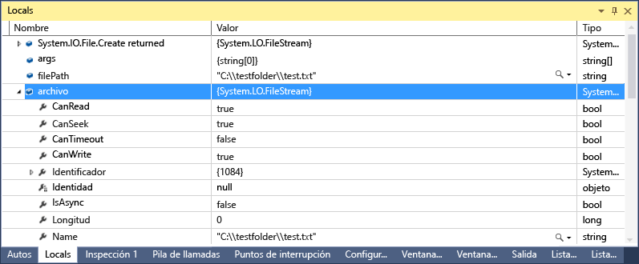
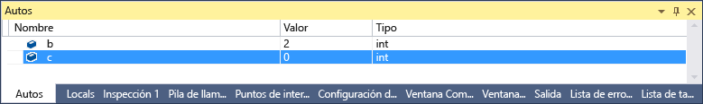
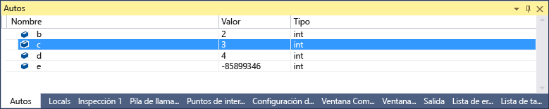
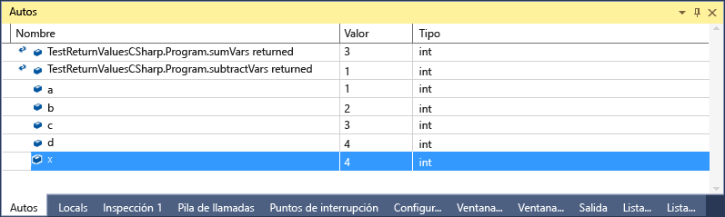

# Ventanas de variables locales y autom&#225;ticas
[!INCLUDE[vs2017banner](../code-quality/includes/vs2017banner.md)]

La ventana **Automático** \(durante la depuración, **CTRL\+ALT\+V, A** o **Depurar \/ Ventanas \/ Automático**\) y la ventana **Variables locales** \(durante la depuración, **CTRL\+ALT\+V, L** o **Depurar \/ Ventanas \/ Variables locales**\) resultan muy útiles a la hora de ver los valores de las variables durante la depuración. En la ventana **Variables locales** se muestran las variables definidas en el ámbito local, que generalmente es la función o el método que se encuentra en ejecución. En la ventana **Automático** se muestran las variables usadas en torno a la línea actual \(es decir, el lugar donde se detiene el depurador\). De hecho, las variables que se muestran varían según los distintos idiomas. Consulte la sección ¿Qué variables se muestran en la ventana Automático? a continuación.  
  
 Si necesita más información sobre la depuración básica, consulte [Introducción al depurador](../debugger/getting-started-with-the-debugger.md).  
  
## Examinar objetos en las ventanas de variables locales y automáticas  
 Las matrices y los objetos se muestran en las ventanas Automático y Variables locales como controles de árbol. Haga clic en la flecha situada a la izquierda del nombre de la variable para expandir la vista y mostrar los campos y las propiedades. En el ejemplo siguiente se muestra un objeto [FileStream](../Topic/FileStream%20Class.md) en la ventana **Variables locales**:  
  
   
  
## ¿Qué variables se muestran en la ventana Automático?  
 Se puede usar la ventana **Automático** en código C\#, Visual Basic y C\+\+. La ventana **Automático** no admite F\# ni JavaScript.  
  
 En C\# y Visual Basic, la ventana **Automático** muestra cualquier variable que se usa en la línea actual o anterior. Por ejemplo, si declara cuatro variables y las define de la siguiente manera:  
  
```c#  
public static void Main() { int a, b, c, d; a = 1; b = 2; c = 3; d = 4; }  
```  
  
 Si establece un punto de interrupción en la línea `c = 3` y ejecuta el depurador, la ventana **Automático** tendrá el siguiente aspecto cuando se detenga la ejecución del depurador:  
  
   
  
 Observe que el valor de `c` es 0, porque la línea `c = 3` aún no se ha ejecutado.  
  
 En C\+\+, la ventana **Automático** muestra las variables que se usan en al menos tres líneas anteriores a la línea actual \(es decir, la línea en la que se detiene la ejecución\). Si declara seis variables:  
  
```cpp  
void main() { int a, b, c, d, e, f; a = 1; b = 2; c = 3; d = 4; e = 5; f = 6; }  
```  
  
 Si establece un punto de interrupción en la línea `e = 5;` y ejecuta el depurador, la ventana **Automático** tendrá el siguiente aspecto cuando se detenga la ejecución del depurador:  
  
   
  
 Observe que la variable e no está inicializada porque el código de la línea  `e = 5;`  aún no se ha ejecutado.  
  
 También se pueden ver los valores devueltos de funciones y métodos en determinadas circunstancias. Consulte [Ver los valores devueltos por las llamadas a métodos](#bkmk_returnValue) a continuación.  
  
##  <a name="bkmk_returnValue"></a> Ver los valores devueltos por las llamadas a métodos  
 En el código .NET y C\+\+ se pueden examinar los valores devueltos cuando una llamada al método se ejecuta paso a paso por procedimientos o paso a paso para salir. Esta funcionalidad resulta útil cuando el resultado de una llamada al método no se almacena en una variable local; por ejemplo, cuando se usa un método como parámetro o valor devuelto de otro método.  
  
 El siguiente código C\# agrega los valores devueltos de dos funciones:  
  
```c#  
static void Main(string[] args) { int a, b, c, d; a = 1; b = 2; c = 3; d = 4; int x = sumVars(a, b) + subtractVars(c, d); } private static int sumVars(int i, int j) { return i + j; } private static int subtractVars(int i, int j) { return j - i; }  
  
```  
  
 Establezca un punto de interrupción en la línea int `x = sumVars(a, b) + subtractVars(c, d);` .  
  
 Inicie la depuración y, cuando la ejecución se interrumpa en el primer punto de interrupción, presione **F10 \(Paso a paso por procedimientos\)**. Debería mostrarse lo siguiente en la ventana **Automático**:  
  
   
  
## ¿Por qué los valores de las variables a veces se muestran en rojo en las ventanas de variables locales y automáticas?  
 Es posible que el valor de una variable a veces se muestre en rojo en las ventanas **Variables locales** y **Automático**. Se trata de valores de variables que cambiaron desde la última evaluación. La causa del cambio podría ser una sesión de depuración anterior o la modificación del valor en la ventana.  
  
## Cambiar el formato numérico de una ventana de variables  
 El formato numérico predeterminado es decimal, pero se puede cambiar a formato hexadecimal. Haga clic con el botón derecho en una ventana **Variables locales** o **Automático** y seleccione **Presentación hexadecimal**. El cambio afecta a todas las ventanas del depurador.  
  
## Editar un valor en una ventana de variables  
 Se pueden editar los valores de la mayoría de las variables que aparecen en las ventanas **Automático**, **Variables locales**, **Inspección** e **Inspección rápida**. Para obtener información sobre las ventanas **Inspección** e **Inspección rápida**, consulte [Ventanas Inspección e Inspección rápida](../debugger/watch-and-quickwatch-windows.md). Simplemente haga doble clic en el valor que quiere cambiar y agregue el nuevo valor.  
  
 Puede escribir una expresión para un valor; por ejemplo, `a + b`. El depurador acepta la mayoría de las expresiones de lenguaje válidas.  
  
 En el código C\+\+ nativo, se debe calificar el contexto de un nombre de variable. Para obtener más información, vea [Operador de contexto \(C\+\+\)](../debugger/context-operator-cpp.md).  
  
 Sin embargo, se debe tener cuidado al cambiar los valores. Estas son algunas causas posibles:  
  
-   La evaluación de algunas expresiones puede cambiar el valor de una variable o afectar de otra forma al estado del programa. Por ejemplo, evaluar `var1 = ++var2` cambia el valor de `var1` y `var2`.  
  
     Las expresiones que cambian datos podrían tener [efectos secundarios](https://en.wikipedia.org/wiki/Side_effect_\(computer_science\)), que pueden generar resultados inesperados si no se tienen en cuenta. Asegúrese de que comprende las consecuencias de este cambio antes de efectuarlo.  
  
-   La modificación de valores de punto flotante puede dar lugar a ligeras imprecisiones debido a la conversión de decimal a binario de los componentes fraccionarios. Incluso una operación de edición aparentemente inofensiva puede causar cambios en alguno de los bits menos significativos de la variable de punto flotante.  
  
## Barra de herramientas Ubicación de depuración  
 Puede usar la barra de herramientas **Ubicación de depuración** para seleccionar la función, el subproceso o el programa que desee. Establezca un punto de interrupción e inicie la depuración. \(Si no ve esta barra de herramientas, puede habilitarla haciendo clic en una parte vacía del área de la barra de herramientas. Se mostrará una lista de barras de herramientas. Seleccione **Ubicación de depuración**\). Cuando se alcanza el punto de interrupción, se detiene la ejecución y se puede ver la barra de herramientas de ubicación de depuración, situada en la fila inferior de la ilustración siguiente:  
  
   
  
 También puede cambiar el contexto de llamadas, subprocesos o procesos a funciones diferentes si hace doble clic en el elemento de las ventanas **Pila de llamadas**, **Subprocesos** o **Procesos**, respectivamente.  
  
## Vea también  
 [Ventanas del depurador](../debugger/debugger-windows.md)