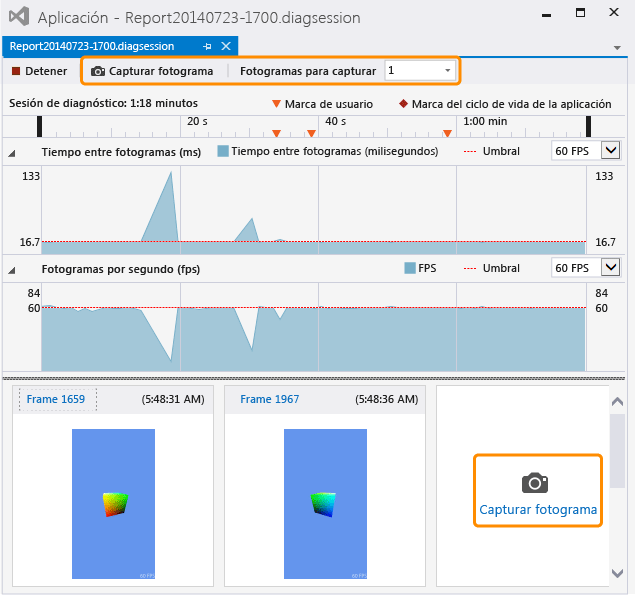

# Capturar informaci&#243;n de gr&#225;ficos
[!INCLUDE[vs2017banner](../code-quality/includes/vs2017banner.md)]

Capture información de gráficos desde la aplicación basada en Direct3D para que pueda usar el Analizador de gráficos de Visual Studio con el fin de diagnosticar problemas de representación y de rendimiento.  
  
## Capturar información de gráficos  
 La captura de información de gráficos es un proceso de dos pasos.  En primer lugar, ejecute la aplicación en Diagnóstico de gráficos y después especifique uno o varios fotogramas de los que desea capturar información detallada.  
  
#### Para ejecutar la aplicación en Diagnóstico de gráficos  
  
-   En la barra de menús, elija **Depurar**, **Gráficos**, **Iniciar diagnóstico**.  \(Teclado: presione Alt\+F5\)  
  
-   En la barra de herramientas **Gráficos**, elija el botón **Iniciar diagnóstico**.  
  
 Mientras se ejecuta una aplicación en Diagnóstico de gráficos, parte de la información de los gráficos se captura en todo momento; entre esta información se incluye la configuración del dispositivo, la creación de la cadena de intercambio, la creación de objetos gráficos y recursos y otros eventos importantes que afectan a varios fotogramas.  Al mismo tiempo, puede capturar información detallada sobre fotogramas específicos, como llamadas de dibujo y envíos del sombreador de cálculo, así como los objetos Direct3D y los recursos subyacentes.  
  
#### Para capturar un fotograma  
  
-   En Visual Studio, en la barra de herramientas **Gráficos**, elija el botón **Capturar fotograma**.  
  
-   En el teclado, presione Imprimir pantalla.  
  
    > [!NOTE]
    >  Mientras se ejecuta una aplicación en **Diagnóstico de gráficos**, la tecla Imprimir pantalla solo se puede utilizar para capturar un fotograma de información de gráficos, es decir, no funciona como lo hace normalmente.  Esto es así hasta que deja de capturar información de gráficos, generalmente deteniendo la depuración o saliendo normalmente de la aplicación, incluso si otra aplicación tiene el foco.  
  
-   En la interfaz de captura de Visual Studio, elija el botón **Capturar fotograma** situado encima de la escala de tiempo **Sesión de diagnóstico** o elija el botón grande **Capturar fotograma** situado debajo de la calle **Fotogramas por segundo** y a la derecha de los fotogramas capturados anteriormente.  En la imagen siguiente, están resaltados los dos botones.  
  
       
  
     Cuando esté listo para examinar los fotogramas capturados, inicie el **Analizador de gráficos de Visual Studio** siguiendo el vínculo **Fotograma...** situado sobre las imágenes en miniatura o haciendo doble clic en la miniatura.  
  
 Solo se pueden capturar fotogramas enteros, por lo que cuando inicia una captura, en realidad se registra la información de gráficos del siguiente fotograma.  La grabación se inicia inmediatamente después de que aparece el fotograma en el que ha iniciado la captura y finaliza cuando aparece el fotograma capturado.  Puede capturar tantos fotogramas como desee mientras la aplicación se ejecuta en Diagnóstico de gráficos.  Si no captura ningún fotograma, se descarta el registro de gráficos.  
  
 Al capturar fotogramas, Visual Studio muestra la ventana de sesión de diagnóstico \(.diagsession\).  Si cierra esta ventana, detiene la depuración o cierra la aplicación, no podrá capturar más fotogramas en ese registro.  Para capturar más información de gráficos, tendrá que ejecutar de nuevo la aplicación en Diagnóstico de gráficos para que se inicie una nueva sesión de diagnóstico.  
  
### Opciones de captura de diagnóstico de gráficos  
 Puede configurar la captura de modo que recopile pilas de llamadas de todos los eventos de gráficos o un subconjunto limitado, deshabilitar la HUD de captura y habilitar o deshabilitar el modo de compatibilidad de captura.  
  
##### Para configurar las opciones de captura de diagnóstico de gráficos  
  
1.  En la barra de menús, elija Herramientas y Opciones.  Aparecerá el cuadro de diálogo Opciones.  
  
2.  En la lista de categorías de las opciones de la izquierda, elija Diagnóstico de gráficos y, a continuación, configure las opciones de diagnóstico de gráficos que quiera.  
  
     **Recopilación de pilas de llamadas durante la captura \(ralentiza la captura\)**  
     Active esta casilla para recopilar pilas de llamadas.  Las pilas de llamadas no se recopilan de forma predeterminada.  Para capturar las pilas de llamadas, asegúrese de que esté activada la casilla **Recopilar pilas de llamadas durante la captura \(ralentiza la captura\)** para habilitar la recopilación y, a continuación, establezca la opción **para los marcadores draw, dispatch, present y perf** \(valor predeterminado\) para recopilar únicamente las pilas de llamadas más importantes, o la opción **para todo** para recopilar todas las pilas de llamadas.  Para detener la recopilación de pilas de llamadas más adelante, desactive la casilla **Recopilar pilas de llamadas durante la captura \(ralentiza la captura\)**.  
  
     **Deshabilitar HUD de juego durante la captura**  
     Active esta casilla para deshabilitar la superposición de HUD que suelen mostrar las aplicaciones que se ejecutan bajo el diagnóstico de gráficos.  Desactívela para mostrar la superposición de HUD.  
  
     **Captura en modo de compatibilidad**  
     Active esta casilla para capturar la información de gráficos en el modo de compatibilidad.  La configuración predeterminada es la captura en modo de compatibilidad.  En el modo de compatibilidad, Direct3D no informa de que la GPU admite más funciones que las definidas en el nivel de características de base.  Así, se evita que la aplicación que se está capturando utilice extensiones específicas del hardware de la GPU donde se captura, y se garantiza que el registro de gráficos se pueda reproducir con cualquier GPU que admita un nivel de características igual o mayor.  Desactive esta casilla para deshabilitar el modo de compatibilidad. Los registros capturados con el modo de compatibilidad deshabilitado no se reproducirán correctamente en las GPU que no admitan las mismas características adicionales que usó la aplicación durante la captura.  
  
     **Detener captura si se encuentran errores en las capas del SDK**  
     Active esta casilla para detener la captura inmediatamente si se producen errores.  
  
## Capturar información de gráficos de forma remota  
 Se puede capturar información de gráficos desde una aplicación que se ejecute en el equipo local o en un dispositivo remoto.  La captura remota se admite para los equipos [!INCLUDE[winblue_client_2](../debugger/includes/winblue_client_2_md.md)] y dispositivos [!INCLUDE[winblue_winrt_2](../debugger/includes/winblue_winrt_2_md.md)].  Para capturar información de gráficos desde una aplicación que se ejecute de forma remota, configure el proyecto para la depuración remota y después ejecute la aplicación en Diagnóstico de gráficos tal como se ha descrito anteriormente.  La aplicación se ejecuta en el equipo remoto y la información de gráficos capturada se registra en el equipo de desarrollo.  
  
 El modo en que configure el proyecto para la depuración remota dependerá del tipo de aplicación que esté desarrollando y del lenguaje de programación que utilice.  Para obtener información sobre cómo configurar la depuración remota de las aplicaciones de la Tienda Windows, vea [Ejecutar aplicaciones de la Tienda Windows en un equipo remoto](../debugger/run-windows-store-apps-on-a-remote-machine.md).  Para obtener información sobre cómo configurar la depuración remota para una aplicación de escritorio de Windows, vea [Configurar la depuración remota en un proyecto de Visual Studio](../Topic/Set%20Up%20Remote%20Debugging%20for%20a%20Visual%20Studio%20Project.md).  
  
 Posteriormente, podrá utilizar un equipo o un dispositivo remoto para reproducir la información de los gráficos, independientemente del lugar donde se haya capturado la información.  Para obtener más información, vea [Cómo: Cambiar la máquina de reproducción de diagnósticos de gráficos](../debugger/how-to-change-the-graphics-diagnostics-playback-machine.md).  
  
## Captura de información de gráficos desde la línea de comandos  
 Se puede capturar información de los gráficos desde una aplicación con una herramienta de línea de comandos.  Esta herramienta, DXCap.exe, puede capturar y reproducir rápidamente información de gráficos sin usar Visual Studio ni capturas de programación.  En particular, puede utilizar DXCap.exe para la automatización o en un entorno de prueba.  Para obtener más información sobre DXCap.exe, vea [Herramienta de captura de línea de comandos](../debugger/command-line-capture-tool.md).  
  
## Vea también  
 [Tutorial: Capturar información de gráficos](../debugger/walkthrough-capturing-graphics-information.md)