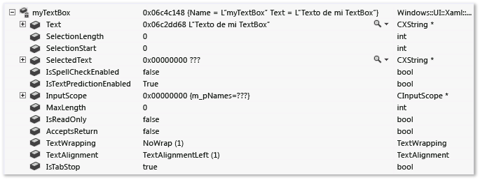
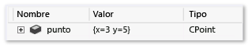
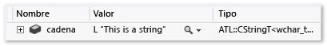
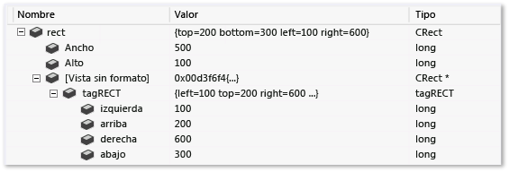
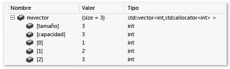
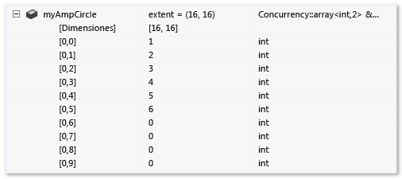
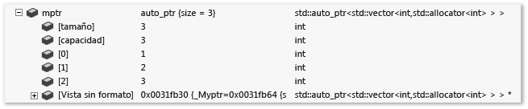
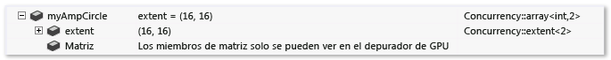
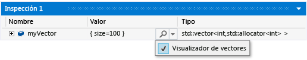

# <a name="create-custom-views-of-c-objects-in-the-debugger-using-the-natvis-framework"></a>Crear vistas personalizadas de C++ objetos en el depurador mediante el marco Natvis

El marco *Natvis* de Visual Studio Personaliza el modo en que los tipos nativos aparecen en las ventanas de variables del depurador, como las ventanas **variables locales** e **inspección** , y en la **información sobre herramientas**. Las visualizaciones de Natvis pueden ayudar a que los tipos que cree sean más visibles durante la depuración.

Natvis reemplaza el archivo *autoexp. dat* en versiones anteriores de Visual Studio con sintaxis XML, mejores diagnósticos, control de versiones y compatibilidad con varios archivos.

> [!NOTE]
> Las personalizaciones de Natvis funcionan con clases y Structs, pero no con definiciones de tipos.

## <a name="BKMK_Why_create_visualizations_"></a>Visualizaciones de Natvis

Use el marco Natvis para crear reglas de visualización para los tipos que cree, de modo que los desarrolladores puedan verlas más fácilmente durante la depuración.

Por ejemplo, en la siguiente ilustración se muestra una variable de tipo [Windows:: UI:: XAML:: Controls:: TextBox](/uwp/api/Windows.UI.Xaml.Controls.TextBox) en una ventana del depurador sin aplicar ninguna visualización personalizada.


La fila resaltada muestra la propiedad `Text` de la clase `TextBox` . La jerarquía de clases compleja dificulta la búsqueda de esta propiedad. El depurador no sabe cómo interpretar el tipo de cadena personalizado, por lo que no se puede ver la cadena contenida en el cuadro de texto.

El mismo `TextBox` parece mucho más sencillo en la ventana de variables cuando se aplican las reglas del visualizador personalizado Natvis. Los miembros importantes de la clase aparecen juntos y el depurador muestra el valor de cadena subyacente del tipo de cadena personalizado.



## <a name="BKMK_Using_Natvis_files"></a>Usar archivos. natvis en C++ proyectos

Natvis usa archivos *. natvis* para especificar las reglas de visualización. Un archivo *. natvis* es un archivo XML con la extensión *. natvis* . El esquema Natvis se define en *%VSINSTALLDIR%\Xml\Schemas\natvis.xsd*.

La estructura básica de un archivo *. natvis* es uno o más elementos `Type` que representan entradas de visualización. El nombre completo de cada elemento `Type` se especifica en su `Name` atributo.

```xml
<?xml version="1.0" encoding="utf-8"?>
<AutoVisualizer xmlns="http://schemas.microsoft.com/vstudio/debugger/natvis/2010">
  <Type Name="MyNamespace::CFoo">
    .
    .
  </Type>

  <Type Name="...">
    .
    .
  </Type>
</AutoVisualizer>
```

Visual Studio proporciona algunos archivos *. natvis* en la carpeta *%VSINSTALLDIR%\Common7\Packages\Debugger\Visualizers* Estos archivos tienen reglas de visualización para muchos tipos comunes y pueden servir como ejemplos para escribir visualizaciones para nuevos tipos.

### <a name="add-a-natvis-file-to-a-c-project"></a>Agregar un archivo. natvis a un C++ proyecto

Puede Agregar un archivo *. natvis* a cualquier C++ proyecto.

**Para agregar un nuevo archivo *. natvis* :**

1. Seleccione el C++ nodo del proyecto en **Explorador de soluciones**y seleccione **proyecto** > **Agregar nuevo elemento**, o haga clic con el botón derecho en el proyecto y seleccione **Agregar** > **nuevo elemento**.

1. En el cuadro de diálogo **Agregar nuevo elemento** , seleccione **utilidad** de **Visual C++**  >  > **archivo de visualización del depurador (. natvis)** .

1. Asigne un nombre al archivo y seleccione **Agregar**.

   El nuevo archivo se agrega a **Explorador de soluciones**y se abre en el panel de documento de Visual Studio.

El depurador de Visual Studio carga los archivos C++ *. natvis* en los proyectos automáticamente y, de forma predeterminada, también los incluye en el archivo *. pdb* cuando se compila el proyecto. Si depura la aplicación compilada, el depurador carga el archivo *. natvis* desde el archivo *. pdb* , aunque no tenga abierto el proyecto. Si no desea que el archivo *. natvis* se incluya en el archivo *. pdb*, puede excluirlo del archivo *. pdb* compilado.

**Para excluir un archivo *. natvis* de un archivo *. pdb*:**

1. Seleccione el archivo *. natvis* en **Explorador de soluciones**y seleccione el icono de **propiedades** , o haga clic con el botón derecho en el archivo y seleccione **propiedades**.

1. Desactive la flecha situada junto a **excluir de la compilación** , seleccione **sí**y, después, haga clic en **Aceptar**.

>[!NOTE]
>Para depurar proyectos ejecutables, utilice los elementos de la solución para agregar los archivos *. natvis* que no están en el archivo *. pdb*, C++ ya que no hay ningún proyecto disponible.

>[!NOTE]
>Las reglas Natvis cargadas desde un archivo *. pdb* solo se aplican a los tipos de los módulos a los que hace referencia *. pdb* . Por ejemplo, si *Module1. pdb* tiene una entrada Natvis para un tipo denominado `Test`, solo se aplica a la clase `Test` de *Module1. dll*. Si otro módulo también define una clase denominada `Test`, no se aplica a la entrada de Natvis *Module1. pdb* .

### <a name="BKMK_natvis_location"></a>Ubicaciones del archivo Natvis

Puede Agregar archivos *. natvis* al directorio de usuario o a un directorio del sistema si desea que se apliquen a varios proyectos.

Los archivos *. natvis* se evalúan en el orden siguiente:

1. Los archivos *. natvis* que se incrustan en un archivo *. pdb* que está depurando, a menos que exista un archivo con el mismo nombre en el proyecto cargado.

2. Los archivos *. natvis* que se encuentran en un C++ proyecto cargado o en una solución de nivel superior. Este grupo incluye todos los C++ proyectos cargados, incluidas las bibliotecas de clases, pero no los proyectos de otros lenguajes.

::: moniker range="vs-2017"

3. El directorio Natvis específico del usuario (por ejemplo, *%userprofile%\Documents\Visual Studio 2017 \ visualizadores*).

::: moniker-end

::: moniker range=">= vs-2019"

3. El directorio Natvis específico del usuario (por ejemplo, *%userprofile%\Documents\Visual Studio 2019 \ visualizadores*).

::: moniker-end

4. El directorio de Natvis de todo el sistema ( *%VSINSTALLDIR%\Common7\Packages\Debugger\Visualizers*). Este directorio tiene los archivos *. natvis* que se instalan con Visual Studio. Si tiene permisos de administrador, puede Agregar archivos a este directorio.

## <a name="modify-natvis-files-while-debugging"></a>Modificar archivos. natvis durante la depuración

Puede modificar un archivo *. natvis* en el IDE mientras depura su proyecto. Abra el archivo en la misma instancia de Visual Studio con la que está realizando la depuración, modifíquelo y guárdelo. En cuanto se guarda el archivo, la actualización de Windows **inspección** y **variables locales** para reflejar el cambio.

También puede Agregar o eliminar archivos *. natvis* en una solución que esté depurando, y Visual Studio agrega o quita las visualizaciones pertinentes.

No se pueden actualizar los archivos *. natvis* que se incrustan en archivos *. pdb* durante la depuración.

Si modifica el archivo *. natvis* fuera de Visual Studio, los cambios no surten efecto automáticamente. Para actualizar las ventanas del depurador, puede volver a evaluar el comando **. comando natvisreload** en la ventana **inspección** . Después, los cambios surten efecto sin necesidad de reiniciar la sesión de depuración.

Use también el comando **. comando natvisreload** para actualizar el archivo *. natvis* a una versión más reciente. Por ejemplo, el archivo *. natvis* se puede proteger en el control de código fuente y desea recoger los cambios recientes que otra persona realizó.

## <a name="BKMK_Expressions_and_formatting"></a> Expresiones y formato
Las visualizaciones de Natvis usan expresiones de C++ para especificar los elementos de datos que se deben mostrar. Además de las mejoras y las limitaciones de C++ las expresiones en el depurador, que se describen en el operador de [contexto (C++)](../debugger/context-operator-cpp.md), tenga en cuenta lo siguiente:

- Las expresiones Natvis se evalúan en el contexto del objeto que se visualiza, no el marco de pila actual. Por ejemplo, `x` en una expresión Natvis hace referencia al campo denominado **x** en el objeto que se visualiza, no a una variable local denominada **x** en la función actual. No se puede tener acceso a las variables locales en expresiones Natvis, aunque se puede tener acceso a variables globales.

- Las expresiones Natvis no permiten la evaluación de funciones ni los efectos secundarios. Se omiten las llamadas de función y los operadores de asignación. Puesto que las [funciones intrínsecas del depurador](../debugger/expressions-in-the-debugger.md#BKMK_Using_debugger_intrinisic_functions_to_maintain_state) no tienen efectos secundarios, pueden llamarse libremente desde cualquier expresión Natvis aunque no se permitan otras llamadas de función.

- Para controlar el modo en que se muestra una expresión, puede usar cualquiera de los especificadores de formato descritos en [especificadores de formato en C++ ](format-specifiers-in-cpp.md#BKMK_Visual_Studio_2012_format_specifiers). Los especificadores de formato se omiten cuando Natvis usa internamente la entrada, como la `Size` expresión en una [expansión ArrayItems](../debugger/create-custom-views-of-native-objects.md#BKMK_ArrayItems_expansion).

## <a name="natvis-views"></a>Vistas de Natvis

Puede definir diferentes vistas Natvis para mostrar tipos de maneras diferentes. Por ejemplo, a continuación se muestra una visualización de `std::vector` que define una vista simplificada denominada `simple`. Los elementos `DisplayString` y `ArrayItems` se muestran en la vista predeterminada y en la vista `simple`, mientras que los elementos `[size]` y `[capacity]` no se muestran en la vista `simple`.

```xml
<Type Name="std::vector&lt;*&gt;">
    <DisplayString>{{ size={_Mylast - _Myfirst} }}</DisplayString>
    <Expand>
        <Item Name="[size]" ExcludeView="simple">_Mylast - _Myfirst</Item>
        <Item Name="[capacity]" ExcludeView="simple">_Myend - _Myfirst</Item>
        <ArrayItems>
            <Size>_Mylast - _Myfirst</Size>
            <ValuePointer>_Myfirst</ValuePointer>
        </ArrayItems>
    </Expand>
</Type>
```

En la ventana **inspección** , use el especificador de formato de **vista** para especificar una vista alternativa. La vista simple aparece como **VEC, View (simple)** :


## <a name="BKMK_Diagnosing_Natvis_errors"></a>Errores Natvis

Cuando el depurador detecta errores en una entrada de visualización, los omite. Muestra el tipo en formato sin procesar o elige otra visualización adecuada. Puede usar los diagnósticos de Natvis para comprender por qué el depurador ha omitido una entrada de visualización y para ver los errores de sintaxis y análisis subyacentes.

**Para activar los diagnósticos de Natvis:**

- En **herramientas** > **Opciones** (o **depurar** **Opciones**de > ) > **depuración** > **ventana de salida**, establezca **los mensajes de diagnóstico de NatvisC++ (solo)** en **error**, **ADVERTENCIA**o **detallado**y, a continuación, seleccione **Aceptar**.

Los errores aparecen en la ventana **salida** .

## <a name="BKMK_Syntax_reference"></a> Referencia de la sintaxis de Natvis

### <a name="BKMK_AutoVisualizer"></a> Elemento AutoVisualizer
El elemento `AutoVisualizer` es el nodo raíz del archivo *.natvis* y contiene el atributo `xmlns:` del espacio de nombres.

```xml
<?xml version="1.0" encoding="utf-8"?>
<AutoVisualizer xmlns="http://schemas.microsoft.com/vstudio/debugger/natvis/2010">
.
.
</AutoVisualizer>
```

El elemento `AutoVisualizer` puede tener los elementos secundarios [Type](#BKMK_Type), [HRESULT](#BKMK_HResult), [UIVisualizer](#BKMK_UIVisualizer)y [CustomVisualizer](#BKMK_CustomVisualizer) .

### <a name="BKMK_Type"></a> Elemento Type

Una `Type` básica es similar a la de este ejemplo:

```xml
<Type Name="[fully qualified type name]">
  <DisplayString Condition="[Boolean expression]">[Display value]</DisplayString>
  <Expand>
    ...
  </Expand>
</Type>
```

 El elemento `Type` especifica:

1. El tipo para el que se debe usar la visualización (el atributo `Name`).

2. Cómo debe ser el valor de un objeto de ese tipo (el elemento `DisplayString` ).

3. Los miembros del tipo deben ser similares cuando el usuario expande el tipo en una ventana de variables (el nodo `Expand`).

#### <a name="templated-classes"></a>Clases con plantilla
El atributo `Name` del elemento `Type` acepta un asterisco `*` como carácter comodín que se puede usar para los nombres de clase con plantilla.

En el ejemplo siguiente, se usa la misma visualización si el objeto es un `CAtlArray<int>` o un `CAtlArray<float>`. Si hay una entrada de visualización específica para un `CAtlArray<float>`, tendrá prioridad sobre la genérica.

```xml
<Type Name="ATL::CAtlArray&lt;*&gt;">
    <DisplayString>{{Count = {m_nSize}}}</DisplayString>
</Type>
```

Puede hacer referencia a los parámetros de plantilla en la entrada de visualización mediante macros $T 1, $T 2, etc. Para buscar ejemplos de estas macros, vea los archivos *.natvis* incluidos con Visual Studio.

#### <a name="BKMK_Visualizer_type_matching"></a> Coincidencia de tipos del visualizador
Si no se puede validar una entrada de visualización, se usa la siguiente visualización disponible.

#### <a name="inheritable-attribute"></a>Atributo heredable
El atributo opcional `Inheritable` especifica si una visualización se aplica solo a un tipo base o a un tipo base y a todos los tipos derivados. El valor predeterminado de `Inheritable` es `true`.

En el ejemplo siguiente, la visualización solo se aplica al tipo de `BaseClass`:

```xml
<Type Name="Namespace::BaseClass" Inheritable="false">
    <DisplayString>{{Count = {m_nSize}}}</DisplayString>
</Type>
```

#### <a name="priority-attribute"></a>Atributo de prioridad

El atributo opcional `Priority` especifica el orden en el que se van a usar las definiciones alternativas si no se puede analizar una definición. Los valores posibles de `Priority` son: `Low`, `MediumLow`,`Medium`, `MediumHigh`y `High`. El valor predeterminado es `Medium`. El atributo `Priority` solo distingue entre prioridades dentro del mismo archivo *. natvis* .

En el siguiente ejemplo se analiza primero la entrada que coincide con el STL 2015. Si esto no se puede analizar, usa la entrada alternativa para la versión 2013 de STL:

```xml
<!-- VC 2013 -->
<Type Name="std::reference_wrapper&lt;*&gt;" Priority="MediumLow">
     <DisplayString>{_Callee}</DisplayString>
    <Expand>
        <ExpandedItem>_Callee</ExpandedItem>
    </Expand>
</Type>

<!-- VC 2015 -->
<Type Name="std::reference_wrapper&lt;*&gt;">
    <DisplayString>{*_Ptr}</DisplayString>
    <Expand>
        <Item Name="[ptr]">_Ptr</Item>
    </Expand>
</Type>
```

### <a name="optional-attribute"></a>Atributo opcional
Puede colocar un atributo `Optional` en cualquier nodo. Si una subexpresión dentro de un nodo opcional no se puede analizar, el depurador omite ese nodo, pero aplica el resto de las reglas de `Type`. En el siguiente tipo, `[State]` no es opcional, pero `[Exception]` sí lo es.  Si `MyNamespace::MyClass` tiene un campo denominado _`M_exceptionHolder`, aparecen los nodos `[State]` y `[Exception]`, pero si no hay ningún campo `_M_exceptionHolder`, solo aparece el nodo `[State]`.

```xml
<Type Name="MyNamespace::MyClass">
    <Expand>
      <Item Name="[State]">_M_State</Item>
      <Item Name="[Exception]" Optional="true">_M_exceptionHolder</Item>
    </Expand>
</Type>
```

### <a name="BKMK_Condition_attribute"></a> Atributo Condition

El atributo opcional `Condition` está disponible para muchos elementos de visualización y especifica cuándo se debe usar una regla de visualización. Si la expresión incluida en el atributo Condition se resuelve como `false`, no se aplica la regla de visualización. Si se evalúa como `true`, o no hay ningún atributo `Condition`, se aplica la visualización. Puede usar este atributo para la lógica IF-Else en las entradas de visualización.

Por ejemplo, la visualización siguiente tiene dos elementos `DisplayString` para un tipo de puntero inteligente. Cuando el miembro `_Myptr` está vacío, la condición del primer elemento `DisplayString` se resuelve como `true`, de modo que se muestra el formulario. Cuando el miembro de `_Myptr` no está vacío, la condición se evalúa como `false`y se muestra el segundo elemento `DisplayString`.

```xml
<Type Name="std::auto_ptr&lt;*&gt;">
  <DisplayString Condition="_Myptr == 0">empty</DisplayString>
  <DisplayString>auto_ptr {*_Myptr}</DisplayString>
  <Expand>
    <ExpandedItem>_Myptr</ExpandedItem>
  </Expand>
</Type>
```

### <a name="includeview-and-excludeview-attributes"></a>Atributos IncludeView y ExcludeView

Los atributos `IncludeView` y `ExcludeView` especifican los elementos que se van a mostrar o no en vistas específicas. Por ejemplo, en la siguiente especificación de Natvis de `std::vector`, la vista de `simple` no muestra los elementos `[size]` y `[capacity]`.

```xml
<Type Name="std::vector&lt;*&gt;">
    <DisplayString>{{ size={_Mylast - _Myfirst} }}</DisplayString>
    <Expand>
        <Item Name="[size]" ExcludeView="simple">_Mylast - _Myfirst</Item>
        <Item Name="[capacity]" ExcludeView="simple">_Myend - _Myfirst</Item>
        <ArrayItems>
            <Size>_Mylast - _Myfirst</Size>
            <ValuePointer>_Myfirst</ValuePointer>
        </ArrayItems>
    </Expand>
</Type>
```

Puede usar los atributos `IncludeView` y `ExcludeView` en los tipos y en los miembros individuales.

### <a name="BKMK_Versioning"></a> Elemento Version
El elemento `Version` limita una entrada de visualización a un módulo y versión específicos. El elemento `Version` ayuda a evitar conflictos de nombres, reduce las discrepancias involuntarias y permite diferentes visualizaciones para distintas versiones de tipos.

Si un archivo de encabezado común usado por módulos diferentes define un tipo, la visualización con versión solo aparece cuando el tipo está en la versión de módulo especificada.

En el ejemplo siguiente, la visualización solo es aplicable para el tipo de `DirectUI::Border` que se encuentra en el `Windows.UI.Xaml.dll` de la versión 1,0 a la 1,5.

```xml
<Type Name="DirectUI::Border">
  <Version Name="Windows.UI.Xaml.dll" Min="1.0" Max="1.5"/>
  <DisplayString>{{Name = {*(m_pDO->m_pstrName)}}}</DisplayString>
  <Expand>
    <ExpandedItem>*(CBorder*)(m_pDO)</ExpandedItem>
  </Expand>
</Type>
```

No necesita `Min` y `Max`. Son atributos opcionales. No se admiten caracteres comodín.

El atributo `Name` está en el formato *filename. ext*, como *Hello. exe* o *algún archivo. dll*. No se permiten nombres de ruta de acceso.

### <a name="BKMK_DisplayString"></a>Elemento DisplayString
El elemento `DisplayString` especifica una cadena que se mostrará como valor de una variable. Acepta cadenas arbitrarias mezcladas con expresiones. Todos los datos encerrados entre llaves se interpretan como una expresión. Por ejemplo, la siguiente entrada `DisplayString`:

```xml
<Type Name="CPoint">
  <DisplayString>{{x={x} y={y}}}</DisplayString>
</Type>
```

Significa que las variables de tipo `CPoint` muestran como en esta ilustración:

 

En la expresión `DisplayString`, `x` y `y`, que son miembros de `CPoint`, están dentro de llaves, por lo que sus valores se evalúan. En el ejemplo también se muestra cómo puede omitir una llave con llaves dobles (`{{` o `}}`).

> [!NOTE]
> El elemento `DisplayString` es el único que acepta cadenas arbitrarias y la sintaxis de llaves. Todos los demás elementos de visualización aceptan solo las expresiones que el depurador puede evaluar.

### <a name="BKMK_StringView"></a>Elemento StringView

El elemento `StringView` define un valor que el depurador puede enviar al visualizador de texto integrado. Por ejemplo, dada la siguiente visualización para el tipo de `ATL::CStringT`:

```xml
<Type Name="ATL::CStringT&lt;wchar_t,*&gt;">
  <DisplayString>{m_pszData,su}</DisplayString>
</Type>
```

El objeto de `CStringT` se muestra en una ventana de variables como en este ejemplo:

")

Al agregar un elemento `StringView`, se indica al depurador que puede mostrar el valor como una visualización de texto.

```xml
<Type Name="ATL::CStringT&lt;wchar_t,*&gt;">
  <DisplayString>{m_pszData,su}</DisplayString>
  <StringView>m_pszData,su</StringView>
</Type>
```

Durante la depuración, puede seleccionar el icono de lupa situado junto a la variable y seleccionar **visualizador de texto** para mostrar la cadena a la que apunta **m_pszData** .

 

La expresión `{m_pszData,su}` incluye un C++ especificador de formato **su**, para mostrar el valor como una cadena Unicode. Para obtener más información, vea [especificadores de C++formato en ](../debugger/format-specifiers-in-cpp.md).

### <a name="BKMK_Expand"></a>Expand (elemento)

El nodo opcional `Expand` Personaliza los elementos secundarios de un tipo visualizado al expandir el tipo en una ventana de variables. El nodo `Expand` acepta una lista de nodos secundarios que definen los elementos secundarios.

- Si no se especifica un nodo `Expand` en una entrada de visualización, los elementos secundarios usan las reglas de expansión predeterminadas.

- Si se especifica un nodo `Expand` sin nodos secundarios, el tipo no se expande en las ventanas del depurador.

#### <a name="BKMK_Item_expansion"></a> Expansión de Item

 El elemento `Item` es el elemento más básico y común en un nodo de `Expand`. `Item` define un único elemento secundario. Por ejemplo, una clase de `CRect` con los campos `top`, `left`, `right`y `bottom` tiene la siguiente entrada de visualización:

```xml
<Type Name="CRect">
  <DisplayString>{{top={top} bottom={bottom} left={left} right={right}}}</DisplayString>
  <Expand>
    <Item Name="Width">right - left</Item>
    <Item Name="Height">bottom - top</Item>
  </Expand>
</Type>
```

En la ventana del depurador, el tipo de `CRect` es similar al de este ejemplo:



El depurador evalúa las expresiones especificadas en los elementos `Width` y `Height`, y muestra los valores en la columna **valor** de la ventana variable.

El depurador crea automáticamente el nodo **[vista sin formato]** para cada expansión personalizada. La captura de pantalla anterior muestra el nodo **[vista sin formato]** expandido, para mostrar cómo la vista sin formato predeterminada del objeto difiere de la visualización de Natvis. La expansión predeterminada crea un subárbol para la clase base y enumera todos los miembros de datos de la clase base como elementos secundarios.

> [!NOTE]
> Si la expresión del elemento Item apunta a un tipo complejo, el propio nodo de **elemento** es expansible.

#### <a name="BKMK_ArrayItems_expansion"></a> ArrayItems expansion
Utilice el nodo `ArrayItems` para que el depurador de Visual Studio interprete el tipo como matriz y muestre sus elementos individuales. La visualización de `std::vector` es un buen ejemplo:

```xml
<Type Name="std::vector&lt;*&gt;">
  <DisplayString>{{size = {_Mylast - _Myfirst}}}</DisplayString>
  <Expand>
    <Item Name="[size]">_Mylast - _Myfirst</Item>
    <Item Name="[capacity]">(_Myend - _Myfirst)</Item>
    <ArrayItems>
      <Size>_Mylast - _Myfirst</Size>
      <ValuePointer>_Myfirst</ValuePointer>
    </ArrayItems>
  </Expand>
</Type>
```

`std::vector` muestra los elementos individuales cuando se expanden en la ventana de variables:



El nodo `ArrayItems` debe tener:

- Expresión `Size` (que debe evaluarse como entero) para que el depurador comprenda la longitud de la matriz.
- `ValuePointer` expresión que apunta al primer elemento (que debe ser un puntero de un tipo de elemento que no se `void*`).

El valor predeterminado del límite inferior de la matriz es 0. Para invalidar el valor, use un elemento `LowerBound`. Los archivos *. natvis* incluidos con Visual Studio tienen ejemplos.

>[!NOTE]
>Puede usar el operador `[]`, por ejemplo `vector[i]`, con cualquier visualización de matriz unidimensional que use `ArrayItems`, incluso si el propio tipo (por ejemplo `CATLArray`) no permite este operador.

También puede especificar matrices multidimensionales. En ese caso, el depurador necesita un poco más de información para mostrar correctamente los elementos secundarios:

```xml
<Type Name="Concurrency::array&lt;*,*&gt;">
  <DisplayString>extent = {_M_extent}</DisplayString>
  <Expand>
    <Item Name="extent">_M_extent</Item>
    <ArrayItems Condition="_M_buffer_descriptor._M_data_ptr != 0">
      <Direction>Forward</Direction>
      <Rank>$T2</Rank>
      <Size>_M_extent._M_base[$i]</Size>
      <ValuePointer>($T1*) _M_buffer_descriptor._M_data_ptr</ValuePointer>
    </ArrayItems>
  </Expand>
</Type>
```

- `Direction` especifica si la matriz está en orden principal de fila o de columna.
- `Rank` especifica el rango de la matriz.
- El elemento `Size` acepta el parámetro `$i` implícito que sustituye al índice de dimensión para buscar la longitud de la matriz en esa dimensión. En el ejemplo anterior, la expresión `_M_extent.M_base[0]` debe proporcionar la longitud de la dimensión 0, `_M_extent._M_base[1]` la primera, etc.

Este es el aspecto de un objeto de `Concurrency::array` bidimensional en la ventana del depurador:



#### <a name="BKMK_IndexListItems_expansion"></a> Expansión de IndexListItems

Solo puede utilizar la expansión de `ArrayItems` si los elementos de la matriz se colocan de forma contigua en la memoria. El depurador obtiene el elemento siguiente simplemente incrementando su puntero. Si necesita manipular el índice al nodo de valor, use `IndexListItems` nodos. A continuación se muestra una visualización con un nodo de `IndexListItems`:

```xml
<Type Name="Concurrency::multi_link_registry&lt;*&gt;">
  <DisplayString>{{size = {_M_vector._M_index}}}</DisplayString>
  <Expand>
    <Item Name="[size]">_M_vector._M_index</Item>
    <IndexListItems>
      <Size>_M_vector._M_index</Size>
      <ValueNode>*(_M_vector._M_array[$i])</ValueNode>
    </IndexListItems>
  </Expand>
</Type>
```

La única diferencia entre `ArrayItems` y `IndexListItems` es el `ValueNode`, que espera la expresión completa para el elemento i<sup>TH</sup> con el parámetro `$i` implícito.

>[!NOTE]
>Puede usar el operador `[]`, por ejemplo `vector[i]`, con cualquier visualización de matriz unidimensional que use `IndexListItems`, incluso si el propio tipo (por ejemplo `CATLArray`) no permite este operador.

#### <a name="BKMK_LinkedListItems_expansion"></a> Expansión de LinkedListItems

Si el tipo visualizado representa una lista vinculada, el depurador puede mostrar sus elementos secundarios si se usa un nodo `LinkedListItems` . La visualización siguiente para el tipo de `CAtlList` utiliza `LinkedListItems`:

```xml
<Type Name="ATL::CAtlList&lt;*,*&gt;">
  <DisplayString>{{Count = {m_nElements}}}</DisplayString>
  <Expand>
    <Item Name="Count">m_nElements</Item>
    <LinkedListItems>
      <Size>m_nElements</Size>
      <HeadPointer>m_pHead</HeadPointer>
      <NextPointer>m_pNext</NextPointer>
      <ValueNode>m_element</ValueNode>
    </LinkedListItems>
  </Expand>
</Type>
```

El elemento `Size` hace referencia a la longitud de la lista. `HeadPointer` apunta al primer elemento, `NextPointer` hace referencia al elemento siguiente y `ValueNode` hace referencia al valor del elemento.

El depurador evalúa las expresiones `NextPointer` y `ValueNode` en el contexto del elemento de nodo `LinkedListItems`, no del tipo de lista primario. En el ejemplo anterior, `CAtlList` tiene una clase `CNode` (que se encuentra en `atlcoll.h`) que es un nodo de la lista vinculada. `m_pNext` y `m_element` son campos de esa `CNode` clase, no de la clase `CAtlList`.

`ValueNode` puede dejarse vacío o usar `this` para hacer referencia al propio nodo de `LinkedListItems`.

#### <a name="customlistitems-expansion"></a>Expansión CustomListItems
La expansión `CustomListItems` le permite escribir una lógica personalizada para recorrer una estructura de datos, como una tabla hash. Use `CustomListItems` para visualizar las estructuras de datos que pueden C++ usar expresiones para todo lo que necesita evaluar, pero no caben en el molde para `ArrayItems`, `IndexListItems`o `LinkedListItems`.

El siguiente visualizador para `CAtlMap` es un ejemplo excelente en el que `CustomListItems` es adecuado.

```xml
<Type Name="ATL::CAtlMap&lt;*,*,*,*&gt;">
    <AlternativeType Name="ATL::CMapToInterface&lt;*,*,*&gt;"/>
    <AlternativeType Name="ATL::CMapToAutoPtr&lt;*,*,*&gt;"/>
    <DisplayString>{{Count = {m_nElements}}}</DisplayString>
    <Expand>
      <CustomListItems MaxItemsPerView="5000" ExcludeView="Test">
        <Variable Name="iBucket" InitialValue="-1" />
        <Variable Name="pBucket" InitialValue="m_ppBins == nullptr ? nullptr : *m_ppBins" />
        <Variable Name="iBucketIncrement" InitialValue="-1" />

        <Size>m_nElements</Size>
        <Exec>pBucket = nullptr</Exec>
        <Loop>
          <If Condition="pBucket == nullptr">
            <Exec>iBucket++</Exec>
            <Exec>iBucketIncrement = __findnonnull(m_ppBins + iBucket, m_nBins - iBucket)</Exec>
            <Break Condition="iBucketIncrement == -1" />
            <Exec>iBucket += iBucketIncrement</Exec>
            <Exec>pBucket = m_ppBins[iBucket]</Exec>
          </If>
          <Item>pBucket,na</Item>
          <Exec>pBucket = pBucket->m_pNext</Exec>
        </Loop>
      </CustomListItems>
    </Expand>
</Type>
```

Puede usar `Exec` para ejecutar código dentro de una expansión de `CustomListItems` mediante las variables y los objetos definidos en la expansión. Puede utilizar operadores lógicos, operadores aritméticos y operadores de asignación con `Exec`. No se puede usar `Exec` para evaluar funciones.

`CustomListItems` admite las siguientes funciones intrínsecas:

- `strlen`, `wcslen`, `strnlen`, `wcsnlen`, `strcmp`, `wcscmp`, `_stricmp`, `_strcmpi`, `_wcsicmp`, `strncmp`, `wcsncmp`, `_strnicmp`, `_wcsnicmp`, `memcmp`, `memicmp`, `wmemcmp`, `strchr`, `wcschr`, `memchr`, `wmemchr`, `strstr`, `wcsstr`, `__log2`, `__findNonNull`
- `GetLastError`, `TlsGetValue`, `DecodeHString`, `WindowsGetStringLen`, `WindowsGetStringRawBuffer`, `WindowsCompareStringOrdinal`, `RoInspectCapturedStackBackTrace`, `CoDecodeProxy`, `GetEnvBlockLength`, `DecodeWinRTRestrictedException`, `DynamicMemberLookup`, `DecodePointer`, `DynamicCast`
- `ConcurrencyArray_OperatorBracket_idx // Concurrency::array<>::operator[index<>] and operator(index<>)`
- `ConcurrencyArray_OperatorBracket_int // Concurrency::array<>::operator(int, int, ...)`
- `ConcurrencyArray_OperatorBracket_tidx // Concurrency::array<>::operator[tiled_index<>] and operator(tiled_index<>)`
- `ConcurrencyArrayView_OperatorBracket_idx // Concurrency::array_view<>::operator[index<>] and operator(index<>)`
- `ConcurrencyArrayView_OperatorBracket_int // Concurrency::array_view<>::operator(int, int, ...)`
- `ConcurrencyArrayView_OperatorBracket_tidx // Concurrency::array_view<>::operator[tiled_index<>] and operator(tiled_index<>)`
- `Stdext_HashMap_Int_OperatorBracket_idx`
- `Std_UnorderedMap_Int_OperatorBracket_idx`
- `TreeTraverse_Init // Initializes a new tree traversal`
- `TreeTraverse_Next // Returns nodes in a tree`
- `TreeTraverse_Skip // Skips nodes in a pending tree traversal`

#### <a name="BKMK_TreeItems_expansion"></a> Expansión de TreeItems
 Si el tipo visualizado representa un árbol, el depurador puede recorrer el árbol y mostrar sus elementos secundarios utilizando un nodo `TreeItems` . Esta es la visualización del tipo de `std::map` mediante un nodo de `TreeItems`:

```xml
<Type Name="std::map&lt;*&gt;">
  <DisplayString>{{size = {_Mysize}}}</DisplayString>
  <Expand>
    <Item Name="[size]">_Mysize</Item>
    <Item Name="[comp]">comp</Item>
    <TreeItems>
      <Size>_Mysize</Size>
      <HeadPointer>_Myhead->_Parent</HeadPointer>
      <LeftPointer>_Left</LeftPointer>
      <RightPointer>_Right</RightPointer>
      <ValueNode Condition="!((bool)_Isnil)">_Myval</ValueNode>
    </TreeItems>
  </Expand>
</Type>
```

La sintaxis es similar a la de `LinkedListItems` nodo. `LeftPointer`, `RightPointer`y `ValueNode` se evalúan en el contexto de la clase de nodo de árbol. `ValueNode` puede dejarse vacío o usar `this` para hacer referencia al propio nodo de `TreeItems`.

#### <a name="BKMK_ExpandedItem_expansion"></a> Expansión de ExpandedItem
 El elemento `ExpandedItem` genera una vista secundaria agregada mostrando las propiedades de las clases base o los miembros de datos como si fueran elementos secundarios del tipo visualizado. El depurador evalúa la expresión especificada y anexa los nodos secundarios del resultado a la lista secundaria del tipo visualizado.

Por ejemplo, el tipo de puntero inteligente `auto_ptr<vector<int>>` suele mostrarse como:

 

 Para ver los valores del vector, tiene que explorar en profundidad dos niveles en la ventana de variables, pasando por el miembro `_Myptr`. Al agregar un elemento `ExpandedItem`, puede eliminar la variable `_Myptr` de la jerarquía y ver directamente los elementos de vector:

```xml
<Type Name="std::auto_ptr&lt;*&gt;">
  <DisplayString>auto_ptr {*_Myptr}</DisplayString>
  <Expand>
    <ExpandedItem>_Myptr</ExpandedItem>
  </Expand>
</Type>
```

 

En el ejemplo siguiente se muestra cómo agregar propiedades de la clase base en una clase derivada. Supongamos que la clase `CPanel` se deriva de `CFrameworkElement`. En lugar de repetir las propiedades que proceden de la clase base `CFrameworkElement`, la visualización del nodo `ExpandedItem` anexa esas propiedades a la lista secundaria de la clase `CPanel`.

```xml
<Type Name="CPanel">
  <DisplayString>{{Name = {*(m_pstrName)}}}</DisplayString>
  <Expand>
    <Item Name="IsItemsHost">(bool)m_bItemsHost</Item>
    <ExpandedItem>*(CFrameworkElement*)this,nd</ExpandedItem>
  </Expand>
</Type>
```

Aquí es necesario usar el especificador de formato **nd** que desactiva la coincidencia de visualización para la clase derivada. De lo contrario, la expresión `*(CFrameworkElement*)this` haría que se aplicara de nuevo la visualización `CPanel`, porque las reglas de coincidencia de tipos de visualización predeterminados consideran la más adecuada. Use el especificador de formato **ND** para indicar al depurador que use la visualización de la clase base o la expansión predeterminada si la clase base no tiene ninguna visualización.

#### <a name="BKMK_Synthetic_Item_expansion"></a> Expansión de elemento Synthetic
 En los casos donde el elemento `ExpandedItem` elimina las jerarquías para proporcionar una vista de datos más plana, el nodo `Synthetic` hace lo contrario. Permite crear un elemento secundario artificial que no es el resultado de una expresión. El elemento artificial puede tener elementos secundarios propios. En el ejemplo siguiente, la visualización del tipo `Concurrency::array` usa un nodo `Synthetic` para mostrar un mensaje de diagnóstico al usuario:

```xml
<Type Name="Concurrency::array&lt;*,*&gt;">
  <DisplayString>extent = {_M_extent}</DisplayString>
  <Expand>
    <Item Name="extent" Condition="_M_buffer_descriptor._M_data_ptr == 0">_M_extent</Item>
    <ArrayItems Condition="_M_buffer_descriptor._M_data_ptr != 0">
      <Rank>$T2</Rank>
      <Size>_M_extent._M_base[$i]</Size>
      <ValuePointer>($T1*) _M_buffer_descriptor._M_data_ptr</ValuePointer>
    </ArrayItems>
    <Synthetic Name="Array" Condition="_M_buffer_descriptor._M_data_ptr == 0">
      <DisplayString>Array members can be viewed only under the GPU debugger</DisplayString>
    </Synthetic>
  </Expand>
</Type>
```

 

### <a name="BKMK_HResult"></a>Elemento HResult
 El elemento `HResult` permite personalizar la información que se muestra para un **valor HRESULT** en las ventanas del depurador. El elemento `HRValue` debe contener el valor de 32 bits de **HRESULT** que se debe personalizar. El elemento `HRDescription` contiene la información que se va a mostrar en la ventana del depurador.

```xml

<HResult Name="MY_E_COLLECTION_NOELEMENTS">
  <HRValue>0xABC0123</HRValue>
  <HRDescription>No elements in the collection.</HRDescription>
</HResult>
```

### <a name="BKMK_UIVisualizer"></a>Elemento UIVisualizer
Un elemento `UIVisualizer` registra un complemento de visualizador gráfico en el depurador. Un visualizador gráfico crea un cuadro de diálogo u otra interfaz que muestra una variable o un objeto de una manera coherente con su tipo de datos. El complemento del visualizador se debe crear como [VSPackage](../extensibility/internals/vspackages.md)y debe exponer un servicio que el depurador pueda consumir. El archivo *. natvis* contiene información de registro del complemento, como su nombre, el GUID del servicio expuesto y los tipos que puede visualizar.

A continuación se muestra un ejemplo de un elemento UIVisualizer:

```xml
<?xml version="1.0" encoding="utf-8"?>
<AutoVisualizer xmlns="http://schemas.microsoft.com/vstudio/debugger/natvis/2010">
    <UIVisualizer ServiceId="{5452AFEA-3DF6-46BB-9177-C0B08F318025}"
        Id="1" MenuName="Vector Visualizer"/>
    <UIVisualizer ServiceId="{5452AFEA-3DF6-46BB-9177-C0B08F318025}"
        Id="2" MenuName="List Visualizer"/>
.
.
</AutoVisualizer>
```

- Un par de atributos de `Id` de  - de `ServiceId`identifica un `UIVisualizer`. El `ServiceId` es el GUID del servicio que expone el paquete del visualizador. `Id` es un identificador único que diferencia los visualizadores, si un servicio proporciona más de uno. En el ejemplo anterior, el mismo servicio del visualizador proporciona dos visualizadores.

- El atributo `MenuName` define un nombre de visualizador que se mostrará en la lista desplegable junto al icono de lupa en el depurador. Por ejemplo:

  

Cada tipo definido en el archivo *. natvis* debe mostrar explícitamente los visualizadores de la interfaz de usuario que pueden mostrarlos. El depurador coincide con las referencias del visualizador de las entradas de tipo con los visualizadores registrados. Por ejemplo, la siguiente entrada de tipo para `std::vector` hace referencia a la `UIVisualizer` en el ejemplo anterior.

```xml
<Type Name="std::vector&lt;int,*&gt;">
  <UIVisualizer ServiceId="{5452AFEA-3DF6-46BB-9177-C0B08F318025}" Id="1" />
</Type>
```

 Puede ver un ejemplo de un `UIVisualizer` en la extensión [Image Watch](https://marketplace.visualstudio.com/items?itemName=VisualCPPTeam.ImageWatch2017) usada para ver los mapas de bits en memoria.

### <a name="BKMK_CustomVisualizer"></a>Elemento CustomVisualizer
 `CustomVisualizer` es un punto de extensibilidad que especifica una extensión VSIX que se escribe para controlar las visualizaciones en Visual Studio Code. Para obtener más información sobre cómo escribir extensiones VSIX, vea el [SDK de Visual Studio](../extensibility/visual-studio-sdk.md).

Es mucho más trabajo escribir un visualizador personalizado que una definición Natvis de XML, pero está libre de restricciones sobre lo que Natvis hace o no es compatible. Los visualizadores personalizados tienen acceso al conjunto completo de API de extensibilidad del depurador, que pueden consultar y modificar el proceso de depuración o comunicarse con otras partes de Visual Studio.

 Puede usar los atributos `Condition`, `IncludeView`y `ExcludeView` en elementos de `CustomVisualizer`.