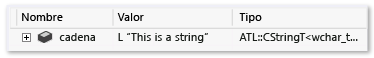

# Crear vistas personalizadas de objetos nativos
[!INCLUDE[vs2017banner](../code-quality/includes/vs2017banner.md)]

El marco Natvis de Visual Studio permite personalizar la manera en que Visual Studio muestra los tipos nativos en las ventanas de variables del depurador \(por ejemplo, las ventanas **Inspección**, **Variables locales** y **Sugerencias de datos**.  
  
 Natvis sustituye el archivo **autoexp.dat** usado en versiones anteriores de Visual Studio y proporciona una sintaxis XML, mejores diagnósticos, control de versiones y compatibilidad con varios archivos.  
  
> [!NOTE]
>  No se puede usar el marco Natvis para las visualizaciones en los siguientes casos:  
>   
>  -   Está depurando un proyecto de escritorio de Windows de C\+\+ con el tipo de depurador establecido en **mixto**.  
> -   Está efectuando una depuración en modo mixto en una aplicación de escritorio de Windows en modo de compatibilidad administrado \(**Herramientas \/ Opciones \/ Depuración \/ General \/ Usar modo de compatibilidad administrado**\).  
> -   Está efectuando una depuración en una aplicación de escritorio de Windows en modo de compatibilidad nativa \(**Herramientas \/ Opciones \/ Depuración \/ General \/ Usar el modo de compatibilidad nativa**\).  
  
##  <a name="BKMK_Why_create_visualizations_"></a> ¿Por qué crear visualizaciones de Natvis?  
 Puede usar el marco Natvis para crear reglas de visualización para los tipos creados, de manera que los desarrolladores puedan verlas fácilmente durante la depuración.  
  
 Por ejemplo, en la imagen siguiente se muestra una variable de tipo [Windows::UI::Xaml::Controls::TextBox](http://go.microsoft.com/fwlink/?LinkId=258422) que se muestra en el depurador sin aplicar ninguna visualización personalizada.  
  
   
  
 La fila resaltada muestra la propiedad `Text` de la clase `TextBox`. La jerarquía de clases complejas dificulta la búsqueda de este valor; además el depurador no sabe cómo interpretar el tipo cadena personalizada que el objeto usa, por lo que no se puede ver la cadena incluida en el cuadro de texto.  
  
 El mismo `TextBox` parece mucho más sencillo en la ventana de variables cuando se aplican reglas de visualización personalizadas. Los miembros importantes de la clase se pueden ver juntos y el depurador muestra el valor de cadena subyacente del tipo cadena personalizado.  
  
   
  
##  <a name="BKMK_Using_Natvis_files"></a> Usar archivos Natvis  
 Los archivos .natvis son archivos XML con una extensión .natvis. El esquema se define en **%VSINSTALLDIR%\\Xml\\Schemas\\natvis.xsd**.  
  
 La estructura básica de un archivo .natvis consta de uno o más elementos `Type`, donde cada elemento `Type` representa una entrada de visualización para un tipo cuyo nombre completo se especifica en el atributo `Name`.  
  
```xml  
  
<?xml version="1.0" encoding="utf-8"?> <AutoVisualizer xmlns="http://schemas.microsoft.com/vstudio/debugger/natvis/2010"> <Type Name="MyNamespace::CFoo"> . . </Type> <Type Name="..."> . . </Type> </AutoVisualizer>  
```  
  
 Visual Studio proporciona algunos archivos .natvis en la carpeta **%VSINSTALLDIR%\\Common7\\Packages\\Debugger\\Visualizers**. Estos archivos contienen reglas de visualización para muchos tipos comunes y pueden servir como ejemplos al escribir visualizaciones para nuevos tipos.  
  
## Agregar archivos .natvis a los proyectos  
 Se pueden agregar archivos .natvis a cualquier proyecto de C\+\+.  
  
 Para agregar un nuevo archivo .natvis, con un proyecto de C\+\+ abierto, seleccione el nodo de proyecto en el **Explorador de soluciones** y haga clic en **Agregar\/Nuevo elemento\/Visual C\+\+\/Utilidad\/Archivo de visualización del depurador \(.natvis\)**. El depurador cargará automáticamente los archivos Natvis de los proyectos de C\+\+. De forma predeterminada, los archivos Natvis del proyecto también se insertan en el archivo .pdb generado por el proyecto. Es decir, si depura el código binario generado por este proyecto, el depurador carga el archivo Natvis desde el archivo .pdb aunque no tenga abierto el proyecto. Si no desea que el archivo .natvis se incluya en el archivo .pdb, haga clic con el botón derecho en el archivo .natvis en el **Explorador de soluciones** y, en la ventana **Propiedades de configuración**, establezca **Excluir de la compilación** en **Sí**.  
  
 Se recomienda editar los archivos Natvis con Visual Studio. Los cambios efectuados durante la depuración surten efecto automáticamente al guardar el archivo. También obtendrá una mejor experiencia de edición con IntelliSense.  
  
 Los archivos Natvis que se cargan desde un archivo .pdb solo se aplican a los tipos del módulo al que hace referencia el archivo .pdb. Por ejemplo, si Module1.pdb define una entrada para un tipo denominado `Test`, esta entrada solo se aplica a la clase **Test** de Module1.dll. Si hay otro módulo que también define una clase denominada **Test**, la entrada natvis de Module1.pdb no se aplica a este.  
  
##  <a name="BKMK_natvis_location"></a> Implementar archivos .natvis  
 Si el archivo .natvis solo se aplica a los tipos que está creando en un proyecto de Visual Studio, no tiene que hacer nada; el archivo .natvis se incluye en el archivo .pdb. No obstante, puede agregar archivos .natvis al directorio del usuario o a un directorio del sistema si desea aplicarlos a varios proyectos.  
  
 El orden de evaluación de los archivos .natvis es el siguiente:  
  
1.  Archivos .natvis insertados en un archivo .pdb que está depurando \(a menos que exista un archivo con el mismo nombre en un proyecto cargado\).  
  
2.  Archivos .natvis que forman parte de un proyecto de C\+\+ cargado o de un elemento de la solución de nivel superior. Se incluyen todos los proyectos de C\+\+ cargados, incluidas las bibliotecas de clases, pero no los proyectos de otros lenguajes \(por ejemplo, no puede cargar un archivo .natvis desde un proyecto de C\#\). Para los proyectos ejecutables, debe usar los elementos de la solución para hospedar los archivos .natvis que no estén presentes en un archivo .pdb, ya que no hay ningún proyecto de C\+\+ disponible.  
  
3.  El directorio de Natvis específico de usuario \(**%USERPROFILE%\\My Documents\\Visual Studio 2015\\Visualizers**\).  
  
4.  El directorio de Natvis de todo el sistema \(**%VSINSTALLDIR%\\Common7\\Packages\\Debugger\\Visualizers**\). Ubicación donde se copian los archivos .natvis instalados con Visual Studio. También puede agregar otros archivos a este directorio si cuenta con permisos de administrador.  
  
## Modificar archivos .natvis durante la depuración  
 Es posible modificar un archivo .natvis en el IDE mientras se depura el proyecto en el que está incluido. Abra el archivo en el IDE \(con la misma instancia de Visual Studio con la que está efectuando la depuración\), modifíquelo y guárdelo. Cuando haya guardado el archivo, debe actualizar las ventanas **Inspección** y **Locales** para reflejar el cambio. Si modifica el archivo .natvis fuera del IDE, los cambios no surtirán efecto automáticamente. Para actualizar las ventanas, puede evaluar el comando **.natvisreload** en la ventana **Inspección**. Esto hace que los cambios surtan efecto sin tener que reiniciar la sesión de depuración.  
  
 También se pueden agregar o eliminar archivos .natvis en una solución que esté depurando, y Visual Studio agregará o quitará las visualizaciones pertinentes.  
  
 No se puede modificar un archivo .natvis durante la depuración si está insertado en un archivo .pdb.  
  
 Use el comando **.natvisreload** al actualizar el archivo .natvis a una versión más reciente \(por ejemplo, si se ha comprobado en el control de código fuente y desea recoger los cambios recientes que alguien ha hecho en el archivo\). Es aconsejable editar los archivos natvis con el editor XML de Visual Studio.  
  
##  <a name="BKMK_Expressions_and_formatting"></a> Expresiones y formato  
 Las visualizaciones de Natvis usan expresiones de C\+\+ para especificar los elementos de datos que se deben mostrar. Además de las mejoras y las limitaciones de las expresiones de C\+\+ del depurador que se describen en [Operador de contexto \(C\+\+\)](../debugger/context-operator-cpp.md), debe conocer las diferencias siguientes:  
  
-   Las expresiones Natvis se evalúan en el contexto del objeto que se visualiza, no el marco de pila actual. Por ejemplo, si usa `x` en una expresión Natvis, esto hace referencia al campo denominado `x` del objeto visualizado, no a una variable local denominada `x` de la función que se está ejecutando actualmente. En las expresiones Natvis no se puede acceder a variables locales, aunque sí a variables globales.  
  
-   Las expresiones Natvis no admiten la evaluación o los efectos secundarios de las funciones. Esto significa que se omiten las llamadas y los operadores de asignación. Puesto que las [funciones intrínsecas del depurador](../debugger/expressions-in-the-debugger.md#BKMK_Using_debugger_intrinisic_functions_to_maintain_state) no tienen efectos secundarios, pueden llamarse libremente desde cualquier expresión Natvis aunque no se permitan otras llamadas de función.  
  
 Para controlar la manera en que se muestra una expresión en una ventana de variables, puede usar cualquiera de los especificadores de formato que se describen en la sección [Especificadores de formato](../debugger/format-specifiers-in-cpp.md#BKMK_Visual_Studio_2012_format_specifiers) del tema [Especificadores de formato en C\+\+](../debugger/format-specifiers-in-cpp.md). Observe que los especificadores de formato se omiten cuando Natvis usa internamente la entrada de virtualización, como la expresión `Size` en una [Expansión de ArrayItems](../debugger/create-custom-views-of-native-objects.md#BKMK_ArrayItems_expansion).  
  
## Vistas de Natvis  
 Las vistas de Natvis le permiten ver cualquier tipo de más de una manera. Por ejemplo, puede definir una vista denominada **simple** que le ofrezca una vista simplificada de un tipo. Por ejemplo, aquí se muestra la visualización de `std::vector`:  
  
```xml  
<Type Name="std::vector<*>"> <DisplayString>{{ size={_Mylast - _Myfirst} }}</DisplayString> <Expand> <Item Name="[size]" ExcludeView="simple">_Mylast - _Myfirst</Item> <Item Name="[capacity]" ExcludeView="simple">_Myend - _Myfirst</Item> <ArrayItems> <Size>_Mylast - _Myfirst</Size> <ValuePointer>_Myfirst</ValuePointer> </ArrayItems> </Expand> </Type>  
```  
  
 Los elementos `DisplayString` y `ArrayItems` se usan en la vista predeterminada y en la vista simple, mientras que los elementos `[size]` y `[capacity]` están excluidos de la vista simple. Puede usar el especificador de formato **,view** para especificar una vista alternativa. En la ventana **Inspección**, especifique la vista simple como **vec,view\(simple\)**:  
  
   
  
##  <a name="BKMK_Diagnosing_Natvis_errors"></a> Diagnosticar errores de Natvis  
 Puede usar los diagnósticos de Natvis para solucionar problemas de sintaxis y errores de análisis. Cuando el depurador detecta errores en una entrada de visualización, omite los errores y muestra el tipo en formato sin procesar o elige otra visualización adecuada. Para comprender el motivo por el que se omite una determinada entrada de visualización y para ver cuáles son los errores subyacentes, puede activar la opción de diagnósticos de Natvis en **Herramientas \/ Opciones \/ Depuración \/ Ventana Salida \/ Mensajes de diagnóstico de Natvis \(solo en C\+\+\)**. Los errores se muestran en la ventana **Salida**.  
  
##  <a name="BKMK_Syntax_reference"></a> Referencia de la sintaxis de Natvis  
  
###  <a name="BKMK_AutoVisualizer"></a> Elemento AutoVisualizer  
 El elemento `AutoVisualizer`  es el nodo raíz del archivo .natvis y contiene el atributo `xmlns:` del espacio de nombres.  
  
```xml  
<?xml version="1.0" encoding="utf-8"?> <AutoVisualizer xmlns="http://schemas.microsoft.com/vstudio/debugger/natvis/2010"> . . </AutoVisualizer>  
```  
  
###  <a name="BKMK_Type"></a> Elemento Type  
 Este es el aspecto de un elemento Type básico:  
  
```xml  
<Type Name="[fully qualified type name]"> <DisplayString Condition="[Boolean expression]">[Display value]</DisplayString> <Expand> ... </Expand> </Type>  
  
```  
  
 Especifica:  
  
1.  Para qué tipo de visualización debería usarse \(el atributo `Type Name`\).  
  
2.  Cómo debe ser el valor de un objeto de ese tipo \(el elemento `DisplayString`\).  
  
3.  Cómo deben ser los miembros del tipo cuando el usuario los expande en una ventana de variables \(el nodo `Expand`\).  
  
 **Clases con plantilla** El atributo `Name` del elemento `Type` acepta un asterisco `*` como carácter comodín que se puede usar para los nombres de clase con plantilla:  
  
```xml  
<Type Name="ATL::CAtlArray<*>"> <DisplayString>{{Count = {m_nSize}}}</DisplayString> </Type>  
  
```  
  
 En este ejemplo, se utilizará la misma visualización, independientemente de que el objeto sea un elemento `CAtlArray<int>` o un elemento `CAtlArray<float>`. Si hay una entrada específica de visualización para `CAtlArray<float>`, esta tendrá prioridad sobre la genérica.  
  
 Observe que se puede hacer referencia a los parámetros de plantilla en la entrada de visualización mediante macros $T1, $T2, etc. Para buscar ejemplos de estas macros, vea los archivos .natvis incluidos con Visual Studio.  
  
####  <a name="BKMK_Visualizer_type_matching"></a> Coincidencia de tipos del visualizador  
 Si no se puede validar una entrada de visualización, se usará la siguiente visualización disponible.  
  
#### Atributo heredable  
 Puede especificar si una visualización se aplica únicamente a un tipo base o a un tipo base y a todos los tipos derivados con el atributo opcional `Inheritable`. En el código siguiente, la visualización solo se aplica al tipo `BaseClass`:  
  
```xml  
<Type Name="Namespace::BaseClass" Inheritable=“true”> <DisplayString>{{Count = {m_nSize}}}</DisplayString> </Type>  
```  
  
 El valor predeterminado de `Inheritable` es `true`.  
  
#### Atributo de prioridad  
 El atributo `Priority` especifica el orden en el que se usan las definiciones alternativas si no se puede analizar una definición. Los valores posibles de `Priority` son: `Low`, `MediumLow`,`Medium`, `MediumHigh` y `High`; el valor predeterminado es `Medium`.  
  
 El atributo de prioridad solo se debe usar para distinguir entre las prioridades dentro del mismo archivo .natvis, no entre distintos archivos.  
  
 En el ejemplo siguiente, primero se analizará la entrada que coincida con la STL de 2015 y, si el análisis falla, se usará la entrada alternativa para la versión 2013 de la STL:  
  
```xml  
<!-- VC 2013 --> <Type Name="std::reference_wrapper<*>" Priority="MediumLow"> <DisplayString>{_Callee}</DisplayString> <Expand> <ExpandedItem>_Callee</ExpandedItem> </Expand> </Type> <!-- VC 2015 --> <Type Name="std::reference_wrapper<*>"> <DisplayString>{*_Ptr}</DisplayString> <Expand> <Item Name="[ptr]">_Ptr</Item> </Expand> </Type>  
```  
  
####  <a name="BKMK_Versioning"></a> Elemento Version  
 Utilice el elemento `Version` para delimitar las visualizaciones a módulos concretos y sus versiones de manera que se puedan minimizar los conflictos de nombres y se puedan usar diferentes visualizaciones para distintas versiones de los tipos. Por ejemplo:  
  
```xml  
<Type Name="DirectUI::Border"> <Version Name="Windows.UI.Xaml.dll" Min="1.0" Max="1.5"/> <DisplayString>{{Name = {*(m_pDO->m_pstrName)}}}</DisplayString> <Expand> <ExpandedItem>*(CBorder*)(m_pDO)</ExpandedItem> </Expand> </Type>  
```  
  
 En este ejemplo, la visualización solo se aplica al tipo `DirectUI::Border` incluido en el objeto `Windows.UI.Xaml.dll` de las versiones 1.0 a 1.5. Observe que, al agregar elementos de versión, se creará un ámbito para la entrada de visualización en un módulo y una versión concretos, y se reducirán las divergencias inadvertidas, pero si se define un tipo en un archivo de encabezado común usado por módulos diferentes, la visualización con versión no se aplica cuando el tipo no está en el módulo especificado.  
  
#### Atributo opcional  
 El atributo `Optional` puede aparecer en cualquier nodo. Si no se puede analizar cualquier subexpresión dentro de un nodo opcional, se omitirá dicho nodo, pero el resto del elemento Type seguirá siendo válido. En el siguiente tipo, `[State]` no es opcional, pero `[Exception]` sí lo es.  Esto significa que si `MyNamespace::MyClass` contiene un campo denominado \_`M_exceptionHolder`, seguirá viendo los nodos `[State]` y `[Exception]`, pero si falta `_M_exceptionHolder`, solo verá el nodo `[State]`.  
  
```xml  
<Type Name="MyNamespace::MyClass"> <Expand> <Item Name="[State]">_M_State</Item> <Item Name="[Exception]" Optional="true">_M_exceptionHolder</Item> </Expand> </Type>  
```  
  
###  <a name="BKMK_Condition_attribute"></a> Atributo Condition  
 El atributo `Condition` opcional está disponible para muchos elementos de visualización y especifica cuándo se debe usar una regla de visualización. Si la expresión del atributo Condition se resuelve como `false`, no se aplicará la regla de visualización especificada por el elemento. Si se evalúa como True o si no hay ningún atributo `Condition`, la regla de visualización se aplica al tipo. Puede usar este atributo para la lógica `if-else` en las entradas de visualización. Por ejemplo, la siguiente visualización tiene dos elementos `DisplayString` para un tipo de puntero inteligente:  
  
```xml  
<Type Name="std::auto_ptr<*>"> <DisplayString Condition="_Myptr == 0">empty</DisplayString> <DisplayString>auto_ptr {*_Myptr}</DisplayString> <Expand> <ExpandedItem>_Myptr</ExpandedItem> </Expand> </Type>  
  
```  
  
 Cuando el miembro `_Myptr` es `null`, la condición del primer elemento `DisplayString` se resuelve como `true`, de manera que se muestra dicho formulario. Cuando el miembro `_Myptr` no es `null`, la condición se evalúa como `false` y se muestra el segundo elemento `DisplayString`.  
  
### Atributos IncludeView y ExcludeView  
 Estos atributos especifican los elementos que se deben mostrar u ocultar en distintas vistas. Por ejemplo, dada la especificación de Natvis de `std::vector`:  
  
```xml  
<Type Name="std::vector<*>"> <DisplayString>{{ size={_Mylast - _Myfirst} }}</DisplayString> <Expand> <Item Name="[size]" ExcludeView="simple">_Mylast - _Myfirst</Item> <Item Name="[capacity]" ExcludeView="simple">_Myend - _Myfirst</Item> <ArrayItems> <Size>_Mylast - _Myfirst</Size> <ValuePointer>_Myfirst</ValuePointer> </ArrayItems> </Expand> </Type>  
```  
  
 La vista simple no muestra los elementos \[size\] ni \[capacity\] en la vista simple. Si se hubiera usado `IncludeView="simple"` en lugar de `ExcludeView`, los elementos `[size]` y `[capacity]` se mostrarían en la vista simple, y no en la vista predeterminada.  
  
 Puede usar los atributos `IncludeView` y `ExcludeView` en los tipos y en los miembros individuales.  
  
###  <a name="BKMK_DisplayString"></a> DisplayString  
 Un elemento `DisplayString` especifica la cadena que se mostrará como valor de la variable. Acepta cadenas arbitrarias mezcladas con expresiones. Todos los datos encerrados entre llaves se interpretan como una expresión. Por ejemplo, una entrada `DisplayString` como la siguiente:  
  
```xml  
<Type Name="CPoint"> <DisplayString>{{x={x} y={y}}}</DisplayString> </Type>  
  
```  
  
 Significa que las variables de tipo `CPoint` se muestran del siguiente modo:  
  
   
  
 En la expresión `DisplayString`, `x` e `y`, que son miembros de `CPoint`, se encuentran dentro de llaves, por lo que sus valores se evalúan. La expresión también muestra cómo se puede omitir una llave con llaves dobles \(`{{` o `}}`\).  
  
> [!NOTE]
>  El elemento `DisplayString` es el único que acepta cadenas arbitrarias y la sintaxis de llaves. Todos los demás elementos de visualización solo aceptan expresiones que evalúa el depurador.  
  
###  <a name="BKMK_StringView"></a> StringView  
 El elemento `StringView` define la expresión cuyo valor se va a enviar al visualizador de texto integrado. Por ejemplo, suponga que tenemos la visualización siguiente para el tipo `ATL::CStringT`:  
  
```xml  
<Type Name="ATL::CStringT<wchar_t,*>"> <DisplayString>{m_pszData,su}</DisplayString> </Type>  
  
```  
  
 El objeto `CStringT` tiene el aspecto siguiente:  
  
   
  
 La visualización muestra un objeto `CStringT` en una ventana de variable como la siguiente:  
  
 Al agregar un elemento `StringView`, se indicará al depurador que este valor se puede ver mediante una visualización de texto:  
  
```  
<Type Name="ATL::CStringT<wchar_t,*>"> <DisplayString>{m_pszData,su}</DisplayString> <StringView>m_pszData,su</StringView> </Type>  
  
```  
  
 Observe el icono de lupa que aparece junto al valor siguiente. Al elegir el icono se iniciará el visualizador de texto que mostrará la cadena a la que apunta `m_pszData`.  
  
   
  
> [!NOTE]
>  Observe que la expresión `{m_pszData,su}` incluye un especificador de formato de C\+\+, `su`, para mostrar el valor como cadena Unicode. Vea [Especificadores de formato en C\+\+](../debugger/format-specifiers-in-cpp.md) para obtener más información.  
  
###  <a name="BKMK_Expand"></a> Expandir  
 El nodo `Expand` se utiliza para personalizar los elementos secundarios del tipo visualizado cuando el usuario los expande en las ventanas de variables. Acepta una lista de nodos secundarios que definen los elementos secundarios.  
  
 El nodo `Expand` es opcional.  
  
-   Si no se especifica ningún nodo `Expand` en una entrada de visualización, se usarán las reglas predeterminadas de expansión de Visual Studio.  
  
-   Si se especifica un nodo `Expand` sin nodos secundarios, el tipo no se podrá expandir en las ventanas del depurador.  
  
####  <a name="BKMK_Item_expansion"></a> Expansión de Item  
 El elemento `Item` es el elemento más básico y más común que se usará en un nodo `Expand`.`Item` define un único elemento secundario. Por ejemplo, suponga que tiene una clase `CRect` con `top`, `left`, `right` y `bottom` como campos y la siguiente entrada de visualización:  
  
```xml  
<Type Name="CRect"> <DisplayString>{{top={top} bottom={bottom} left={left} right={right}}}</DisplayString> <Expand> <Item Name="Width">right - left</Item> <Item Name="Height">bottom - top</Item> </Expand> </Type>  
  
```  
  
 El tipo `CRect` tendrá este aspecto:  
  
   
  
 Las expresiones especificadas en los elementos `Width` y `Height` se evalúan y se muestran en la columna Valor. El depurador crea automáticamente el nodo `[Raw View]` siempre que se use una extensión personalizada. Se expande en la captura de pantalla anterior para mostrar cómo la vista sin formato del objeto es diferente de su visualización. La expansión predeterminada de Visual Studio crea un subárbol para la clase base y muestra todos los miembros de datos de la clase base como elementos secundarios.  
  
> [!NOTE]
>  Si la expresión del elemento Item apunta a un tipo complejo, el propio nodo `Item` se puede expandir.  
  
####  <a name="BKMK_ArrayItems_expansion"></a> Expansión de ArrayItems  
 Utilice el nodo `ArrayItems` para que el depurador de Visual Studio interprete el tipo como matriz y muestre sus elementos individuales. La visualización de `std::vector` es un buen ejemplo:  
  
```xml  
<Type Name="std::vector<*>"> <DisplayString>{{size = {_Mylast - _Myfirst}}}</DisplayString> <Expand> <Item Name="[size]">_Mylast - _Myfirst</Item> <Item Name="[capacity]">(_Myend - _Myfirst)</Item> <ArrayItems> <Size>_Mylast - _Myfirst</Size> <ValuePointer>_Myfirst</ValuePointer> </ArrayItems> </Expand> </Type>  
  
```  
  
 `std::vector` muestra los elementos individuales cuando se expanden en la ventana de variables:  
  
   
  
 Como mínimo, el nodo `ArrayItems` debe tener lo siguiente:  
  
1.  Una expresión `Size` \(que debe evaluarse como entero\) para que el depurador comprenda la longitud de la matriz  
  
2.  Una expresión `ValuePointer` que debe apuntar al primer elemento \(que debe ser un puntero de un tipo de elemento que no sea `void*`\).  
  
 El valor predeterminado del límite inferior de la matriz es 0. El valor se puede invalidar mediante un elemento `LowerBound` \(se pueden encontrar ejemplos en los archivos .natvis incluidos con Visual Studio\).  
  
 Ahora puede usar el operador `[]` con una expansión `ArrayItems`, por ejemplo `vector[i]`. El operador \[\] se puede usar con cualquier visualización de una matriz unidimensional que use `ArrayItems` o `IndexListItems`, incluso si el propio tipo no lo admite \(por ejemplo, `CATLArray`\).  
  
 También se pueden especificar matrices multidimensionales. En ese caso, el depurador necesita un poco más de información para mostrar correctamente los elementos secundarios:  
  
```xml  
<Type Name="Concurrency::array<*,*>"> <DisplayString>extent = {_M_extent}</DisplayString> <Expand> <Item Name="extent">_M_extent</Item> <ArrayItems Condition="_M_buffer_descriptor._M_data_ptr != 0"> <Direction>Forward</Direction> <Rank>$T2</Rank> <Size>_M_extent._M_base[$i]</Size> <ValuePointer>($T1*) _M_buffer_descriptor._M_data_ptr</ValuePointer> </ArrayItems> </Expand> </Type>  
  
```  
  
 `Direction` especifica si la matriz se ordena por fila principal o por columna principal.`Rank` especifica el rango de la matriz. El elemento `Size` acepta el parámetro `$i` implícito que sustituye al índice de dimensión para buscar la longitud de la matriz en esa dimensión. Por ejemplo, en el ejemplo anterior, la expresión `_M_extent.M_base[0]` debe proporcionar la longitud de la dimensión 0, `_M_extent._M_base[1]` la de la dimensión 1 y así sucesivamente.  
  
 Aquí se muestra cómo un objeto bidimensional `Concurrency::array` busca en el depurador:  
  
   
  
####  <a name="BKMK_IndexListItems_expansion"></a> Expansión de IndexListItems  
 Puede usar la expansión `ArrayItems` solo si los elementos de matriz están dispuestos de forma contigua en la memoria. El depurador obtiene el elemento siguiente al incrementar simplemente el puntero al elemento actual. Para admitir casos donde es necesario manipular el índice al nodo de valor, se pueden usar nodos `IndexListItems`. Esta es una visualización del uso del nodo `IndexListItems`:  
  
```xml  
<Type Name="Concurrency::multi_link_registry<*>"> <DisplayString>{{size = {_M_vector._M_index}}}</DisplayString> <Expand> <Item Name="[size]">_M_vector._M_index</Item> <IndexListItems> <Size>_M_vector._M_index</Size> <ValueNode>*(_M_vector._M_array[$i])</ValueNode> </IndexListItems> </Expand> </Type>  
  
```  
  
 Ahora puede usar el operador `[]` con una expansión `IndexListItems`, por ejemplo `vector[i]`. El operador `[]` se puede usar con cualquier visualización de una matriz unidimensional que use `ArrayItems` o `IndexListItems`, incluso si el propio tipo no lo admite \(por ejemplo, `CATLArray`\).  
  
 La única diferencia entre `ArrayItems` y `IndexListItems` reside en que `ValueNode` espera la expresión completa para el elemento <sup>n</sup> con el parámetro `$i` implícito.  
  
####  <a name="BKMK_LinkedListItems_expansion"></a> Expansión de LinkedListItems  
 Si el tipo visualizado representa una lista vinculada, el depurador puede mostrar sus elementos secundarios si se usa un nodo `LinkedListItems`. A continuación se muestra la visualización del tipo `CAtlList` mediante esta característica:  
  
```xml  
<Type Name="ATL::CAtlList<*,*>"> <DisplayString>{{Count = {m_nElements}}}</DisplayString> <Expand> <Item Name="Count">m_nElements</Item> <LinkedListItems> <Size>m_nElements</Size> <HeadPointer>m_pHead</HeadPointer> <NextPointer>m_pNext</NextPointer> <ValueNode>m_element</ValueNode> </LinkedListItems> </Expand> </Type>  
  
```  
  
 El elemento `Size` hace referencia a la longitud de la lista.`HeadPointer` apunta al primer elemento, `NextPointer` hace referencia al elemento siguiente y `ValueNode` hace referencia al valor del elemento.  
  
-   Las expresiones `NextPointer` y `ValueNode` se evalúan en el contexto del elemento del nodo de lista de vínculo, no del tipo de lista primario. En el ejemplo anterior, `CAtlList` tiene una clase `CNode` \(que se encuentra en `atlcoll.h`\) que representa un nodo de la lista vinculada. Los objetos `m_pNext` y `m_element` son campos de la clase `CNode` y no de la clase `CAtlList`.  
  
-   `ValueNode` puede dejarse vacío o usar `this` para hacer referencia al propio nodo de lista de vínculo.  
  
#### Expansión CustomListItems  
 La expansión `CustomListItems` le permite escribir una lógica personalizada para recorrer una estructura de datos, como una tabla hash. Debe usar `CustomListItems` para visualizar estructuras de datos en las que todo lo que deba evaluar se pueda expresar mediante expresiones de C\+\+, pero que no se ajustan lo suficiente al molde para `ArrayItems`, `TreeItems` o `LinkedListItems.`.  
  
 El visualizador de CAtlMap es un ejemplo excelente de dónde es adecuado `CustomListItems`.  
  
```xml  
<Type Name="ATL::CAtlMap<*,*,*,*>"> <AlternativeType Name="ATL::CMapToInterface<*,*,*>"/> <AlternativeType Name="ATL::CMapToAutoPtr<*,*,*>"/> <DisplayString>{{Count = {m_nElements}}}</DisplayString> <Expand> <CustomListItems MaxItemsPerView="5000" ExcludeView="Test"> <Variable Name="iBucket" InitialValue="-1" /> <Variable Name="pBucket" InitialValue="m_ppBins == nullptr ? nullptr : *m_ppBins" /> <Variable Name="iBucketIncrement" InitialValue="-1" /> <Size>m_nElements</Size> <Exec>pBucket = nullptr</Exec> <Loop> <If Condition="pBucket == nullptr"> <Exec>iBucket++</Exec> <Exec>iBucketIncrement = __findnonnull(m_ppBins + iBucket, m_nBins - iBucket)</Exec> <Break Condition="iBucketIncrement == -1" /> <Exec>iBucket += iBucketIncrement</Exec> <Exec>pBucket = m_ppBins[iBucket]</Exec> </If> <Item>pBucket,na</Item> <Exec>pBucket = pBucket->m_pNext</Exec> </Loop> </CustomListItems> </Expand> </Type>  
```  
  
####  <a name="BKMK_TreeItems_expansion"></a> Expansión de TreeItems  
 Si el tipo visualizado representa un árbol, el depurador puede recorrer el árbol y mostrar sus elementos secundarios utilizando un nodo `TreeItems`. A continuación se muestra la visualización del tipo `std::map` mediante esta característica:  
  
```xml  
<Type Name="std::map<*>"> <DisplayString>{{size = {_Mysize}}}</DisplayString> <Expand> <Item Name="[size]">_Mysize</Item> <Item Name="[comp]">comp</Item> <TreeItems> <Size>_Mysize</Size> <HeadPointer>_Myhead->_Parent</HeadPointer> <LeftPointer>_Left</LeftPointer> <RightPointer>_Right</RightPointer> <ValueNode Condition="!((bool)_Isnil)">_Myval</ValueNode> </TreeItems> </Expand> </Type>  
  
```  
  
 La sintaxis es muy similar a la del nodo `LinkedListItems`. Los objetos `LeftPointer`, `RightPointer`y `ValueNode` se evalúan en el contexto de la clase de nodo de árbol y el objeto `ValueNode` puede dejarse vacío o incluir el objeto `this` para hacer referencia al propio nodo de árbol.  
  
####  <a name="BKMK_ExpandedItem_expansion"></a> Expansión de ExpandedItem  
 El elemento `ExpandedItem` se puede utilizar para generar una vista secundaria agregada que muestre las propiedades de las clases base o los miembros de datos como si fueran elementos secundarios del tipo visualizado. Se evalúa la expresión especificada y se anexan los nodos secundarios del resultado a la lista secundaria del tipo visualizado. Por ejemplo, suponga que tenemos un tipo de puntero inteligente `auto_ptr<vector<int>>` que suele mostrarse como:  
  
   
  
 Para ver los valores del vector, tiene que examinar en la ventana de variables dos niveles que pasan por el miembro \_Myptr. Al agregar un elemento `ExpandedItem`, puede eliminar la variable `_Myptr` de la jerarquía y ver directamente los elementos de vector:  
  
```xml  
<Type Name="std::auto_ptr<*>"> <DisplayString>auto_ptr {*_Myptr}</DisplayString> <Expand> <ExpandedItem>_Myptr</ExpandedItem> </Expand> </Type>  
  
```  
  
   
  
 En el ejemplo siguiente se muestra cómo agregar propiedades a partir de la clase base en una clase derivada. Supongamos que la clase `CPanel` se deriva de `CFrameworkElement`. En lugar de repetir las propiedades procedentes de la clase base `CFrameworkElement`, el nodo `ExpandedItem` permite anexar esas propiedades a la lista secundaria de la clase `CPanel`. Aquí es necesario usar el especificador de formato **nd** que desactiva la coincidencia de visualización para la clase derivada. De lo contrario, la expresión `*(CFrameworkElement*)this` hará que la visualización `CPanel` se vuelva a aplicar porque las reglas de coincidencia de tipos de visualización predeterminada la consideran la más adecuada. El uso del especificador de formato **nd** indica al depurador que use la visualización de la clase base o la expansión predeterminada de la clase base si la clase base no tiene una visualización.  
  
```xml  
<Type Name="CPanel"> <DisplayString>{{Name = {*(m_pstrName)}}}</DisplayString> <Expand> <Item Name="IsItemsHost">(bool)m_bItemsHost</Item> <ExpandedItem>*(CFrameworkElement*)this,nd</ExpandedItem> </Expand> </Type>  
  
```  
  
####  <a name="BKMK_Synthetic_Item_expansion"></a> Expansión de elemento Synthetic  
 En los casos donde el elemento `ExpandedItem` elimina las jerarquías para proporcionar una vista de datos más plana, el nodo `Synthetic` hace lo contrario. Permite crear un elemento secundario artificial \(es decir, un elemento secundario que no es un resultado de una expresión\). Este elemento secundario puede contener elementos secundarios propios. En el ejemplo siguiente, la visualización del tipo `Concurrency::array` usa un nodo `Synthetic` para mostrar un mensaje de diagnóstico al usuario:  
  
```xml  
<Type Name="Concurrency::array<*,*>"> <DisplayString>extent = {_M_extent}</DisplayString> <Expand> <Item Name="extent" Condition="_M_buffer_descriptor._M_data_ptr == 0">_M_extent</Item> <ArrayItems Condition="_M_buffer_descriptor._M_data_ptr != 0"> <Rank>$T2</Rank> <Size>_M_extent._M_base[$i]</Size> <ValuePointer>($T1*) _M_buffer_descriptor._M_data_ptr</ValuePointer> </ArrayItems> <Synthetic Name="Array" Condition="_M_buffer_descriptor._M_data_ptr == 0"> <DisplayString>Array members can be viewed only under the GPU debugger</DisplayString> </Synthetic> </Expand> </Type>  
  
```  
  
   
  
###  <a name="BKMK_HResult"></a> HResult  
 El elemento `HResult` permite personalizar la información que se muestra para un tipo de datos HRESULT en las ventanas del depurador. El elemento `HRValue` debe contener el valor de 32 bits de HRESULT que se debe personalizar. El elemento `HRDescription` contiene la información que se muestra en el depurador.  
  
```  
  
<HResult Name="MY_E_COLLECTION_NOELEMENTS"> <HRValue>0xABC0123</HRValue> <HRDescription>No elements in the collection.</HRDescription> </HResult>  
```  
  
###  <a name="BKMK_UIVisualizer"></a> UIVisualizer  
 Un elemento `UIVisualizer` registra un complemento de visualizador gráfico en el depurador. Un complemento de visualizador gráfico crea un cuadro de diálogo u otra interfaz para mostrar una variable o un objeto de forma adecuada según su tipo de datos. El complemento del visualizador se debe crear como [VSPackage](../extensibility/internals/vspackages.md) y tiene que exponer un servicio que el depurador pueda consumir. El archivo .natvis contiene información de registro del complemento, como su nombre, el GUID del servicio expuesto y los tipos que puede visualizar.  
  
 A continuación se muestra un ejemplo de un elemento UIVisualizer:  
  
```xml  
  
<?xml version="1.0" encoding="utf-8"?> <AutoVisualizer xmlns="http://schemas.microsoft.com/vstudio/debugger/natvis/2010"> <UIVisualizer ServiceId="{5452AFEA-3DF6-46BB-9177-C0B08F318025}" Id="1" MenuName="Vector Visualizer"/> <UIVisualizer ServiceId="{5452AFEA-3DF6-46BB-9177-C0B08F318025}" Id="2" MenuName="List Visualizer"/> . . </AutoVisualizer>  
```  
  
 Un elemento `UIVisualizer` se identifica mediante un par de atributos `ServiceId` \- `Id`.`ServiceId` es el GUID del servicio expuesto por el paquete del visualizador, `Id` es un identificador único que se puede utilizar para diferenciar los visualizadores si un servicio proporciona más de un visualizador. En el ejemplo anterior, el mismo servicio del visualizador proporciona dos visualizadores.  
  
 El atributo `MenuName` es lo que los usuarios ven como el nombre del visualizador cuando abren el menú desplegable junto al icono de lupa en las ventanas de variables del depurador, por ejemplo:  
  
   
  
 Cada tipo definido en el archivo .natvis debe mostrar explícitamente los visualizadores de la interfaz de usuario que lo pueden mostrar. El depurador coincide con las referencias del visualizador de las entradas de tipo para que los tipos coincidan con los visualizadores registrados. Por ejemplo, la entrada de tipos siguientes para `std::vector` hace referencia al elemento UIVisualizer del ejemplo anterior.  
  
```  
  
<Type Name="std::vector<int,*>"> <UIVisualizer ServiceId="{5452AFEA-3DF6-46BB-9177-C0B08F318025}" Id="1" /> </Type>  
```  
  
 Puede ver un ejemplo de UIVisualizer en la extensión Image Watch usada para ver los mapas de bits en memoria: [ImageWatch](https://visualstudiogallery.msdn.microsoft.com/e682d542-7ef3-402c-b857-bbfba714f78d)  
  
### Elemento CustomVisualizer  
 `CustomVisualizer` es un punto de extensibilidad que especifica una extensión VSIX que puede escribir para controlar la visualización en un código que se ejecuta en Visual Studio. Para obtener más información sobre cómo escribir extensiones VSIX, vea [Visual Studio SDK](../extensibility/visual-studio-sdk.md). Escribir un visualizador personalizado comporta mucho más trabajo que escribir una definición de natvis XML, pero le libera de las restricciones de compatibilidad con natvis. Los visualizadores personalizados tienen acceso a todo el conjunto de API de extensibilidad del depurador, que se pueden usar para consultar y modificar el proceso de depurado o para comunicarse con otras partes de Visual Studio.  
  
 Puede usar los atributos `Condition`, `IncludeView` y `ExcludeView` en los elementos CustomVisualizer.