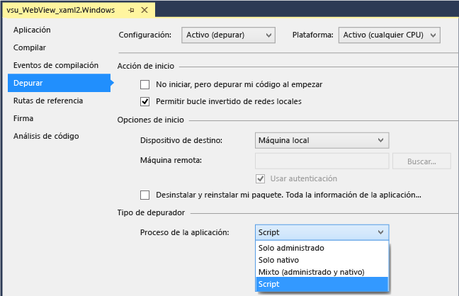
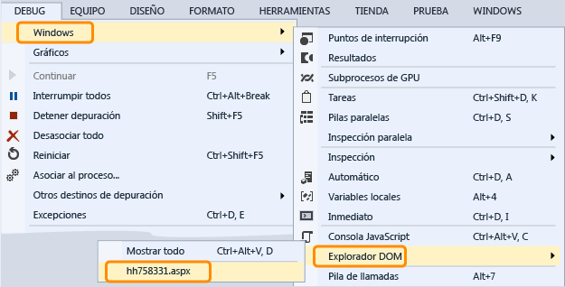

# Depurar un control WebView en una aplicación de UWP
  
 Para inspeccionar y depurar controles `WebView` en una aplicación de Windows en tiempo de ejecución, puede configurar Visual Studio de modo que adjunte el depurador de script al iniciar la aplicación. Tiene dos formas de interactuar con `WebView` controla el uso del depurador:  
  
-   Abra la [el explorador DOM](../debugger/quickstart-debug-html-and-css.md) para un `WebView` instancia, inspeccionar los elementos DOM, investigar los problemas de estilo CSS y probar los cambios presentados de forma dinámica en los estilos.  
  
-   Seleccione la página Web o `iFrame` aparece en la `WebView` instancia como un destino en el [consola JavaScript](../debugger/javascript-console-commands.md) ventana y después podrá interactuar con la página Web mediante comandos de la consola. La consola ofrece acceso al contexto de ejecución de script actual.  
  
### Adjuntar el depurador (C#, Visual Basic, C++)  
  
1.  En Visual Studio, agregue un control `WebView` a la aplicación de Windows en tiempo de ejecución.  
  
2.  En el Explorador de soluciones, abra las propiedades para el proyecto eligiendo **propiedades** en el menú contextual para el proyecto.  
  
3.  Elija **depurar**. En el **proceso de la aplicación** elija **Script**.  
  
       
  
4.  (Opcional) Para no en las versiones Express de Visual Studio, deshabilitar la depuración just-in-time (JIT) eligiendo **Herramientas > Opciones > depuración > Just-In-Time**, y, a continuación, deshabilitando la depuración JIT para Script.  
  
    > [!NOTE]
    >  Al deshabilitar la depuración JIT, puede ocultar los cuadros de diálogo de las excepciones no controladas que se producen en algunas páginas web. En Visual Studio Express, la depuración JIT siempre está deshabilitada.  
  
5.  Presione F5 para iniciar la depuración.  
  
### Usar el Explorador DOM para inspeccionar y depurar un control WebView  
  
1.  (C#, Visual Basic, C++) Adjunte el depurador de script a la aplicación. Consulte la primera sección para obtener instrucciones.  
  
2.  Si aún no lo ha hecho, agregue un control `WebView` a la aplicación y presione F5 para iniciar la depuración.  
  
3.  Vaya a la página que contiene el control o controles `Webview`.  
  
4.  Abra la ventana del explorador DOM para la `WebView` control eligiendo **depurar**, **Windows**, **el explorador DOM**y, a continuación, elija la dirección URL de la `WebView` que desea inspeccionar.  
  
       
  
     El Explorador DOM asociado al control `WebView` aparece como una nueva pestaña en Visual Studio.  
  
5.  Ver y modificar los elementos DOM activos y estilos CSS como se describe en [estilos CSS depurar mediante el explorador DOM](../debugger/debug-css-styles-using-dom-explorer.md).  
  
### Usar la ventana Consola JavaScript para inspeccionar y depurar un control WebView  
  
1.  (C#, Visual Basic, C++) Adjunte el depurador de script a la aplicación. Consulte la primera sección para obtener instrucciones.  
  
2.  Si aún no lo ha hecho, agregue un control `WebView` a la aplicación y presione F5 para iniciar la depuración.  
  
3.  Abra la ventana Consola JavaScript para la `WebView` control eligiendo **depurar**, **Windows**, **consola JavaScript**.  
  
     Aparece la ventana Consola JavaScript.  
  
4.  Vaya a la página que contiene el control o controles `Webview`.  
  
5.  En la ventana de consola, seleccione la página Web o un `iFrame` mostrado por el `WebView` controlar en el **destino** lista.  
  
       
  
    > [!NOTE]
    >  Con la consola, puede interactuar con un único `WebView`, `iFrame`, contrato de participación o trabajo web a la vez. Cada elemento necesita una instancia independiente del host de plataforma web (WWAHost.exe). Puede interactuar con un host a la vez.  
  
6.  Ver y modificar las variables de la aplicación o utilizar comandos de consola, tal como se describe en [inicio rápido: depurar JavaScript](../debugger/quickstart-debug-javascript-using-the-console.md) y [comandos de la consola de JavaScript](../debugger/javascript-console-commands.md).  
  
## Vea también  
 [Inicio rápido: Depurar HTML y CSS](../debugger/quickstart-debug-html-and-css.md)