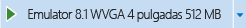
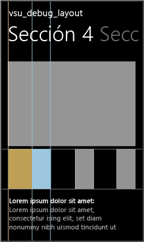
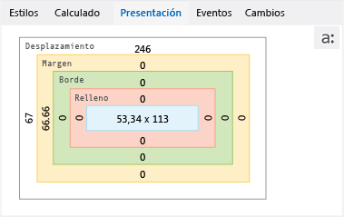

# Depurar el dise&#241;o mediante el Explorador DOM
[!INCLUDE[vs2017banner](../code-quality/includes/vs2017banner.md)]

  
  
 La pestaña **Diseño** del explorador DOM muestra el [Modelo de cuadros CSS](http://go.microsoft.com/fwlink/?LinkID=238778) para el elemento seleccionado en una aplicación de [!INCLUDE[win8_appname_long](../debugger/includes/win8_appname_long_md.md)], una aplicación de la Tienda de Windows Phone o una aplicación creada con Visual Studio Tools para Apache Cordova. Puedes utilizar esta representación visual del modelo de cuadros para identificar y modificar los valores relacionados con el diseño que afectan a la apariencia de los elementos.  
  
> [!TIP]
>  Los cambios que realizas en la pestaña **Diseño** no son permanentes. Puede hacer cambios permanentes en el código fuente y, después, actualizar la aplicación con el botón **Actualizar aplicación de Windows** \(solo aplicaciones de la Tienda Windows y de la Tienda de Windows Phone\) de la barra de herramientas Depurar. De esta manera, puedes evitar tener que reiniciar el depurador.  
  
 Si quieres usar el Explorador DOM para modificar aspectos de la presentación que no se muestran en el modelo de cuadros, consulta [Inicio rápido: Depurar HTML y CSS](../debugger/quickstart-debug-html-and-css.md) y [Depurar estilos de CSS mediante el Explorador DOM](../debugger/debug-css-styles-using-dom-explorer.md).  
  
## Ejemplo de corrección de un problema de diseño  
 En este ejemplo, vemos cómo seleccionar un elemento de lista en la plantilla Hub\/Pivot, interpretaremos los valores del modelo de cuadros que aparecen en la pestaña **Diseño** y, luego, cambiaremos uno de los valores de propiedad para solucionar un problema de diseño.  
  
#### Para solucionar el problema de diseño  
  
1.  En Visual Studio, cree una nueva aplicación de la Tienda Windows que use la plantilla de proyecto Hub\/Pivot.  
  
2.  En la carpeta pages\\hubs, abra hub.css.  
  
3.  Reemplace el código de CSS siguiente:  
  
    ```css  
    .hubpage .hub .section4 .sub-image-row img { height: 95px; width: 130px; }  
    ```  
  
     con este código CSS:  
  
    ```css  
    .hubpage .hub .section4 .sub-image-row img { height: 95px; width: 130px; margin-left: 5em; }  
    ```  
  
4.  Seleccione los proyectos NombreDeAplicación.WindowsPhone o NombreDeAplicación.Windows en el Explorador de soluciones y seleccione **Establecer como proyecto de inicio** en el menú contextual del proyecto.  
  
5.  En función del proyecto de inicio, elija **Emulator 8.1 WVGA 4 512MB\(ES\)** o **Simulador** en la lista desplegable de la barra de herramientas Depurar \(el valor predeterminado es **Equipo local**\).  
  
       
  
6.  Presiona F5 para ejecutar la aplicación en modo de depuración.  
  
7.  Desplácese o navegue hasta la sección 4 y ábrala.  
  
    > [!TIP]
    >  Coloque el emulador de Windows Phone o el simulador junto a la ventana de Visual Studio para que pueda ver inmediatamente los resultados de sus selecciones y los cambios realizados en los estilos CSS.  
  
     Cuando se cargue la sección 4, podrá ver que las imágenes de abajo no tienen un aspecto correcto. Cada imagen de elemento aparece cortada por la mitad \(sin la mitad izquierda\).  
  
8.  Cambie a Visual Studio y haga clic en **Seleccionar elemento** en el Explorador DOM \(o presione Ctrl\+B\). El modo de selección se modifica para que pueda seleccionar un elemento haciendo clic en él. Además, la aplicación se sitúa en primer plano. El modo se revierte al original al hacer clic.  
  
    > [!TIP]
    >  También puede usar las teclas de dirección u otros métodos para seleccionar elementos HTML directamente en el Explorador DOM. Para obtener más información sobre la selección de elementos, consulta [Inicio rápido: Depurar HTML y CSS](../debugger/quickstart-debug-html-and-css.md).  
  
9. En el emulador de Windows Phone o en el simulador, seleccione la parte derecha de color gris de una de las imágenes cortadas por la mitad. Aparecerá el resaltado alrededor del elemento seleccionado, tal como se muestra en el emulador de Windows Phone:  
  
       
  
    > [!TIP]
    >  Con el simulador, es posible mantener el mouse sobre los elementos DOM para que aparezca el resaltado del cuadro alrededor de ellos antes de seleccionarlos. En cambio, el emulador de Windows Phone no es compatible con esta acción.  
  
     Al seleccionar un elemento DOM, el Explorador DOM selecciona el elemento IMG correspondiente en Visual Studio de forma automática. El elemento seleccionado en el Explorador DOM tiene este aspecto:  
  
    ```html  
     </img>  
    ```  
  
10. Haz clic en la pestaña **Presentación**. Esta pestaña muestra el modelo de cuadros del elemento seleccionado, como se muestra aquí, en el emulador de Windows Phone.  
  
       
  
     Esta vista proporciona información útil sobre el elemento:  
  
    -   Los colores corresponden al resaltado del cuadro que aparece en el simulador cuando se mantiene el mouse sobre los elementos. El color azul representa las dimensiones del elemento \. El color tostado representa los valores de margen.  
  
    -   Se establece el margen izquierdo \(margin\-left\), que indica la causa del problema ya que coincide con el síntoma \(negro en el margen izquierdo de la imágenes\).  
  
    -   Los cuadros que muestran valores de 0 píxeles \(por ejemplo, Borde y Relleno\) sugieren que es probable que las propiedades CSS correspondientes no se hayan establecido.  
  
11. Para ver cómo se aplica la regla margin\-left, haga clic en la pestaña **Calculado** y examine la regla margin\-left. Puede ver que esta regla se ha definido con un valor de 5em, pero el valor calculado es de 66,66 px o 146,66 px, en función del dispositivo de destino.  
  
    > [!TIP]
    >  La pestaña **Calculado** muestra que la regla margin\-left está establecida en el selector de CSS `..hubpage .hub. section4 .sub-image-row img`, que se encuentra en hub.css. En esta aplicación de demostración, es ahí donde debe realizarse la corrección.  
  
     Puedes utilizar la pestaña **Diseño** para probar las modificaciones en los valores de diseño.  
  
12. En la pestaña **Diseño**, haga clic en **66.66** o **146,66**, que aparecen en el cuadro **Margen**, en el lado izquierdo del cuadro.  
  
13. Escribe `0` y presiona Intro. \(También puedes usar las teclas Flecha arriba y Flecha abajo para cambiar el valor\).  
  
14. Seleccione los otros elementos \ en el Explorador DOM y cambie sus valores margin\-left a 0.  
  
15. Cambie al emulador o al simulador de Windows Phone. Los valores margin\-left actualizados se han aplicado a las imágenes de la sección 4. Estos valores también se han actualizado en la pestaña **Calculado** bajo la regla margin\-left.  
  
## Vea también  
 [Inicio rápido: Depurar HTML y CSS](../debugger/quickstart-debug-html-and-css.md)   
 [Depurar estilos de CSS mediante el Explorador DOM](../debugger/debug-css-styles-using-dom-explorer.md)   
 [Ver agentes de escucha de eventos DOM](../debugger/view-dom-event-listeners.md)