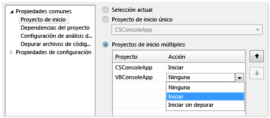
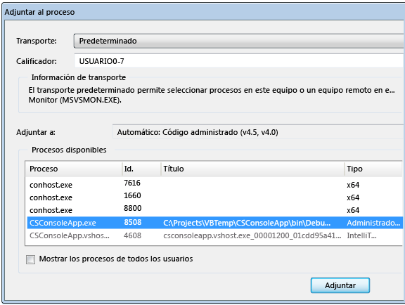
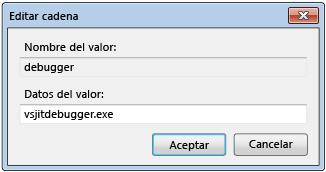
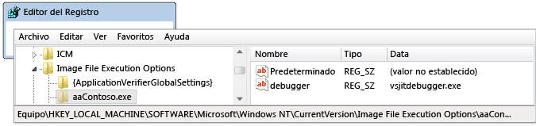
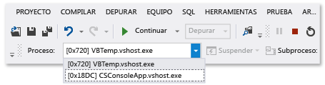
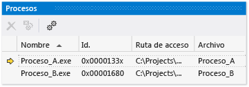

# Depurar varios procesos (C#, Visual Basic, C++)

Visual Studio puede depurar una solución que tenga varios procesos. Puede iniciar y cambiar entre procesos, interrumpir, continuar y recorrer el código fuente, detendrá la depuración y end o desasociar procesos individuales.

## Iniciar la depuración con varios procesos

Cuando más de un proyecto en una solución de Visual Studio puede ejecutar de forma independiente, puede seleccionar qué proyecto se inicia el depurador. El proyecto de inicio actual aparece en negrita en **el Explorador de soluciones**.

Para cambiar el proyecto de inicio, en **el Explorador de soluciones**, haga clic en otro proyecto y seleccione **establecer como proyecto de inicio**.

Para empezar a depurar un proyecto de **el Explorador de soluciones** sin establecerla como el proyecto de inicio, haga clic en el proyecto y seleccione **depurar** > **Iniciar nueva instancia** o **ir a nueva instancia**.

**Para establecer el proyecto de inicio o de varios proyectos de solución de propiedades:**

1. Seleccione la solución en **el Explorador de soluciones** y, a continuación, seleccione el **propiedades** icono en la barra de herramientas o botón secundario en la solución y seleccione **propiedades**.

1. En el **propiedades** página, seleccione **propiedades comunes** > **proyecto de inicio**.

   

1. Seleccione **selección actual**, **proyecto de inicio único** y un archivo de proyecto o **varios proyectos de inicio**.

   Si selecciona **varios proyectos de inicio**, puede cambiar el orden de inicio y la acción que se realizará para cada proyecto: **Iniciar**, **iniciar sin depurar**, o **ninguno**.

1. Seleccione **aplicar**, o **Aceptar** para aplicar y cerrar el cuadro de diálogo.

###  Asociar a un proceso

El depurador también puede *adjuntar* para aplicaciones que se ejecutan en procesos fuera de Visual Studio, incluso en dispositivos remotos. Después de asociar a una aplicación, puede usar al depurador de Visual Studio. Las características de depuración podrían ser limitada. Depende de si la aplicación se ha generado con información de depuración, si tiene acceso al código fuente de la aplicación y si el compilador JIT es un seguimiento de información de depuración.

Para obtener más información, consulte [adjuntar a procesos en ejecución](../debugger/attach-to-running-processes-with-the-visual-studio-debugger.md).

**Para asociar a un proceso en ejecución:**

1. Con la aplicación en ejecución, seleccione **depurar** > **asociar al proceso**.

   

1. En el **asociar al proceso** cuadro de diálogo, seleccione el proceso desde el **procesos disponibles** lista y, a continuación, seleccione **adjuntar**.

>[!NOTE]
>El depurador no se asocia automáticamente a un proceso secundario iniciado por un proceso depurado, aunque el proyecto secundario se encuentre en la misma solución. Para depurar un proceso secundario, adjuntar al proceso secundario después de iniciarse, o configurar el Editor del registro de Windows para iniciar el proceso secundario en una nueva instancia del depurador.

###  Utilice el Editor del registro para iniciar automáticamente un proceso en el depurador

A veces, es posible que deba depurar el código de inicio para una aplicación que se inicia otro proceso. Por ejemplo, servicios y configuraciones personalizadas. Puede tener el depurador inicie y se asocia automáticamente a la aplicación.

1. Inicie el Editor del registro de Windows ejecutando *regedit.exe*.

1. En el Editor del registro, vaya a **HKEY_LOCAL_MACHINE\Software\Microsoft\Windows NT\CurrentVersion\Image File Execution Options**.

1. Seleccione la carpeta de la aplicación que desee iniciar en el depurador.

   Si la aplicación no aparece como una carpeta secundaria, haga clic en **Image File Execution Options**, seleccione **New** > **clave**y escriba el nombre de la aplicación. O bien, haga clic en la nueva clave en el árbol, seleccione **cambiar el nombre**y, a continuación, escriba el nombre de la aplicación.

1. Haga clic en la nueva clave en el árbol y seleccione **New** > **valor de cadena**.

1. Cambiar el nombre del nuevo valor de **New Value #1** a `debugger`.

1. Haga clic en **depurador** y seleccione **modificar**.

   

1. En el **Editar cadena** cuadro de diálogo, escriba `vsjitdebugger.exe` en el **datos del valor** cuadro y, a continuación, seleccione **Aceptar**.

   

##  Depurar con varios procesos

Cuando se depura una aplicación con varios procesos, la última hora, ejecución paso a paso y continuar con los comandos del depurador afectan a todos los procesos de forma predeterminada. Por ejemplo, cuando un proceso se suspende en un punto de interrupción, también se suspende la ejecución de todos los demás procesos. Puede cambiar este comportamiento predeterminado para tener un mejor control sobre los destinos de los comandos de ejecución.

**Para cambiar si se suspenden todos los procesos cuando se interrumpa uno:**

- En **herramientas** (o **depurar**) > **opciones** > **depuración** > **General**, active o desactive el **interrumpir todos los procesos cuando se interrumpa uno** casilla de verificación.

###  Comandos de interrupción, paso y continuación

En la tabla siguiente se describe los comportamientos de depuración de comandos cuando el **interrumpir todos los procesos cuando se interrumpa uno** se selecciona o anula la selección de casilla de verificación:

|**Comando**|Seleccionado|Selección anulada|
|-|-|-|
|**Depurar**  > **interrumpir todo**|Se interrumpen todos los procesos.|Se interrumpen todos los procesos.|
|**Depurar** > **continuar**|Se reanudan todos los procesos.|Se reanudan todos los procesos suspendidos.|
|**Depurar** > **paso a paso**, **saltar**, o **salir**|Se ejecutan todos los procesos mientras que el proceso actual se ejecuta paso a paso.  A continuación, se interrumpen todos los procesos.|El proceso actual se ejecuta paso a paso.  Se reanudan los procesos suspendidos.  Continúan los procesos en ejecución.|
|**Depurar** > **ir al proceso actual**, **paso a través del proceso actual**, o **salir del proceso actual**|N/D|El proceso actual se ejecuta paso a paso. Otros procesos mantienen su estado existente (suspendido o en ejecución).|
|Ventana de código fuente **punto de interrupción**|Se interrumpen todos los procesos.|Solo se interrumpe el proceso de la ventana de código fuente.|
|Ventana de código fuente **ejecutar hasta el cursor** La ventana de código fuente debe estar en el proceso actual.|Se ejecutan todos los procesos mientras se ejecuta el proceso de la ventana de código fuente hasta el cursor para, a continuación, interrumpirse. A continuación, se interrumpen todos los demás procesos.|El proceso de la ventana de código fuente se ejecuta hasta el cursor. Otros procesos mantienen su estado existente (suspendido o en ejecución).|
|**Procesos** Ventana > **interrumpir proceso**|N/D|Se interrumpe el proceso seleccionado. Otros procesos mantienen su estado existente (suspendido o en ejecución).|
|**Procesos** Ventana > **continuar proceso**|N/D|Se reanuda el proceso seleccionado. Otros procesos mantienen su estado existente (suspendido o en ejecución).|

###  Buscar archivos de origen y de símbolos (.pdb)
Para navegar por el código fuente de un proceso, el depurador necesita acceso a sus archivos de código fuente y los archivos de símbolos. Para obtener más información, vea [Especificar archivos de código fuente y símbolos (.pdb) en el depurador de Visual Studio (C#, C++, Visual Basic, F#)](../debugger/specify-symbol-dot-pdb-and-source-files-in-the-visual-studio-debugger.md).

Si no se puede obtener acceso a los archivos de un proceso, puede navegar mediante el uso de la **desensamblado** ventana. Para obtener más información, vea [Cómo: Uso de la ventana Desensamblado](../debugger/how-to-use-the-disassembly-window.md).

###  Cambiar entre procesos

Puede asociar varios procesos cuando se está depurando, pero sólo un proceso estará activo en el depurador en un momento dado. Puede establecer el proceso activo o *actual* en la **Barra de herramientas** de la ubicación de depuración o en la ventana **Procesos**. Para cambiar entre procesos, ambos procesos deben encontrarse en el modo de interrupción.

**Para establecer el proceso actual de la barra de herramientas ubicación de depuración:**

1. Para abrir el **ubicación de depuración** barra de herramientas, seleccione **vista** > **las barras de herramientas** > **ubicación de depuración**.

1. Durante la depuración, en el **ubicación de depuración** barra de herramientas, seleccione el proceso que desea establecer como proceso actual desde el **proceso** lista desplegable.

   

**Para establecer el proceso actual en la ventana procesos:**

1. Para abrir el **procesos** ventana, durante la depuración, seleccione **depurar** > **Windows** > **procesos**.

1. En el **procesos** ventana, el proceso actual se marca mediante una flecha amarilla. Haga doble clic en el proceso que desea establecer como el proceso actual.

   

Cambiar a un proceso, establece como el proceso actual con fines de depuración. Ventanas del depurador muestran el estado del proceso actual, y comandos de ejecución paso a paso afectan sólo del proceso actual.

## Detener la depuración con varios procesos

De forma predeterminada, cuando se selecciona **depurar** > **Detener depuración**, el depurador finaliza o desasocia de todos los procesos.

- Si se ha iniciado el proceso actual en el depurador, se finaliza el proceso.

- Si asoció el depurador al proceso actual, el depurador se desasociará del proceso y dejará el proceso en ejecución.

Si inicia la depuración de un proceso de una solución de Visual Studio, a continuación, adjunte a otro proceso que ya se está ejecutando y, a continuación, elija **Detener depuración**, finaliza la sesión de depuración. Finaliza el proceso que se inició en Visual Studio, mientras que el proceso que ha adjuntado a sigue ejecutándose.

Para controlar la manera en que **Detener depuración** afecta a un proceso individual, en el **procesos** ventana, haga clic en un proceso y, a continuación, active o desactive el **desasociar cuando detiene la depuración** casilla de verificación.

>[!NOTE]
>El **interrumpir todos los procesos cuando se interrumpa uno** OPCION no afectan a la detención, finalización o desasociación de procesos.

### Comandos de detención, finalización y desasociación

En la tabla siguiente se describe los comportamientos de la detención del depurador, finalización y desasociación de comandos con varios procesos:

|**Comando**|**Descripción**|
|-|-|
|**Depurar** > **detener la depuración**|A menos que se cambia el comportamiento en el **procesos** ventana, se cancelan los procesos iniciados por el depurador y los procesos asociados se desasocian.|
|**Depurar** > **Finalizar todo**|Todos los procesos finalizan.|
|**Depurar** > **Desasociar todo**|El depurador se desasocia de todos los procesos.|
|**Procesos** Ventana > **desasociar proceso**|El depurador se desasocia del proceso seleccionado. Otros procesos mantienen su estado existente (suspendido o en ejecución).|
|**Procesos** Ventana > **terminar el proceso**|Finaliza el proceso seleccionado. Otros procesos mantienen su estado existente (suspendido o en ejecución).|
|**Procesos** Ventana > **desasociar cuando se detiene la depuración**|Si se selecciona, **depurar** > **Detener depuración** se desasocia del proceso seleccionado.  Si no se selecciona, **depurar** > **Detener depuración** finaliza el proceso seleccionado. |

## Vea también

- [Especificación de archivos de código fuente y símbolos (.pdb)](../debugger/specify-symbol-dot-pdb-and-source-files-in-the-visual-studio-debugger.md)
- [Asociar a procesos en ejecución](../debugger/attach-to-running-processes-with-the-visual-studio-debugger.md)
- [Desplazarse por el código con el depurador](../debugger/navigating-through-code-with-the-debugger.md)
- [Depuración Just-In-Time](../debugger/just-in-time-debugging-in-visual-studio.md)
- [Depuración de aplicaciones multiproceso](../debugger/debug-multithreaded-applications-in-visual-studio.md)