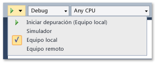
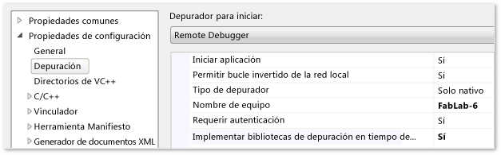
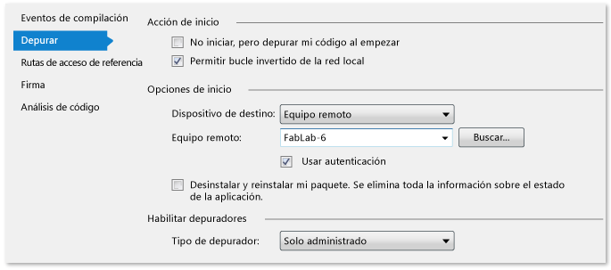

# Implementar aplicaciones de la Tienda Windows desde Visual Studio
[!INCLUDE[vs2017banner](../code-quality/includes/vs2017banner.md)]

  
  
 La funcionalidad de implementación de Visual Studio crea y registra aplicaciones de la Tienda Windows creadas con Visual Studio en un dispositivo de destino. El modo en que se registra la aplicación depende de si el dispositivo de destino es local o remoto.  
  
-   Cuando el destino es un equipo local de Visual Studio, Visual Studio registra la aplicación desde su carpeta de compilación.  
  
-   Cuando el destino es un dispositivo remoto, Visual Studio copia los archivos necesarios en el equipo remoto y registra la aplicación en ese dispositivo.  
  
 La implementación es automática cuando se depura la aplicación desde Visual Studio mediante la opción **Iniciar depuración** \(teclado: F5\) o la opción **Iniciar sin depurar** \(teclado: CTRL \+ F5\). También puede implementar la aplicación manualmente. La implementación manual es útil en los siguientes casos:  
  
-   Pruebas ad hoc en un equipo local o remoto.  
  
-   Implementación de una aplicación que iniciará otra aplicación que querrá depurar.  
  
-   Implementación de una aplicación que se depurará cuando la inicie otra aplicación u otro método.  
  
##   En este tema  
 En este tema, puede aprender lo siguiente:  
  
 [Cómo implementar una aplicación de la Tienda Windows](#BKMK_How_to_deploy_a_Windows_Store_app)  
  
 [Cómo especificar un dispositivo remoto](#BKMK_How_to_specify_a_remote_device)  
  
 [Opciones de implementación](#BKMK_Deployment_options)  
  
##   Cómo implementar una aplicación de la Tienda Windows  
 La implementación manual de una aplicación es un proceso simple:  
  
1.  Si implementa a un dispositivo remoto, especifique el nombre o la dirección IP del dispositivo en la página de proyecto de la propiedad del proyecto de inicio de la aplicación. Los pasos necesarios se mencionan más adelante dentro de este tema.  
  
2.  En la barra de herramientas de Visual Studio del depurador, seleccione el destino de la implementación en la lista desplegable que hay junto al botón **Iniciar depuración**.  
  
       
  
3.  En el menú **Compilar**, elija **Implementar**  
  
##   Cómo especificar un dispositivo remoto  
 **Requisitos previos**  
  
 Para implementar una aplicación en un dispositivo remoto:  
  
-   Debe haber una licencia de desarrollador instalada en el dispositivo remoto.  
  
-   La aplicación Herramientas remotas de Visual Studio debe estar instalada en el dispositivo remoto, y el Monitor de depuración remota debe estar en ejecución.  
  
     En la implementación se usa el canal de la red del depurador remoto para enviar los archivos de aplicación al dispositivo remoto.  
  
#### Para especificar un dispositivo remoto  
  
1.  En la página de propiedades de depuración del proyecto de inicio, especifique el nombre o la dirección IP de un dispositivo de implementación remoto.  
  
2.  Para abrir la página de propiedades de depuración, elija el proyecto en el Explorador de soluciones y, luego, seleccione **Propiedades** en el menú contextual.  
  
3.  A continuación, elija el nodo **Depurar** en la ventana de las páginas de propiedad.  
  
4.  Puede escribir el nombre o la dirección IP del dispositivo remoto, o bien seleccionarlo en el cuadro de diálogo **Seleccionar conexión del depurador remoto**.  
  
       
  
     El cuadro de diálogo **Seleccionar conexión del depurador remoto** muestra los equipos que están en la subred local y los que están conectados directamente con el equipo de Visual Studio mediante un cable Ethernet.  
  
 **Cómo especificar el dispositivo remoto en una página de proyecto de JavaScript o Visual C\+\+**  
  
   
  
1.  Elige **Depurador remoto** en la lista **Depurador para iniciar**.  
  
2.  Especifique el nombre de la red del dispositivo remoto en el cuadro **Nombre de equipo**. O bien puede seleccionar la flecha abajo del cuadro para seleccionar el dispositivo desde el cuadro de diálogo Seleccionar conexión del depurador remoto.  
  
 **Cómo especificar el dispositivo remoto en una página de proyecto de Visual C\# y Visual Basic**  
  
   
  
1.  Elige **Equipo remoto** en la lista **Dispositivo de destino**.  
  
2.  Escribe el nombre de red del dispositivo remoto en el cuadro **Equipo remoto** o haz clic en **Buscar** para elegir el dispositivo en el cuadro de diálogo **Seleccionar conexión del depurador remoto**.  
  
##   Opciones de implementación  
 Puede establecer las siguientes opciones de implementación en la página de propiedades de depuración del proyecto de inicio.  
  
 **Permitir bucle invertido de red**  
 Por razones de seguridad, una aplicación de la [!INCLUDE[win8_appname_long](../debugger/includes/win8_appname_long_md.md)] instalada de forma estándar, no puede realizar llamadas de red al dispositivo en el que está instalada. De forma predeterminada, la implementación de Visual Studio crea una exención respecto a esta regla para la aplicación implementada. Esta exención te permite probar procedimientos de comunicación en un mismo equipo. Antes de enviar su aplicación a la [!INCLUDE[win8_appstore_long](../debugger/includes/win8_appstore_long_md.md)], debe probarla sin la exención.  
  
 Para quitar la exención de bucle invertido de red en la aplicación:  
  
-   En C\# y en la página de propiedades de depuración de VB, desactive la casilla **Permitir bucle invertido de red**.  
  
-   En JavaScript y en la página de propiedades de depuración, establezca el valor de **Permitir bucle invertido de red** en **No**.  
  
 **No iniciar, pero depurar mi código al empezar \(C\# y VB\)\/Iniciar aplicación \(JavaScript y C\+\+\)**  
 Para configurar el inicio automático de una sesión de depuración en la implementación cuando se inicie la aplicación:  
  
-   En C\# y en la página de depuración de VB, active la casilla **No iniciar, pero depurar mi código al empezar**.  
  
-   En JavaScript y en la página de propiedades de depuración, establezca el valor de **Iniciar aplicación** en **Sí**.  
  
## Vea también  
 [Ejecutar aplicaciones desde Visual Studio](../debugger/run-store-apps-from-visual-studio.md)