# <a name="diagnose-problems-after-deployment-using-intellitrace"></a>Diagnosticar problemas después de la implementación con IntelliTrace

Para diagnosticar problemas en la aplicación web ASP.NET después de la implementación con IntelliTrace, incluya la información de compilación en su versión para que Visual Studio pueda encontrar automáticamente los archivos de código fuente y archivos de símbolos correctos que se necesitan para depurar el registro de IntelliTrace.

 Si usa Microsoft Monitoring Agent para controlar IntelliTrace, también necesitará configurar la supervisión de rendimiento de la aplicación en el servidor web. Esto registra eventos de diagnóstico mientras se ejecuta la aplicación y guarda los eventos en un archivo de registro de IntelliTrace. Después, puede consultar los eventos en Visual Studio Enterprise (pero no en las versiones Professional ni Community), ir al código donde se produjo un evento, ver los valores registrados en ese momento y avanzar o retroceder en el código ejecutado. Después de identificar y corregir el problema, repita el ciclo para compilar, lanzar y supervisar la aplicación con el objetivo de solucionar posibles problemas futuros con mayor rapidez.

 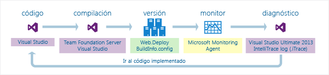

 **Necesitará:**

-   Visual Studio, Azure DevOps o Team Foundation Server 2017, 2015, 2013, 2012 o 2010 para configurar la compilación

-   Microsoft Monitoring Agent para supervisar la aplicación y registrar los datos de diagnóstico

-   Visual Studio Enterprise (pero no las versiones Professional ni Community) para revisar los datos de diagnóstico y depurar el código con IntelliTrace

##  <a name="SetUpBuild"></a> Paso 1: Incluir información de compilación con la versión
 Configure el proceso de compilación para crear un manifiesto de compilación (archivo *BuildInfo.config*) para el proyecto web e incluya este manifiesto en la versión. Este manifiesto contiene información sobre el proyecto, el control de código fuente y el sistema de compilación que se usaron para crear una compilación específica. Esa información ayuda a Visual Studio a identificar el código fuente y los símbolos que coincidan después de abrir el registro de IntelliTrace para revisar los eventos registrados.

###  <a name="AutomatedBuild"></a> Crear el manifiesto de compilación para una compilación automatizada con Team Foundation Server

 Haga lo siguiente si usa control de versiones de Team Foundation o Git.

####  <a name="TFS2017"></a> Azure DevOps y Team Foundation Server 2017

Visual Studio 2017 no incluye el *BuildInfo.config* archivo, que se ha desusado y, a continuación, se quitan. Para depurar aplicaciones web ASP.NET después de la implementación, use uno de los métodos siguientes:

* Para la implementación en Azure, use [Application Insights](https://docs.microsoft.com/azure/application-insights/).

* Si necesita usar IntelliTrace, abra el proyecto en Visual Studio y cargar los archivos de símbolos de la compilación correspondiente. Puede cargar los archivos de símbolos desde la **módulos** ventana o mediante la configuración de símbolos en **herramientas** > **opciones** > **depuración**   >  **Símbolos**.


####  <a name="TFS2013"></a> Team Foundation Server 2013
 Configure su canalización de compilación para agregar las ubicaciones de su origen, compilación y símbolos para el manifiesto de compilación (archivo BuildInfo.config). Team Foundation Build crea automáticamente el archivo y lo copia en la carpeta de salida del proyecto.

1.  [La canalización de compilación de editar o crear una nueva canalización de compilación.](/azure/devops/pipelines/get-started-designer?view=vsts)

     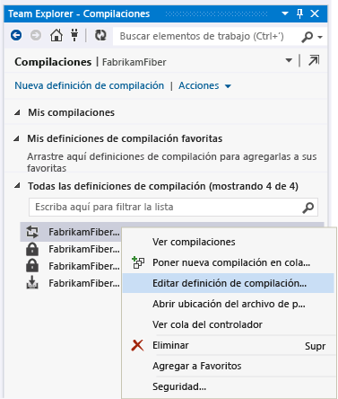

2.  Elija la plantilla predeterminada (TfvcTemplate.12.xaml) o su propia plantilla personalizada.

     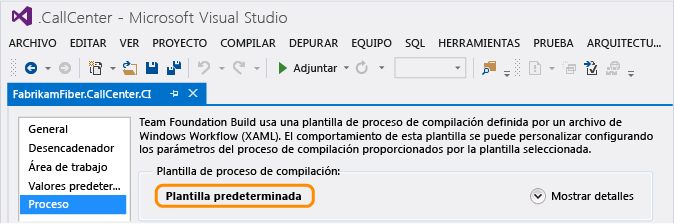

3.  Especifique dónde guardar el archivo de símbolos (PDB) para indizar el origen automáticamente.

     Si usa una plantilla personalizada, asegúrese de que la plantilla tiene una actividad para indizar el origen. Posteriormente, podrá agregar un argumento de MSBuild para especificar dónde quiere guardar los archivos de símbolos.

     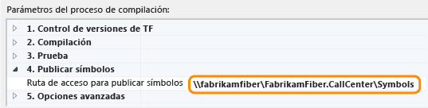

     Para obtener más información sobre los símbolos, vea [Publicar datos de símbolos](/azure/devops/pipelines/tasks/build/index-sources-publish-symbols?view=vsts).

4.  Agregue este argumento de MSBuild para incluir el TFS y las ubicaciones de símbolos al archivo de manifiesto de compilación:

     **/p:IncludeServerNameInBuildInfo=True**

     Cualquier usuario que tenga acceso al servidor web podrá ver estas ubicaciones en el manifiesto de compilación. Asegúrese de que el servidor de código fuente sea seguro.

5.  Si usa una plantilla personalizada, agregue este argumento de MSBuild para especificar dónde guardar el archivo de símbolos:

     **/p:BuildSymbolStorePath=**\<*ruta a símbolos*>

     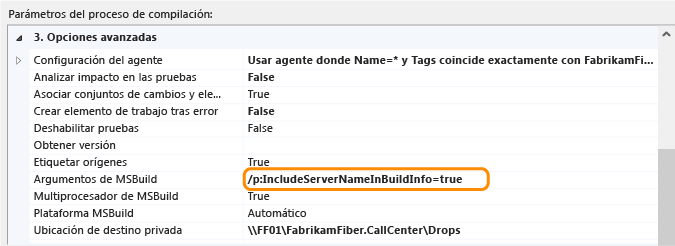

     Y agregue estas líneas al archivo de proyecto web (.csproj, .vbproj):

    ```xml
    <!-- Import the targets file. Change the folder location as necessary. -->
       <Import Project=""$(MSBuildExtensionsPath)\Microsoft\VisualStudio\v$(VisualStudioVersion)\BuildInfo\Microsoft.VisualStudio.ReleaseManagement.BuildInfo.targets" />

    ```

     Cualquier usuario que tenga acceso al servidor web podrá ver estas ubicaciones en el manifiesto de compilación. Asegúrese de que el servidor de código fuente sea seguro.

6.  Ejecute una nueva compilación.

    Vaya al [Paso 2: Lanzar la aplicación](#DeployRelease)

####  <a name="TFS2012_2010"></a> Team Foundation Server 2012 o 2010
 Haga lo siguiente para crear automáticamente el manifiesto de compilación (archivo BuildInfo.config) para el proyecto y copiar el archivo en la carpeta de salida del proyecto. El archivo aparece como "*NombreDelProyecto*.BuildInfo.config" en la carpeta de salida, pero tendrá el nombre "BuildInfo.config" en la carpeta de implementación después de publicar la aplicación.

1.  Instale Visual Studio 2013 (cualquier edición) en el servidor de Team Foundation Build.

2.  En la canalización de compilación, especifique dónde guardar los símbolos para indizar el origen automáticamente.

     Si usa una plantilla personalizada, asegúrese de que la plantilla tiene una actividad para indizar el origen.

3.  Agregue estos argumentos de MSBuild a la canalización de compilación:

    -   **/p:VisualStudioVersion=12.0**

    -   **/p:MSBuildAssemblyVersion=12.0**

    -   **/tv:12.0**

    -   **/p:IncludeServerNameInBuildInfo=True**

    -   **/p:BuildSymbolStorePath=**\<*ruta a símbolos*>

4.  Ejecute una nueva compilación.

    Vaya al [Paso 2: Lanzar la aplicación](#DeployRelease)

###  <a name="ManualBuild"></a> Crear el manifiesto de compilación para una compilación manual con Visual Studio
 Haga lo siguiente para crear automáticamente el manifiesto de compilación (archivo BuildInfo.config) para el proyecto y copiar el archivo en la carpeta de salida del proyecto. El archivo aparece como "*NombreDelProyecto*.BuildInfo.config" en la carpeta de salida, pero tendrá el nombre "BuildInfo.config" en la carpeta de implementación después de publicar la aplicación.

1.  En el **Explorador de soluciones**, descargue el proyecto web.

2.  Abra el archivo de proyecto (.csproj, .vbproj). Agregue estas líneas:

    ```xml
    <!-- **************************************************** -->
    <!-- Build info -->
    <PropertyGroup>
       <!-- Generate the BuildInfo.config file -->
       <GenerateBuildInfoConfigFile>True</GenerateBuildInfoConfigFile>
       <!-- Include server name in build info -->
       <IncludeServerNameInBuildInfo>True</IncludeServerNameInBuildInfo>
       <!-- Include the symbols path so Visual Studio can find the matching deployed code when you start debugging. -->
       <BuildSymbolStorePath><path to symbols></BuildSymbolStorePath>
    </PropertyGroup>
    <!-- **************************************************** -->
    ```

3.  Proteja el archivo de proyecto actualizado.

4.  Ejecute una nueva compilación.

    Vaya al [Paso 2: Lanzar la aplicación](#DeployRelease)

###  <a name="MSBuild"></a> Crear el manifiesto de compilación para una compilación manual con MSBuild.exe
 Agregue estos argumentos de compilación cuando ejecute una compilación:

 **/p:GenerateBuildInfoConfigFile = true**

 **/p:IncludeServerNameInBuildInfo=True**

 **/p:BuildSymbolStorePath=**\<*ruta a símbolos*>

##  <a name="DeployRelease"></a> Paso 2: Liberar la aplicación
 Si usa el [paquete Web.Deploy](https://msdn.microsoft.com/library/dd394698.aspx) creado por el proceso de compilación para implementar la aplicación, el nombre del manifiesto de compilación se cambiará automáticamente de “*NombreDelProyecto*.BuildInfo.config” a “BuildInfo.config” y se copiará en la misma carpeta que el archivo Web.config de la aplicación en el servidor web.

 Si usa otros métodos para implementar la aplicación, asegúrese de cambiar el nombre del manifiesto de compilación de “*NombreDelProyecto*.BuildInfo.config” a “BuildInfo.config” y que se copie en la misma carpeta que el archivo Web.config de la aplicación en el servidor web.

## <a name="step-3-monitor-your-app"></a>Paso 3: Supervisar la aplicación
 Establezca la supervisión de rendimiento de aplicaciones en el servidor web para identificar los posibles problemas de la aplicación, registrar eventos de diagnóstico y guardar estos eventos en un archivo de registro de IntelliTrace. Consulte [Supervisar la publicación para identificar problemas de implementación](../debugger/using-the-intellitrace-stand-alone-collector.md).

##  <a name="InvestigateEvents"></a> Paso 4: Identificar el problema
 Necesitará Visual Studio Enterprise en el equipo de desarrollo o en otro equipo para revisar los eventos registrados y depurar el código con IntelliTrace. También puede usar herramientas como CodeLens, mapas de depurador y mapas de código para diagnosticar el problema.

### <a name="open-the-intellitrace-log-and-matching-solution"></a>Abrir el registro de IntelliTrace y la solución correspondiente

1.  Abra el registro de IntelliTrace (archivo .iTrace) en Visual Studio Enterprise. O bien, haga doble clic en el archivo si tiene Visual Studio Enterprise en el mismo equipo.

2.  Elija **Abrir solución** para hacer que Visual Studio abra automáticamente la solución o el proyecto correspondiente, si el proyecto no se compiló como parte de una solución. [P: En el registro de IntelliTrace falta información sobre una aplicación implementada. ¿Por qué ocurre esto? ¿Qué hago?](#InvalidConfigFile)

     Visual Studio aplaza automáticamente los cambios pendientes al abrir la solución o proyecto correspondiente. Para obtener más detalles sobre este conjunto de cambios aplazados, consulte la ventana **Salida** o **Team Explorer**.

     Antes de realizar cambios, confirme que tiene el código fuente correcto. Si usa bifurcaciones, podría estar trabajando en una bifurcación distinta de donde Visual Studio encuentra el código fuente correspondiente, como su bifurcación de versión.

     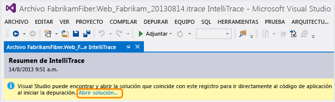

     Si tiene un área de trabajo asignada a esta solución o proyecto, Visual Studio seleccionará dicha área de trabajo para colocar el código fuente encontrado.

     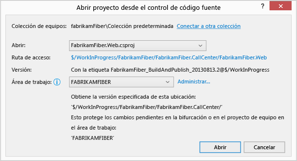

     De lo contrario, elija otra área de trabajo o cree una nueva. Visual Studio asignará la bifurcación completa a esta área de trabajo.

     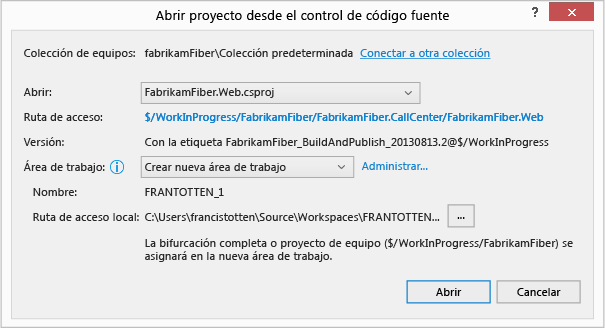

     Para crear un área de trabajo con asignaciones específicas o un nombre distinto al del equipo, elija **Administrar**.

     [P: ¿Por qué dice Visual Studio que el área de trabajo seleccionada no es válida?](#IneligibleWorkspace)

     [P: ¿Por qué no se puede continuar hasta elegir una colección de equipo o una colección distinta?](#ChooseTeamProject)

### <a name="diagnose-a-performance-problem"></a>Diagnosticar un problema de rendimiento

1.  En **Infracciones de rendimiento**, consulte los eventos de rendimiento registrados, el tiempo de ejecución total y otra información del evento. A continuación, profundice más en los métodos que se llamaron durante un evento de rendimiento específico.

     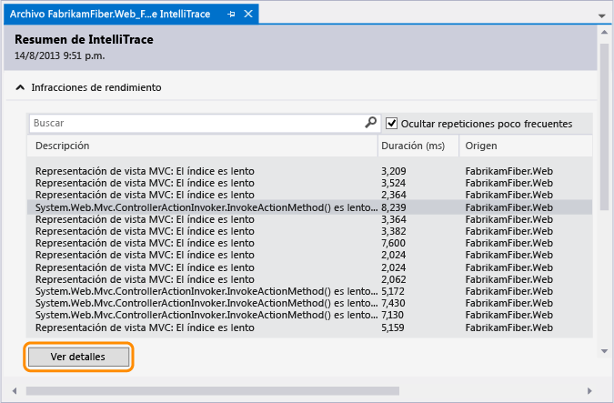

     También puede hacer doble clic en el evento.

2.  En la página de eventos, revise los tiempos de ejecución de estas llamadas. Busque una llamada lenta en el árbol de ejecución.

     Las llamadas más lentas aparecen en su propia sección si tiene varias llamadas, anidadas o de otra manera.

     Expanda esa llamada para revisar todas las llamadas anidadas y los valores que se registraron en ese punto en el tiempo. Después, inicie la depuración desde esa llamada.

     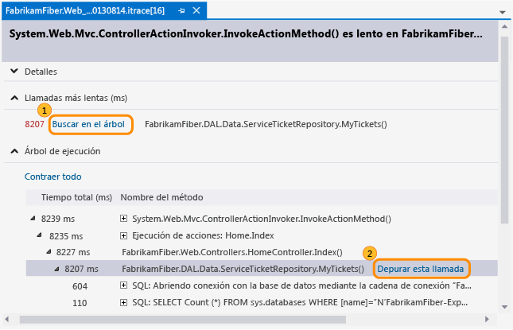

     También puede hacer simplemente doble clic en la llamada.

     Si el método está en el código de aplicación, Visual Studio va a ese método.

     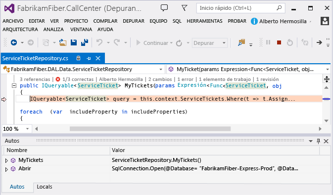

     Ahora puede revisar otros valores registrados, la pila de llamadas, recorrer el código o utilizar la ventana **IntelliTrace** para [moverse hacia atrás o hacia delante “en el tiempo” por otros métodos](../debugger/intellitrace.md) a los que se llamó durante este evento de rendimiento.

    - [¿Qué son todos los eventos e información que aparecen en el registro de IntelliTrace?](../debugger/using-saved-intellitrace-data.md)
    - [¿Qué más se puede hacer desde aquí?](#WhatElse)
    - [¿Desea más información sobre los eventos de rendimiento?](https://blogs.msdn.microsoft.com/devops/2013/09/20/performance-details-in-intellitrace/)

### <a name="diagnose-an-exception"></a>Diagnosticar una excepción

1.  En **Datos de excepción**, revise los eventos de excepciones registrados, sus tipos, mensajes y cuándo se produjeron las excepciones. Para profundizar en el código, inicie la depuración desde el evento más reciente de un grupo de excepciones.

     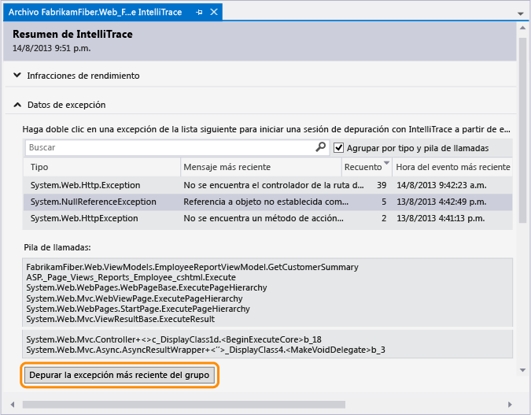

     También puede hacer doble clic en el evento.

     Si se produjo una excepción en el código de la aplicación, Visual Studio va al lugar donde se ha producido la excepción.

     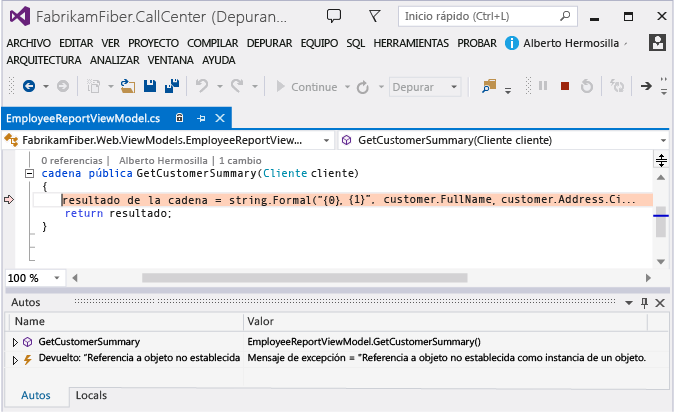

     Ahora puede revisar otros valores registrados, la pila de llamadas o utilizar la ventana **IntelliTrace** para [moverse hacia atrás o hacia delante “en el tiempo” por otros eventos registrados](../debugger/intellitrace.md), código relacionado y los valores registrados en esos puntos en el tiempo.

     [¿Qué son todos los eventos e información que aparecen en el registro de IntelliTrace?](../debugger/using-saved-intellitrace-data.md)

###  <a name="WhatElse"></a> ¿Qué más se puede hacer desde aquí?

-   [Más información sobre este código](../ide/find-code-changes-and-other-history-with-codelens.md). Para buscar referencias a este código, su historial de cambios, errores relacionados, elementos de trabajo, revisiones de código o pruebas unitarias (todo ello sin salir del editor de código), use los indicadores de CodeLens en el editor.

     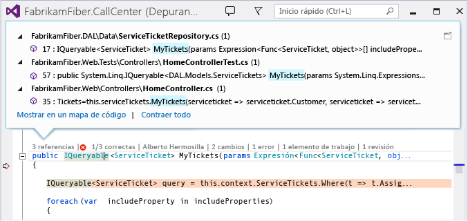

     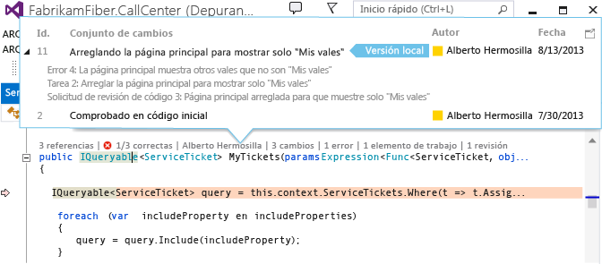

-   [Asignar su lugar en el código durante la depuración.](../debugger/map-methods-on-the-call-stack-while-debugging-in-visual-studio.md) Para realizar un seguimiento visual de los métodos llamados durante la sesión de depuración, asigne la pila de llamadas.

     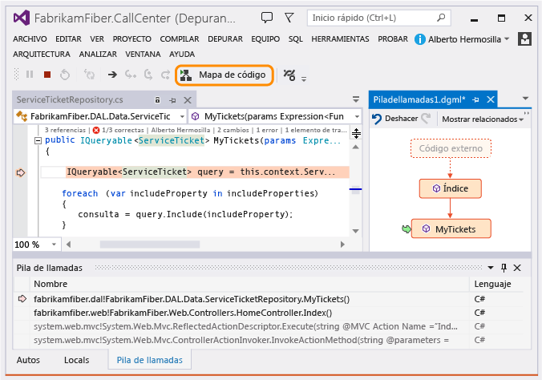

###  <a name="FAQ"></a> Preguntas y respuestas

####  <a name="WhyInclude"></a> P: ¿Por qué incluir información sobre mi proyecto, control de código fuente, compilación y símbolos en la versión?
 Visual Studio usa esta información para buscar la solución y el código fuente que coincidan con la versión que intente depurar. Después de abrir el registro de IntelliTrace y seleccionar el evento para iniciar la depuración, Visual Studio usa símbolos para buscar y mostrar el código donde se produjo el evento. Después, podrá consultar los valores que se registraron y avanzar o retroceder en la ejecución del código.

 Si usa TFS y esta información no se encuentra en el manifiesto de compilación (archivo BuildInfo.config), Visual Studio buscará el código fuente y los símbolos que coincidan en el TFS. Si Visual Studio no puede encontrar el TFS correctos ni código fuente que coincida, se le pedirá que elija un TFS distinto.

####  <a name="InvalidConfigFile"></a> P: En el registro de IntelliTrace falta información sobre una aplicación implementada. ¿Por qué ocurre esto? ¿Qué hago?
 Esto puede ocurrir si realiza la implementación desde un equipo de desarrollo o si no está conectado a TFS durante la implementación.

1.  Vaya a la carpeta de implementación del proyecto.

2.  Busque y abra el manifiesto de compilación (archivo BuildInfo.config).

3.  Compruebe que el archivo contenga la información necesaria:

- **ProjectName**

   El nombre del proyecto en Visual Studio. Por ejemplo:

  ```xml
  <ProjectName>FabrikamFiber.Extranet.Web</ProjectName>
  ```

- **SourceControl**

- Información sobre el sistema de control de código fuente y las siguientes propiedades obligatorias:

  - **TFS**

    - **URIDeColecciónDeProyecto**: la URI de Team Foundation Server y de la colección de proyectos

    - **EspecificacionesDeElementoDeProyecto**: la ruta de acceso al archivo del proyecto de la aplicación (.csproj o .vbproj)

    - **EspecificacionesDeVersiónDeProyecto**: la versión del proyecto

      Por ejemplo:

    ```xml
    <SourceControl type="TFS">
       <TfsSourceControl>
          <ProjectCollectionUri>http://fabrikamfiber:8080/tfs/FabrikamFiber</ProjectCollectionUri>
          <ProjectItemSpec>$/WorkInProgress/FabrikamFiber/FabrikamFiber.CallCenter/FabrikamFiber.Web/FabrikamFiber.Web.csproj</ProjectItemSpec>
          <ProjectVersionSpec>LFabrikamFiber_BuildAndPublish_20130813@$/WorkInProgress</ProjectVersionSpec>
       </TfsSourceControl>
    </SourceControl>
    ```

  - **Git**

    - **ControlDeCódigoFuenteGit**: la ubicación del esquema **ControlDeCódigoFuenteGit**

    - **URLDelRepositorio**: la URI de Team Foundation Server, de la colección de proyectos y del repositorio Git

    - **RutaDeAccesoAlProyecto**: la ruta de acceso al archivo del proyecto de la aplicación (.csproj o .vbproj)

    - **IdDeConfirmación**: el identificador de la confirmación

      Por ejemplo:

    ```xml
    <SourceControl type="Git">
       <GitSourceControl xmlns="http://schemas.microsoft.com/visualstudio/deploymentevent_git/2013/09">
          <RepositoryUrl>http://gittf:8080/tfs/defaultcollection/_git/FabrikamFiber</RepositoryUrl>
          <ProjectPath>/FabrikamFiber.CallCenter/FabrikamFiber.Web/FabrikamFiber.Web.csproj</ProjectPath>
          <CommitId>50662c96502dddaae5cd5ced962d9f14ec5bc64d</CommitId>
       </GitSourceControl>
    </SourceControl>
    ```

- **Compilación**

   Información sobre el sistema de compilación, ya sea `"TeamBuild"` o `"MSBuild"`, y las siguientes propiedades obligatorias:

  - **EtiquetaDeCompilación** (para TeamBuild): el nombre y el número de la compilación. Esta etiqueta también se usa como nombre del evento de implementación. Para más información sobre los números de compilación, vea [Usar números de compilación para dar nombres significativos a las compilaciones completadas](/azure/devops/pipelines/build/options?view=vsts).

  - **RutaDeAccesoASímbolos** (recomendado): lista de URI de ubicaciones de símbolos (archivo PDB) separadas por caracteres de punto y coma. Estas URI pueden ser URL o UNC. Esto permite a Visual Studio buscar los símbolos que coinciden para ayudarle con la depuración.

  - **URLDeInformeDeCompilación** (para TeamBuild): la ubicación del informe de compilación en TFS

  - **IdDeCompilación** (para TeamBuild): la URI de los detalles de la compilación en TFS. Esta URI también se usa como el identificador del evento de implementación. Si no usa TeamBuild, debe ser un identificador único.

  - **SoluciónCreada**: ruta de acceso al archivo de solución que Visual Studio usa para buscar y abrir la solución correspondiente. Este es el contenido de la propiedad **SolutionPath** de MsBuild.

    Por ejemplo:

  - **TFS**

    ```xml
    <Build type="TeamBuild">
       <MsBuild>
          <BuildLabel kind="label">FabrikamFiber_BuildAndPublish_20130813.1</BuildLabel>
          <SymbolPath>\\fabrikamfiber\FabrikamFiber.CallCenter\Symbols</SymbolPath>
          <BuildReportUrl kind="informative, url" url="http://fabrikamfiber:8080/tfs/FabrikamFiber/_releasePipeline/FindRelease?buildUri=fabrikamfiber%3a%2f%2f%2fBuild%2fBuild%2f448">Build Report Url</BuildReportUrl>
          <BuildId kind="id">1c4444d2-518d-4673-a590-dce2773c7744,fabrikamfiber:///Build/Build/448</BuildId>
          <BuiltSolution>$/WorkInProgress/FabrikamFiber/FabrikamFiber.CallCenter/FabrikamFiber.CallCenter.sln</BuiltSolution>
       </MsBuild>
    </Build>
    ```

  - **Git**

    ```xml
    <Build type="MSBuild">
       <MSBuild>
          <SymbolPath>\\gittf\FabrikamFiber.CallCenter\Symbols</SymbolPath>
          <BuiltSolution>/FabrikamFiber.CallCenter/FabrikamFiber.CallCenter.sln</BuiltSolution>
       </MSBuild>
    </Build>
    ```

####  <a name="IneligibleWorkspace"></a> P: ¿Por qué dice Visual Studio que el área de trabajo seleccionada no es válida?
 **R:** El área de trabajo seleccionada no tiene ninguna asignación entre la carpeta de control de código fuente y una carpeta local. Para crear una asignación para esta área de trabajo, elija **Administrar**. De lo contrario, elija un área de trabajo ya asignada o cree una nueva.

 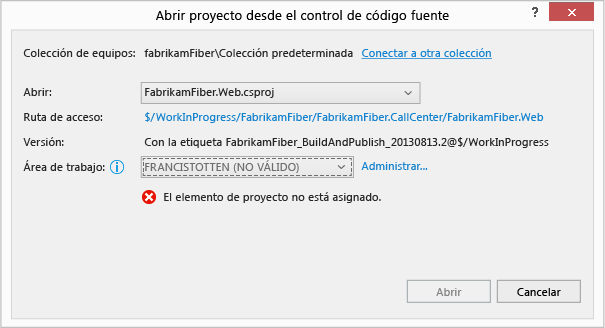

####  <a name="ChooseTeamProject"></a> P: ¿Por qué no se puede continuar hasta elegir una colección de equipo o una colección distinta?
 **R:** Esto puede ocurrir por cualquiera de las razones siguientes:

-   Visual Studio no está conectado a TFS.

     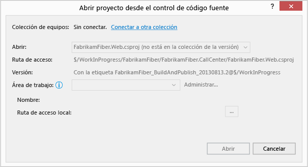

-   Visual Studio no encontró la solución o el proyecto en la colección de equipo actual.

     Cuando el archivo de manifiesto de compilación (\<*NombreDelProyecto*>.BuildInfo.config) no especifica dónde puede encontrar Visual Studio el código fuente coincidente, esta aplicación usa el TFS conectado actualmente para buscar la solución o el proyecto correspondiente. Si la colección de equipo actual no tiene el código fuente correspondiente, Visual Studio le pedirá que se conecte a otra colección de equipo.

-   Visual Studio no encontró la solución o el proyecto en la colección especificada por el archivo de manifiesto de compilación (\<*NombreDelProyecto*>.BuildInfo.config).

     Puede que el servidor TFS especificado ya no tenga el código fuente coincidente o que este ni siquiera exista, quizá porque se migró a un nuevo servidor TFS. Si el servidor TFS especificado no existe, puede que Visual Studio agote el tiempo de espera tras un minuto aproximadamente y después le pida que se conecte a otra colección. Para continuar, conéctese al servidor TFS correcto.

     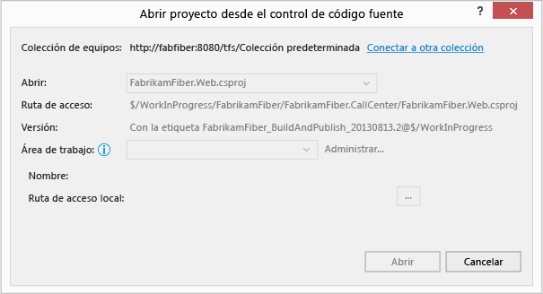

####  <a name="WhatWorkspace"></a> P: ¿Qué es un área de trabajo?
 **R:** El [área de trabajo almacena una copia del código fuente](/azure/devops/repos/tfvc/create-work-workspaces?view=vsts) para poder desarrollarlo y probarlo por separado antes de proteger el trabajo. Si aún no tiene un área de trabajo asignada específicamente a la solución o proyecto encontrados, Visual Studio le pedirá que elija un área de trabajo disponible o que cree una nueva área de trabajo con el nombre del equipo como nombre predeterminado del área.

####  <a name="UntrustedSymbols"></a> P: ¿Por qué aparece un mensaje sobre símbolos que no son de confianza?
 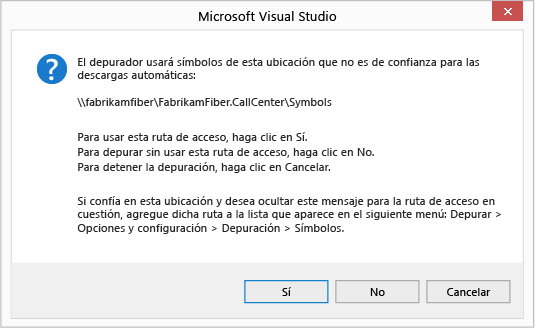

 **R:** este mensaje aparece cuando la ruta de acceso de símbolos del archivo de manifiesto de compilación (\<*nombreDelProyecto*>.BuildInfo.config) no se incluye en la lista de rutas de acceso de símbolos de confianza. Puede agregar la ruta de acceso a dicha lista en las opciones del depurador.
