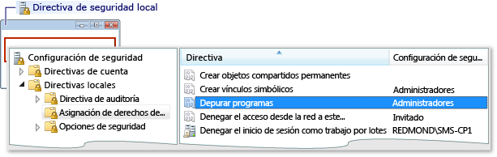

# Error: El grupo de trabajo no ha podido iniciar una sesión remota
Este error reza como sigue:  
  
 Error de inicio de sesión: nombre de usuario desconocido o contraseña incorrecta  
  
 **Causa**  
  
 Este error se produce cuando se está depurando en un equipo de un grupo de trabajo y se intenta conectar con el equipo remoto. Entre las posibles causas se incluyen:  
  
-   No existe ninguna cuenta que coincida con el nombre y la contraseña en el equipo remoto.  
  
-   Si el equipo de Visual Studio y el equipo remoto se encuentran en grupos de trabajo, este error puede deberse a que el valor predeterminado **directiva de seguridad Local** establecer en el equipo remoto. El valor predeterminado para la **directiva de seguridad Local** configuración es **sólo invitado: usuarios locales autenticados como invitados**. Para depurar en esta configuración, debe cambiar la configuración en el equipo remoto a **clásico: usuarios locales autenticados como ellos mismos**.  
  
> [!NOTE]
>  Debe ser administrador para llevar a cabo las tareas siguientes.  
  
### Para abrir la ventana Directiva de seguridad local  
  
1.  Iniciar el **secpol.msc** complemento Microsoft Management Console. Escriba secpol.msc en la búsqueda de Windows, el cuadro Ejecutar de Windows o en un símbolo del sistema.  
  
### Para agregar asignaciones de derechos de usuario  
  
1.  Abra la **directiva de seguridad Local** ventana.  
  
2.  Expanda el **directivas locales** carpeta.  
  
3.  Haga clic en **asignación de derechos de usuario**.  
  
4.  En el **directiva** columna, haga doble clic en **depurar programas** para ver las asignaciones de directivas de grupo local actual en el **configuración de directiva de seguridad Local** cuadro de diálogo.  
  
       
  
5.  Para agregar nuevos usuarios, haga clic en el **Agregar usuario o grupo** botón.  
  
### Para cambiar el modelo de seguridad y recursos compartidos  
  
1.  Abra la **directiva de seguridad Local** ventana.  
  
2.  Expanda el **directivas locales** carpeta.  
  
3.  Haga clic en **opciones de seguridad**.  
  
4.  En el **directiva** columna, haga doble clic en **acceso a la red: modelo de seguridad y recursos compartidos para cuentas locales**.  
  
5.  En el **acceso a la red: modelo de seguridad y recursos compartidos para cuentas locales** diálogo cuadro, cambie el valor a **clásico: usuarios locales autenticados como ellos mismos** y haga clic en el **aplicar**botón.  
  
       
  
## Vea también  
 [Errores de depuración remota y sus soluciones](../debugger/remote-debugging-errors-and-troubleshooting.md)   
 [Depuración remota](../debugger/remote-debugging.md)