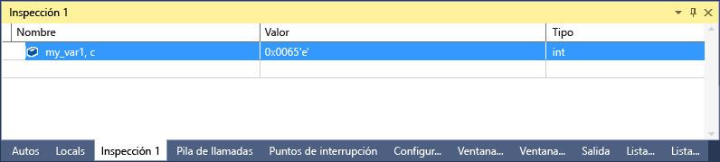

# <a name="format-specifiers-in-c-in-the-visual-studio-debugger"></a>Especificadores de formato en C++ en el depurador de Visual Studio
Puede cambiar el formato en el que se muestra un valor en la ventana **Inspección** mediante especificadores de formato.  
  
 También puede usar especificadores de formato en las ventanas **Inmediato** y **Comandos** , así como en las ventanas de código fuente. Si hace una pausa sobre una expresión de esas ventanas, el resultado aparecerá en un cuadro desplegable de información sobre datos. La visualización de información sobre datos refleja el especificador de formato.  
  
> [!NOTE]
>  Cuando el depurador nativo de Visual Studio cambia a un nuevo motor de depuración, se han agregado algunos especificadores de formato nuevos y se han quitado otros más antiguos. El depurador antiguo todavía se usa cuando se realiza depuración de interoperabilidad (administrada y nativa mixta) con C++/CLI. Las secciones siguientes de este tema muestran los especificadores de formato de cada motor de depuración.
>   
>  -   [Especificadores de formato](#BKMK_Visual_Studio_2012_format_specifiers) describe los especificadores de formato en el nuevo motor de depuración.  
> -   [Especificadores de formato para la depuración de interoperabilidad con C++/CLI](#BKMK_Format_specifiers_for_interop_debugging_and_C___edit_and_continue) describe los especificadores de formato en el motor de depuración antiguo.  
  
## <a name="using-format-specifiers"></a>Uso de especificadores de formato  
 Si tiene el siguiente código:  
  
```C++  
int main() {  
    int my_var1 = 0x0065;  
    int my_var2 = 0x0066;  
    int my_var3 = 0x0067;  
}  
```  
  
 Agregar el `my_var1` variable a la **inspección** ventana (durante la depuración, **Depurar > Windows > inspección > Inspección 1**) y establezca la presentación en formato hexadecimal (en el **ver**ventana, haga clic en la variable y seleccione **presentación Hexadecimal**). Ahora la ventana Inspección muestra que contiene el valor 0x0065. Para ver este valor expresado como carácter, en vez de como entero, en la columna Nombre, agregue el especificador de formato de carácter **, c**después del nombre de la variable: La columna **Valor** muestra ahora **101 'e'**.  
  
   
  
##  <a name="BKMK_Visual_Studio_2012_format_specifiers"></a> Especificadores de formato  
 Las siguientes tablas muestran los especificadores de formato que se pueden usar en Visual Studio. Los especificadores en negrita no se admiten para la depuración de interoperabilidad con C++/CLI.  
  
|Especificador|Formato|Valor de inspección original|Valor mostrado|  
|---------------|------------|--------------------------|---------------------|  
|d|Entero decimal|0x00000066|102|  
|o|Entero octal sin signo|0x00000066|000000000146|  
|x<br /><br /> **h**|entero hexadecimal|102|0xcccccccc|  
|X<br /><br /> **H**|entero hexadecimal|102|0xcccccccc|  
|c|carácter único|0x0065, c|101 'e'|  
|s|cadena const char*|\<ubicación > "Hola a todos"|"hola a todos"|  
|**sb**|const char * string (sin las comillas)|\<ubicación > "Hola a todos"|hola a todos|  
|s8|Cadena UTF-8|\<ubicación > "Esto es un ☕ de taza de café UTF-8"|"Esto es un ☕ de taza de café UTF-8"|
|**s8b**|Cadena UTF-8 (sin las comillas)|\<ubicación > "Hola a todos"|hola a todos|  
|su|Cadena Unicode (codificación UTF-16)|\<ubicación > L "Hola a todos"|L"hola a todos"<br /><br /> u"hola a todos"|  
|sub|Cadena de Unicode (codificación UTF-16) (sin las comillas)|\<ubicación > L "Hola a todos"|hola a todos|  
|bstr|Cadena BSTR|\<ubicación > L "Hola a todos"|L"hola a todos"|  
|env|Bloque de entorno (doble null la cadena terminada)|\<ubicación > L "=:: =::\\\\"|L "=:: =::\\\\\\0 = C: = C:\\\\windows\\\\system32\\0ALLUSERSPROFILE =...|
|**s32**|cadena UTF-32|\<ubicación > U "Hola a todos"|u"hola a todos"|  
|**s32b**|cadena UTF-32 (sin comillas)|\<ubicación > U "Hola a todos"|hola a todos|  
|**en**|enum|Sábado(6)|Sábado|  
|**hv**|Tipo de puntero: indica que el valor de puntero que se va a inspeccionar es el resultado de la asignación del montón de una matriz, por ejemplo, `new int[3]`.|\<ubicación > {\<primer miembro >}|\<ubicación > {\<primer miembro >, \<segundo miembro >,...}|  
|**na**|Suprime la dirección de memoria de un puntero a un objeto.|\<ubicación >, {miembro = value...}|{miembro = value...}|  
|**nd**|Muestra solo la información de la clase, omitiendo las clases derivadas|`(Shape*) square` incluye la información de clase base y derivada|Muestra únicamente la información de clase base|  
|hr|HRESULT o código de error Win32. (Ahora, el depurador descodifica los valores HRESULT automáticamente, de modo que este especificador no es necesario en esos casos).|S_OK|S_OK|  
|wc|Marcador de clase de ventana|0x0010|WC_DEFAULTCHAR|  
|wm|Números de mensajes de Windows|16|WM_CLOSE|  
|!|Sin formato, omite cualquier personalización de vistas de tipos de datos|\<personalizar la representación en forma de >|4|  
  
> [!NOTE]
>  Cuando el especificador de formato **hv** está presente, el depurador intenta determinar la longitud del búfer y muestra el número apropiado de elementos. Dado que el depurador no siempre puede averiguar el tamaño del búfer exacto de una matriz, debe usar un especificador de tamaño de `(pBuffer,[bufferSize])` siempre que sea posible. El especificador de formato **hv** está diseñado para escenarios en los que el tamaño de búfer no está disponible  
  
###  <a name="BKMK_Size_specifiers_for_pointers_as_arrays_in_Visual_Studio_2012"></a> Especificadores de tamaño para punteros como matrices  
 Si tiene un puntero a un objeto que desea ver como una matriz, puede utilizar un entero o una expresión para especificar el número de elementos de matriz:  
  
|Especificador|Formato|Valor de inspección original|Valor mostrado|  
|---------------|------------|---------------------------|---------------------|  
|n|Entero decimal o **hexadecimal**|pBuffer,[32]<br /><br /> pBuffer,**[0x20]**|Muestra `pBuffer` como una matriz de 32 elementos.|  
|**[exp]**|Expresión de C++ válida que se evalúa como un entero.|pBuffer,[bufferSize]|Muestra pBuffer como una matriz de `bufferSize` elementos.|  
|**expand(n)**|Expresión de C++ válida que se evalúa como un entero|pBuffer, expand(2)|Muestra el tercer elemento de  `pBuffer`|  
  
##  <a name="BKMK_Format_specifiers_for_interop_debugging_and_C___edit_and_continue"></a> Especificadores de formato para la depuración de interoperabilidad con C++/CLI  
 Los especificadores en **negrita** solo son compatibles con la depuración nativa y con el código C++/CLI.  
  
|Especificador|Formato|Valor de inspección original|Valor mostrado|  
|---------------|------------|--------------------------|---------------------|  
|**d,i**|Entero decimal con signo|0xF000F065|-268373915|  
|**u**|Entero decimal sin signo|0x0065|101|  
|o|Entero octal sin signo|0xF065|0170145|  
|x,X|entero hexadecimal|61541|0x0000f065|  
|**l,h**|Prefijo long o short para: d, i, u, o, x, X|00406042|0x0c22|  
|**f**|Punto flotante con signo|(3./2.), f|1.500000|  
|**e**|Notación científica con signo|(3.0/2.0)|1.500000e+000|  
|**g**|Punto flotante con signo o notación científica con signo, lo que sea más corto|(3.0/2.0)|1.5|  
|c|carácter único|\<ubicación >|101 'e'|  
|s|const char*|\<ubicación >|"hola a todos"|  
|su|const wchar_t*<br /><br /> char16_t const\*|\<ubicación >|L"hola a todos"|  
|sub|const wchar_t*<br /><br /> char16_t const\*|\<ubicación >|hola a todos|  
|s8|const char*|\<ubicación >|"hola a todos"|  
|hr|HRESULT o código de error Win32. (Ahora, el depurador descodifica los valores HRESULT automáticamente, de modo que este especificador no es necesario en esos casos).|S_OK|S_OK|  
|wc|Marcador de clase de ventana.|0x00000040,|WC_DEFAULTCHAR|  
|wm|Números de mensajes de Windows|0x0010|WM_CLOSE|  
|!|Sin formato, omite cualquier personalización de vistas de tipos de datos|\<personalizar la representación en forma de >|4|  
  
###  <a name="BKMK_Format_specifiers_memory_locations_in_interop_debugging_and_C___edit_and_continue"></a> Ubicaciones de memoria de los especificadores de formato en la depuración de interoperabilidad con C++/CLI  
 La siguiente tabla contiene símbolos de formato que se utilizan para ubicaciones de memoria. Puede utilizar un especificador de ubicación de memoria con cualquier valor o expresión que se evalúe como una ubicación.  
  
|Símbolo|Formato|Valor de inspección original|Valor mostrado|  
|------------|------------|--------------------------|---------------------|  
|**ma**|64 caracteres ASCII|0x0012ffac|0x0012ffac .4...0...".0W&.......1W&.0.:W..1...."..1.JO&.1.2.."..1...0y....1|  
|**m**|16 bytes en hexadecimal, seguidos de 16 caracteres ASCII|0x0012ffac|0x0012ffac B3 34 CB 00 84 30 94 80 FF 22 8A 30 57 26 00 00 .4...0...".0W&amp;.|  
|**mb**|16 bytes en hexadecimal, seguidos de 16 caracteres ASCII|0x0012ffac|0x0012ffac B3 34 CB 00 84 30 94 80 FF 22 8A 30 57 26 00 00 .4...0...".0W&amp;.|  
|**mw**|8 palabras|0x0012ffac|0x0012ffac 34B3 00CB 3084 8094 22FF 308A 2657 0000|  
|**md**|4 palabras dobles|0x0012ffac|0x0012ffac 00CB34B3 80943084 308A22FF 00002657|  
|**mq**|2 palabras cuádruples|0x0012ffac|0x0012ffac 7ffdf00000000000 5f441a790012fdd4|  
|**mu**|Caracteres de 2 bytes (Unicode)|0x0012ffac|0x0012ffac 8478 77f4 ffff ffff 0000 0000 0000 0000|  
  
###  <a name="BKMK_Size_specifier_for_pointers_as_arrays_in_interop_debugging_and_C___edit_and_continue"></a>Especificador de tamaño para punteros como matrices en la depuración de interoperabilidad con C++ / CLI  
 Si tiene un puntero a un objeto que desea ver como una matriz, puede utilizar un entero para especificar el número de elementos de matriz:  
  
|Especificador|Formato|Expresión|Valor mostrado|  
|---------------|------------|----------------|---------------------|  
|n|Entero decimal|pBuffer[32]|Muestra `pBuffer` como una matriz de 32 elementos.|
