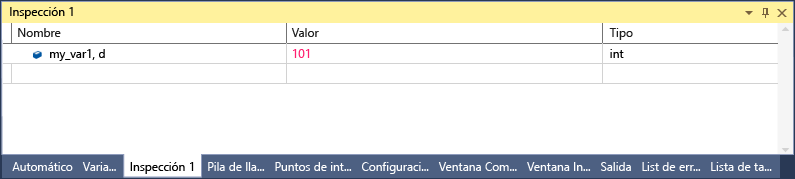

# <a name="format-specifiers-in-c-in-the-visual-studio-debugger"></a>Especificadores de formato en C# en el depurador de Visual Studio
Puede cambiar el formato en el que se muestra un valor en la ventana **Inspección** mediante especificadores de formato. También puede utilizar especificadores de formato en el **inmediato** ventana, el **comando** ventana, en [puntos de seguimiento](../debugger/using-breakpoints.md#BKMK_Print_to_the_Output_window_with_tracepoints)así como en ventanas de código fuente. Si hace una pausa sobre una expresión de esas ventanas, el resultado aparecerá en un cuadro desplegable de información sobre datos. Estos cuadros mostrarán el especificador de formato en la pantalla de información sobre datos.  
  
 Para utilizar un especificador de formato, escriba la expresión seguida de una coma. Tras la coma, agregue el especificador adecuado.  
  
## <a name="using-format-specifiers"></a>Uso de especificadores de formato  
 Si tiene el siguiente código:  
  
```csharp  
{  
        int my_var1 = 0x0065;  
        int my_var2 = 0x0066;  
        int my_var3 = 0x0067;  
}  
```  
  
 Agregar el `my_var1` variable a la ventana Inspección (durante la depuración, **Depurar > Windows > inspección > Inspección 1**) y establezca la presentación en formato hexadecimal (en el **inspección** ventana, haga clic en la variable y Seleccione **presentación Hexadecimal**). Ahora la ventana **Inspección** muestra que contiene el valor 0x0065. Para ver el valor expresado como entero decimal en lugar de como entero hexadecimal, en la columna Nombre, agregue el especificador de formato de carácter **, d**. La columna Valor muestra ahora el valor decimal 101  
  
   
  
## <a name="format-specifiers"></a>Especificadores de formato  
 La siguiente tabla muestra los especificadores de formato de C# que reconoce el depurador.  
  
|Especificador|Formato|Valor de inspección original|Muestra|  
|---------------|------------|--------------------------|--------------|  
|ac|Fuerza la evaluación de una expresión. Esto puede resultar útil si se desactiva la evaluación implícita de propiedades y las llamadas a funciones implícitas.|Mensaje "evaluación de funciones implícita se ha desactivado por el usuario"|\<valor >|  
|d|Entero decimal|0x0065|101|  
|dynamic|Muestra el objeto especificado mediante un vista dinámica|Muestra todos los miembros del objeto, incluida la vista dinámica|Muestra solo la vista dinámica|  
|h|Entero hexadecimal|61541|0x0000F065|  
|nq|cadena sin comillas|"Mi Cadena"|Mi Cadena|  
|hidden|Muestra todos los miembros públicos y no públicos|Muestra los miembros públicos|Muestra todos los miembros|  
|raw|Muestra el elemento tal como aparece en el nodo de elemento sin formato. Válido solo en objetos de servidor proxy.|Diccionario\<T >|Vista sin formato del diccionario\<T >|  
|results|Usar con una variable de un tipo que implementa IEnumerable o IEnumerable\<T >, normalmente es el resultado de una expresión de consulta. Solo muestra los miembros que contienen el resultado de la consulta.|Muestra todos los miembros.|Muestra los miembros que cumplan las condiciones de la consulta.|  
  
## <a name="see-also"></a>Vea también  
 [Inspección y ventanas de inspección rápida](../debugger/watch-and-quickwatch-windows.md)   
 [Ventanas de variables locales y automáticas](../debugger/autos-and-locals-windows.md)
