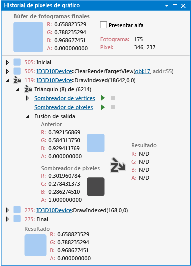

# Historial de p&#237;xeles de gr&#225;fico
[!INCLUDE[vs2017banner](../code-quality/includes/vs2017banner.md)]

La ventana Historial de píxeles de gráfico del Analizador de gráficos de Visual Studio ayuda a comprender cómo afectan los eventos de Direct3D que se producen durante un fotograma del juego o la aplicación a un píxel concreto.  
  
 Esta es la ventana Historial de píxeles:  
  
   
  
## Descripción de la ventana Historial de píxeles  
 Con Historial de píxeles, puede analizar cómo afectan los eventos de Direct3D a un píxel determinado del destino de representación durante un fotograma.  Puede relacionar un problema de representación con un evento concreto de Direct3D, incluso cuando los eventos posteriores \(o las primitivas posteriores del mismo evento\) siguen cambiando el valor de color final del píxel.  Por ejemplo, es posible que un píxel se represente de forma incorrecta y, luego, quede ocultado por un píxel semitransparente, de modo que sus colores se fusionen en el búfer de fotogramas.  Este tipo de problema sería difícil de diagnosticar si solo pudiera guiarse por el contenido final del destino de representación.  
  
 La ventana Historial de píxeles muestra el historial completo de un píxel a lo largo del fotograma seleccionado.  El **Búfer de fotogramas finales** situado en la parte superior de la ventana muestra el color que se escribe en el búfer de fotogramas al final del fotograma, junto con información adicional sobre el píxel, como el fotograma del que proviene y las coordenadas de la pantalla.  Esta área contiene también la casilla **Presentar alfa**.  Cuando esta casilla está activada, los valores de color y color intermedio de **Búfer de fotogramas finales** se muestran con transparencia sobre un patrón de cuadros bicolores.  Si la casilla está desactivada, se ignorará el canal alfa de los valores de color.  
  
 La parte inferior de la ventana muestra los eventos que tuvieron oportunidad de afectar al color del píxel, junto con el pseudoevento **Inicial** y el **Final**, que representan los valores de color inicial y final del píxel en el búfer de fotogramas.  El valor de color inicial viene determinado por el primer evento que cambió el color del píxel \(suele ser un evento `Clear`\).  Los píxeles siempre tienen estos dos pseudoeventos en su historial, aunque no los afectara ningún otro evento.  Si hubo otros eventos que tuvieron oportunidad de afectar al píxel, se mostrarán entre el evento **Inicial** y el **Final**.  Los eventos se pueden expandir para mostrar sus detalles.  En el caso de los eventos simples, como los que borran un destino de representación, el efecto del evento es solamente un valor de color.  Los eventos más complejos, como las llamadas a draw, generan una o varias primitivas que podrían contribuir al color del píxel.  
  
 Las primitivas que dibujó el evento se identifican por su tipo e índice de primitiva, junto con el número total de primitivas del objeto.  Por ejemplo, un identificador como **Triángulo \(1456\) de \(6214\)** significa que la primitiva corresponde al triángulo n.º 1.456 de un objeto formado por 6.214 triángulos.  A la izquierda del identificador de cada primitiva hay un icono que resume el efecto que tuvo la primitiva sobre el píxel.  Las primitivas que afectan al color del píxel se representan con un rectángulo redondeado rellenado con el color resultante.  Las primitivas que están excluidas de afectar al color del píxel se representan con iconos que indican el motivo por el que se excluyó el píxel.  Estos iconos se describen en la sección [Exclusión de primitivas](../debugger/graphics-pixel-history.md#exclusion), más adelante en este mismo artículo.  
  
 Puede expandir cada primitiva para examinar cómo se combinó la salida del sombreador de píxeles con el color de píxel existente para producir el color resultante.  Desde aquí, también puede examinar o depurar el código del sombreador de píxeles asociado a la primitiva, y puede expandir aún más el nodo del sombreador de vértices para examinar la entrada del sombreador de vértices.  
  
###   Exclusión de primitivas  
 Si una primitiva se excluye de modo que no afecte al color del píxel, la exclusión puede producirse por varios motivos.  Cada motivo está representado por un icono de los que se describen en esta tabla:  
  
|Iconos|Motivo de exclusión|  
|------------|-------------------------|  
||El píxel se excluyó porque no superó la prueba de profundidad.|  
||El píxel se excluyó porque no superó la prueba de tijera.|  
||El píxel se excluyó porque no superó la prueba de galería de símbolos.|  
  
### Exclusión de llamadas a draw  
 Si todas las primitivas de una llamada a draw se excluyen de modo que no afecten al destino de representación por no superar una prueba, la llamada a draw no se podrá expandir y se mostrará junto a ella un icono correspondiente al motivo de la exclusión.  Los motivos de exclusión de las llamadas a draw se asemejan a los motivos de exclusión de las primitivas y sus iconos son similares.  
  
### Visualización y depuración de código de sombreado  
 Puede examinar y depurar código de sombreadores de vértices, de casco, de dominios, de geometría y de píxeles mediante los controles situados debajo de la primitiva asociada con el sombreador.  
  
##### Para ver el código fuente de un sombreador  
  
1.  En la ventana **Historial de píxeles de gráfico**, busque la llamada a draw que corresponde con el sombreador que desea examinar y expándala.  
  
2.  En la llamada a draw que acaba de expandir, seleccione una primitiva que muestre el problema que le interesa y expándala.  
  
3.  En la primitiva que le interesa, siga el vínculo del título del sombreador. Por ejemplo, siga el vínculo **Sombreador de vértices obj:30** para ver el código fuente del sombreador de vértices.  
  
    > [!TIP]
    >  El número de objeto, **obj:30**, identifica este sombreador en toda la interfaz del Analizador de gráficos, tal como se muestra en la ventana de tabla de objetos y etapas de canalización.  
  
##### Para depurar un sombreador  
  
1.  En la ventana **Historial de píxeles de gráfico**, busque la llamada a draw que corresponde con el sombreador que desea examinar y expándala.  
  
2.  A continuación, en la llamada a draw que acaba de expandir, seleccione una primitiva que muestre el problema que le interesa y expándala.  
  
3.  En la primitiva que le interesa, seleccione **Iniciar depuración**.  Este punto de entrada en el depurador HLSL tiene como valor predeterminado la primera invocación del sombreador para la primitiva correspondiente, es decir, el primer píxel o vértice que procesa el sombreador.  Hay un único píxel asociado con la primitiva, pero hay más de una invocación del sombreador de vértices para las líneas y los triángulos.  
  
     Para depurar la invocación del sombreador de vértices de un vértice concreto, expanda el vínculo del título VertexShader y busque el vértice que le interesa; a continuación, seleccione **Iniciar depuración** junto a él.  
  
### Vínculos a objetos gráficos  
 Para comprender los eventos de gráficos del historial de píxeles, puede que necesite información sobre el estado que tenía el dispositivo en el momento del evento o los objetos de Direct3D a los que hace referencia el evento.  De cada evento del historial de píxeles, el **Historial de píxeles de gráfico** proporciona vínculos al estado que tenía el dispositivo en ese momento y a los objetos relacionados.  
  
## Vea también  
 [Tutorial: Objetos ausentes debido al estado del dispositivo](../debugger/walkthrough-missing-objects-due-to-device-state.md)   
 [Tutorial: Depurar errores de representación debidos al sombreado](../debugger/walkthrough-debugging-rendering-errors-due-to-shading.md)