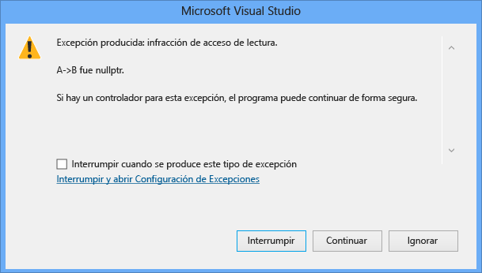

# <a name="how-can-i-debug-a-c-access-violation"></a>Cómo depurar una infracción de acceso de C++

## <a name="problem-description"></a>Descripción del problema

El programa produce una infracción de acceso. ¿Cómo se puede depurar este error?

## <a name="solution"></a>Soluciones

Si se produce una infracción de acceso en una línea de código que desreferencia varios punteros, puede ser difícil averiguar qué puntero produjo la infracción de acceso. A partir de Visual Studio 2015 Update 1, el cuadro de diálogo de excepción ahora indica explícitamente el puntero que produjo la infracción de acceso.

Por ejemplo, con el siguiente código, debería obtener una infracción de acceso:

```C++
#include <iostream>
using namespace std;

class ClassC {
public:
  void printHello() {
    cout << "hello world";
  }
};

class ClassB {
public:
  ClassC* C;
  ClassB() {
    C = new ClassC();
  }
};

class ClassA {
public:
  ClassB* B;
  ClassA() {
    // Uncomment to fix
    // B = new ClassB();
  }
};

int main() {
  ClassA* A = new ClassA();
  A->B->C->printHello();

}
```

Si ejecuta este código en Visual Studio 2015 Update 1, verá el cuadro de diálogo de excepción siguiente:



Si no puede determinar por qué el puntero ha provocado una infracción de acceso, realice el seguimiento del código para asegurarse de que el puntero que causa el problema se ha asignado correctamente.  Si se pasa como parámetro, asegúrese de que se pasa correctamente y que no está creando accidentalmente una [copia superficial](https://stackoverflow.com/questions/184710/what-is-the-difference-between-a-deep-copy-and-a-shallow-copy). A continuación, compruebe que los valores no se cambian involuntariamente en algún lugar del programa mediante la creación de un punto de interrupción de datos para el puntero en cuestión, para asegurarse de que no se esté modificando en otra parte del programa. Para obtener más información sobre los puntos de interrupción de datos, vea la sección sobre los puntos de interrupción de datos en [Using Breakpoints](../debugger/using-breakpoints.md).

## <a name="see-also"></a>Vea también
- [Preguntas más frecuentes sobre la depuración de código nativo](../debugger/debugging-native-code-faqs.md)