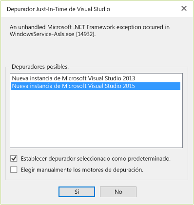

# <a name="how-to-debug-the-onstart-method"></a>Procedimiento Depuración del método OnStart
Se puede depurar un servicio de Windows si se inicia el servicio y se asocia el depurador al proceso del servicio. Para obtener más información, vea [Cómo: Depurar aplicaciones de servicios de Windows](/dotnet/framework/windows-services/how-to-debug-windows-service-applications). Sin embargo, para depurar el método <xref:System.ServiceProcess.ServiceBase.OnStart%2A?displayProperty=fullName> de un servicio de Windows, debe iniciar el depurador desde dentro del método.

1. Agregue una llamada a <xref:System.Diagnostics.Debugger.Launch%2A> al principio del método `OnStart()`.

    ```csharp
    protected override void OnStart(string[] args)
    {
        System.Diagnostics.Debugger.Launch();
    }
    ```

2. Inicie el servicio (puede usar `net start`o iniciarlo en la ventana **Servicios** ).

    Debería ver un cuadro de diálogo similar al siguiente:

    

3. Seleccione **Sí, depurar \<service name>.**

4. En la ventana del depurador Just-In-Time, seleccione la versión de Visual Studio que quiere usar para la depuración.

    

5. Una nueva instancia de Visual Studio se inicia y la ejecución se detiene en el método `Debugger.Launch()` .

## <a name="see-also"></a>Vea también
- [Seguridad del depurador](../debugger/debugger-security.md)
- [Depurar código administrado](../debugger/debugging-managed-code.md)
