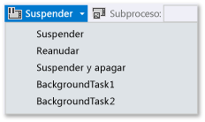
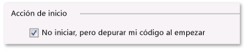
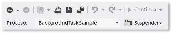

# Cómo desencadenar suspender, reanudar y en segundo plano de los eventos durante la depuración de aplicaciones para UWP en Visual Studio
Cuando no estás depurando, la **Administración de la duración de los procesos** (PLM) de Windows controla el estado de ejecución de la aplicación, es decir, inicia, suspende, reanuda y finaliza la aplicación en respuesta a las acciones del usuario y al estado del dispositivo. Mientras depuras, Windows deshabilita estos eventos de activación. En este tema se describe cómo activar estos eventos en el depurador.  
  
 También se describe cómo depurar **tareas en segundo plano**. Las tareas en segundo plano te permiten realizar algunas operaciones en un proceso de segundo plano, aunque la aplicación no se esté ejecutando. Puedes utilizar el depurador para poner la aplicación en modo de depuración y, sin iniciar la interfaz de usuario, iniciar y depurar la tarea en segundo plano.  
  
 Para obtener más información sobre la Administración de la duración de los procesos y las tareas en segundo plano, consulta [Launching, resuming, and multitasking](/windows/uwp/launch-resume/index).  
  
##   Desencadenar eventos de la Administración de la duración de los procesos  
 Windows puede suspender la aplicación cuando el usuario cambia a otra aplicación o cuando Windows entra en estado de baja energía. Puedes responder al evento `Suspending` para guardar los datos pertinentes de la aplicación y del usuario en el almacenamiento persistente, y para liberar recursos. Cuando una aplicación se reanuda del estado **suspendido** , entra en el estado de **ejecución** y sigue desde el punto donde se suspendió. Puedes responder al evento `Resuming` para restaurar o actualizar el estado de la aplicación, y para reclamar recursos.  
  
 Aunque Windows intenta mantener en la memoria tantas aplicaciones suspendidas como sea posible, puede finalizar la tuya si no hay suficientes recursos para conservarla en la memoria. También un usuario podría cerrar tu aplicación de forma explícita. No hay ningún evento especial que indique que un usuario ha cerrado una aplicación.  
  
 En el depurador de Visual Studio, puedes suspender, reanudar y finalizar manualmente las aplicaciones para depurar eventos de ciclo de vida. Para depurar un evento de ciclo de vida:  
  
1.  Establece un punto de interrupción en el controlador del eventos que quieres depurar.  
  
2.  Presiona **F5** para iniciar la depuración.  
  
3.  En la barra de herramientas **Ubicación de depuración** , elige el evento que desees desencadenar:  
  
       
  
     Observa que **Suspender y apagar** cierra la aplicación y finaliza la sesión de depuración.  
  
##   Desencadenar tareas en segundo plano  
 Aunque no esté en ejecución, cualquier aplicación puede registrar una tarea en segundo plano para responder a determinados eventos del sistema. Las tareas en segundo plano no pueden ejecutar código que actualice directamente la interfaz de usuario. En cambio, muestran información al usuario con las actualizaciones de imágenes y distintivos, y las notificaciones. Para obtener más información, vea [Supporting your app with background tasks](https://msdn.microsoft.com/library/4c7bb148-eb1f-4640-865e-41f627a46e8e)  
  
 Desde el depurador, puedes desencadenar eventos que inician tareas en segundo plano de tu aplicación.  
  
> [!NOTE]
>  El depurador solo puede desencadenar los eventos que no contienen datos, como los que indican un cambio de estado del dispositivo. Tienes que desencadenar manualmente las tareas en segundo plano que requieran datos proporcionados por el usuario o de otro tipo.  
  
 La forma más realista de desencadenar un evento de tarea en segundo plano es hacerlo cuando la aplicación no se está ejecutando. Sin embargo, también es posible desencadenarlo en una sesión de depuración estándar.  
  
###   Desencadenar un evento de tarea en segundo plano desde una sesión de depuración estándar  
  
1.  Establece un punto de interrupción en el código de la tarea en segundo plano que quieras depurar.  
  
2.  Presiona **F5** para iniciar la depuración.  
  
3.  En la lista de eventos de la barra de herramientas **Ubicación de depuración** , elige la tarea en segundo plano que desees iniciar.  
  
       
  
###   Desencadenar una tarea en segundo plano cuando la aplicación no se está ejecutando  
  
1.  Establece un punto de interrupción en el código de la tarea en segundo plano que quieras depurar.  
  
2.  Abre la página de propiedades de depuración del proyecto de inicio. En el Explorador de soluciones, seleccione el proyecto. En el menú **Depurar** , elige **Propiedades**.  
  
     Para los proyectos de C++ y JavaScript, expanda **propiedades de configuración** y, a continuación, elija **depuración**.  
  
3.  Realice una de las siguientes acciones:  
  
    -   Para proyectos de Visual C# y Visual Basic, elige **No iniciar, pero depurar mi código al empezar**.  
  
           
  
    -   Para los proyectos de JavaScript y Visual C++, elige **No** en la lista **Iniciar aplicación** .  
  
           
  
4.  Presiona **F5** para poner la aplicación en modo de depuración. Ten en cuenta que la lista **Proceso** de la barra de herramientas **Ubicación de depuración** muestra el nombre del paquete de la aplicación, para indicar que estás en modo de depuración.  
  
       
  
5.  En la lista de eventos de la barra de herramientas **Ubicación de depuración** , elige la tarea en segundo plano que desees iniciar.  
  
       
  
##   Desencadenar eventos de la Administración de la duración de los procesos y tareas en segundo plano desde una aplicación instalada  
 Use la **depurar paquete de aplicaciones instalado** cuadro de diálogo para cargar una aplicación que ya está instalada en el depurador. Por ejemplo, puede depurar una aplicación que se instaló desde Microsoft Store, o depurar una aplicación cuando tenga los archivos de origen para la aplicación, pero no un proyecto de Visual Studio para la aplicación. El **depurar paquete de aplicaciones instalado** cuadro de diálogo permite iniciar una aplicación en modo de depuración en el equipo de Visual Studio o en un dispositivo remoto, o para establecer la aplicación se ejecute en modo de depuración pero no iniciarla. Para obtener más información, consulte [depurar un paquete de aplicación instalados](../debugger/debug-installed-app-package.md).
  
 Una vez cargada la aplicación en el depurador, puedes usar cualquiera de los procedimientos descritos más arriba.  
  
##   Diagnosticar errores de activación de tareas en segundo plano  
 Los registros de diagnóstico del Visor de eventos de Windows de la infraestructura de segundo plano contienen información detallada que puedes utilizar para diagnosticar y solucionar problemas de errores de tareas en segundo plano. Para ver el registro:  
  
1.  Abra la aplicación Visor de eventos.  
  
2.  En el panel **Acciones** , elige **Ver** y asegúrate de que esté activada la casilla **Mostrar registros analíticos y de depuración** .  
  
3.  En la barra de herramientas **Visor de eventos (local)** , expande los nodos **Registros de aplicaciones y servicios** > **Microsoft** > **Windows** > **BackgroundTasksInfrastructure**.  
  
4.  Elige el registro **Diagnóstico** .  
  
## Vea también  
 [Testing UWP apps with Visual Studio (Probar aplicaciones para UWP con Visual Studio)](../test/testing-store-apps-with-visual-studio.md)   
 [Debug apps in Visual Studio](../debugger/debug-store-apps-in-visual-studio.md)   
 [Ciclo de vida de la aplicación](/windows/uwp/launch-resume/app-lifecycle)   
 [Launching, resuming, and multitasking](/windows/uwp/launch-resume/index)