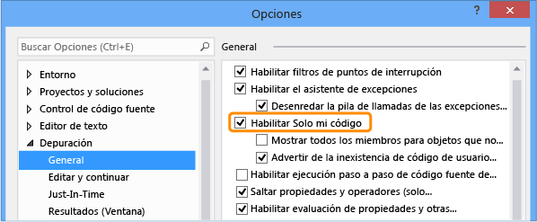

# <a name="debug-only-user-code-with-just-my-code"></a>Depurar código de usuario sólo con sólo mi código 

*Solo mi código* es una característica de depuración de Visual Studio que automáticamente los pasos a través de las llamadas al sistema, el marco de trabajo y otro código que no es de usuario. En el **pila de llamadas** ventana, solo mi código contrae estas llamadas en **[código externo]** marcos. 

Solo mi código funciona de manera diferente en los proyectos de .NET Framework, C++ y JavaScript.

##  <a name="BKMK_Enable_or_disable_Just_My_Code"></a> Habilitar o deshabilitar Solo mi código  

Para la mayoría de los lenguajes de programación, solo mi código está habilitada de forma predeterminada. 

- Para habilitar o deshabilitar solo mi código en Visual Studio, en **herramientas** > **opciones** (o **depurar** > **opciones**) > **Depuración** > **General**, seleccione o anule la selección de **habilitar solo mi código**.
  
   
  
> [!NOTE]
> **Habilitar Solo mi código** es una configuración global que se aplica a todos los proyectos de Visual Studio en todos los idiomas.  
  
##  <a name="just-my-code-debugging"></a>depuración de Sólo mi código

Durante una sesión de depuración, el **módulos** ventana muestra que el depurador se trata como mi código (código de usuario), los módulos de código, junto con su estado de carga de símbolos. Para obtener más información, consulte [familiarizarse más con cómo el depurador se asocia a la aplicación](../debugger/debugger-tips-and-tricks.md#modules_window).

 
  
En el **pila de llamadas** o **tareas** ventana, solo mi código contrae el código de no usuario en un marco de código anotados atenuados con la etiqueta `[External Code]`.

 
  
>[!TIP]
>Para abrir el **módulos**, **pila de llamadas**, **tareas**, o la mayoría de otras ventanas de depuración, debe estar en una sesión de depuración. Durante la depuración, en **depurar** > **Windows**, seleccione las ventanas que desee abrir. 

<a name="BKMK_Override_call_stack_filtering"></a> Para ver el código en un contraído **[código externo]** marco, haga clic en el **pila de llamadas** o **tarea** ventana y seleccione **mostrar código externo**en el menú contextual. Reemplace las líneas de código externo expandido la **[código externo**] marco. 

 
  
> [!NOTE]
> **Mostrar código externo** es un generador de perfiles de usuario actual que se aplica a todos los proyectos en todos los idiomas que están abiertos por el usuario.

Haga doble clic en una línea de código externo expandido en el **pila de llamadas** ventana resalta la línea de código que realiza la llamada en verde en el código fuente. Para archivos DLL o a otros módulos no se encontró o carga, un símbolo o el origen no encontró puede abrir la página.

##  <a name="BKMK__NET_Framework_Just_My_Code"></a>Solo mi código de .NET Framework 

En los proyectos de .NET Framework, solo mi código utiliza el símbolo (*.pdb*) los archivos y las optimizaciones de programa para clasificar el código de usuario y no de usuario. El depurador de .NET Framework considera optimizado para los archivos binarios y no carga *.pdb* los archivos de código de no usuario.
  
Tres atributos de compilador también afectan a lo que el depurador de .NET se considera código de usuario:  

- <xref:System.Diagnostics.DebuggerNonUserCodeAttribute> indica al depurador que el código al que se aplica no es código de usuario.  
- <xref:System.Diagnostics.DebuggerHiddenAttribute> oculta el código para el depurador, incluso si Solo mi código está desactivado.  
- <xref:System.Diagnostics.DebuggerStepThroughAttribute> indica al depurador que recorra el código que se aplica, en lugar de paso en el código.  

El depurador de .NET Framework considera que todos los otro código para código de usuario.  

Durante la depuración de .NET Framework:

- **Depurar** > **paso a paso** (o **F11**) en el código de no usuario salta el código a la siguiente línea de código de usuario. 
- **Depurar** > **paso a paso fuera** (o **MAYÚS**+**F11**) en el código de no usuario se ejecuta a la siguiente línea de código de usuario. 

Si no hay ningún código de usuario más, depuración continúa hasta que finaliza, llega a otro punto de interrupción o produce un error. 

<a name="BKMK_NET_Breakpoint_behavior"></a> Si el depurador se interrumpe en el código que no es de usuario (por ejemplo, usa **depurar** > **interrumpir todos** y pausa en el código de no usuario), el **n origen** aparecerá la ventana. A continuación, puede usar un **depurar** > **paso** comando para ir a la siguiente línea de código de usuario.

Si se produce una excepción no controlada en código de no usuario, el depurador se interrumpe en la línea de código de usuario donde se generó la excepción.  
  
Si se habilitan excepciones de primera oportunidad para la excepción, la línea de código de usuario que realiza la llamada está resaltada en verde en el código fuente. El **pila de llamadas** ventana muestra el marco anotado con la etiqueta **[código externo]**.  

##  <a name="BKMK_C___Just_My_Code"></a> Solo mi código de C++  
  
En C++, habilitar solo mi código es lo mismo que usar el [/JMC (solo mi código de depuración)](/cpp/build/reference/jmc) modificador del compilador.

<a name="BKMK_CPP_User_and_non_user_code"></a> Solo mi código es diferente en C++ que en .NET Framework y JavaScript, ya que puede especificar los archivos que no son de usuario por separado para el comportamiento del recorrido y **pila de llamadas** ventana. 

Solo mi código en C++ considera que solo estas funciones de código que no es de usuario:

- Para el **pila de llamadas** ventana: 

  - Funciones con información de origen eliminada en su archivo de símbolos.  
  - Funciones en las que los archivos de símbolos indican que no hay ningún archivo de código fuente correspondiente al marco de pila.  
  - Funciones especificadas en  *\*.natjmc* archivos en el *%VsInstallDirectory%\Common7\Packages\Debugger\Visualizers* carpeta.  
  
- Para la ejecución paso a paso de comportamiento:
  
  - Funciones especificadas en  *\*.natstepfilter* archivos en el *%VsInstallDirectory%\Common7\Packages\Debugger\Visualizers* carpeta.  
  
Puede crear *.natstepfilter* y *.natjmc* archivos para personalizar el comportamiento de ejecución paso a paso solo mi código y la **pila de llamadas** ventana. Consulte [comportamiento del avance personalizar C++](#BKMK_CPP_Customize_stepping_behavior) y [comportamiento de pila de llamadas de personalizar C++](#BKMK_CPP_Customize_call_stack_behavior). 

<a name="BKMK_CPP_Stepping_behavior"></a> Durante la depuración de C++:

- **Depurar** > **paso a paso** (o **F11**) en el código de no usuario salta el código a la siguiente línea de código de usuario. 
- **Depurar** > **paso a paso fuera** (o **MAYÚS**+**F11**) en el código de no usuario se ejecuta a la siguiente línea de código de usuario. 

Si no hay ningún código de usuario más, depuración continúa hasta que finaliza, llega a otro punto de interrupción o produce un error. 

Si el depurador se interrumpe en el código que no es de usuario (por ejemplo, usa **depurar** > **interrumpir todos** y poner en pausa en el código de no usuario), el avance continúa en el código que no es de usuario.

Si el depurador llega a una excepción, se detiene en la excepción, ya sea en el código de usuario o que no es de usuario. **No controla el usuario** opciones en el **configuración de excepciones** se pasan por alto el cuadro de diálogo.  

###  <a name="BKMK_CPP_Customize_stepping_behavior"></a> Personalizar el comportamiento de ejecución paso a paso de C++  

 En los proyectos de C++, puede especificar funciones salten enumera como código que no son de usuario en  *\*.natstepfilter* archivos.  
  
- Para especificar código que no son de usuario para todos los usuarios locales de Visual Studio, agregue el *.natstepfilter* del archivo a la *%VsInstallDirectory%\Common7\Packages\Debugger\Visualizers* carpeta.  
- Para especificar código que no es de usuario para un usuario individual, agregue el archivo *.natstepfilter* a la carpeta *%USERPROFILE%\My Documents\Visual Studio 2017\Visualizers*.  
  
Un *.natstepfilter* archivo es un archivo XML con esta sintaxis:  
  
```xml  
<?xml version="1.0" encoding="utf-8"?>  
<StepFilter xmlns="http://schemas.microsoft.com/vstudio/debugger/natstepfilter/2010">  
    <Function>  
        <Name>FunctionSpec</Name>  
        <Action>StepAction</Action>  
    </Function>  
    <Function>  
        <Name>FunctionSpec</Name>  
        <Module>ModuleSpec</Module>  
        <Action>StepAction</Action>  
    </Function>  
</StepFilter>  
  
```  
  
|Elemento|Descripción|  
|-------------|-----------------|  
|`Function`|Obligatorio. Especifica una o más funciones como funciones que no son de usuario.|  
|`Name`|Obligatorio. Expresión regular con formato ECMA-262 que especifica el nombre de función completo que debe coincidir. Por ejemplo:<br /><br /> `<Name>MyNS::MyClass.*</Name>`<br /><br /> indica al depurador que todos los métodos de `MyNS::MyClass` deben considerarse código que no es de usuario. La coincidencia distingue mayúsculas de minúsculas.|  
|`Module`|Opcional. Expresión regular con formato ECMA-262 que especifica la ruta de acceso completa al módulo que contiene la función. La búsqueda no distingue entre mayúsculas y minúsculas.|  
|`Action`|Obligatorio. Uno de estos valores que distingue mayúsculas y minúsculas:<br /><br /> `NoStepInto`  -indica al depurador que omita la función.<br /> `StepInto`  -indica al depurador paso a paso por la función, invalidando cualquier otro `NoStepInto` para la función coincidente.|  
  
###  <a name="BKMK_CPP_Customize_call_stack_behavior"></a> Personalizar el comportamiento de pila de llamada de C++  

Para los proyectos de C++, puede especificar los módulos, archivos de código fuente y las funciones del **pila de llamadas** ventana trata como código de no usuario especificándolas en  *\*.natjmc* archivos.  
  
-   Para especificar código que no es de usuario para todos los usuarios del equipo de Visual Studio, agregue el archivo *.natjmc* a la carpeta *%VsInstallDirectory%\Common7\Packages\Debugger\Visualizers*.  
-   Para especificar código que no es de usuario para un usuario individual, agregue el archivo *.natjmc* a la carpeta *%USERPROFILE%\My Documents\Visual Studio 2017\Visualizers*.  

Un *.natjmc* archivo es un archivo XML con esta sintaxis:  
  
```xml  
<?xml version="1.0" encoding="utf-8"?>  
<NonUserCode xmlns="http://schemas.microsoft.com/vstudio/debugger/jmc/2015">  
  
  <!-- Modules -->  
  <Module Name="ModuleSpec" />  
  <Module Name="ModuleSpec" Company="CompanyName" />  
  
  <!-- Files -->  
  <File Name="FileSpec"/>  
  
  <!-- Functions -->  
  <Function Name="FunctionSpec" />  
  <Function Name="FunctionSpec" Module ="ModuleSpec" />  
  <Function Name="FunctionSpec" Module ="ModuleSpec" ExceptionImplementation="true" />  
  
</NonUserCode>  
  
```  
  
 **Atributos del elemento Module**  
  
|Atributo|Descripción|  
|---------------|-----------------|  
|`Name`|Obligatorio. Ruta de acceso completa al módulo o los módulos. Puede usar los caracteres comodín de Windows `?` (cero o un carácter) y `*` (cero o más caracteres). Por ejemplo,<br /><br /> `<Module Name="?:\3rdParty\UtilLibs\*" />`<br /><br /> indica al depurador que trate como código externo todos los módulos de *\3rdParty\UtilLibs* en cualquier unidad.|  
|`Company`|Opcional. Nombre de la compañía que publica el módulo que está incrustado en el archivo ejecutable. Puede utilizar este atributo para eliminar la ambigüedad de los módulos.|  
  
 **Atributos del elemento File**  
  
|Atributo|Descripción|  
|---------------|-----------------|  
|`Name`|Obligatorio. Ruta de acceso completa del archivo o archivos de código fuente que se van a tratar como código externo. Puede usar los caracteres comodín `?` y `*` de Windows para especificar la ruta de acceso.|  
  
 **Atributos del elemento Function**  
  
|Atributo|Descripción|  
|---------------|-----------------|  
|`Name`|Obligatorio. Nombre completo de la función que se va a tratar como código externo.|  
|`Module`|Opcional. Nombre o ruta de acceso completa al módulo que contiene la función. Puede utilizar este atributo para eliminar la ambigüedad de funciones que tienen el mismo nombre.|  
|`ExceptionImplementation`|Cuando se establece en `true`, la pila de llamadas muestra la función que produjo la excepción en lugar de esta función.|  
  
##  <a name="BKMK_JavaScript_Just_My_Code"></a> Solo mi código de JavaScript  

<a name="BKMK_JS_User_and_non_user_code"></a> Solo mi código de JavaScript controla la ejecución paso a paso y la presentación de la pila de llamadas categorizando el código en una de estas clasificaciones:  

|||  
|-|-|  
|**MyCode**|Código de usuario que posee y controla.|  
|**LibraryCode**|Código de no usuario desde su aplicación y bibliotecas que utiliza habitualmente se basa en para funcionar correctamente (por ejemplo, WinJS o jQuery).|  
|**UnrelatedCode**|Código que no son de usuario en su aplicación que no posee y la aplicación no se basa en funcione correctamente. Por ejemplo, un SDK que muestra anuncios publicitarios podrían ser UnrelatedCode. En los proyectos UWP, cualquier código que se carga en la aplicación desde un URI HTTP o HTTPS también se considera UnrelatedCode.|  

El depurador de JavaScript clasifica el código como usuario o el usuario en este orden:  
  
1. Las clasificaciones predeterminadas.  
   -   Script que se ejecuta pasando una cadena a la proporcionada por el host `eval` función es **MyCode**.  
   -   Script que se ejecuta pasando una cadena a la `Function` constructor es **LibraryCode**.  
   -   Secuencia de comandos en una referencia de framework, como WinJS o el SDK de Azure, es **LibraryCode**.  
   -   Script que se ejecuta pasando una cadena a la `setTimeout`, `setImmediate`, o `setInterval` functions es **UnrelatedCode**.  
   
2. Las clasificaciones especificadas para todos los proyectos de JavaScript de Visual Studio en el *%VSInstallDirectory%\JavaScript\JustMyCode\mycode.default.wwa.json* archivo.  
   
3. Clasificaciones en el *mycode.json* archivo del proyecto actual.  
  
Cada paso de clasificación invalida los pasos anteriores. 

Todo el código restante se clasifica como **MyCode**.  

Puede modificar las clasificaciones predeterminadas y clasificar determinados archivos y direcciones URL como código de usuario o que no son de usuario, agregando un *.json* archivo denominado *mycode.json* a la carpeta raíz de un proyecto de JavaScript. Consulte [personalizar solo mi código de JavaScript](#BKMK_JS_Customize_Just_My_Code). 

<a name="BKMK_JS_Stepping_behavior"></a> Durante la depuración de JavaScript: 

- Si una función es código de no usuario **depurar** > **paso a paso** (o **F11**) se comporta igual que **depurar**  >  **Saltar** (o **F10**).  
- Si un paso comienza en el que no es de usuario (**LibraryCode** o **UnrelatedCode**), código de ejecución paso a paso temporalmente se comporta como si no está habilitado solo mi código. Cuando se pasa al código de usuario, solo mi código se vuelve a habilitar la ejecución paso a paso.  
- Cuando los resultados de paso del código de usuario cuando se deja el contexto de ejecución actual, el depurador se detiene en la siguiente línea de código de usuario ejecutada. Por ejemplo, si se ejecuta una devolución de llamada en código **LibraryCode**, el depurador continúa hasta que se ejecuta la línea de código de usuario siguiente.
- **Paso a paso fuera** (o **MAYÚS**+**F11**) se detiene en la siguiente línea de código de usuario. 

Si no hay ningún código de usuario más, depuración continúa hasta que finaliza, llega a otro punto de interrupción o produce un error. 

Siempre se alcanzan los puntos de interrupción establecidos en el código, pero se clasifica el código.  

- Si el `debugger` aparece una palabra clave en **LibraryCode**, el depurador siempre se interrumpe.  
- Si el `debugger` aparece una palabra clave en **UnrelatedCode**, no se detiene el depurador.  
  
<a name="BKMK_JS_Exception_behavior"></a> Si se produce una excepción no controlada en **MyCode** o **LibraryCode** código, el depurador siempre interrumpe.  

Si se produce una excepción no controlada en **UnrelatedCode**, y **MyCode** o **LibraryCode** se encuentra en la pila de llamadas, el depurador se interrumpa.  
  
Si se han habilitado excepciones de primera oportunidad para la excepción y produce una excepción en **LibraryCode** o **UnrelatedCode**:  
  
-   Si se controla la excepción, el depurador no se interrumpe.  
-   Si la excepción no se controla, se interrumpe el depurador.  
  
###  <a name="BKMK_JS_Customize_Just_My_Code"></a> Personalizar solo mi código de JavaScript  

Para clasificar el usuario y código de no usuario para un único proyecto de JavaScript, puede agregar un *.json* archivo denominado *mycode.json* a la carpeta raíz del proyecto.  
  
Especificaciones de este archivo invalidación las clasificaciones predeterminadas y la *mycode.default.wwa.json* archivo. El *mycode.json* enumerar todos los pares clave / valor no es necesario el archivo. El **MyCode**, **bibliotecas**, y **Unrelated** valores pueden ser matrices vacías.  
  
*MyCode.JSON* archivos usan esta sintaxis:  
  
```json  
{  
    "Eval" : "Classification",  
    "Function" : "Classification",  
    "ScriptBlock" : "Classification",  
    "MyCode" : [  
        "UrlOrFileSpec",  
        . . .  
        "UrlOrFileSpec"  
    ],  
    "Libraries" : [  
        "UrlOrFileSpec",  
        . .  
        "UrlOrFileSpec"  
    ],  
    "Unrelated" : [  
        "UrlOrFileSpec",  
        . . .  
        "UrlOrFileSpec"  
    ]  
}  
  
```  
  
 **Eval, Function y ScriptBlock**  
  
 Los pares clave-valor **Eval**, **Function** y **ScriptBlock** determinan cómo se clasifica el código generado dinámicamente:  
  
|||  
|-|-|  
|**Eval**|Script que se ejecuta pasando una cadena a la función `eval` proporcionada por el host. De forma predeterminada, el script Eval se clasifica como **MyCode**.|  
|**Function**|Script que se ejecuta pasando una cadena al constructor de `Function`. De forma predeterminada, el script Function se clasifica como **LibraryCode**.|  
|**ScriptBlock**|Script que se ejecuta pasando una cadena a las funciones `setTimeout`, `setImmediate` o `setInterval`. De forma predeterminada, el script ScriptBlock se clasifica como **UnrelatedCode**.|  
  
 Puede cambiar el valor a una de estas palabras clave:  
  
-   `MyCode` clasifica el script como **MyCode**.  
-   `Library` clasifica el script como **LibraryCode**.  
-   `Unrelated` clasifica el script como **UnrelatedCode**.  
  
  **MyCode, Libraries y Unrelated**  
  
 Los pares clave-valor **MyCode**, **Libraries** y **Unrelated** especifican las direcciones URL o los archivos que desea incluir en una clasificación:  
  
|||  
|-|-|  
|**MyCode**|Matriz de direcciones URL o archivos que se clasifican como **MyCode**.|  
|**Bibliotecas**|Matriz de direcciones URL o archivos que se clasifican como **LibraryCode**.|  
|**Unrelated**|Matriz de direcciones URL o archivos que se clasifican como **UnrelatedCode**.|  
  
 La cadena de dirección URL o el archivo puede tener uno o varios `*` caracteres, que coincide con cero o más caracteres. `*` es el mismo que la expresión regular `.*`.
