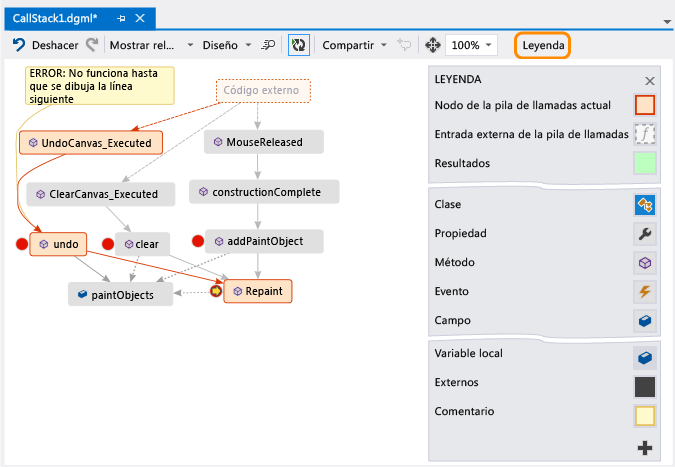

# Asignar m&#233;todos en la pila de llamadas durante la depuraci&#243;n en Visual Studio
[!INCLUDE[vs2017banner](../code-quality/includes/vs2017banner.md)]

Cree un mapa de código para hacer un seguimiento visual de la pila de llamadas durante la depuración.  Puede hacer anotaciones en el mapa para llevar a cabo el seguimiento de lo que hace el código y poder concentrarse en encontrar errores.  
  
   
  
 Necesitará:  
  
-   [Visual Studio Enterprise](https://www.visualstudio.com/downloads/download-visual-studio-vs)  
  
-   Código que pueda depurar, por ejemplo, Visual C\# .NET, Visual Basic .NET, C\+\+, JavaScript o X\+\+.  
  
 Vea el [vídeo de Channel 9 sobre cómo depurar visualmente con la integración del depurador del mapa de código](http://go.microsoft.com/fwlink/?LinkId=293418) • [Asignar la pila de llamadas](#MapStack) • [Hacer notas sobre el código](#MakeNotes) • [Actualizar el mapa con la siguiente pila de llamadas](#UpdateMap) • [Agregar código relacionado al mapa](#AddRelatedCode) • [Buscar errores usando el mapa](#FindBugs) • [Preguntas y respuestas](#QA)  
  
 Para obtener detalles de los comandos y las acciones que puede usar al trabajar con mapas de código, vea [Examinar y reorganizar mapas de código](../modeling/browse-and-rearrange-code-maps.md).  
  
##   Asignar la pila de llamadas  
  
1.  Inicie la depuración.  \(Teclado: **F5**\)  
  
2.  Cuando la aplicación entre en modo de interrupción o entre en una función, elija **Mapa de código**.  \(Teclado: **Ctrl** \+ **Mayús** \+ **\`**\)  
  
       
  
     La pila de llamadas actual aparece en naranja en un nuevo mapa de código:  
  
       
  
     El mapa se actualiza automáticamente a la vez que continúa depurando.  Vea [Actualizar el mapa con la siguiente pila de llamadas](#UpdateMap).  
  
##   Hacer notas sobre el código  
 Agregue comentarios para el hacer seguimiento de lo que pasa en el código.  Para agregar una nueva línea a un comentario, presione **Mayús \+ Entrar**.  
  
   
  
##   Actualizar el mapa con la siguiente pila de llamadas  
 Ejecute la aplicación hasta el siguiente punto de interrupción o entre en una función.  El mapa agrega una nueva pila de llamadas.  
  
   
  
##   Agregar código relacionado al mapa  
 Ahora ya tiene un mapa, ¿qué viene después?  Si trabaja con Visual C\# .NET o Visual Basic .NET, agregue elementos, como campos, propiedades y otros métodos, para hacer el seguimiento de lo que pasa en el código.  
  
 Haga doble clic en un método para ver su definición de código, o bien use el menú contextual para el método.  \(Teclado: seleccione el método en el mapa y presione **F12**\)  
  
   
  
 Agregue los elementos de los que desee realizar el seguimiento al mapa.  
  
   
  
> [!NOTE]
>  De forma predeterminada, al agregar elementos al mapa también se agregan nodos del grupo primario, como clase, espacio de nombres y ensamblado.  Aunque esto es útil, puede mantener la simplicidad del mapa si desactiva esta característica mediante el botón **Incluir elementos primarios** de la barra de herramientas del mapa, o bien presionando **CTRL** al agregar elementos.  
  
   
  
 Aquí puede ver fácilmente los métodos que utilizan los mismos campos.  Los elementos agregados más recientemente aparecen en verde.  
  
 Continúe con la compilación del mapa para ver más código.  
  
   
  
   
  
##   Buscar errores usando el mapa  
 La visualización del código puede ayudarle a encontrar errores con mayor rapidez.  Por ejemplo, suponga que está investigando un error en un programa de dibujo.  Cuando dibuja una línea e intenta deshacerla, no sucede nada hasta que dibuja otra línea.  
  
 Por tanto, establece los puntos de interrupción en los métodos  `clear`, `undo` y `Repaint`, inicia la depuración y compila un mapa como este:  
  
   
  
 Observe que todos los gestos de usuario en el mapa llaman a `Repaint`, salvo `undo`.  Esto podría explicar por qué `undo` no funciona inmediatamente.  
  
 Tras corregir el error y seguir ejecutando el programa, el mapa agrega la nueva llamada de `undo` a `Repaint`:  
  
   
  
##   Preguntas y respuestas  
  
-   **No todas las llamadas aparecen en el mapa.  ¿Por qué?**  
  
     De forma predeterminada, en el mapa solo se muestra su código.  Para ver el código externo, actívelo en la ventana **Pila de llamadas**:  
  
       
  
     o desactive **Habilitar Solo mi código** en las opciones de depuración de Visual Studio:  
  
       
  
-   **¿Afecta el cambio del mapa al código?**  
  
     Cambiar el mapa no afecta al código en forma alguna.  No dude en cambiar el nombre, mover o quitar contenido del mapa.  
  
-   **¿Qué significa este mensaje: “El diagrama se puede basar en una versión anterior del código”?**  
  
     El código podría haber cambiado después de la última actualización del mapa.  Por ejemplo, una llamada en el mapa tal vez ya no exista en el código.  Cierre el mensaje y, a continuación, intente volver a compilar la solución antes de actualizar el mapa de nuevo.  
  
-   **¿Cómo puedo controlar el diseño del mapa?**  
  
     Abra el menú **Diseño** de la barra de herramientas del mapa:  
  
    -   Cambie el diseño predeterminado.  
  
    -   Para que el mapa deje de reorganizarse automáticamente, desactive la opción **Diseñar automáticamente al depurar**.  
  
    -   Para reorganizar el mapa lo mínimo posible cuando se agregan elementos, desactive **Diseño incremental**.  
  
-   **¿Es posible compartir el mapa con otros usuarios?**  
  
     Puede exportar el mapa, enviarlo a otros usuarios si tiene Microsoft Outlook o guardarlo en la solución para protegerlo en el control de versiones de Team Foundation.  
  
       
  
-   **¿Cómo se detiene la agregación automática de nuevas pilas de llamadas al mapa?**  
  
     En la barra de herramientas del mapa, elija .  Para agregar manualmente la pila de llamadas actual al mapa, presione **Ctrl** \+ **Mayús** \+ **\`**.  
  
     El mapa continuará resaltando las pilas de llamadas existentes mientras se está depurando.  
  
-   **¿Qué significan los iconos y las flechas de los elementos?**  
  
     Para obtener más información sobre un elemento, mueva el puntero del mouse sobre él y examine la información sobre herramientas del elemento.  También puede ver la **Leyenda** para saber el significado de cada icono.  
  
       
  
 Vea: [Asignar la pila de llamadas](#MapStack) • [Hacer notas sobre el código](#MakeNotes) • [Actualizar el mapa con la siguiente pila de llamadas](#UpdateMap) • [Agregar código relacionado al mapa](#AddRelatedCode) • [Buscar errores usando el mapa](#FindBugs)  
  
## Vea también  
 [Asignar dependencias de sus soluciones](../modeling/map-dependencies-across-your-solutions.md)   
 [Usar mapas de código para depurar aplicaciones](../modeling/use-code-maps-to-debug-your-applications.md)   
 [Buscar posibles problemas mediante analizadores de mapas de código](../modeling/find-potential-problems-using-code-map-analyzers.md)   
 [Examinar y reorganizar mapas de código](../modeling/browse-and-rearrange-code-maps.md)