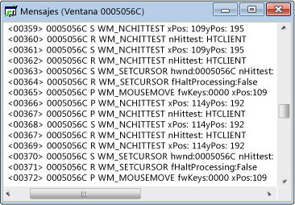

# Vista Mensajes
Cada ventana tiene una secuencia de mensajes asociada. La ventana de vista Mensajes muestra esta secuencia de mensajes. Se muestran el identificador de ventana, el código del mensaje y el mensaje. También puede crear una vista Mensajes para un subproceso o un proceso. Esto permite ver los mensajes enviados a todas las ventanas que pertenecen a un proceso o un subproceso específico, lo que es especialmente útil para capturar los mensajes de inicialización de la ventana.

 Aquí se muestra una ventana de vista Mensajes típica. Fíjese en que la primera columna contiene el identificador de ventana y la segunda contiene un código de mensaje (que se explica en [Códigos de mensaje](../debugger/message-codes.md)). Los parámetros de mensaje descodificados y los valores devueltos están a la derecha.

  Vista de mensajes de Spy++

## Procedimientos

#### Para abrir una vista Mensajes para una ventana, proceso o subproceso

1. Mueva el foco a una [vista Ventanas](../debugger/windows-view.md), [vista Procesos](../debugger/processes-view.md) o [vista Subprocesos](../debugger/threads-view.md).

2. Busque el nodo del elemento cuyos mensajes quiere examinar y selecciónelo.

3. En el menú **Spy**, seleccione **Mensajes de registro**.

     Se abre el [cuadro de diálogo Opciones de mensaje](../debugger/message-options-dialog-box.md).

4. Seleccione las opciones del mensaje que quiere mostrar.

5. Presione **Aceptar** para empezar a registrar mensajes.

     Se abre la ventana de una vista Mensajes y se agrega un menú **Mensajes** a la barra de herramientas de Spy++. En función de las opciones seleccionadas, los mensajes comienzan a transmitirse a la ventana de la vista Mensajes activa.

6. Cuando tenga suficientes mensajes, seleccione **Detener registro** en el menú **Mensajes**.

## En esta sección
 [Control de vista Mensajes](../debugger/how-to-control-messages-view.md) Explica cómo administrar la vista Mensajes.

 [Apertura de la vista Mensajes desde Buscar ventana](../debugger/how-to-open-messages-view-from-find-window.md) Explica cómo abrir la vista Mensajes desde el cuadro de diálogo Buscar ventana.

 [Búsqueda de mensajes en la vista Mensajes](../debugger/how-to-search-for-a-message-in-messages-view.md) Explica cómo buscar un mensaje concreto en la vista Mensajes.

 [Inicio y detención de la visualización del registro de mensajes](../debugger/how-to-start-and-stop-the-message-log-display.md) Explica cómo iniciar y detener el registro de mensajes.

 [Códigos de mensaje](../debugger/message-codes.md) Define los códigos de los mensajes que aparecen en la vista Mensajes.

 [Mostrar Propiedades de mensaje](../debugger/how-to-display-message-properties.md) Describe cómo mostrar más información sobre un mensaje.

## Secciones relacionadas
 [Vistas de Spy ++](../debugger/spy-increment-views.md): se explican las vistas de árbol de ventanas, mensajes, procesos y subprocesos de Spy++.

 [Usar Spy++](../debugger/using-spy-increment.md) Presenta la herramienta Spy++ y explica cómo se puede usar.

 [Cuadro de diálogo Opciones de mensaje](../debugger/message-options-dialog-box.md) Se usa para seleccionar los mensajes que se enumeran en la vista Mensajes activa.

 [Búsqueda de mensajes (cuadro de diálogo)](../debugger/message-search-dialog-box.md) Se usa para buscar el nodo de un mensaje específico en la vista Mensajes.

 [Cuadro de diálogo Propiedades del mensaje](../debugger/message-properties-dialog-box.md) Se usa para mostrar las propiedades de un mensaje seleccionado en la vista Mensajes.

 [Referencia de Spy++](../debugger/spy-increment-reference.md) Incluye secciones que describen cada menú y cuadro de diálogo de Spy++.