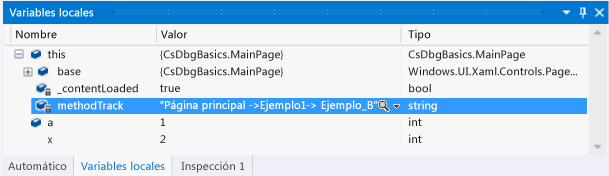
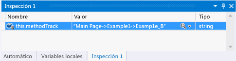
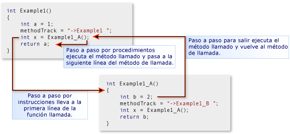
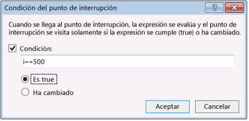
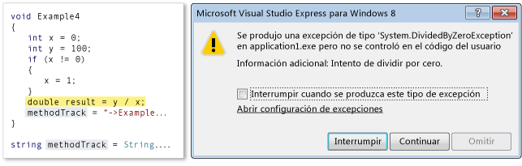
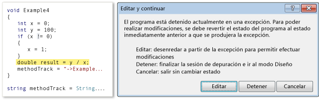
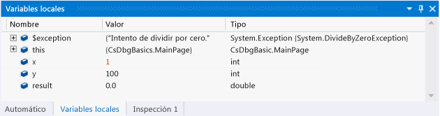

# Navegar por una sesión de depuración en Visual Studio (Xaml y C#)
En este inicio rápido se muestra cómo navegar por las sesiones de depuración de Visual Studio y cómo ver y cambiar el estado del programa en una sesión.  
  
 Está dirigido a los desarrolladores que son nuevos en la depuración con Visual Studio, así como a los desarrolladores que quieran obtener más información sobre la navegación en una sesión de depuración de Visual Studio. No enseña el arte de la depuración. Los métodos del código de ejemplo están diseñados únicamente para demostrar los procedimientos de depuración que se describen en este tema. Los métodos no emplean los procedimientos recomendados de diseño de la aplicación o de una función. De hecho, descubrirá rápidamente que los métodos y la propia aplicación no hacen mucho.  
  
 Las secciones de este inicio rápido se han diseñado para ser lo más independiente posible, por lo que puede omitir cualquier sección que incluya información que ya conoce. Tampoco necesita crear una aplicación de ejemplo; sin embargo, lo recomendamos y hemos hecho el proceso lo más sencillo posible.  
  
 **Métodos abreviados de teclado del depurador.** La navegación del depurador de Visual Studio está optimizada para el ratón y el teclado. Muchos de los pasos de este tema incluyen la tecla de aceleración o la tecla de método abreviado del teclado en un comentario entre paréntesis. Por ejemplo, (teclado: F5) indica que la tecla F5 inicia o continúa la ejecución del depurador.  
  
## En este tema  
 Aprenderá a realizar lo siguiente:  
  
-   [Crear la aplicación de ejemplo](#BKMK_CreateTheApplication)  
  
-   [Establecer y ejecutar hasta un punto de interrupción, depurar un método paso a paso por instrucciones y examinar los datos de programa](#BKMK_StepInto)  
  
-   [Ir a un método, saltarlo o salir de este](#BKMK_StepIntoOverOut)  
  
-   [Establecer un punto de interrupción condicional, ejecutar hasta el cursor y ver una variable](#BKMK_ConditionCursorVisualize)  
  
-   [Editar y continuar, recuperarse de una excepción](#BKMK_EditContinueRecoverExceptions)  
  
##   Crear la aplicación de ejemplo  
 Depuración trata del código, por lo que la aplicación de ejemplo usa el marco de trabajo de la aplicación UWP solamente para crear un archivo de código fuente en el que puede ver cómo funciona la navegación de una sesión de depuración y cómo se examina y cambia el estado del programa. A todo el código que va a invocar se le llama desde el constructor de la página principal. No se agrega ningún control ni se controla ningún evento.  
  
 **Cree una aplicación de UWP de C# de forma predeterminada.** Abra Visual Studio. En la página principal, seleccione el vínculo de **Nuevo proyecto** . En el cuadro de diálogo nuevo proyecto, elija **Visual C#** en el **instalado** lista y, a continuación, elija **universales de Windows**. En la lista de plantillas de proyecto, elija **aplicación vacía (Windows Universal)**. Visual Studio crea una solución y un proyecto nuevos. Luego, muestra el diseñador de MainPage.xaml y el editor de código XAML.  
  
 **Abra el archivo de origen MainPage.xaml.cs.** Haga clic con el botón secundario en cualquier parte del editor de XAML y seleccione **Ver código**. Aparece el archivo de código subyacente MainPage.xaml.cs. Observe que el archivo contiene un solo método, el constructor `MainPage()` .  
  
 **Reemplace el constructor MainPage con el código de ejemplo.** Elimine el método MainPage(). Siga este vínculo: [código de ejemplo de navegación (Xaml y C#) del depurador](https://github.com/MicrosoftDocs/visualstudio-docs/raw/master/docs/debugger/samples/debugger-navigation-sample-code-xaml-and-csharp.cs)y, a continuación, copie el código que aparece en la sección de C# en el Portapapeles. (Elija **volver** en el explorador o el Visor de ayuda para volver a esta página de inicio rápido.) En el editor de Visual Studio, pegue el código en el bloque `partial class MainPage`. Presione CTRL+ S para guardar el archivo.  
  
 Ahora, puede seguir los ejemplos de este tema.  
  
##   Establecer y ejecutar hasta un punto de interrupción, depurar un método paso a paso por instrucciones y examinar los datos de programa  
 La manera más común de iniciar una sesión de depuración es seleccionar **Iniciar depuración** en el menú **Depurar** (teclado: F5). La ejecución comienza y continúa hasta que se alcanza un punto de interrupción, se suspende manualmente la ejecución, se produce una excepción o la aplicación finaliza.  
  
 Cuando se suspende la ejecución en el depurador, se puede ver el valor de una variable activa en una sugerencia de datos que aparece si se mantiene el ratón sobre la variable. También puede abrir las ventanas Variables locales y Automático para ver las listas de las variables activas y sus valores actuales. Puede agregar una o más variables a una ventana Inspección para observar sus valores a medida que la aplicación continúa la ejecución.  
  
 Después de suspender la ejecución de la aplicación (lo que también se llama interrumpir en el depurador), puede controlar la manera en que se ejecuta el resto del código de programa. Puede continuar línea por línea, pasar de una llamada al método al propio método o ejecutar en un solo paso un método al que se ha llamado. Se llama a estos procedimientos al recorrer paso a paso la aplicación. También puede reanudar la ejecución estándar de la aplicación, ejecutando hasta el siguiente punto de interrupción configurado o hasta la línea en la que se ha colocado el cursor. Puede detener la sesión de depuración en cualquier momento. El depurador se ha diseñado para realizar las operaciones de limpieza necesarias y salir de la ejecución.  
  
### Ejemplo 1  
 En este ejemplo, se configura un punto de interrupción en el constructor MainPage del archivo MainPage.xaml.cs, se depura paso a paso el primer método, se consultan los valores de las variables y se detiene la depuración.  
  
 **Establezca un punto de interrupción.** Establezca un punto de interrupción en la instrucción `methodTrack = "Main Page";` del constructor MainPage. Seleccione la línea en el margen interno sombreado del editor de código fuente (teclado: sitúe el cursor en la línea y presione la tecla F9).  
  
   
  
 El icono de punto de interrupción aparece en el medianil.  
  
 **Ejecute hasta el punto de interrupción.** Inicie la sesión de depuración. Para ello, elija **Iniciar depuración** on the **Depurar** (teclado: F5).  
  
 La aplicación comienza a ejecutarse y suspende la ejecución inmediatamente antes de la instrucción donde configuró el punto de interrupción. El icono de la línea actual que aparece en el margen identifica su ubicación. La instrucción actual se resalta.  
  
   
  
 Ahora controla la ejecución de la aplicación y puede examinar el estado del programa a medida que recorre paso a paso sus instrucciones.  
  
 **Depure el método paso a paso.** On the **Depurar** , seleccione **Paso a paso por instrucciones** (teclado: F11).  
  
   
  
 Tenga en cuenta que el depurador se desplaza a la siguiente línea, que es una llamada al método Example1. Seleccione Paso a paso por instrucciones de nuevo. El depurador se mueve al punto de entrada del método Example1. Esto indica que el método se ha cargado en la pila de llamadas y se ha asignado la memoria para las variables locales.  
  
 Al depurar paso a paso por instrucciones una línea de código, el depurador realiza una de las siguientes acciones:  
  
-   Si la instrucción siguiente no es una llamada a una función de la solución, el depurador ejecuta la instrucción, pasa a la siguiente instrucción y, después, suspende la ejecución.  
  
-   Si la instrucción es una llamada a una función de la solución, el depurador se va hasta el punto de entrada de la función a la que se llamó y, luego, suspende la ejecución.  
  
 Continúe depurando Example1 paso a paso por instrucciones, hasta el punto de salida. El depurador resalta la llave de cierre del método.  
  
 **Examine los valores de las variables en las sugerencias de datos.** Al mantener el ratón sobre un nombre de variable, la sugerencia de datos muestra el nombre, el valor y el tipo de la variable.  
  
   
  
 Mantenga el ratón sobre la variable `a`. Observe su nombre, valor y tipo de datos. Mantenga el ratón sobre la variable `methodTrack`. Apunte de nuevo el nombre, el valor y el tipo de datos.  
  
 **También ahora, observa su nombre, valor y tipo de datos.** On the **Depurar** , diríjase a **Ventanas**y seleccione **Variables locales**. (Teclado: Alt+4).  
  
   
  
 La ventana Variables locales es una vista de árbol de los parámetros y las variables de la función. Las propiedades de una variable de objeto son los nodos secundarios del propio objeto. La variable `this` es un parámetro oculto en cada método de objeto que representa el propio objeto. En este caso, representa la clase MainPage. Dado que `methodTrack` es miembro de la clase MainPage, su valor y tipo de datos se muestran en una línea por debajo de `this`. Expanda el nodo `this` para ver la información de `methodTrack` .  
  
 **Agregue un observador para la variable methodTrack.** La variable `methodWatch` se usa en este inicio rápido para mostrar los métodos llamados en los ejemplos. Para que sea más fácil ver el valor de la variable, agréguela a una ventana Inspección. Haga clic con el botón secundario en el nombre de la variable y seleccione **Agregar inspección**.  
  
   
  
 Puede inspeccionar múltiples variables en una ventana Inspección. Los valores de las variables inspeccionadas, igual que los valores de las ventanas Variables locales y de sugerencias de datos, se actualizan cada vez que se suspende la ejecución. También puede agregar variables a la ventana Inspección desde el editor de código. Seleccione la variable para inspeccionar, haga clic con el botón secundario y seleccione **Agregar inspección**.  
  
##   Ir a un método, saltarlo o salir de este  
 A diferencia de la depuración paso a paso por instrucciones de un método al que llamó un método primario, la depuración paso a paso por procedimientos ejecuta el método secundario y, después, suspende la ejecución del método de llamada cuando se reanuda el primario. Podrá depurar paso a paso por procedimientos un método si sabe bien cómo opera y está seguro de que el problema que investiga no está relacionado con su ejecución.  
  
 Cuando se usa la depuración paso a paso por procedimientos en una línea de código que no contiene una llamada a un método, esa línea se ejecuta de igual manera que con la depuración paso a paso por instrucciones.  
  
 Al depurar un método secundario paso a paso hasta salir, continúa su ejecución. Después, se suspende cuando el método vuelve a su método de llamada. Puede ser conveniente depurar una función larga paso a paso hasta salir si ha determinado que el resto de la función no es significativo.  
  
 La función se ejecuta cuando se depura paso a paso tanto por procedimientos como hasta salir.  
  
   
  
### Ejemplo 2  
 En este ejemplo, se depuran métodos paso a paso por instrucciones y por procedimientos, y hasta salir.  
  
 **Llame al método Example2 del constructor MainPage.** Edite el constructor MainPage y reemplace la línea que aparece después de `methodTrack = String.Empty;` con `Example2();`.  
  
   
  
 **Ejecute hasta el punto de interrupción.** Inicie la sesión de depuración. Para ello, elija **Iniciar depuración** on the **Depurar** (teclado: F5). El depurador suspende la ejecución en el punto de interrupción.  
  
 **Depure la línea de código paso a paso por procedimientos.** En el cuadro de diálogo **Depurar** , seleccione **Paso a paso por procedimientos** (teclado: F10). El depurador ejecuta la instrucción `methodTrack = "MainPage";` de la misma manera que si se depurase paso a paso por instrucciones.  
  
 **Depure paso a paso por instrucciones Example2 y Example2_A.** Presione la tecla F11 para depurar paso a paso por instrucciones el método Example2. Siga depurando paso a paso las instrucciones de Example2 hasta llegar a la línea `int x = Example2_A();`. De nuevo, depure paso a paso por instrucciones esta línea hasta alcanzar el punto de entrada de Example2_A. Continúe la depuración paso a paso por instrucciones en cada instrucción de Ejemplo2_A hasta volver a Ejemplo2.  
  
   
  
 **epure una función paso a paso por procedimientos.** Observe que la línea siguiente de Example2, `int y = Example2_A();` , es básicamente igual que la anterior. Puede depurarla paso a paso por procedimientos sin ningún problema. Presione la tecla F10 para pasar de la reanudación de Example2 a esta segunda llamada a Example2_A. Presione F10 para depurar este método paso a paso por procedimientos. Observe que la cadena `methodTrack` indica que el método Example2_A se ejecuta dos veces. También observará que el depurador pasa inmediatamente a la línea siguiente. No suspende la ejecución en el punto donde se reanuda Example2.  
  
 **Depure una función paso a paso hasta salir.** Presione la tecla F11 para depurar paso a paso por instrucciones el método Example2_B. Observe que Example2_B no es muy diferente de Example2_A. Para salir del método, seleccione **Paso a paso para salir** en el menú **Depurar** (teclado: Mayús + F11). Observe que la variable `methodTrack` indica que Example2_B se ha ejecutado y que el depurador ha regresado al punto donde se reanuda Example2.  
  
 **Detenga la depuración.** En el menú Depurar, seleccione Detener depuración (teclado: Mayús + F5). Esto finaliza la sesión de depuración.  
  
##   Establecer un punto de interrupción condicional, ejecutar hasta el cursor y ver una variable  
 Un punto de interrupción condicional especifica una condición que hace que el depurador suspenda la ejecución. La condición se especifica mediante cualquier expresión de código que se pueda evaluar como verdadera o falsa. Por ejemplo, en un método al que se llama a menudo, podría usar un punto de interrupción condicional para que el estado del programa se examine solamente cuando una variable alcance un valor determinado.  
  
 Ejecutar hasta el cursor es igual que establecer un punto de interrupción único. Cuando se suspende la ejecución, puede seleccionar una línea de código fuente y reanudar la ejecución hasta la línea seleccionada. Por ejemplo, mientras recorre paso a paso un bucle de un método, podría determinar que el código del bucle funciona correctamente. En lugar de recorrer todas las iteraciones del bucle, puede ejecutar hasta el cursor colocado que está después de la ejecución del bucle.  
  
 A veces, es difícil ver el valor de una variable en la fila de una sugerencia de datos o en una ventana de variables. El depurador puede mostrar cadenas, HTML y XML en un visualizador de texto que presenta una vista con formato del valor en una ventana desplazable.  
  
### Ejemplo 3  
 En este ejemplo, se establece un punto de interrupción condicional para interrumpir la ejecución en una iteración concreta de un bucle y, después, se ejecuta hasta el cursor situado después del bucle. También se ve el valor de una variable en un visualizador de texto.  
  
 **Llame al método Example3 del constructor MainPage.** Edite el constructor MainPage y reemplace la línea que aparece después de `methodTrack = String.Empty;` con la línea `Example3();`.  
  
   
  
 **Ejecute hasta el punto de interrupción.** Inicie la sesión de depuración. Para ello, elija **Iniciar depuración** en el menú **Depurar** (teclado: F5). El depurador suspende la ejecución en el punto de interrupción del método MainPage.  
  
 **Depure paso a paso por instrucciones el método Example3.** Seleccione **Paso a paso por instrucciones** en el menú **Depurar** (teclado: F11) hasta alcanzar el punto de entrada del método Example3. Siga depurando el método paso a paso por instrucciones hasta que haya recorrudo en iteración uno o dos bucles del bloque `for` . Tenga en cuenta que se tardaría demasiado tiempo en recorrer paso a paso las 1000 iteraciones.  
  
 **Establezca un punto de interrupción condicional.** En el margen interno izquierdo de la ventana de código, haga clic con el botón secundario en la línea `x += i;` y seleccione **Condición**. Active la casilla **Condición** y escriba `i == 500;` en el cuadro de texto. Seleccione la opción **Es true** y seleccione **Aceptar**. El punto de interrupción permite comprobar el valor en la iteración número 500 del bucle `for` .  
  
   
  
 El aspa blanca le permite distinguir el icono de un punto de interrupción condicional.  
  
   
  
 **Ejecute hasta el punto de interrupción.** En el menú Depurar, seleccione Continuar (teclado: F5). En la ventana Variables locales, confirme que el valor actual de `i` es 500. Observe que la variable `s` está representada como una línea y es mucho más larga que la ventana.  
  
 **Muestre una variable de cadena.** Haga clic en el icono de lupa en la columna de **Valor** de `s`.  
  
 Aparece la ventana del visualizador de texto. El valor de la cadena se muestra como una cadena de varias líneas.  
  
 **Ejecute hasta el cursor.** Haga clic con el botón derecho en la línea `methodTrack += "->Example3";` y seleccione **Ejecutar hasta el Cursor** (teclado: lleve el cursor a la línea; Ctrl + F10). El depurador completa las iteraciones del bucle y, después, suspende la ejecución en la línea.  
  
 **Detenga la depuración.** En el menú Depurar, seleccione Detener depuración (teclado: Mayús + F5). Esto finaliza la sesión de depuración.  
  
##   Editar y continuar, recuperarse de una excepción  
 En algunas circunstancias, cuando se interrumpe el código del Depurador de Visual Studio, tiene la oportunidad de cambiar el valor de las variables e incluso la lógica de las instrucciones. Esta funcionalidad se denomina editar y continuar.  
  
 Editar y continuar puede resultar especialmente útil cuando se interrumpe en una excepción. En lugar de tener que detener y reiniciar la depuración de un procedimiento largo e intrincado para evitar la excepción, puede "rebobinar" la excepción para desplazar la ejecución hasta el punto inmediatamente anterior al lugar donde se produjo la excepción y, después, cambiar la variable o la instrucción que genera el error y continuar con la sesión de depuración actual en un estado que no produzca una excepción.  
  
 Aunque puedes usar editar y continuar en escenarios muy variados, resulta complicado especificar las condiciones concretas que no admiten esta funcionalidad, porque dependen del lenguaje de programación, del estado actual de la pila de programas, y de la capacidad de cambiar el estado sin dañar el proceso. La mejor manera de determinar si se admite un cambio de edición es intentarlo, sin más. El depurador te hará saber inmediatamente si el cambio no se admite.  
  
### Ejemplo 4  
 En este ejemplo, ejecutará el depurador hasta una excepción, rebobinará la excepción, corregirá la lógica del método y, después, cambiará el valor de una variable para poder seguir ejecutando el método.  
  
 **Llame al método Example4 del constructor MainPage.** Edite el constructor MainPage() y reemplace la línea que aparece después de `methodTrack = String.Empty;` con la línea `Example4();`.  
  
   
  
 **Ejecute hasta la excepción.** Inicie la sesión de depuración. Para ello, elija **Iniciar depuración** en el menú **Depurar** (teclado: F5). Presione F5 de nuevo para reanudar la ejecución. El depurador suspende la ejecución en la excepción del método Example4 y muestra un cuadro de diálogo de excepción.  
  
   
  
 **Cambie la lógica del programa.** Es evidente que el error está en la condición `if` : el valor de `x` deberá cambiarse cuando `x` sea igual a 0; no cuando `x` sea distinto de cero. Seleccione **Interrumpir** para corregir la lógica del método. Cuando intente editar la línea, aparecerá otro cuadro de diálogo.  
  
   
  
 Seleccione **Editar** y cambie la línea `if (x != 0)` por `if (x == 0)`. El depurador conserva en el archivo de origen los cambios que se hacen en la lógica del programa.  
  
 **Cambie el valor de la variable.** Examine el valor de `x` en una sugerencia de datos o en la ventana Variables locales. Sigue siendo 0 (cero). Si intenta ejecutar la instrucción que produjo la excepción original, lo único que conseguirá es que se produzca otra vez. Puede cambiar el valor de `x`. En la ventana Variables locales, haga doble clic en la columna **Valor** de la fila **x** . Cambie el valor 0 por 1.  
  
   
  
 Presione la tecla F11 para depurar paso a paso la instrucción que antes produjo una excepción. Observe que la línea se ejecuta sin errores. Presione F11 otra vez.  
  
 **Detenga la depuración.** On the **Depurar** , seleccione **Detener depuración** (teclado: Mayús + F5). Esto finaliza la sesión de depuración.  
  
## Vea también  
 [Inicie una sesión de depuración (VB, C#, C++ y XAML)](../debugger/start-a-debugging-session-for-a-store-app-in-visual-studio-vb-csharp-cpp-and-xaml.md)   
 [Desencadenar suspender, reanudar y eventos para aplicaciones UWP en segundo plano)](../debugger/how-to-trigger-suspend-resume-and-background-events-for-windows-store-apps-in-visual-studio.md)   
 [Depurar aplicaciones en Visual Studio](../debugger/debug-store-apps-in-visual-studio.md)