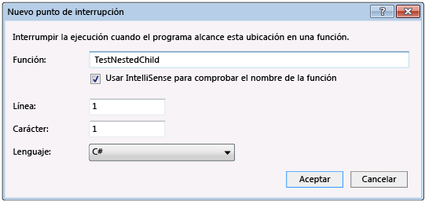
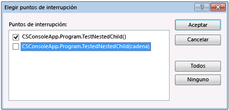

# <a name="navigate-through-code-with-the-visual-studio-debugger"></a>Navegar por el código con el depurador de Visual Studio

El depurador de Visual Studio puede ayudarle a navegar por el código para inspeccionar el estado de una aplicación y mostrar su flujo de ejecución. Puede usar métodos abreviados de teclado, comandos de depuración, los puntos de interrupción y otras características para ponerse rápidamente al código que desea examinar. Familiaridad con los comandos de navegación del depurador y los métodos abreviados de hace más rápidas y fáciles de encontrar y solucionar problemas en aplicaciones.  Si se trata de la primera vez que ha probado para depurar el código, es posible que desea leer [de depuración para principiantes absolutos](../debugger/debugging-absolute-beginners.md) y [herramientas y técnicas de depuración](../debugger/write-better-code-with-visual-studio.md) antes de pasar a través de este artículo.

## <a name="basic-debugging"></a>Depuración básica

Para iniciar la aplicación con el depurador adjunto, presione **F5**, seleccione **depurar** > **Iniciar depuración**, o seleccione la flecha verde en la barra de herramientas de Visual Studio.

 

Durante la depuración, resaltado amarillo que muestra la línea de código que se ejecutará la siguiente.

 

Más del depurador de windows, como el **módulos** y **inspección** windows, solo están disponibles mientras se ejecuta el depurador. Algunas características del depurador, por ejemplo, ver los valores de variable en el **variables locales** ventana o evaluación de expresiones en el **inspección** ventana, están disponibles sólo mientras el depurador está en pausa en un punto de interrupción, también denominado *modo de interrupción*.

En modo de interrupción, se suspende la ejecución de la aplicación mientras las funciones, variables, y los objetos permanecen en memoria. Puede examinar las posiciones de los elementos y Estados para buscar infracciones o errores. Para algunos tipos de proyecto, también puede realizar ajustes en la aplicación en modo de interrupción. Para ver un vídeo que muestra estas características, consulte [introducción con el depurador](https://www.youtube.com/watch?v=FtGCi5j30YU&list=PLReL099Y5nRfw6VNvzMkv0sabT2crbSpK&index=6).

Si se interrumpe en el código que no tiene código fuente o al símbolo (*.pdb*) los archivos cargados, el depurador muestra una **archivos de origen no encontrado** o **no se encontraron símbolos** página que puede ayudarle a Buscar y cargar los archivos. Consulte [Specify symbol (.pdb) and source files](../debugger/specify-symbol-dot-pdb-and-source-files-in-the-visual-studio-debugger.md) (Especificación de símbolo (.pdb) y archivos de origen). Si no se puede cargar los archivos de origen o de símbolos, aún puede depurar las instrucciones de ensamblado en el **desensamblado** ventana.

No siempre tienes que iniciar la depuración a partir de una aplicación al principio. También puede presionar **F11** a [ir a código](#BKMK_Step_into__over__or_out_of_the_code), presione **F10** a [paso a través de código](#BKMK_Step_over_Step_out), o [ejecutar en una ubicación específica o función](#BKMK_Break_into_code_by_using_breakpoints_or_Break_All).

##  <a name="step-through-code"></a>Examinar el código

Los comandos de paso del depurador le permiten inspeccionar el estado de la aplicación o buscar más información acerca de su flujo de ejecución.

Si necesita buscar el punto de entrada en la aplicación, comience con **F10** o **F11**.

### <a name="BKMK_Step_into__over__or_out_of_the_code"></a> Ir al código línea por línea

Para detener en cada línea del código o la instrucción durante la depuración, utilice **depurar** > **paso a paso**, o bien presione **F11**.

El depurador pasa a través de instrucciones de código, las líneas no físicas. Por ejemplo, una cláusula `if` se puede escribir en una línea:

  ```csharp
  int x = 42;
  string s = "Not answered";
  if( int x == 42) s = "Answered!";
  ```

  ```vb
  Dim x As Integer = 42
  Dim s As String = "Not answered"
  If x = 42 Then s = "Answered!"
  ```

Sin embargo, cuando entre en esta línea, el depurador trata la condición como un paso y el resultado como otro. En el ejemplo anterior, la condición es true.

En una llamada a una función anidada, **Paso a paso por instrucciones** llega hasta la función más profundamente anidada. Por ejemplo, si usa **paso a paso** en una llamada como `Func1(Func2())`, el depurador ejecuta paso a paso la función `Func2`.

>[!TIP]
>Cuando se ejecuta cada línea de código, puede mantener el puntero sobre las variables para ver sus valores o usar el [variables locales](autos-and-locals-windows.md) y [inspección](watch-and-quickwatch-windows.md) windows para ver los valores que cambia. Visualmente también permite realizar el seguimiento de la pila de llamadas durante la ejecución paso a paso en funciones. Consulte [asignar métodos en la pila de llamadas durante la depuración](../debugger/map-methods-on-the-call-stack-while-debugging-in-visual-studio.md).

###  <a name="BKMK_Step_over_Step_out"></a> Recorrer el código y omitir algunas funciones

No es posible que preocupe una función mientras se depura o sabe funciona, como código de biblioteca totalmente probado. Puede usar los siguientes comandos para omitir a través del código. Seguir ejecutan las funciones, pero el depurador omite sobre ellos.

|Comando de teclado|Comando del menú Depurar|Descripción|
|----------------------|------------------|-----------------|
|**F10**|**Paso a paso por procedimientos**|Si la línea actual contiene una llamada de función, **saltar** ejecuta el código y, después, suspende la ejecución en la primera línea de código después de la función llamada.|
|**Mayús**+**F11**|**Paso a paso para salir**|**Paso a paso fuera** continúa la ejecución de código y suspende la ejecución cuando se devuelve la función actual. El depurador se salta a través de la función actual.|

##  <a name="BKMK_Break_into_code_by_using_breakpoints_or_Break_All"></a> Ejecutar hasta una ubicación específica o función

Prefiere ejecutar directamente a una ubicación específica o una función cuando se sabe exactamente qué código que desea inspeccionar o se sabe dónde desea iniciar la depuración.

### <a name="run-to-a-breakpoint-in-code"></a>Ejecutar un punto de interrupción en código

Para establecer un punto de interrupción simple en el código, haga clic en el margen izquierdo junto a la línea de código donde desea suspender la ejecución. También puede seleccionar la línea y presione **F9**, seleccione **depurar** > **Alternar puntos de interrupción**, o haga clic en y seleccione **delpuntodeinterrupción**  >  **Insertar punto de interrupción**. El punto de interrupción aparece como un punto rojo en el margen izquierdo junto a la línea de código. El depurador suspende la ejecución antes de la línea se ejecuta.


Los puntos de interrupción proporcionan un amplio conjunto de funcionalidades adicionales en Visual Studio, como los puntos de interrupción condicionales y de seguimiento. Para obtener más información, consulte [usar puntos de interrupción](../debugger/using-breakpoints.md).

### <a name="run-to-a-function-breakpoint"></a>Ejecutar hasta un punto de interrupción de función

Puede indicar al depurador ejecutar hasta que llega a una función especificada. Puede especificar la función por su nombre o elegirla en la pila de llamadas.

**Para especificar un punto de interrupción de función por su nombre**

1. Seleccione **depurar** > **nuevo punto de interrupción** > **interrupción de función**

1. En el **nuevo punto de interrupción de función** cuadro de diálogo, escriba el nombre de la función y seleccione su idioma.

   

1. Seleccione **Aceptar**.

Si la función está sobrecargada o en más de un espacio de nombres, puede elegir lo que desee en el **puntos de interrupción** ventana.



**Para seleccionar un punto de interrupción de función de la pila de llamadas**

1. Durante la depuración, abra el **pila de llamadas** ventana seleccionando **depurar** > **Windows** > **pila de llamadas**.

1. En el **pila de llamadas** ventana, haga clic en una función y seleccione **ejecutar hasta el Cursor**, o bien presione **Ctrl**+**F10**.

Para realizar un seguimiento la pila de llamadas, vea [asignar métodos en la pila de llamadas durante la depuración](../debugger/map-methods-on-the-call-stack-while-debugging-in-visual-studio.md).

### <a name="run-to-a-cursor-location"></a>Ejecutar hasta una ubicación del cursor

Para ejecutar hasta la ubicación del cursor, en el código fuente o el **pila de llamadas** ventana, seleccione la línea que desea interrumpir la ejecución, haga clic en y seleccione **ejecutar hasta el Cursor**, o bien presione **Ctrl** + **F10**. Seleccionar **ejecutar hasta el Cursor** es igual que establecer un punto de interrupción temporal.

### <a name="run-to-click"></a>Icono para ejecutar hasta la línea

Mientras está en pausa en el depurador, puede desplazar el puntero sobre una instrucción en el código fuente o el **desensamblado** ventana y seleccione el **ejecutar hasta aquí** icono de flecha verde. Uso de **hacer clic y ejecutar** elimina la necesidad de establecer un punto de interrupción temporal.


> [!NOTE]
> **Hacer clic y ejecutar** está disponible a partir de [!include[vs_dev15](../misc/includes/vs_dev15_md.md)].

### <a name="manually-break-into-code"></a>Interrumpir el código manualmente

Para interrumpir en la siguiente línea de código en una aplicación en ejecución disponible, seleccione **depurar** > **interrumpir todos**, o bien presione **Ctrl**+**Alt**  + **Interrumpir**.

##  <a name="BKMK_Set_the_next_statement_to_execute"></a> Mueva el puntero para cambiar el flujo de ejecución

Cuando el depurador está pausado, una flecha amarilla en el margen del código fuente o **desensamblado** ventana marca la ubicación de la siguiente instrucción que se ejecutará. Puede cambiar la siguiente instrucción para ejecutar moviendo esta flecha. Puede saltarse una parte del código o volver a una línea anterior. Mover el puntero es útil en situaciones como la omisión de una sección de código que contiene un error conocido.

 

Para cambiar la siguiente instrucción para ejecutar, el depurador debe estar en modo de interrupción. En el código fuente o **desensamblado** ventana, arrastre la flecha amarilla hasta una línea diferente, o haga clic en la línea que desea ejecutar a continuación y seleccione **Establecer instrucción siguiente**.

El contador del programa salta directamente a la nueva ubicación e instrucciones entre la ejecución antigua y nueva puntos no se ejecutan. Sin embargo, si mueve el punto de ejecución con las versiones anteriores, las instrucciones intermedias no deshacer.

>[!CAUTION]
>- Al mover la instrucción siguiente a otro ámbito o función normalmente se producen daños en la pila de llamadas y un error o excepción en tiempo de ejecución. Si intenta mover la instrucción siguiente a otro ámbito, el depurador abre un cuadro de diálogo con una advertencia que le ofrece la oportunidad de cancelar la operación.
>- En Visual Basic, no puede mover la instrucción siguiente a otro ámbito o función.
>- En C++ nativo, si ha habilitado comprobaciones en tiempo de ejecución, al establecer la instrucción siguiente se puede producir una excepción cuando la ejecución llegue al final del método.
>- Cuando la opción Editar y continuar está habilitada, **Establecer instrucción siguiente** genera un error si se han realizado modificaciones que Editar y continuar no puede reasignar inmediatamente. Esto puede suceder, por ejemplo, si se ha editado código en un bloque catch. Cuando esto sucede, un mensaje de error indica que no se admite la operación.
>- En código administrado, no se puede mover la instrucción next si:
>   - La instrucción siguiente está en un método diferente de la instrucción actual.
>   - Se inició la depuración Just-In-Time mediante la depuración.
>   - Un desenredo de pila de llamadas está en curso.
>   - Se ha producido una excepción System.StackOverflowException o System.Threading.ThreadAbortException.

## <a name="BKMK_Restrict_stepping_to_Just_My_Code"></a>Depurar código de no usuario

De forma predeterminada, el depurador intenta depurar el código de la aplicación al habilitar una configuración denominada *solo mi código*. Para obtener más información acerca de cómo funciona esta característica para diferentes tipos de proyectos y lenguajes, y cómo se puede personalizar, consulte [solo mi código](../debugger/just-my-code.md).

Para ver el código de framework, código de la biblioteca de terceros o las llamadas del sistema durante la depuración, puede deshabilitar solo mi código. En **herramientas** (o **depurar**) > **opciones** > **depuración**, desactive la **habilitar solo mi código** casilla de verificación. Cuando se deshabilita solo mi código, código de usuario no aparece en las ventanas del depurador y el depurador puede ir al código que no es de usuario.

> [!NOTE]
> Sólo mi código no se admite para los proyectos de dispositivos.

### <a name="debug-system-code"></a>Depurar el código del sistema

Si se han cargado símbolos de depuración para el código del sistema de Microsoft y deshabilitar solo mi código, puede entrar en una llamada del sistema se puede hacer cualquier otra llamada.

Para cargar símbolos de Microsoft, vea [configurar ubicaciones de símbolos y las opciones de carga](specify-symbol-dot-pdb-and-source-files-in-the-visual-studio-debugger.md#configure-symbol-locations-and-loading-options).

**Para cargar los símbolos para un componente específico del sistema:**

1. Durante la depuración, abra el **módulos** ventana seleccionando **depurar** > **Windows** > **módulos**, o presionando **Ctrl**+**Alt**+**U**.

1. En el **módulos** ventana, puede saber qué módulos tienen símbolos cargados en el **estado del símbolo** columna. Haga clic en el módulo que desea cargar los símbolos para y seleccione **cargar símbolos**.

##  <a name="BKMK_Step_into_properties_and_operators_in_managed_code"></a> Ir a propiedades y operadores en código administrado
 El depurador se salta las propiedades y los operadores en código administrado de forma predeterminada. En la mayoría de los casos, esto proporciona una mejor experiencia de depuración. Para habilitar la ejecución paso a paso en las propiedades o los operadores, elija **depurar** > **opciones**. En la página **Depuración** > **General**, desactive la casilla **Saltar propiedades y operadores (solo administrado)**.

## <a name="see-also"></a>Vea también
- [¿Qué es la depuración?](../debugger/what-is-debugging.md)
- [Herramientas y técnicas de depuración](../debugger/write-better-code-with-visual-studio.md)
- [Primer vistazo a la depuración](../debugger/debugger-feature-tour.md)
