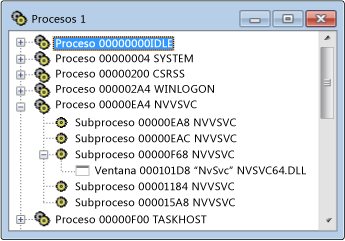

# Vista Procesos
La vista Procesos muestra un árbol de todos los procesos activos en el sistema. Se muestran el identificador del proceso y el nombre del módulo. Use la vista Procesos si quiere examinar un determinado proceso del sistema, que normalmente corresponde a un programa en ejecución. Los procesos se identifican por nombres de módulo o se designan como "procesos del sistema".

 Microsoft Windows admite varios procesos. Cada proceso puede tener uno o más subprocesos, y cada subproceso puede tener una o varias ventanas de nivel superior asociadas. Cada ventana de nivel superior puede poseer una serie de ventanas. Un símbolo + indica que un nivel está contraído. La vista contraída se compone de una línea por proceso. Haga clic en el símbolo + para expandir el nivel.

 Use la vista Procesos si quiere examinar un determinado proceso del sistema, que normalmente corresponde a un programa en ejecución. Los procesos se identifican por nombres de módulo o se designan como "procesos del sistema". Para buscar un proceso, contraiga el árbol y busque en la lista.

## Procedimientos

#### Para abrir la vista Procesos

1. En el menú **Spy**, seleccione **Procesos**.

    Vista de procesos de Spy++

   En la ilustración anterior se muestra la vista Procesos con los nodos de proceso y subproceso expandidos.

### En esta sección
 [Búsqueda de un proceso en la vista Procesos](../debugger/how-to-search-for-a-process-in-processes-view.md): se explica cómo buscar un proceso específico en la vista Procesos.

 [Mostrar propiedades del proceso](../debugger/how-to-display-process-properties.md): se explica cómo mostrar más información sobre un mensaje.

### Secciones relacionadas
 [Vistas de Spy ++](../debugger/spy-increment-views.md): se explican las vistas de árbol de ventanas, mensajes, procesos y subprocesos de Spy++.

 [Uso de Spy++](../debugger/using-spy-increment.md): se presenta la herramienta Spy++ y se explica cómo se puede usar.

 [Cuadro de diálogo Buscar proceso](../debugger/process-search-dialog-box.md): se usa para buscar el nodo de un proceso específico en la vista Procesos.

 [Cuadro de diálogo Propiedades del proceso](../debugger/process-properties-dialog-box.md): muestra las propiedades de un proceso seleccionado en la vista Procesos.

 [Referencia de Spy++](../debugger/spy-increment-reference.md): incluye secciones que describen cada menú y cuadro de diálogo de Spy++.