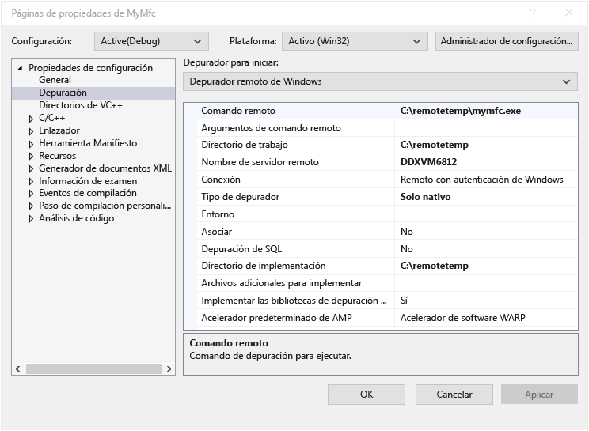
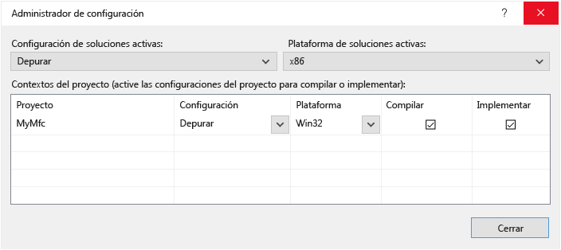

# Depuración remota C++ de un proyecto en Visual Studio
Para depurar una aplicación de Visual Studio en otro equipo, instale y ejecute las herramientas remotas en el equipo donde va a implementar la aplicación, configure el proyecto para que se conecte al equipo remoto desde Visual Studio y, a continuación, implemente y ejecute la aplicación.

Para obtener información sobre la depuración remota de aplicaciones universales de Windows (UWP), consulte [depurar un paquete de aplicaciones instalado](debug-installed-app-package.md).

## Requisitos

El depurador remoto se admite en Windows 7 y versiones más recientes (no en teléfono) y versiones de Windows Server a partir de Windows Server 2008 Service Pack 2. Para obtener una lista completa de los requisitos, consulte [requisitos](../debugger/remote-debugging.md#requirements_msvsmon).

> [!NOTE]
> No se admite la depuración entre dos equipos conectados a través de un proxy. No se recomienda la depuración a través de una conexión de alta latencia o de ancho de banda bajo, como acceso telefónico a Internet o a través de Internet a través de países, y puede producir un error o ser inaceptablemente lento.

## Descarga e instalación de las herramientas remotas

[!INCLUDE [remote-debugger-download](../debugger/includes/remote-debugger-download.md)]

> [!TIP]
> En algunos escenarios, puede ser más eficaz ejecutar el depurador remoto desde un recurso compartido de archivos. Para obtener más información, vea [ejecutar el depurador remoto desde un recurso compartido de archivos](../debugger/remote-debugging.md#fileshare_msvsmon).

##  Establecimiento del depurador remoto

[!INCLUDE [remote-debugger-configuration](../debugger/includes/remote-debugger-configuration.md)]

> [!NOTE]
> Si necesita agregar permisos para usuarios adicionales, cambie el modo de autenticación o el número de puerto para el depurador remoto, vea [configurar el depurador remoto](../debugger/remote-debugging.md#configure_msvsmon).

## Depuración C++ remota de un proyecto
 En el procedimiento siguiente, el nombre y la ruta de acceso del proyecto es C:\remotetemp\MyMfc y el nombre del equipo remoto es **MJO-DL**.

1. Cree una aplicación MFC denominada **mymfc**.

2. Establezca un punto de interrupción en alguna parte de la aplicación que esté fácilmente accesible como, por ejemplo, en **MainFrm.cpp**, al principio de `CMainFrame::OnCreate`.

3. En Explorador de soluciones, haga clic con el botón derecho en el proyecto y seleccione **propiedades**. Abra la pestaña **Depuración**.

4. Establezca el **Depurador para iniciar** en **Depurador remoto de Windows**.

    

5. Realice los siguientes cambios de las propiedades:

   |Configuración|Value|
   |-|-|
   |Comando remoto|C:\remotetemp\mymfc.exe|
   |Directorio de trabajo|C:\remotetemp|
   |Nombre de servidor remoto|MJO-DL:*portnumber*|
   |Conexión|Remoto con autenticación de Windows|
   |Tipo de depurador|Solo nativo|
   |Directorio de implementación|C:\remotetemp.|
   |Archivos adicionales para implementar|C:\data\mymfcdata.txt.|

    Si implementa archivos adicionales (opcional), la carpeta debe existir en ambos equipos.

6. En Explorador de soluciones, haga clic con el botón secundario en la solución y elija **Configuration Manager**.

7. Para la configuración de **Depurar**, active la casilla **Implementar**.

    

8. Inicie la depuración (**Depurar > Iniciar depuración** o presione **F5**).

9. El archivo ejecutable se implementa automáticamente en el equipo remoto.

10. Si se le solicita, escriba las credenciales de red para conectarse a la máquina remota.

     Las credenciales necesarias son específicas de la configuración de seguridad de la red. Por ejemplo, en un equipo de dominio, puede elegir un certificado de seguridad o escribir su nombre de dominio y contraseña. En una máquina que no es de dominio, puede escribir el nombre del equipo y un nombre de cuenta de usuario válido, como <strong>MJO-DL\name@something.com</strong>, junto con la contraseña correcta.

11. En el equipo de Visual Studio, verá que la ejecución se detiene en el punto de interrupción.

    > [!TIP]
    > De manera alternativa, puede implementar los archivos como un paso independiente. En el **Explorador de soluciones**, haga clic con el botón derecho en el nodo **mymfc** y después elija **Implementar**.

    Si tiene archivos que no son de código requeridos por la aplicación, puede especificarlos en **archivos adicionales para implementarlos** en la página del **Depurador remoto de Windows** .

    Como alternativa, puede incluir los archivos en el proyecto y establecer la propiedad de **contenido** en **sí** en la página de **propiedades** de cada archivo. Estos archivos se copian en el **Directorio de implementación** especificado en la página del **Depurador remoto de Windows** . También puede cambiar el **tipo de elemento** a **copiar archivo** y especificar otras propiedades si necesita que los archivos se copien en una subcarpeta del **Directorio de implementación**.

## Configurar la depuración con símbolos remotos

[!INCLUDE [remote-debugger-symbols](../debugger/includes/remote-debugger-symbols.md)]

## Consulte también
- [Depurar en Visual Studio](../debugger/index.yml)
- [Primer vistazo al depurador](../debugger/debugger-feature-tour.md)
- [Configurar el Firewall de Windows para la depuración remota](../debugger/configure-the-windows-firewall-for-remote-debugging.md)
- [Asignaciones de puerto del depurador remoto](../debugger/remote-debugger-port-assignments.md)
- [Depuración remota de ASP.NET en un equipo remoto de IIS](../debugger/remote-debugging-aspnet-on-a-remote-iis-computer.md)
- [Errores de la depuración remota y sus soluciones](../debugger/remote-debugging-errors-and-troubleshooting.md)