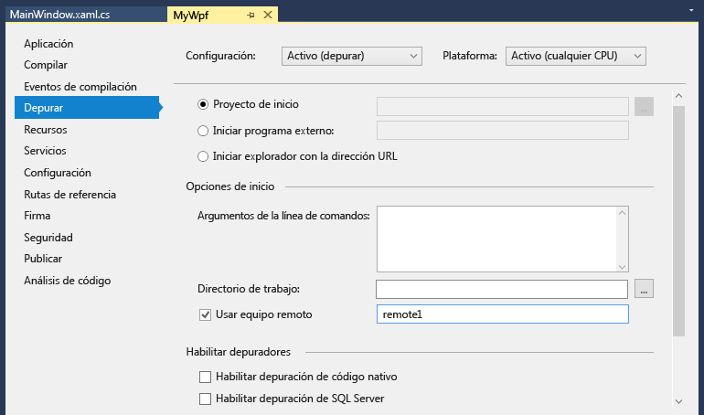

# Depuración remota de un proyecto C# o Visual Basic en Visual Studio
Para depurar una aplicación de Visual Studio que se ha implementado en un equipo diferente, instalar y ejecutar las herramientas remotas en el equipo donde ha implementado la aplicación, configurar el proyecto para conectarse al equipo remoto desde Visual Studio y, a continuación, ejecute la aplicación.

Para obtener información acerca de las aplicaciones universales de Windows (UWP) de depuración remota, vea [depurar un paquete de aplicaciones instalado](debug-installed-app-package.md).

## Requisitos

El depurador remoto es compatible con Windows 7 y versiones más recientes (no de teléfono) y las versiones de Windows Server a partir de Windows Server 2008 Service Pack 2. Para obtener una lista completa de requisitos, consulte [requisitos](../debugger/remote-debugging.md#requirements_msvsmon).

> [!NOTE]
> No se admite la depuración entre dos equipos conectados a través de un servidor proxy. Depuración mediante una conexión de ancho de banda bajo, por ejemplo, acceso telefónico a Internet, o una latencia alta o a través de Internet entre países no se recomienda y puede ser un error o inaceptablemente bajo.

## Descarga e instalación de las herramientas remotas

[!INCLUDE [remote-debugger-download](../debugger/includes/remote-debugger-download.md)]

> [!TIP]
> En algunos escenarios, puede ser más eficaz para ejecutar al depurador remoto desde un recurso compartido de archivos. Para obtener más información, consulte [ejecutar el depurador remoto desde un recurso compartido de archivos](../debugger/remote-debugging.md#fileshare_msvsmon).

##  Establecimiento del depurador remoto

[!INCLUDE [remote-debugger-configuration](../debugger/includes/remote-debugger-configuration.md)]

> [!NOTE]
> Si necesita agregar permisos para usuarios adicionales, cambiar el modo de autenticación, o número de puerto para el depurador remoto, consulte [configurar el depurador remoto](../debugger/remote-debugging.md#configure_msvsmon).

##  El proyecto de depuración remota
El depurador no puede implementar aplicaciones de escritorio de Visual C# o Visual Basic en un equipo remoto, pero se pueden depurar de manera remota como se describe a continuación. El siguiente procedimiento se da por supuesto que desea depurar en un equipo denominado **MJO DL**, como se muestra en la ilustración siguiente.

1. Cree un proyecto WPF denominado **MyWpf**.

2. Establezca un punto de interrupción en alguna parte del código fácilmente accesible.

    Por ejemplo, puede establecer un punto de interrupción en un controlador de botón. Para ello, abra MainWindow.xaml y agregar un control de botón en el cuadro de herramientas, a continuación, haga doble clic en el botón para abrir su controlador.

3. En el Explorador de soluciones, haga clic en el proyecto y elija **propiedades**.

4. En la página **Propiedades**, elija la pestaña **Depurar**.

    

5. Asegúrese de que el cuadro de texto **Directorio de trabajo** está vacío.

6. Elija **usar equipo remoto**y el tipo **yourmachinename:port** en el cuadro de texto. (Se muestra el número de puerto en la ventana del depurador remoto. El número de puerto incrementa 2 en cada versión de Visual Studio).

    En este ejemplo, use:
    ::: moniker range=">=vs-2019"
    **MJO-DL:4024** 2019 de Visual Studio
    ::: moniker-end
    ::: moniker range="vs-2017"
    **MJO-DL:4022** en Visual Studio 2017
    ::: moniker-end

7. Asegúrese de que la opción **Habilitar la depuración de código nativo** no está seleccionada.

8. Compile el proyecto.

9. Cree una carpeta en el equipo remoto en la misma ruta de acceso que la carpeta **Depurar** del equipo de Visual Studio: **\<ruta de acceso de origen>\MyWPF\MyWPF\bin\Debug**.

10. Copie el archivo ejecutable que acaba de compilar desde el equipo de Visual Studio a la carpeta recién creada en el equipo remoto.

    > [!CAUTION]
    >  No realice cambios en el código o volver a generar (o debe repetir este paso). El archivo ejecutable que copió en el equipo remoto debe coincidir exactamente con el origen local y los símbolos.

    Puede copiar manualmente el proyecto, use Xcopy, Robocopy, Powershell u otras opciones.

11. Asegúrese de que el depurador remoto se está ejecutando en el equipo de destino (si no es así, busque **Remote Debugger** en el **iniciar** menú). La ventana del depurador remoto tiene este aspecto.

     

12. En Visual Studio, inicie la depuración (**Depurar > Iniciar depuración** o presione **F5**).

13. Si se le solicite, escriba las credenciales de red para conectarse a la máquina remota.

     Las credenciales requeridas varían según la configuración de seguridad de su red. Por ejemplo, en un equipo de dominio, puede escribir el nombre de dominio y la contraseña. En un equipo que no sea de dominio, puede escribir el nombre del equipo y un nombre de cuenta de usuario válido, como <strong>MJO-DL\name@something.com</strong>, junto con la contraseña correcta.

     Verá que la ventana principal de la aplicación de WPF está abierta en el equipo remoto.

14. Si es necesario, tome medidas para el punto de interrupción. Debe ver que el punto de interrupción está activo. Si no lo está, quiere decir que no se han cargado los símbolos de la aplicación. Vuelva a intentar y si esto no funciona, obtener información sobre la carga de símbolos y cómo solucionarlos en [descripción de los archivos de símbolos y Visual Studio Lores](https://devblogs.microsoft.com/devops/understanding-symbol-files-and-visual-studios-symbol-settings/).

15. En la máquina de Visual Studio, verá que la ejecución se detiene en el punto de interrupción.

    Si tiene los archivos que no son de código que necesitan ser utilizadas por la aplicación, deberá incluirlos en el proyecto de Visual Studio. Cree una carpeta de proyecto para los archivos adicionales (en el **Explorador de soluciones**, haga clic en **Agregar > Nueva carpeta**). A continuación, agregue los archivos a la carpeta (en el **Explorador de soluciones**, haga clic en **Agregar > Elemento existente** y, a continuación, seleccione los archivos). En la página **Propiedades** de cada archivo, establezca **Copiar en el directorio de resultado** en **Copiar siempre**.

## Configurar la depuración con símbolos remotos

[!INCLUDE [remote-debugger-symbols](../debugger/includes/remote-debugger-symbols.md)]

## Vea también
- [Depurar en Visual Studio](../debugger/index.md)
- [Primer vistazo al depurador](../debugger/debugger-feature-tour.md)
- [Configurar el Firewall de Windows para la depuración remota](../debugger/configure-the-windows-firewall-for-remote-debugging.md)
- [Asignaciones de puertos del depurador remoto](../debugger/remote-debugger-port-assignments.md)
- [Depuración remota de ASP.NET en un equipo remoto de IIS](../debugger/remote-debugging-aspnet-on-a-remote-iis-computer.md)
- [Errores de la depuración remota y sus soluciones](../debugger/remote-debugging-errors-and-troubleshooting.md)