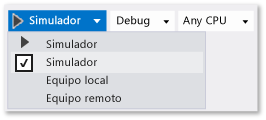

# Ejecutar aplicaciones para UWP en el simulador

El simulador de Visual Studio para aplicaciones para UWP es una aplicación de escritorio que simula una aplicación de UWP. Normalmente, querrá depurar en el equipo local, en un dispositivo conectado o en un equipo remoto. Sin embargo, en algunos escenarios, puede que desee usar el simulador de Visual Studio para emular un tamaño de pantalla física y una resolución diferentes. También puede simular eventos táctiles y de rotación comunes y simular propiedades de conexión de red.

El simulador proporciona un entorno en el que puede diseñar, desarrollar, depurar y probar aplicaciones para UWP. Sin embargo, antes de publicar la aplicación en Microsoft Store, debe probar la aplicación en un dispositivo real.

El simulador de Visual Studio para aplicaciones para UWP no se ejecuta en un entorno aislado en el equipo local. Por eso, los errores que aparecen en el simulador (como un error irrecuperable del sistema), también pueden afectar a todo el equipo.

> [!IMPORTANT]
> El simulador de Visual Studio 2015 no incluye el botón de geolocalización. Esto se debe a que el simulador de Windows 10 no incluye la simulación de geolocalización.

##  Establecer el simulador como destino

Para ejecutar la aplicación para UWP en el simulador, seleccione **simulador** en la lista desplegable situada junto al botón **iniciar depuración** en la barra de herramientas **estándar** del depurador. Esta opción solo está disponible si la **versión mínima** de la plataforma de destino de la aplicación es menor o igual que el sistema operativo del equipo de desarrollo.

##  Elegir el modo de interacción

Puede elegir los siguientes modos de interacción:

-  Modo de mouse: establece el modo de interacción en los gestos del mouse. Los gestos del mouse son los clics, los doble clics y arrastrar.

-  Iniciar emulación táctil: establece el modo de interacción en gestos táctiles de un solo dedo. Los eventos de un solo dedo son pulsar, arrastrar y deslizar rápidamente.

   
   
   El icono de destino único indica la ubicación de los eventos en el simulador. Usa el mouse para colocar el puntero.

   
   
   Presione el botón primario del mouse para activar el modo táctil. Por ejemplo, haz clic en el botón para simular una pulsación, o mantenlo presionado para arrastrar o deslizar rápidamente.

## Modo táctil de acercar y alejar

Establece el modo de interacción en gestos táctiles de acercar y alejar utilizando dos dedos.

El icono de destino doble indica la ubicación de los dos dedos en la pantalla del dispositivo.

- Mueve el mouse para colocar los iconos sobre el objeto en la pantalla del dispositivo.

- Gira la rueda del mouse hacia atrás o hacia delante para cambiar la distancia simulada de los dos dedos antes de realizar la emulación táctil de acercar o alejar.

- Presiona el botón primario y gira la rueda hacia atrás (hacia ti) para acercar (acercar los dedos).

- Presiona el botón primario y gira la rueda del mouse hacia delante (hacia el lado contrario a donde tú estás) para alejar (separar los dedos).

## Rotación de objetos

El botón **Emulación táctil, girar** establece el modo de interacción en los gestos de rotación de dos dedos.

- Mueve el mouse para colocar los iconos sobre el objeto en la pantalla del dispositivo. Gira la rueda del mouse hacia atrás o hacia delante para cambiar la orientación simulada de los dos dedos antes de rotar el objeto.

- Presiona el botón primario y gira la rueda hacia atrás (hacia ti) para rotar el objeto hacia la izquierda. Al girar la rueda del mouse, uno de los dos iconos de destino rota alrededor del otro para indicar el tamaño relativo de la rotación.

- Presiona el botón primario y gira la rueda del mouse hacia delante (hacia el lado contrario a donde te encuentras) para rotar el objeto en el sentido de las agujas del reloj.

##  Habilitar o deshabilitar el modo Siempre visible
 Puedes establecer la ventana del simulador para que siempre esté encima de las demás. El botón **Alternar la ventana de nivel superior** habilita o deshabilita el modo **Siempre visible** de la ventana del simulador.

##  Cambiar la orientación del dispositivo
 Puedes cambiar la orientación del dispositivo entre vertical y horizontal rotándolo 90 grados en cualquier dirección.

> [!NOTE]
> El simulador no respeta la propiedad [DisplayProperties.AutoRotationPreferences](/uwp/api/Windows.Graphics.Display.DisplayProperties#Windows_Graphics_Display_DisplayProperties_AutoRotationPreferences) de un proyecto. Por ejemplo, si el proyecto establece la orientación en `Landscape`y, después, tú rotes el simulador para situarlo en orientación vertical, la imagen de la pantalla del simulador también se rotará y cambiará de tamaño. Debes probar la configuración en un dispositivo real.

> [!NOTE]
> Si rotas el simulador de modo que su borde sea mayor que la pantalla en que aparece, su tamaño cambia para ajustarse automáticamente a la pantalla. Si lo vuelves a rotar, no recupera su tamaño original.

##  Cambiar el tamaño y la resolución de pantalla simulados
 Para cambiar el tamaño y la resolución de pantalla simulados, seleccione el botón **Cambiar resolución** en la paleta y seleccione otro tamaño y resolución en la lista.

 El tamaño y la resolución de la pantalla aparecen como *Pulgadas de ancho de pantalla, ancho de píxel X alto de píxel*. Ten en cuenta que tanto el tamaño como la resolución de pantalla son simulados. Las coordenadas de ubicación en el simulador se traducen en el tamaño y la resolución seleccionados del dispositivo.

> [!NOTE]
> Puedes guardar versiones a escala de las imágenes de mapa de bits en tu aplicación. Windows cargará la imagen correcta para la escala actual. Para obtener más información, consulte [Introducción al diseño y la interfaz de usuario](/windows/uwp/layout/design-and-ui-intro). Sin embargo, si cambias la resolución del simulador de modo que Windows elija otra imagen para ajustarla a la resolución, deberás detener y reiniciar la sesión de depuración para ver la nueva imagen.

## Captura de una captura de pantalla de la aplicación para enviarla a Microsoft Store
 Al enviar una aplicación a Microsoft Store, debe incluir capturas de pantallas de la aplicación.

> [!NOTE]
> La captura de pantalla se guarda con la resolución actual del simulador. Para cambiar la resolución, elige el botón **Cambiar resolución** .

- Para crear capturas de pantalla de la aplicación en el simulador, elige el botón **Capturar pantalla en el Portapapeles** .

- Para configurar la ubicación donde se encuentran las capturas de pantalla, seleccione el botón **Configuración de captura de pantalla** y elija la ubicación en el menú contextual.

   

##  Simular propiedades de conexión de red

Puedes ayudar a los usuarios de la aplicación a administrar los costos de las conexiones de red de uso medido haciendo que tengan conocimiento de ellos o de los cambios de estado del plan de datos, y habilitando la aplicación para utilizar esta información y evitar incurrir así en gastos adicionales por uso en itinerancia o por superar un límite de transferencia de datos determinado. Las API de [Windows.Networking.Connectivity](/uwp/api/windows.networking.connectivity) le permiten responder a los eventos [NetworkStatusChanged](/uwp/api/windows.networking.connectivity.networkinformation) y [TriggerType](/uwp/api/windows.applicationmodel.background.systemtrigger) que firman. Vea [Inicio rápido: administrar los límites de costos de red de uso medido](https://msdn.microsoft.com/library/windows/apps/Hh750310.aspx).

Para depurar o probar el código con reconocimiento de costos de red, el simulador puede imitar las propiedades de una red que se exponen a través del objeto [ConnectionProfile](/uwp/api/windows.networking.connectivity.connectionprofile) devuelto por [GetInternetConnectionProfile](/uwp/api/windows.networking.connectivity.networkinformation).

Para simular propiedades de red:

1. En la barra de herramientas del simulador, elija el botón **Cambiar las propiedades de red** .

2. En el cuadro de diálogo **Establecer propiedades de red** , seleccione **Usar propiedades de red simuladas**.

    Desactiva la casilla para quitar la simulación y vuelve a las propiedades de red de la interfaz conectada actualmente.

3. Escribe un **Nombre de perfil** para la red simulada. Recomendamos usar un nombre único que puede usar para identificar la simulación en la propiedad [ProfileName](/uwp/api/windows.networking.connectivity.connectionprofile) del objeto [ConnectionProfile](/uwp/api/windows.networking.connectivity.connectionprofile) .

4. Seleccione el valor [NetworkCostType](/uwp/api/windows.networking.connectivity.networkcosttype) para el perfil de la lista **Tipo de costo de red** .

5. En la lista **Marca de estado del límite de datos**, puede establecer la propiedad [ApproachingDataLimit](/uwp/api/windows.networking.connectivity.connectioncost) o [OverDataLimit](/uwp/api/windows.networking.connectivity.connectioncost)en true, o puede elegir **Por debajo del límite de datos** para establecer ambos valores en false.

6. En la lista **Estado de movilidad** , establezca la propiedad [Movilidad](/uwp/api/windows.networking.connectivity.connectioncost) .

7. Elija **Configurar propiedades** para simular las propiedades de red desencadenando un evento [NetworkStatusChanged](/uwp/api/windows.networking.connectivity.networkinformation) en primer plano y [SystemTrigger](/uwp/api/windows.applicationmodel.background.systemtrigger) en segundo plano de tipo **NetworkStateChange**.

Para obtener más información acerca de la administración de conexiones de red, consulte:

[Inicio rápido: administrar los límites de costos de red de uso medido](https://msdn.microsoft.com/library/windows/apps/Hh750310.aspx)

[Ejemplo de información de red](https://code.msdn.microsoft.com/windowsapps/Network-Information-Sample-63aaa201)

::: moniker range="vs-2017"
[Analizar el uso de energía](../profiling/analyze-energy-use-in-store-apps.md)
::: moniker-end

[Windows.Networking.Connectivity](/uwp/api/windows.networking.connectivity)

[Cómo responder a eventos del sistema con tareas en segundo plano](/previous-versions/windows/apps/hh977058(v=win.10))

[Desencadenación de eventos de suspensión, reanudación y en segundo plano en aplicaciones para UWP](how-to-trigger-suspend-resume-and-background-events-for-windows-store-apps-in-visual-studio.md)

##  Navegar por el simulador con el teclado

Para navegar por la barra de herramientas del simulador, presione **Ctrl + Alt + flecha arriba** para cambiar el foco de la ventana del simulador a la barra de herramientas del simulador. Usa las teclas **Flecha arriba** y **Flecha abajo** para desplazarte entre los botones de la barra de herramientas.

Para apagar el simulador, presione **Ctrl + Alt + F4**.

## Vea también

- [Ejecutar aplicaciones desde Visual Studio](debugging-windows-store-and-windows-universal-apps.md)
