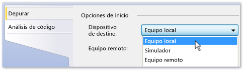
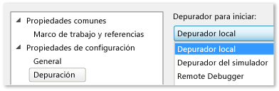

# Ejecutar aplicaciones de la Tienda Windows en el equipo local
[!INCLUDE[vs2017banner](../code-quality/includes/vs2017banner.md)]

  
  
 Para depurar, realizar pruebas o ejecutar análisis de rendimiento en una aplicación de la Tienda Windows, puede ejecutar la aplicación en el mismo equipo en el que se encuentre Visual Studio.  Si la pantalla del dispositivo permite los toques, puede probar todas las funciones de la aplicación. De lo contrario, solo podrá usar gestos de mouse y teclado.  
  
##   En este tema  
 Puedes obtener información sobre:  
  
 [Cómo ejecutar la aplicación en un equipo local](#BKMK_How_to_run_on_a_local_machine)  
  
 [Cómo cambiar de una aplicación de la Tienda Windows a Visual Studio en un solo monitor](#BKMK_How_to_switch_between_a_Windows_Store_app_and_Visual_Studio_on_a_single_monitor)  
  
##   Cómo ejecutar la aplicación en un equipo local  
 Para ejecutar la aplicación en el equipo local, elija **Equipo local** en la lista desplegable situada junto al botón Iniciar depuración de la barra de herramientas **Estándar** del depurador.  
  
   
  
 Si no ve la barra de herramientas **Estándar**, haga clic en el menú **Ver**, apunte a **Barras de herramientas** y, luego, haga clic en **Estándar**.  
  
 La opción que seleccione en la lista desplegable permanece habilitada en el archivo de propiedades del proyecto y se convierte en el destino de ejecución predeterminado.  
  
 Además, puede establecer el destino de ejecución directamente en el archivo de propiedades del proyecto.  Haga clic con el botón secundario en el nombre del proyecto en el **Explorador de soluciones** y elija **Propiedades**.  Realice alguno de los siguientes procedimientos:  
  
-   En los proyectos de C\# y Visual Basic, haga clic en **Depurar** y, luego, seleccione **Equipo local** en la lista desplegable **Dispositivo de destino**.  
  
       
  
-   En los proyectos de C\+\+ y JavaScript, expanda el nodo **Propiedades de configuración**, haga clic en **Depuración** y, a continuación, seleccione **Depurar local** en la lista **Depurador para iniciar**.  
  
       
  
##   Cómo cambiar de una aplicación de la Tienda Windows a Visual Studio en un solo monitor  
 **Para cambiar de una instancia en ejecución de una aplicación de la Tienda Windows a Visual Studio**  
  
 Cuando ejecute una aplicación de la Tienda Windows en un equipo local y use un solo monitor, le recomendamos que vuelva a usar Visual Studio mientras se ejecute la aplicación.  Por ejemplo, es posible que ningún punto de interrupción pueda llegar a la aplicación debido a que, por ejemplo, esté esperando un evento o se haya quedado bloqueada en un bucle infinito.  Para cambiar a Visual Studio \(presione Alt\+Tab\).