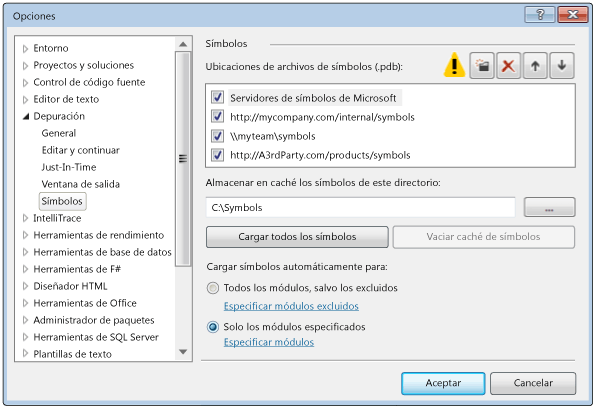
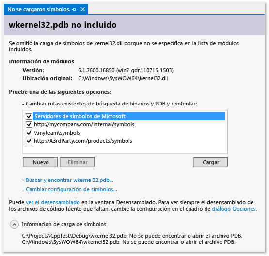
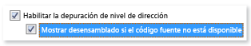
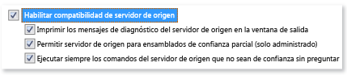

# Especificar archivos de c&#243;digo fuente y s&#237;mbolos (.pdb) en el depurador de Visual Studio
[!INCLUDE[vs2017banner](../code-quality/includes/vs2017banner.md)]

Un archivo de base de datos de programa \(.pdb\), también denominado archivo de símbolos, asigna los identificadores creados en archivos de código fuente de clases, métodos y otro código a los identificadores que se utilizan en los archivos ejecutables compilados del proyecto. El archivo .pdb también asigna las instrucciones del código fuente a las instrucciones de ejecución de los archivos ejecutables. El depurador utiliza estos datos para determinar dos elementos clave de la información: el archivo de código fuente y el número de línea que se muestran en el IDE de Visual Studio y la ubicación del archivo ejecutable en la que debe detenerse cuando se establece un punto de interrupción. Un archivo de símbolos también contiene la ubicación original de los archivos de código fuente y, opcionalmente, la ubicación de un servidor de origen en donde pueden recuperarse los archivos de código fuente.  
  
 Cuando se depura un proyecto en el IDE de Visual Studio, el depurador conoce la ubicación predeterminada del archivo .pdb y de los archivos de código fuente del código. Si desea depurar código externo al código fuente del proyecto, por ejemplo código de Windows o de terceros que llame el proyecto, tiene que especificar la ubicación de los .pdb \(y, opcionalmente, de los archivos de código fuente del código externo\) y dichos archivos deben coincidir exactamente con la versión de los archivos ejecutables.  
  
 Antes de Visual Studio 2012, para depurar código administrado en un dispositivo remoto, era necesario colocar los archivos de símbolos en el equipo remoto. Pero esto ya no es así. Todos los archivos de símbolos deben encontrarse en el equipo local o en una ubicación especificada en la página **Herramientas \/ Opciones \/ Depuración \/ Símbolos**.  
  
##   ¿Dónde busca el depurador los archivos .pdb?  
  
1.  La ubicación que se especifica dentro del archivo DLL o el archivo ejecutable.  
  
     \(De forma predeterminada, si ha compilado una DLL o un archivo ejecutable en su equipo, el vinculador coloca la ruta de acceso completa y el nombre del archivo .pdb asociado dentro de la DLL o el archivo ejecutable. El depurador comprueba primero si el archivo de símbolos existe en la ubicación especificada dentro del archivo DLL o el archivo ejecutable. Esto resulta útil, porque siempre hay símbolos disponibles para el código que ha compilado en el equipo\).  
  
2.  Archivos .pdb que podrían encontrarse en la misma carpeta que el archivo DLL o el archivo ejecutable.  
  
3.  Cualquier carpeta de caché de símbolos local.  
  
4.  Cualquier red, Internet o servidor y ubicación de símbolos local donde se especifiquen, por ejemplo el servidor de símbolos de Microsoft, si está habilitado.  
  
###   ¿Por qué los archivos de símbolos deben coincidir exactamente con los archivos ejecutables?  
 El depurador solo cargará un archivo .pdb de un archivo ejecutable que coincida exactamente con el archivo .pdb creado cuando se compiló el archivo ejecutable \(es decir, el archivo .pdb debe ser el original o una copia del archivo .pdb original\). Dado que el compilador está optimizado para acelerar la compilación además de su tarea principal de crear un código correcto y eficaz, el diseño real de un archivo ejecutable puede cambiar aunque el propio código no haya cambiado. Para obtener más información, consulte [Why does Visual Studio require debugger symbol files to \*exactly\* match the binary files that they were built with?](https://blogs.msdn.microsoft.com/jimgries/2007/07/06/why-does-visual-studio-require-debugger-symbol-files-to-exactly-match-the-binary-files-that-they-were-built-with/) \(¿Por qué Visual Studio requiere que los archivos de símbolos del depurador coincidan exactamente con los archivos binarios con los que se compilaron?\).  
  
###   Especificar las ubicaciones de símbolos y el comportamiento de carga  
 Cuando se depura un proyecto en el IDE de VS, el depurador carga automáticamente los archivos de símbolos que se encuentran en el directorio del proyecto. Puede especificar rutas de acceso de búsqueda alternativas y servidores de símbolos de Microsoft, Windows o componentes de terceros en **Herramientas \/ Opciones \/ Depuración \/ Símbolos**. También puede especificar módulos concretos para los que quiere que el depurador cargue símbolos automáticamente. Y posteriormente puede cambiar esta configuración manualmente mientras está depurando de manera activa.  
  
1.  En Visual Studio, abra la página **Herramientas \/ Opciones \/ Depuración \/ Símbolos**.  
  
       
  
2.  Elija el icono de carpeta . En el cuadro **Ubicaciones del archivo de símbolos \(.pdb\)**, aparece texto modificable.  
  
3.  Escriba la dirección URL o la ruta de acceso del directorio del servidor de símbolos o de la ubicación del símbolo. La finalización de instrucciones le será de ayuda para especificar el formato correcto.  
  
4.  Para mejorar el rendimiento de carga de los símbolos, escriba la ruta de acceso de un directorio local en el que los servidores de símbolos puedan copiar los símbolos en el cuadro **Almacenar en caché los símbolos de este directorio**.  
  
    > [!NOTE]
    >  No coloque la memoria caché de símbolos en una carpeta protegida \(como la carpeta C:\\Windows o una de sus subcarpetas\). Utilice una carpeta de lectura y escritura en su lugar.  
  
 **Especificar el comportamiento de carga de los símbolos**  
  
 Puede especificar los archivos que desea cargar automáticamente desde ubicaciones del cuadro **Ubicaciones de archivos de símbolos \(.pdb\)** cuando inicie la depuración. Los archivos de símbolos del directorio del proyecto siempre se cargan.  
  
1.  Elija **Todos los módulos, excepto los excluidos** para cargar todos los símbolos de todos los módulos excepto los que especifique si elige el vínculo **Especificar módulos excluidos**.  
  
2.  Elija la opción **Solo los módulos especificados** y, a continuación, seleccione **Especificar módulos** para enumerar los archivos de símbolos de los módulos que desee cargar automáticamente. Los archivos de símbolos de otros módulos se omiten.  
  
 **Especificar opciones de símbolos adicionales**  
  
 También puede establecer las siguientes opciones en la página **Herramientas \/ Opciones \/ Depuración \/ Símbolos**:  
  
 **Advertir de la inexistencia de símbolos al iniciar \(solo nativo\)**  
  
 Cuando se selecciona esta opción, se muestra un cuadro de diálogo de advertencia al intentar depurar un programa para el que el depurador no tiene información simbólica.  
  
 **Cargar exportaciones de dll**  
  
 Cuando se selecciona esta opción, se cargan las tablas de exportación de archivos DLL. La información simbólica de las tablas de exportación de archivos DLL puede resultar útil si se trabaja con mensajes de Windows, procedimientos de Windows \(WindowProc\), objetos COM, cálculo de referencias o cualquier archivo DLL para el que no disponga de símbolos. La lectura de la información de exportación de archivos DLL implica cierta sobrecarga. Por lo tanto, esta funcionalidad está desactivada de forma predeterminada.  
  
 Para ver los símbolos que están disponibles en la tabla de exportación de un archivo DLL, utilice `dumpbin /exports`. Los símbolos están disponibles para cualquier archivo DLL de sistema de 32 bits. Si lee el resultado de `dumpbin /exports`, podrá ver el nombre exacto de la función, incluidos los caracteres no alfanuméricos. Esto resulta útil para establecer un punto de interrupción en una función. Los nombres de función procedentes de tablas de exportación de archivos DLL pueden aparecer truncados en otras partes del depurador. Las llamadas se muestran en una lista según el orden de llamada, y la función actual \(la que está anidada a mayor profundidad\) aparece en la parte superior. Para obtener más información, vea [dumpbin \/exports](/visual-cpp/build/reference/dash-exports).  
  
###   Usar servidores de símbolos para buscar archivos de símbolos que no estén en el equipo local  
 [!INCLUDE[vsprvs](../code-quality/includes/vsprvs_md.md)] puede descargar archivos de símbolos de depuración de servidores de símbolos que implementan el protocolo symsrv.[Visual Studio Team Foundation Server](../Topic/Index%20and%20publish%20symbol%20data.md) y las [Herramientas de depuración para Windows](http://msdn.microsoft.com/library/windows/hardware/ff551063\(v=VS.85\).aspx) son dos herramientas que pueden implementar servidores de símbolos. Especifique los servidores de símbolos que desee usar en el cuadro **Opciones** de VS.  
  
 Los servidores de símbolos que podría utilizar incluyen:  
  
 **Servidores de símbolos públicos de Microsoft**  
  
 Para depurar un bloqueo que se produzca durante una llamada a un archivo DLL del sistema o a una biblioteca de terceros, generalmente necesitará archivos .pdb del sistema, que contienen símbolos de archivos DLL, EXE y controladores de dispositivos de Windows. Puede obtener estos símbolos en los servidores de símbolos públicos de Microsoft. Los servidores de símbolos públicos de Microsoft proporcionan símbolos de los sistemas operativos Windows, además de MDAC, IIS, ISA y [!INCLUDE[dnprdnshort](../code-quality/includes/dnprdnshort_md.md)].  
  
 Para utilizar los servidores de símbolos de Microsoft, seleccione **Opciones y configuración** en el menú **Depurar** y, a continuación, elija **Símbolos**. Seleccione **Servidores de símbolos de Microsoft**.  
  
 **Servidores de símbolos de una red interna o del equipo local**  
  
 Su equipo o compañía puede crear servidores de símbolos para sus propios productos y como memoria caché de símbolos de orígenes externos. Podría tener un servidor de símbolos en su propio equipo. Puede especificar la ubicación de los servidores de símbolos como una dirección URL o como una ruta de acceso en la página **Depuración**\/**Símbolos** del cuadro de diálogo **Opciones** de VS.  
  
 **Servidores de símbolos de terceros**  
  
 Los proveedores de aplicaciones Windows y bibliotecas de terceros pueden proporcionar acceso al servidor de símbolos en Internet. También puede escribir la dirección URL de estos servidores de símbolos en la página **Depuración**\/**Símbolos**,  
  
> [!NOTE]
>  Si utiliza un servidor de símbolos distinto de los servidores de símbolos públicos de Microsoft, asegúrese de que el servidor de símbolos y la ruta de acceso son de confianza. Dado que los archivos de símbolos pueden contener código ejecutable arbitrario, puede que se exponga a amenazas de seguridad.  
  
###   Buscar y cargar símbolos durante la depuración  
 En cualquier momento mientras el depurador esté en modo de interrupción, puede cargar símbolos de un módulo que se haya excluido previamente mediante las opciones del depurador o que el compilador no haya podido encontrar. Puede cargar símbolos desde los menús contextuales de las ventanas Pila de llamadas, Módulos, Variables locales, Automático y todas las ventanas Inspección. Si el depurador interrumpe la ejecución en código que no tiene archivos de símbolos o de código fuente disponibles, aparece una ventana de documento. Aquí puede encontrar información sobre los archivos que faltan y tomar medidas para encontrarlos y cargarlos.  
  
 **Buscar símbolos con las páginas de documento No se cargaron símbolos**  
  
 El depurador puede interrumpir el código que no tiene símbolos disponibles de varias maneras:  
  
1.  Depurar paso a paso el código.  
  
2.  Interrumpir el código desde un punto de interrupción o una excepción.  
  
3.  Cambiar a un subproceso diferente.  
  
4.  Cambiar el marco de pila haciendo doble clic en un marco de la ventana Pila de llamadas.  
  
 Cuando se produce uno de estos eventos, el depurador muestra la página **No se cargaron símbolos** para ayudar a encontrar y cargar los símbolos necesarios.  
  
   
  
-   Para cambiar las rutas de acceso de búsqueda, elija una ruta de acceso no seleccionada o elija **Nuevo** y escriba una nueva ruta de acceso. Elija **Cargar** para buscar de nuevo las rutas de acceso y cargar el archivo de símbolos si se encuentra.  
  
-   Elija **Examinar y buscar***nombre\-de\-ejecutable***…** para invalidar cualquier opción de símbolo y reintentar las rutas de búsqueda. Si se encuentra el archivo de símbolos se carga, o se muestra un Explorador de archivos para que seleccione manualmente el archivo de símbolos.  
  
-   Elija **Cambiar configuración de símbolos ...** para mostrar la página **Depuración** \/ **Símbolos** del cuadro de diálogo Opciones de VS.  
  
-   Elija **ver desensamblado** para mostrar el desensamblado en una nueva ventana una vez.  
  
-   Para mostrar siempre el desensamblado cuando no se encuentren los archivos de código fuente o de símbolos, elija el vínculo **Cuadro de diálogo Opciones** y seleccione **Habilitar la depuración de nivel de dirección** y **Mostrar desensamblado si el código fuente no está disponible**.  
  
       
  
 **Cambiar opciones de símbolo desde el menú contextual**  
  
 Mientras está en modo de interrupción, puede buscar y cargar los símbolos de los elementos que se muestran en las ventanas Pila de llamadas, Módulos, Variables locales, Automático y en todas las ventanas Inspección. Seleccione un elemento de la ventana, abra el menú contextual y elija una de las opciones siguientes:  
  
|Opción|Descripción|  
|------------|-----------------|  
|**Cargar símbolos**|Intenta cargar símbolos de las ubicaciones especificadas en la página **Depuración** \/ **Símbolos** del cuadro de diálogo **Opciones**. Si no se encuentra el archivo de símbolos, se inicia el Explorador de archivos para poder especificar una nueva ubicación en la que buscar.|  
|**Información de carga de símbolos**|Presenta información que muestra la ubicación de un archivo de símbolos cargado, o las ubicaciones buscadas en caso de que el depurador no encuentre el archivo.|  
|**Configuración de símbolos...**|Abre la página **Depuración** \/ **Símbolos** del cuadro de diálogo **Opciones** de VS.|  
|**Cargar siempre automáticamente**|Agrega el archivo de símbolos a la lista de archivos que el depurador carga automáticamente.|  
  
###   Establecer opciones del compilador para archivos de símbolos  
 Cuando compila un proyecto mediante el IDE de VS y utiliza la configuración de compilación de **depuración** estándar, los compiladores administrados y de C\+\+ crean archivos de símbolos adecuados para el código. También puede establecer opciones del compilador en la línea de comandos para crear los archivos de símbolos.  
  
 **Opciones de C\+\+**  
  
 Un archivo de base de datos de programa \(.pdb\) contiene información sobre el estado de la depuración y del proyecto que permite la vinculación incremental de una configuración Debug del programa. Cuando se compila con [\/ZI o \/Zi](/visual-cpp/build/reference/z7-zi-zi-debug-information-format) \(para C\/C\+\+\) se crea un archivo .pdb.  
  
 En [!INCLUDE[vcprvc](../code-quality/includes/vcprvc_md.md)], la opción [\/Fd](/visual-cpp/build/reference/fd-program-database-file-name) asigna nombre al archivo .pdb creado por el compilador. Al crear un proyecto en [!INCLUDE[vsprvs](../code-quality/includes/vsprvs_md.md)] mediante los asistentes, la opción **\/Fd** se establece para crear un archivo .pdb denominado *project*.pdb.  
  
 Si compila una aplicación de C\/C\+\+ mediante un archivo Make y especifica **\/ZI** o **\/Zi** sin **\/Fd**, terminará con dos archivos .pdb:  
  
-   VC*x*.pdb, donde *x* representa la versión de Visual C\+\+, por ejemplo VC11.pdb. Este archivo almacena toda la información de depuración de los archivos OBJ individuales y reside en el mismo directorio que el archivo MAKE del proyecto.  
  
-   proyecto.pdb   Este archivo almacena toda la información de depuración del archivo .exe. En C\/C\+\+, este archivo reside en el subdirectorio \\debug.  
  
 Cada vez que crea un archivo OBJ, el compilador de C\/C\+\+ combina la información de depuración en VC*x*.pdb. La información insertada incluye información de tipo, pero no información de símbolo como definiciones de función. Por lo tanto, aunque cada archivo de código fuente incluya archivos de encabezado comunes como \<windows.h\>, las definiciones de tipo de esos encabezados solo se almacenan una vez, en vez de aparecer en cada archivo OBJ.  
  
 El vinculador crea el archivo proyecto.pdb, que contiene información de depuración del archivo EXE del proyecto. El archivo proyecto.pdb contiene toda la información de depuración, incluidos los prototipos de función, y no solo la información de tipo que se encuentra en VC*x*.pdb. Ambos archivos .pdb permiten actualizaciones incrementales. El vinculador también incrusta la ruta de acceso al archivo .pdb en el archivo .exe o .dll que crea.  
  
 El depurador de [!INCLUDE[vsprvs](../code-quality/includes/vsprvs_md.md)] utiliza la ruta de acceso al archivo .pdb en el archivo EXE o DLL para buscar el archivo proyecto.pdb. Si el depurador no puede encontrar el archivo .pdb en dicha ubicación o si la ruta de acceso no es válida \(por ejemplo, si el proyecto se ha movido a otro equipo\), el depurador busca la ruta que contiene el archivo EXE, las rutas de acceso de símbolos especificadas en el cuadro de diálogo **Opciones** \(carpeta **Depuración**, nodo **Símbolos**\). El depurador no cargará un archivo .pdb que no coincida con el archivo ejecutable que se está depurando. Si el depurador no encuentra ningún archivo .pdb, aparecerá el cuadro de diálogo **Buscar símbolos** que permite buscar símbolos o agregar más ubicaciones a la ruta de acceso de búsqueda.  
  
 **Opciones de .NET Framework**  
  
 Un archivo de base de datos de programa \(.pdb\) contiene información sobre el estado de la depuración y del proyecto que permite la vinculación incremental de una configuración Debug del programa. Cuando se compila con **\/debug**, se crea un archivo .pdb. Puede compilar las aplicaciones con **\/debug:full** o **\/debug:pdbonly**. La compilación mediante **\/debug:full** genera código depurable. La compilación mediante **\/debug:pdbonly** genera archivos .pdb, pero no genera el atributo `DebuggableAttribute` que indica al compilador JIT que existe información de depuración disponible. Use **\/debug:pdbonly** si quiere generar archivos .pdb para una compilación de versión que no quiere que sea depurable. Para obtener más información, vea [\/debug \(Emit Debugging Information\)](/dotnet/csharp/language-reference/compiler-options/debug-compiler-option) o [\/debug](/dotnet/visual-basic/reference/command-line-compiler/debug).  
  
 El depurador de [!INCLUDE[vsprvs](../code-quality/includes/vsprvs_md.md)] utiliza la ruta de acceso al archivo .pdb en el archivo EXE o DLL para buscar el archivo proyecto.pdb. Si el depurador no encuentra el archivo .pdb en esa ubicación o si la ruta de acceso no es válida, el depurador busca en la ruta de acceso que contiene el archivo EXE y, a continuación, en las rutas de acceso de símbolos especificadas en el cuadro de diálogo **Opciones**. Esta ruta de acceso generalmente es la carpeta **Depuración** en el nodo **Símbolos**. El depurador no cargará un archivo .pdb que no coincida con el archivo ejecutable que se está depurando. Si el depurador no encuentra ningún archivo .pdb, aparecerá el cuadro de diálogo **Buscar símbolos** que permite buscar símbolos o agregar más ubicaciones a la ruta de acceso de búsqueda.  
  
 **Aplicaciones web**  
  
 El archivo de configuración de la aplicación \(Web.config\) se debe establecer en modo de depuración. El modo de depuración hace que ASP.NET genere símbolos para los archivos generados dinámicamente y permite al depurador asociarse a la aplicación ASP.NET. VS lo establece automáticamente al empezar a depurar si el proyecto se creó a partir de la plantilla de proyectos web.  
  
##   Buscar archivos de código fuente  
  
###   Dónde busca el depurador los archivos de código fuente  
 El depurador busca los archivos de código fuente en las siguientes ubicaciones:  
  
1.  Archivos abiertos en el IDE de la instancia de Visual Studio que inició el depurador.  
  
2.  Archivos de la solución abierta en la instancia de Visual Studio.  
  
3.  Directorios especificados en la página **Propiedades comunes** \/ **Depurar archivos de código fuente** de las propiedades de la solución. \(En el **Explorador de soluciones**, seleccione el nodo de la solución, haga clic con el botón derecho y seleccione **Propiedades**\). \)  
  
4.  Información de origen del archivo .pdb del módulo. Puede ser la ubicación del archivo de código fuente cuando se compiló el módulo, o puede ser un comando para un servidor de origen.  
  
###   Buscar y cargar archivos de código fuente mediante las páginas No se cargaron orígenes \/ No se cargaron símbolos  
 Cuando el depurador interrumpe la ejecución en una ubicación en la que no está disponible el archivo de código fuente, mostrará las páginas **No se cargaron orígenes** o **No se cargaron símbolos** que pueden ayudarle a buscar el archivo de código fuente.**No se cargaron símbolos** aparece cuando el depurador no encuentra un archivo de símbolos \(.pdb\) para que el archivo ejecutable complete su búsqueda. La página No se cargaron símbolos proporciona opciones para buscar el archivo. Si se encuentra el archivo .pdb después de ejecutar una de las opciones y el depurador puede recuperar el archivo de código fuente mediante la información del archivo de símbolos, se muestra el código fuente. De lo contrario, aparece una página **No se cargaron orígenes** que describe el problema. La página muestra vínculos de opciones que pueden realizar acciones que podrían resolver el problema.  
  
###   Agregar rutas de acceso de búsqueda de archivo de código fuente a una solución  
 Puede especificar una red o directorios locales para buscar archivos de código fuente.  
  
1.  Seleccione la solución en el Explorador de soluciones y, a continuación, elija **Propiedades** en el menú contextual.  
  
2.  Bajo el nodo **Propiedades comunes**, elija **Depurar archivos de código fuente**.  
  
3.  Haga clic en el icono de carpeta . En la lista **Directorios que contienen código fuente**, aparece texto modificable.  
  
4.  Agregue la ruta de acceso que desee buscar.  
  
 Observe que solo se busca el directorio especificado. Debe agregar entradas para cualquier subdirectorio que desee buscar.  
  
###   Usar servidores de origen  
 Cuando no existe código fuente en el equipo local o el archivo .pdb no coincide con el código fuente, puede utilizar el servidor de origen como ayuda para depurar una aplicación. El servidor de origen recoge solicitudes de archivos y devuelve archivos reales. El servidor de origen se ejecuta mediante un archivo DLL denominado srcsrv.dll. El servidor de origen lee el archivo .pdb de la aplicación, que contiene punteros al repositorio de código fuente, y comandos que se utilizan para recuperar el código fuente del repositorio. Puede restringir qué comandos se pueden ejecutar a partir del archivo .pdb de la aplicación especificando la lista de comandos permitidos dentro de un archivo denominado srcsrv.ini, que debe encontrarse en el mismo directorio que srcsrv.dll y devenv.exe.  
  
> [!IMPORTANT]
>  En el archivo .pdb de la aplicación se pueden incrustar comandos arbitrarios, por lo que debe asegurarse de colocar únicamente los que desee ejecutar en el archivo srcsrv.ini. Todo intento de ejecutar un comando no incluido en el archivo srcsvr.ini provocará la aparición de un cuadro de diálogo de confirmación. Para obtener más información, consulta [Advertencia de seguridad: El depurador debe ejecutar un comando que no es de confianza](../debugger/security-warning-debugger-must-execute-untrusted-command.md). No se realiza ninguna validación de los parámetros de comando, por lo que debe tener cuidado con los comandos de confianza. Por ejemplo, si confiara en cmd.exe, un usuario malintencionado podría especificar parámetros que harían que el comando fuera peligroso.  
  
 **Para habilitar el uso de un servidor de origen**  
  
1.  Asegúrese de cumplir las medidas de seguridad descritas en la sección anterior.  
  
2.  En el menú **Herramientas**, elija **Opciones**.  
  
     Aparecerá el cuadro de diálogo **Opciones**.  
  
3.  En el nodo **Depuración**, elija **General**.  
  
4.  Active la casilla **Habilitar compatibilidad de servidor de origen**.  
  
       
  
5.  \(Opcional\) Elija las opciones secundarias que desee.  
  
     Observe que tanto **Permitir servidor de origen para ensamblados de confianza parcial \(solo administrado\)** como **Ejecutar siempre los comandos del servidor de origen que no sean de confianza sin preguntar** pueden aumentar los riesgos para la seguridad descritos anteriormente.  
  
## Vea también  
 [Cambios en la carga remota de símbolos .NET en Visual Studio 2012 y 2013](http://blogs.msdn.com/b/visualstudioalm/archive/2013/10/16/net-remote-symbol-loading-changes-in-visual-studio-2012-and-2013.aspx)