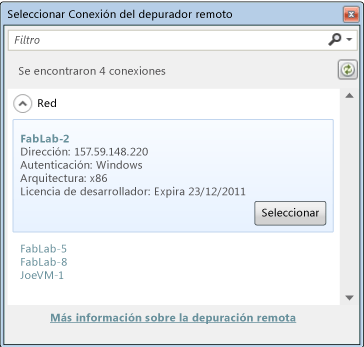

# Iniciar una sesi&#243;n de depuraci&#243;n para aplicaciones de la Tienda en Visual Studio (JavaScript)
[!INCLUDE[vs2017banner](../code-quality/includes/vs2017banner.md)]

  
  
 En este tema se describe cómo iniciar una sesión de depuración para las aplicaciones de la Tienda Windows compiladas en JavaScript y HTML5. Puede iniciar la depuración presionando una sola tecla o puede configurar la sesión de depuración para situaciones concretas y eligir la forma de iniciar la aplicación.  
  
> [!NOTE]
>  Para aplicaciones escritas en XAML y Visual C\#, Visual C\+\+ o Visual Basic, consulte [Iniciar una sesión de depuración \(VB, C\#, C\+\+ y XAML\)](../debugger/start-a-debugging-session-for-a-store-app-in-visual-studio-vb-csharp-cpp-and-xaml.md)  
  
##   En este tema  
 [En este tema](#BKMK_In_this_topic)  
  
 [Iniciar la depuración de manera sencilla](#BKMK_The_easy_way_to_start_debugging)  
  
 [Configurar la sesión de depuración](#BKMK_Configure_the_debugging_session)  
  
-   [Abrir la página de propiedades de depuración del proyecto](#BKMK_Open_the_debugging_property_page_for_the_project)  
  
-   [Elegir las opciones de configuración de compilación](#BKMK_Choose_the_build_configuration_options)  
  
-   [Elegir el destino de implementación](#BKMK_Choose_the_deployment_target)  
  
-   [Elegir el depurador utilizado](#BKMK_Choose_the_debugger_to_use)  
  
-   [(Opcional) Retrase el inicio de la aplicación en la sesión de depuración](#BKMK__Optional__Delay_starting_app_in_the_debug_session)  
  
-   [(Opcional) Deshabilitar bucles invertidos de red](#BKMK__Optional__Disable_network_loopbacks)  
  
 [Iniciar la sesión de depuración](#BKMK_Start_the_debugging_session)  
  
-   [Iniciar la depuración (F5)](#BKMK_Start_debugging__F5_)  
  
-   [Iniciar la depuración (F5) pero retrasar el inicio de la aplicación](#BKMK_Start_debugging__F5__but_delay_the_app_start)  
  
 [Iniciar una aplicación instalada en el depurador](#BKMK_Start_an_installed_app_in_the_debugger)  
  
 [Asociar el depurador a una aplicación en ejecución](#BKMK_Attach_the_debugger_to_a_running_app_)  
  
-   [Configurar la aplicación para que se ejecute en modo de depuración](#BKMK_Set_the_app_to_run_in_debug_mode)  
  
-   [Asociar el depurador](#BKMK_Attach_the_debugger)  
  
##   Iniciar la depuración de manera sencilla  
   
  
1.  Abrir la solución de la aplicación en Visual Studio.  
  
2.  Si la solución contiene proyectos para las aplicaciones de la Tienda Windows y de la Tienda de Windows Phone, asegúrese de que el proyecto que quiera depurar sea el proyecto de inicio. En el Explorador de soluciones, seleccione el proyecto y elija **Establecer como proyecto de inicio** en el menú contextual.  
  
3.  Presione F5.  
  
   
  
 Visual Studio compila e inicia la aplicación con el depurador adjunto. La ejecución continúa hasta que se alcanza un punto de interrupción, se suspende manualmente la ejecución, se produce una excepción no controlada o la aplicación finaliza. Para obtener más información, consulte [Inicio rápido: Depurar HTML y CSS](../debugger/quickstart-debug-html-and-css.md).  
  
##   Configurar la sesión de depuración  
 Dado que no se compila el script, no se aplican los ajustes de configuración de la compilación ni de la plataforma. Si depura un componente administrado o C\+\+, establezca la **Configuración** en **Depurar** y elija la plataforma de destino en el cuadro de diálogo **Configuración**.  
  
###   Abrir la página de propiedades de depuración del proyecto  
  
1.  En el Explorador de soluciones, seleccione el proyecto. En el menú contextual, elija **Propiedades**.  
  
2.  Expanda el nodo **Propiedades de configuración**  y elija **Depuración**  
  
###   Elegir las opciones de configuración de compilación  
  
1.  Desde la lista **Configuración** elija **Depurar** o **Depurar \(activo\)**.  
  
2.  Desde la lista **Plataforma** elija la plataforma de destino para la que va a compilar. En la mayoría de los casos, **Cualquier CPU** es la mejor opción.  
  
###   Elegir el destino de implementación  
 Puede implementar y depurar una aplicación en el equipo de Visual Studio, en el simulador de Visual Studio de la máquina local o en una máquina remota. Elija el destino de la lista **Depurador para iniciar** en la página de propiedades **Depuración** del proyecto.  
  
   
  
 Para las aplicaciones de la Tienda Windows, elija una de estas opciones de la lista **Dispositivo de destino**:  
  
|||  
|-|-|  
|**Máquina local**|Depurar la aplicación en la sesión actual en la máquina local. Consulte [Ejecutar aplicaciones de la Tienda Windows en el equipo local](../debugger/run-windows-store-apps-on-the-local-machine.md).|  
|**Simulador**|Depurar la aplicación en el simulador de Visual Studio para las aplicaciones [!INCLUDE[win8_appname_long](../debugger/includes/win8_appname_long_md.md)]. El simulador es una ventana del escritorio que te permite depurar la funcionalidad del dispositivo \(por ejemplo, gestos táctiles y de rotación de dispositivos\) que no está disponible en el equipo local. Consulte [Ejecutar aplicaciones de la Tienda Windows en el simulador](../debugger/run-windows-store-apps-in-the-simulator.md).|  
|**Máquina remota**|Depurar la aplicación en un dispositivo conectado a la máquina local a través de una intranet o conectada directamente con un cable Ethernet. Para depurar remotamente, las Herramientas remotas de Visual Studio deben estar instaladas y ejecutándose en el dispositivo remoto. Consulte [Ejecutar aplicaciones de la Tienda Windows en un equipo remoto](../debugger/run-windows-store-apps-on-a-remote-machine.md).|  
  
 Si selecciona **Máquina remota**, especifique el nombre o la dirección IP de la máquina remota de una de las siguientes maneras:  
  
-   Escriba el nombre o la dirección IP de la máquina remota en el cuadro **Nombre de la máquina**.  
  
-   Elija la flecha hacia abajo en el cuadro **Nombre de la máquina** y elija **\<Buscar...\>**. A continuación, elija el equipo remoto en el cuadro de diálogo **Seleccionar conexión del depurador remoto**.  
  
       
  
    > [!NOTE]
    >  El cuadro de diálogo Seleccionar conexión del depurador remoto muestra las máquinas que están en la subred local y las que están conectadas directamente a la máquina de Visual Studio mediante un cable Ethernet. Para especificar otra máquina, escriba el nombre en el cuadro **Nombre de la máquina**.  
  
   
  
 Para las aplicaciones de la Tienda Windows, elija **Dispositivo** o uno de los emuladores de la lista **Dispositivo de destino**.  
  
###   Elegir el depurador utilizado  
 El depurador va asociado al código JavaScript de la aplicación de forma predeterminada. Puede depurar el código administrado y de C\+\+ nativo de los componentes de la aplicación en lugar del código JavaScript. Especifique el código que va a depurar en la lista **Tipo de depurador** de la página de propiedades **Depuración** del proyecto de la aplicación.  
  
 Elija uno de estos depuradores de la lista **Tipo de depurador**:  
  
|||  
|-|-|  
|**Solo script**|Depure el código JavaScript de la aplicación. Se omite el código administrado y el código nativo.|  
|**Solo nativo**|Depure el código de C\/C\+\+ nativo de la aplicación. Se omite el código administrado y el código JavaScript.|  
|**Código nativo con script**|Depure el código nativo de C\+\+ y el código JavaScript de la aplicación.|  
|**Solo administrado**|Depure el código administrado de la aplicación. Se omite el código JavaScript y el código de C\/C\+\+ nativo.|  
|**Mixto \(nativo y administrado\)**|Depure el código de C\/C\+\+ nativo y el código administrado de la aplicación. Se omite el código JavaScript.|  
  
###   \(Opcional\) Retrase el inicio de la aplicación en la sesión de depuración  
 De forma predeterminada, Visual Studio inicia inmediatamente la aplicación al iniciar la depuración. También puedes iniciar una sesión de depuración pero retrasar el inicio de la aplicación. La aplicación se inicia en el depurador cuando se inicia desde la pantalla Inicio o mediante un contrato de activación, o bien cuando la inicia otro proceso o método. También puede usar el inicio retrasado para depurar los eventos en segundo plano de la aplicación que quiera que se produzcan cuando la aplicación no se esté ejecutando.  
  
 El retraso del inicio de la aplicación se especifica en la lista **Iniciar aplicación** de la página de propiedades de **Depuración** del proyecto de la aplicación. Elija una de estas opciones:  
  
-   Elija **No** para retrasar el inicio de la aplicación.  
  
-   Elija **Sí** para iniciar la aplicación inmediatamente.  
  
###   \(Opcional\) Deshabilitar bucles invertidos de red  
   
  
 Por motivos de seguridad, las aplicaciones de la Tienda Windows instaladas de forma estándar no pueden realizar llamadas de red al dispositivo en las que están instaladas. De forma predeterminada, la implementación de Visual Studio crea una exención respecto a esta regla para la aplicación implementada. Esta exención te permite probar procedimientos de comunicación en un mismo equipo. Antes de enviar la aplicación a la Tienda Windows, debe probar la aplicación sin la exención.  
  
 Para quitar la exención de bucle invertido de red, elija **No** desde la lista **Permitir bucle invertido de red** de la página de propiedades **Depuración**.  
  
##   Iniciar la sesión de depuración  
  
###   Iniciar la depuración \(F5\)  
 Al seleccionar **Iniciar depuración** en el menú **Depurar** \(teclado: F5\), Visual Studio inicia la aplicación con el depurador adjunto. La ejecución continúa hasta que se alcanza un punto de interrupción, se suspende manualmente la ejecución, se produce una excepción no controlada o la aplicación finaliza.  
  
###   Iniciar la depuración \(F5\) pero retrasar el inicio de la aplicación  
 Puede establecer que la aplicación se ejecute en modo de depuración, pero dejar que se inicie mediante un método que no sea el depurador. Por ejemplo, puede depurar el inicio de la aplicación desde el menú Inicio o depurar un proceso en segundo plano de la aplicación sin iniciarla. Si quiere retrasar el inicio de la aplicación, haga lo siguiente:  
  
1.  En la página **Depurar** de las propiedades del proyecto de la aplicación, elija **No** de la lista **Iniciar aplicación**.  
  
2.  Elija **Iniciar depuración** en el menú **Depurar** \(teclado: F5\).  
  
3.  Inicie la aplicación desde el menú Inicio, un contrato de ejecución u otro procedimiento.  
  
 La aplicación se inicia en modo de depuración. La ejecución continúa hasta que se alcanza un punto de interrupción, se suspende manualmente la ejecución, se produce una excepción no controlada o la aplicación finaliza.  
  
 . Para obtener más información sobre la depuración de tareas en segundo plano, consulte [Desencadenar eventos de suspensión, reanudación y en segundo plano para aplicaciones de la Tienda Windows](../debugger/how-to-trigger-suspend-resume-and-background-events-for-windows-store-apps-in-visual-studio.md).  
  
##   Iniciar una aplicación instalada en el depurador  
 Al iniciar la depuración con F5, Visual Studio compila e implementa la aplicación, configura la aplicación para que se ejecute en modo de depuración y la inicia. Para iniciar una aplicación que ya está instalada en un dispositivo, utiliza el cuadro de diálogo Depurar paquete de aplicaciones instalado. Este procedimiento es útil si necesitas depurar una aplicación instalada desde la Tienda Windows o si tienes los archivos de origen de la aplicación pero no tienes un proyecto de Visual Studio para ella. Por ejemplo, es posible que tenga un sistema de compilación personalizado que no use soluciones o proyectos de Visual Studio.  
  
 La aplicación se puede instalar en el dispositivo local o en un dispositivo remoto. Puedes iniciar la aplicación inmediatamente o establecer que se ejecute en el depurador cuando se inicie mediante otro proceso o método, por ejemplo desde el menú Inicio o mediante un contrato de activación. También puedes establecer que la aplicación se ejecute en modo de depuración cuando desees depurar un proceso en segundo plano sin iniciar la aplicación. Para obtener más información, consulte [Desencadenar eventos de suspensión, reanudación y en segundo plano para aplicaciones de la Tienda Windows](../debugger/how-to-trigger-suspend-resume-and-background-events-for-windows-store-apps-in-visual-studio.md).  
  
 Para configurar una aplicación instalada para que se ejecute en modo de depuración, haga lo siguiente:  
  
> [!NOTE]
>  La aplicación no se debe ejecutar al iniciar este procedimiento.  
  
1.  En el menú **Depurar**, seleccione **Depurar paquete de la aplicación instalado**  
  
2.  Seleccione una de las siguientes opciones de la lista:  
  
    |||  
    |-|-|  
    |**Máquina local**|Depurar la aplicación en la sesión actual en la máquina local. Consulte [Ejecutar aplicaciones de la Tienda Windows en el equipo local](../debugger/run-windows-store-apps-on-the-local-machine.md).|  
    |**Simulador**|Depurar la aplicación en el simulador de Visual Studio para las aplicaciones [!INCLUDE[win8_appname_long](../debugger/includes/win8_appname_long_md.md)]. El simulador es una ventana del escritorio que te permite depurar la funcionalidad del dispositivo \(por ejemplo, gestos táctiles y de rotación de dispositivos\) que no está disponible en el equipo local. Consulte [Ejecutar aplicaciones de la Tienda Windows en el simulador](../debugger/run-windows-store-apps-in-the-simulator.md).|  
    |**Máquina remota**|Depurar la aplicación en un dispositivo conectado a la máquina local a través de una intranet o conectada directamente con un cable Ethernet. Para depurar remotamente, las Herramientas remotas de Visual Studio deben estar instaladas y ejecutándose en el dispositivo remoto. Consulte [Ejecutar aplicaciones de la Tienda Windows en un equipo remoto](../debugger/run-windows-store-apps-on-a-remote-machine.md).|  
  
3.  Seleccione la aplicación de la lista **Paquetes de la aplicación instalados**.  
  
4.  Seleccione el motor de depuración para usar de la lista **Depurar este tipo de código**.  
  
5.  \(Opcional\). Seleccione **No iniciar, pero depurar mi código cuando se inicia** para depurar la aplicación cuando se inicia con otro método o para depurar un proceso en segundo plano.  
  
 Al hacer clic en **Iniciar**, la aplicación se inicia o se configura para ejecutarse en modo de depuración.  
  
##   Asociar el depurador a una aplicación en ejecución  
 Para adjuntar el depurador a una aplicación [!INCLUDE[win8_appname_long](../debugger/includes/win8_appname_long_md.md)], debe usar el Administrador de paquetes depurables para que la aplicación se ejecute en modo de depuración. El Administrador de paquetes depurables se instala con las Herramientas remotas de Visual Studio.  
  
 Asociar el depurador a una aplicación resulta útil si tiene que depurar una aplicación ya instalada, por ejemplo, que se haya instalado desde la Tienda Windows. Es necesario asociarlo cuando tienes los archivos de origen de la aplicación pero no tienes un proyecto de Visual Studio para ella. Por ejemplo, puede que tengas un sistema de compilación personalizado que no utilice proyectos o soluciones de Visual Studio.  
  
 Para adjuntar a una aplicación:  
  
1.  Configure la aplicación para que se ejecute en modo de depuración. Esto se debe hacer cuando la aplicación no se está ejecutando.  
  
2.  Inicie la aplicación. Puede iniciar la aplicación desde el menú Inicio, un contrato de ejecución o algún otro método.  
  
3.  Adjunte el depurador a la aplicación en ejecución.  
  
###   Configurar la aplicación para que se ejecute en modo de depuración  
  
1.  Instale las Visual Studio Remote Tools en el dispositivo en el que está instalada la aplicación. Consulte [Instalar las herramientas remotas](http://msdn.microsoft.com/library/windows/apps/hh441469.aspx#BKMK_Installing_the_Remote_Tools).  
  
2.  En el menú Inicio, busque `Debuggable Package Manager` e inícielo.  
  
     Se abre una ventana de PowerShell configurada correctamente para cmdlet AppxDebug.  
  
3.  Para habilitar la depuración de una aplicación, debe especificar el identificador PackageFullName de la aplicación. Para ver una lista de todas las aplicaciones que incluyan PackageFullName, escriba `Get-AppxPackage` en el símbolo del sistema de PowerShell.  
  
4.  En el símbolo del sistema de PowerShell, escriba `Enable-AppxDebug` *PackageFullName* donde *PackageFullName* es el identificador PackageFullName de la aplicación.  
  
###   Asociar el depurador  
  
> [!TIP]
>  Las aplicaciones de JavaScript se ejecutan en una instancia del proceso wwahost.exe. Si hay otras aplicaciones de JavaScript ejecutándose durante la asociación, debe conocer el identificador numérico del proceso \(PID\) del proceso wwahost.exe en el que se ejecuta la aplicación.  
>   
>  El modo más fácil de solucionarlo es cerrar las demás aplicaciones de JavaScript. De lo contrario, puede abrir el Administrador de tareas de Windows antes de iniciar la aplicación y apuntar los identificadores de los procesos wwahost.exe. Al especificar el proceso para adjuntar al cuadro diálogo **Procesos disponibles** , wwahost.exe de la aplicación tendrá un identificador que es diferente de los que haya anotado.  
  
 Para adjuntar el depurador:  
  
1.  En el menú **Depurar**, seleccione **Adjuntar al proceso**.  
  
     Aparecerá el cuadro de diálogo **Adjuntar al proceso**.  
  
2.  Para adjuntar a una aplicación de un dispositivo remoto, especifique el dispositivo remoto en el cuadro **Calificador**. Puede:  
  
    -   Escribir el nombre en el cuadro **Calificador**.  
  
    -   Elija la flecha hacia abajo del cuadro **Calificador** y elija el dispositivo de una lista de dispositivos que ha adjuntad previamente.  
  
    -   Elija **Buscar** para elegir el dispositivo en una lista de dispositivos en la subred local.  
  
3.  Especificar el tipo de código que quiere depurar en el cuadro **Adjuntar a**.  
  
     Seleccione **Seleccionar** y realice una de las siguientes acciones:  
  
    -   Seleccione **Determinar automáticamente el tipo de código para depurar**  
  
    -   Elija **Depurar estos tipos de código** y elija uno o varios tipos de la lista.  
  
4.  En el lista **Procesos disponibles**,  elija el proceso **wwahost.exe** correcto. Use la columna **Título** para identificar la aplicación.  
  
5.  Seleccione **Adjuntar**.  
  
 Visual Studio adjunta el depurador al proceso. La ejecución continúa hasta que se alcanza un punto de interrupción, se suspende manualmente la ejecución, se produce una excepción no controlada o la aplicación finaliza.  
  
## Vea también  
 [Controlar la ejecución en una sesión de depuración \(JavaScript\)](../debugger/control-execution-of-a-store-app-in-a-visual-studio-debug-session-for-windows-store-apps-javascript.md)   
 [Inicio rápido: Depurar HTML y CSS](../debugger/quickstart-debug-html-and-css.md)   
 [Desencadenar eventos de suspensión, reanudación y en segundo plano para aplicaciones de la Tienda Windows](../debugger/how-to-trigger-suspend-resume-and-background-events-for-windows-store-apps-in-visual-studio.md)   
 [Depurar aplicaciones en Visual Studio](../debugger/debug-store-apps-in-visual-studio.md)