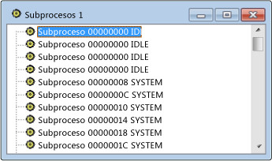

# Threads View
[!INCLUDE[vs2017banner](../code-quality/includes/vs2017banner.md)]

La vista Subprocesos es una lista plana de todos los subprocesos que están asociados a ventanas en el sistema.  Se incluyen el identificador de subproceso y el nombre de módulo de cada subproceso.  Los procesos no se incluyen, pero es fácil encontrar el proceso que es propietario de un subproceso seleccionado.  
  
## Procedimientos  
  
#### Para abrir la vista Subprocesos  
  
1.  En el menú **Spy**, elija **Subprocesos**.  
  
   
Vista de subprocesos de Spy\+\+  
  
 En la ilustración anterior se muestra la vista Subprocesos.  
  
## En esta sección  
 [Buscar un subproceso en la Vista de subprocesos](../debugger/how-to-search-for-a-thread-in-threads-view.md)  
 Explica cómo encontrar un subproceso concreto en la vista Subprocesos.  
  
 [Mostrar las propiedades del subproceso](../debugger/how-to-display-thread-properties.md)  
 Explica cómo mostrar más información sobre un subproceso.  
  
## Secciones relacionadas  
 [Vistas de Spy\+\+](../debugger/spy-increment-views.md)  
 Explica las vistas de árbol de Spy\+\+ de ventanas, mensajes, procesos y subprocesos.  
  
 [Usar Spy\+\+](../debugger/using-spy-increment.md)  
 Presenta la herramienta Spy\+\+ y explica cómo se puede usar.  
  
 [Cuadro de diálogo Buscar subproceso](../debugger/thread-search-dialog-box.md)  
 Se usa para encontrar el nodo de un subproceso concreto en la vista Subprocesos.  
  
 [Cuadro de diálogo Propiedades del subproceso](../debugger/message-properties-dialog-box.md)  
 Muestra las propiedades de un subproceso seleccionado en la vista Subprocesos o en la vista Mensajes.  
  
 [Referencia de Spy\+\+](../debugger/spy-increment-reference.md)  
 Incluye secciones que describen los menús y cuadros de diálogo de Spy\+\+.