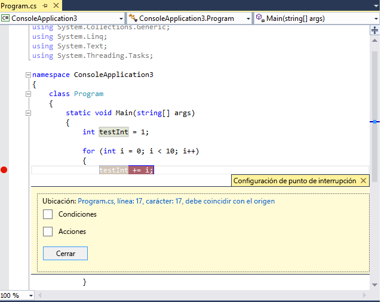
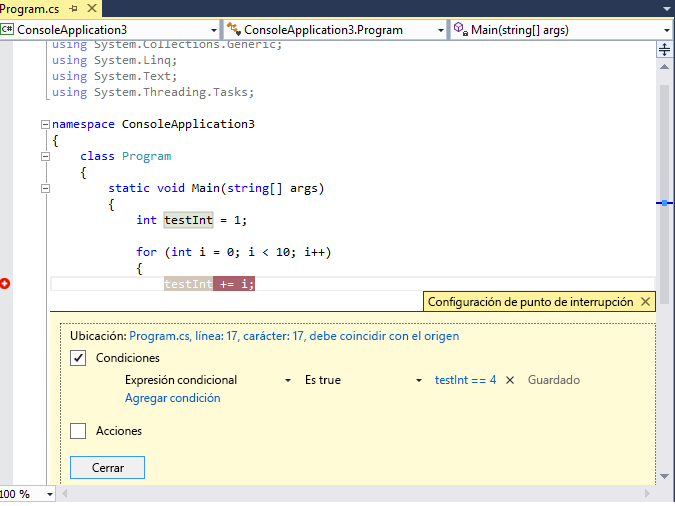
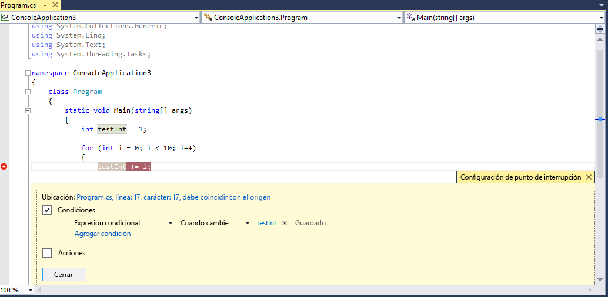
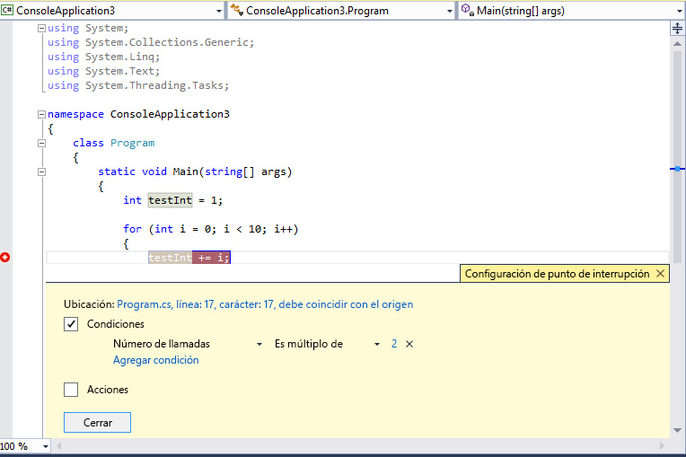

# <a name="use-breakpoints-in-the-visual-studio-debugger"></a>Utilizar puntos de interrupción en el depurador de Visual Studio
Los puntos de interrupción son una de las técnicas de depuración más importantes en el cuadro de herramientas de desarrollador. Establecer puntos de interrupción donde desee pausar la ejecución del depurador. Por ejemplo, es posible que desee ver el estado de las variables del código o examine la pila de llamadas en un determinado punto de interrupción. Si esta es la primera vez que intenta depurar código, le recomendamos que lea [Depuración para principiantes sin experiencia](../debugger/debugging-absolute-beginners.md) antes de continuar con este artículo.

##  <a name="BKMK_Overview"></a> Establezca puntos de interrupción en el código fuente
 Los puntos de interrupción pueden establecerse en cualquier línea de código ejecutable. Por ejemplo, en el siguiente código de C#, podría establecer un punto de interrupción en la declaración de variable, el `for` bucle o cualquier código dentro de la `for` bucle. No se puede establecer un punto de interrupción en las declaraciones de espacio de nombres o clase, o en la firma del método.

 Para establecer un punto de interrupción en el código fuente, haga clic en el margen izquierdo junto a una línea de código. También puede seleccionar la línea y presione **F9**, seleccione **depurar** > **Alternar puntos de interrupción**, o haga clic en y seleccione **delpuntodeinterrupción**  >  **Insertar punto de interrupción**. El punto de interrupción aparece como un punto rojo en el margen izquierdo.

En C# automáticamente se resaltan el código, el punto de interrupción y líneas de ejecución actual. Para C++ código, puede activar el resaltado de punto de interrupción y líneas actuales seleccionando **herramientas** (o **depurar**) > **opciones**  >  **Depuración** >  **resaltar la línea de código fuente completo para los puntos de interrupción y la instrucción actual (C++ sólo)**.

 

 Al depurar, la ejecución se detiene en el punto de interrupción antes de ejecutar el código en esa línea. El símbolo de punto de interrupción muestra una flecha amarilla.

 En el punto de interrupción en el ejemplo siguiente, el valor de `testInt` aún es 1.

 

 Cuando el depurador se detiene en el punto de interrupción, puede mirar el estado actual de la aplicación, incluidos los valores de variable y la pila de llamadas. Para obtener más información acerca de la pila de llamadas, vea [Cómo: Utilice la ventana Pila de llamadas](../debugger/how-to-use-the-call-stack-window.md).

- El punto de interrupción es un botón de alternancia. Puede hacer clic en él y presione **F9**, o bien usar **depurar** > **Alternar puntos de interrupción** para eliminar o volver a insertarlo.

- Para deshabilitar un punto de interrupción sin eliminarla, mantenga el mouse sobre o haga clic en él y seleccione **deshabilitar punto de interrupción**. Puntos de interrupción deshabilitados aparecen como puntos vacíos en el margen izquierdo o el **puntos de interrupción** ventana. Para volver a habilitar un punto de interrupción, mantenga el mouse sobre o haga clic en él y seleccione **Habilitar punto de interrupción**.

- Establecer condiciones y acciones, agregar y editar etiquetas o exportar un punto de interrupción, haga clic en él y seleccionando el comando correspondiente, o al mantener el mouse sobre él y seleccionando la **configuración** icono.

##  <a name="BKMK_Set_a_breakpoint_in_a_function"></a> Establecer puntos de interrupción del depurador de windows

También puede establecer puntos de interrupción desde el **pila de llamadas** y **desensamblado** ventanas del depurador.

### <a name="BKMK_Set_a_breakpoint_in_the_call_stack_window"></a> Establezca un punto de interrupción en la ventana Pila de llamadas

 Para interrumpir en la instrucción o línea que devuelve una función que realiza la llamada a, puede establecer un punto de interrupción el **pila de llamadas** ventana.

**Para establecer un punto de interrupción en la ventana Pila de llamadas:**

1. Para abrir el **pila de llamadas** ventana, se debe poner en pausa durante la depuración. Seleccione **depurar** > **Windows** > **pila de llamadas**, o bien presione **Ctrl** + **Alt**+**C**.

2. En el **pila de llamadas** ventana, haga clic en la función de llamada y seleccione **punto de interrupción** > **Insertar punto de interrupción**, o bien presione **F9**.

   Aparece un símbolo de punto de interrupción junto al nombre de la llamada de función en el margen izquierdo de la pila de llamadas.

El punto de interrupción de la pila de llamadas aparece en el **puntos de interrupción** ventana como una dirección con una ubicación de memoria que corresponde a la siguiente instrucción ejecutable de la función.

El depurador se interrumpe en la instrucción.

Para obtener más información acerca de la pila de llamadas, vea [Cómo: Utilice la ventana Pila de llamadas](../debugger/how-to-use-the-call-stack-window.md).

Visualmente traza puntos de interrupción durante la ejecución de código, vea [asignar métodos en la pila de llamadas durante la depuración](../debugger/map-methods-on-the-call-stack-while-debugging-in-visual-studio.md).

### <a name="set-a-breakpoint-in-the-disassembly-window"></a>Establezca un punto de interrupción en la ventana Desensamblado

1. Para abrir el **desensamblado** ventana, se debe poner en pausa durante la depuración. Seleccione **depurar** > **Windows** > **desensamblado**, o bien presione **Alt** + **8**.

2. En el **desensamblado** ventana, haga clic en el margen izquierdo de la instrucción que desea interrumpir la ejecución. También puede seleccionarlo y presionar **F9**, o haga clic en y seleccione **punto de interrupción** > **Insertar punto de interrupción**.

##  <a name="BKMK_Set_a_breakpoint_in_a_source_file"></a> Establezca puntos de interrupción de función

  Puede interrumpir la ejecución cuando se llama a una función.

**Para establecer un punto de interrupción de función:**

1. Seleccione **depurar** > **nuevo punto de interrupción** > **punto de interrupción de función**, o bien presione **Alt** + **F9** > **Ctrl**+**B**.

   También puede seleccionar **New** > **punto de interrupción de función** en el **puntos de interrupción** ventana.

1. En el **nuevo punto de interrupción de función** cuadro de diálogo, escriba el nombre de función en el **nombre de la función** cuadro.

   Para restringir la especificación de función:

   - Use el nombre de función completo.

     Ejemplo:  `Namespace1.ClassX.MethodA()`

   - Agregue los tipos de parámetro de una función sobrecargada.

     Ejemplo:  `MethodA(int, string)`

   - Utilice el '!' símbolo para especificar el módulo.

     Ejemplo: `App1.dll!MethodA`

   - Use el operador de contexto en C++ nativo.

     `{function, , [module]} [+<line offset from start of method>]`

     Ejemplo: `{MethodA, , App1.dll}+2`

1. En el **lenguaje** lista desplegable, elija el idioma de la función.

1. Seleccione **Aceptar**.

### <a name="set-a-function-breakpoint-using-a-memory-address-native-c-only"></a>Establecer un punto de interrupción de función mediante una dirección de memoria (solo C++ nativo)
 Puede usar la dirección de un objeto para establecer un punto de interrupción de función en un método llamado por una instancia específica de una clase.  Por ejemplo, dado un objeto de tipo direccionable `my_class`, puede establecer un punto de interrupción de función en el `my_method` método que llama a la instancia.

1.  Establecer un punto de interrupción en algún lugar después de que se crea una instancia de la instancia de la clase.

2.  Buscar la dirección de la instancia (por ejemplo, `0xcccccccc`).

3.  Seleccione **depurar** > **nuevo punto de interrupción** > **punto de interrupción de función**, o bien presione **Alt** + **F9** > **Ctrl**+**B**.

4.  Agregue lo siguiente a la **nombre de la función** cuadro y seleccione **C++** lenguaje.

    ```C++
    ((my_class *) 0xcccccccc)->my_method
    ```
::: moniker range=">= vs-2019"

## <a name="BKMK_set_a_data_breakpoint_managed"></a>Establecer puntos de interrupción de datos (.NET Core 3.0 o posterior)

Los puntos de interrupción de datos interrumpen la ejecución cuando cambia la propiedad de un objeto específico.

**Para establecer un punto de interrupción de datos**

1. En un proyecto .NET Core, inicie la depuración y espere hasta que se alcanza un punto de interrupción.

2. En el la **automático**, **inspección**, o **variables locales** ventana, haga clic en una propiedad y seleccione **interrumpir cuando cambia el valor de** en el menú contextual.

    

Los puntos de interrupción de datos en .NET Core no funcionarán para:

- Propiedades que no se pueden expandir en la información sobre herramientas, las variables locales, automático, o inspección (ventana)
- Variables estáticas
- Clases con el atributo DebuggerTypeProxy
- Campos dentro de structs 

::: moniker-end

## <a name="BKMK_set_a_data_breakpoint_native_cplusplus"></a>Establecer puntos de interrupción de datos (solo C++ nativo)

 Los puntos de interrupción de datos interrumpen la ejecución cuando un valor almacenado en cambia una dirección de memoria especificada. Si el valor se lee pero no cambia, la ejecución no se interrumpe.

**Para establecer un punto de interrupción de datos:**

1.  En un proyecto de C++, iniciar la depuración y espere hasta que se alcanza un punto de interrupción. En el **depurar** menú, elija **nuevo punto de interrupción** > **punto de interrupción de datos**

    También puede seleccionar **New** > **punto de interrupción de datos** en el **puntos de interrupción** ventana o haga clic en un elemento en el **automático**, **Inspección**, o **variables locales** ventana y seleccione **interrumpir cuando cambia el valor de**en el menú contextual.

2.  En el cuadro **Dirección**, escriba una dirección de la memoria o una expresión que se evalúe como una dirección de memoria. Por ejemplo, escriba `&avar` para que se produzca una interrupción cuando cambie el contenido de la variable `avar` .

3.  En el desplegable **Recuento de bytes** , seleccione el número de bytes que desea que el depurador inspeccione. Por ejemplo, si selecciona **4**, el depurador inspeccionará cuatro bytes a partir de `&avar` e interrumpirá la ejecución si alguno de esos bytes cambia de valor.

Los puntos de interrupción de datos no funcionan en las siguientes condiciones:
-   Si un proceso que no se está depurando escribe en la ubicación de la memoria.
-   Si la ubicación de la memoria se comparte entre dos o más procesos.
-   Si la ubicación de la memoria se actualiza dentro del kernel. Por ejemplo, si se pasa memoria a la Windows de 32 bits `ReadFile` función, la memoria se actualizará desde el modo de kernel, por lo que el depurador no interrumpirá en la actualización.

>[!NOTE]
>- Los puntos de interrupción de datos dependen de direcciones de memoria concreta. Cambia la dirección de una variable de una sesión de depuración a la siguiente, por lo que los puntos de interrupción de datos se deshabilitan automáticamente al final de cada sesión de depuración.
>
>- Si se establece un punto de interrupción de datos en una variable local, el punto de interrupción se mantiene habilitado cuando finaliza la función, pero la dirección de memoria ya no es aplicable, por lo que el comportamiento del punto de interrupción es imprevisible. Si establece un punto de interrupción de datos en una variable local, debe eliminar o deshabilitar el punto de interrupción antes de que finalice la función.

##  <a name="BKMK_Specify_advanced_properties_of_a_breakpoint_"></a> Administrar puntos de interrupción en la ventana Puntos de interrupción

 Puede usar el **puntos de interrupción** ventana para ver y administrar todos los puntos de interrupción en la solución. Esta ubicación centralizada es especialmente útil en una solución grande o para escenarios de depuración complejos que los puntos de interrupción son muy importantes.

En el **puntos de interrupción** ventana, puede buscar, ordenar, filtrar, habilitar o deshabilitar o eliminar puntos de interrupción. También puede establecer las condiciones y acciones, o agregar una nueva función o un punto de interrupción de datos.

Para abrir el **puntos de interrupción** ventana, seleccione **depurar** > **Windows** > **puntos de interrupción**, o bien presione  **ALT**+**F9** o **Ctrl**+**Alt**+**B**.


Para seleccionar las columnas para mostrar en el **puntos de interrupción** ventana, seleccione **mostrar columnas**. Seleccione un encabezado de columna para ordenar la lista de puntos de interrupción por esa columna.

###  <a name="BKMK_Set_a_breakpoint_at_a_function_return_in_the_Call_Stack_window"></a> Etiquetas de puntos de interrupción
Puede utilizar etiquetas para ordenar y filtrar la lista de puntos de interrupción en el **puntos de interrupción** ventana.

1. Para agregar una etiqueta a un punto de interrupción, haga clic en el punto de interrupción en el código fuente o el **puntos de interrupción** ventana y, a continuación, seleccione **editar etiquetas**. Agregar una nueva etiqueta o seleccione uno existente y, a continuación, seleccione **Aceptar**.
2. Ordenar la lista de punto de interrupción en el **puntos de interrupción** ventana seleccionando la **etiquetas**, **condiciones**, o en otros encabezados de columna. Puede seleccionar las columnas para mostrar seleccionando **mostrar columnas** en la barra de herramientas.

### <a name="export-and-import-breakpoints"></a>Exportar e importar puntos de interrupción
 Para guardar o compartir el estado y la ubicación de los puntos de interrupción, puede exportar o importarlos.

- Para exportar un punto de interrupción en un archivo XML, haga clic en el punto de interrupción en el código fuente o **puntos de interrupción** ventana y seleccione **exportar** o **exportación seleccionado**. Seleccione una ubicación de exportación y, a continuación, seleccione **guardar**. La ubicación predeterminada es la carpeta de soluciones.
- Para exportar varios puntos de interrupción en el **puntos de interrupción** ventana, seleccione las casillas situadas junto a los puntos de interrupción, o escriba los criterios de búsqueda en el **búsqueda** campo. Seleccione el **exportar todos los puntos de interrupción que cumplen los criterios de búsqueda actual** icono y guarde el archivo.
- Para exportar todos los puntos de interrupción, anule la selección de todos los cuadros y dejar el **búsqueda** campo en blanco. Seleccione el **exportar todos los puntos de interrupción que cumplen los criterios de búsqueda actual** icono y guarde el archivo.
- Para importar puntos de interrupción, en el **puntos de interrupción** ventana, seleccione el **Importar puntos de interrupción de un archivo** icono, navegue hasta la ubicación del archivo XML y seleccione **abierto**.

##  <a name="breakpoint-conditions"></a>Condiciones de punto de interrupción
 La definición de condiciones le permite controlar cuándo y dónde se ejecuta un punto de interrupción. La condición puede ser cualquier expresión válida que reconozca el depurador. Para más información sobre las expresiones válidas, vea [Expresiones en el depurador de Visual Studio](../debugger/expressions-in-the-debugger.md).

**Para establecer una condición de punto de interrupción:**

1. Haga clic en el símbolo de punto de interrupción y seleccione **condiciones**. O mantenga el puntero sobre el símbolo de punto de interrupción, seleccione el **configuración** icono y, a continuación, seleccione **condiciones** en el **configuración de punto de interrupción** ventana.

   También puede establecer condiciones la **puntos de interrupción** ventana haciendo clic en un punto de interrupción y seleccione **configuración**y, a continuación, seleccione **condiciones**.

   

2. En la lista desplegable, seleccione **expresión condicional**, **recuento de visitas**, o **filtro**y establezca el valor en consecuencia.

3. Seleccione **cerrar** o presione **Ctrl**+**ENTRAR** para cerrar el **configuración de punto de interrupción** ventana. O bien, en el **puntos de interrupción** ventana, seleccione **Aceptar** para cerrar el cuadro de diálogo.

Puntos de interrupción con el conjunto de condiciones aparecen con un **+** símbolo en el código fuente y **puntos de interrupción** windows.

<a name="BKMK_Specify_a_breakpoint_condition_using_a_code_expression"></a>
### <a name="conditional-expression"></a>Expresión condicional

Al seleccionar **expresión condicional**, puede elegir entre dos condiciones: **Es true** o **cuando cambia**. Elija **es true** para interrumpir cuando se cumple la expresión, o **cuando cambia** para interrumpir cuando el valor de la expresión ha cambiado.

 En el ejemplo siguiente, se alcanza el punto de interrupción solo cuando el valor de `testInt` es **4**:

 

 En el ejemplo siguiente, se alcanza el punto de interrupción solo cuando el valor de `testInt` cambios:

 

 Si se establece una condición de punto de interrupción con una sintaxis no válida, aparecerá un mensaje de advertencia. Si se especifica una condición de punto de interrupción con una sintaxis válida pero una semántica no válida, aparecerá un mensaje de advertencia la primera vez que se visite el punto de interrupción. En cualquier caso, el depurador se interrumpe cuando llega el punto de interrupción no válido. El punto de interrupción se omitirá únicamente si la condición es válida y se evalúa como `false`.

 >[!NOTE]
 >El comportamiento del campo **Cuando cambie** es diferente según el lenguaje de programación.
 >- Para código nativo, el depurador no considerará la primera evaluación de la condición como cambio, por lo que no se visitará el punto de interrupción en la primera evaluación.
 >- Para código administrado, el depurador llega al punto de interrupción en la primera evaluación después de **cuando cambia** está seleccionada.

### <a name="using-object-ids-in-conditional-expressions-c-and-f-only"></a>Uso de identificadores de objeto en las expresiones condicionales (C# y F# solo)
 Hay veces cuando desee observar el comportamiento de un objeto específico. Por ejemplo, es posible que desee averiguar por qué un objeto se insertó en una colección de más de una vez. En C# y F#, puede crear identificadores de objeto para instancias específicas de [tipos de referencia](/dotnet/csharp/language-reference/keywords/reference-types) y usarlos en condiciones de punto de interrupción. Los servicios de depuración de Common Language Runtime (CLR) generan el identificador de objeto y lo asocian al objeto.

**Para crear un identificador de objeto:**

1. Establecer un punto de interrupción en el código de algún lugar una vez creado el objeto.

2. Inicie la depuración y cuando la ejecución se detiene en el punto de interrupción, seleccione **depurar** > **Windows** > **variables locales** o **Alt** + **4** para abrir el **variables locales** ventana.

   Busque el punto de interrupción en el **variables locales** ventana, haga clic en él y seleccione **Make Object ID**.

   Debería ver el símbolo **$** junto con un número en la ventana **Locales** . Este es el identificador del objeto.

3. Agregar un nuevo punto de interrupción en el punto que desea investigar; Por ejemplo, cuando el objeto es que se agregarán a la colección. Haga clic con el botón derecho en el punto de interrupción y seleccione **Condiciones**.

4. Use el identificador de objeto en el campo **Expresión condicional**. Por ejemplo, si la variable `item` es el objeto que se agregarán a la colección, seleccione **es true** y tipo **item == $\<n >**, donde \<n > es el número de Id. de objeto .

   La ejecución se interrumpirá en el punto cuando ese objeto se agregue a la colección.

   Para eliminar el identificador de objeto, haga clic en la variable en el **variables locales** ventana y seleccione **eliminar el identificador del objeto**.

>[!NOTE]
>Los identificadores de objeto crean referencias débiles y no impiden que el objeto se recopile en la recolección de elementos no utilizados. Los identificadores de objeto solo son válidos para la sesión de depuración actual.

### <a name="hit-count"></a>Número de llamadas
 Si sospecha que un bucle del código inicia un comportamiento erróneo después de cierto número de iteraciones, puede establecer un punto de interrupción para detener la ejecución después de ese número de aciertos, en lugar de tener que presionar repetidamente **F5** para llegar a esa iteración.

 En **condiciones** en el **configuración de punto de interrupción** ventana, seleccione **recuento de visitas**y, a continuación, especifique el número de iteraciones. En el ejemplo siguiente, se establece el punto de interrupción se alcanza únicamente cada dos iteraciones:

 

### <a name="filter"></a>Filtro
Puede restringir un punto de interrupción para que se active solo en los dispositivos especificados, o bien en los procesos y subprocesos especificados.

En **condiciones** en el **configuración de punto de interrupción** ventana, seleccione **filtro**y, a continuación, escriba una o varias de las siguientes expresiones:

-   MachineName = "name"
-   ProcessId = value
-   ProcessName = "name"
-   ThreadId = value
-   ThreadName = "name"

Incluya los valores de cadena entre comillas dobles. Puede combinar las cláusulas con `&` (AND), `||` (OR), `!` (NOT) y paréntesis.

##  <a name="BKMK_Print_to_the_Output_window_with_tracepoints"></a> Acciones de punto de interrupción y puntos de seguimiento
 Un *punto de seguimiento* es un punto de interrupción que imprime un mensaje en la ventana **Salida**. Un punto de seguimiento puede actuar como una instrucción de seguimiento temporal en el lenguaje de programación.

**Para establecer un punto de seguimiento:**

1. Haga clic en un punto de interrupción y seleccione **acciones**. O bien, en el **configuración de punto de interrupción** ventana, mantenga el puntero sobre el punto de interrupción, seleccione el **configuración** icono y, a continuación, seleccione **acciones**.

1. Escriba un mensaje en el **registrar un mensaje en la ventana de salida** campo. El mensaje puede incluir cadenas de texto genérico, los valores de variables o expresiones entre llaves y especificadores de formato ([C#](../debugger/format-specifiers-in-csharp.md) y [C++](../debugger/format-specifiers-in-cpp.md)) para los valores.

   También puede usar las siguientes palabras clave especiales en el mensaje:

   - **$ADDRESS** : instrucción actual
   - **$CALLER** -nombre de la función que realiza la llamada
   - **$CALLSTACK** : pila de llamadas
   - **$FUNCTION** -nombre de la función actual
   - **$PID** -Id. de proceso
   - **$PNAME** -nombre del proceso
   - **$TID** -Id. de subproceso
   - **$TNAME** -nombre de subproceso
   - **$TICK** -recuento de graduación (desde Windows `GetTickCount`)

1. Para imprimir el mensaje a la **salida** ventana sin interrupción, seleccione el **continuar la ejecución** casilla de verificación. Para imprimir el mensaje y detendrá la ejecución en el punto de seguimiento, desactive la casilla de verificación.

Puntos de seguimiento aparecen como diamantes rojo en el margen izquierdo del código fuente y **puntos de interrupción** windows.

## <a name="see-also"></a>Vea también

- [¿Qué es la depuración?](../debugger/what-is-debugging.md)
- [Escribir mejor C# código con Visual Studio](../debugger/write-better-code-with-visual-studio.md)
- [Primer vistazo a la depuración](../debugger/debugger-feature-tour.md)
- [Solución de problemas de puntos de interrupción en el depurador de Visual Studio](../debugger/troubleshooting-breakpoints.md)