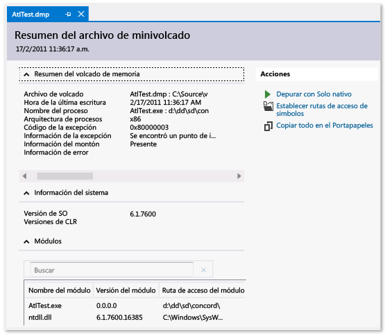

# Archivos de volcado de memoria en el depurador de Visual Studio

 Un *archivo de volcado* es una instantánea que muestra el proceso que se estaba ejecutando y los módulos que se cargaron para una aplicación en un momento dado. Un volcado de memoria con información del montón también incluye una instantánea de memoria de la aplicación en ese momento.

Abrir un archivo de volcado de memoria con un montón en Visual Studio es algo parecido a detenerse en un punto de interrupción en una sesión de depuración. Aunque no puede continuar la ejecución, puede examinar las pilas, subprocesos y los valores de variable de la aplicación en el momento del volcado de memoria.

Volcados de memoria se utilizan principalmente para depurar los problemas de las máquinas que los desarrolladores no tengan acceso a. Puede usar un archivo de volcado de memoria del equipo de un cliente cuando no se puede reproducir un bloqueo o de bloqueo en su propio equipo. Evaluadores también crean volcados de memoria para guardar el bloqueo o bloqueo de datos que desea usar para realizar más pruebas.

El depurador de Visual Studio puede guardar archivos de volcado de memoria de código administrado o nativo. Pueden depurar archivos de volcado creados por Visual Studio o por otras aplicaciones que guardan archivos en el *minivolcado* formato.

##   Requisitos y limitaciones

-   Para depurar archivos de volcado de equipos de 64 bits, debe ejecutar Visual Studio en un equipo de 64 bits.

-   Visual Studio puede depurar archivos de volcado de memoria de aplicaciones nativas desde dispositivos ARM. También se pueden depurar los volcados de aplicaciones administradas desde dispositivos ARM, pero solo en el depurador nativo.

-   Para depurar [modo kernel](/windows-hardware/drivers/debugger/kernel-mode-dump-files) los archivos de volcado o usar el [SOS.dll](/dotnet/framework/tools/sos-dll-sos-debugging-extension) depurar la extensión en Visual Studio, descargue las herramientas de depuración para Windows en el [Windows Driver Kit (WDK)](/windows-hardware/drivers/download-the-wdk).

-   Visual Studio no puede depurar archivos de volcado guardados en el antiguo [volcado completo en modo usuario](/windows/desktop/wer/collecting-user-mode-dumps) formato. Un volcado completo en modo usuario no es igual que un volcado de memoria con montón.

-   La depuración de archivos de volcado de memoria de código optimizado puede resultar confusa. Por ejemplo, la inclusión en línea de funciones por parte del compilador puede dar lugar a pilas de llamadas inesperadas y otras optimizaciones podrían cambiar la duración de las variables.

##   Archivos de volcado de memoria, con o sin montones

Archivos de volcado de memoria pueden tengan o no información del montón.

-   **Los archivos con montones de volcado** contienen una instantánea de memoria de la aplicación, incluidos los valores de variables, en el momento del volcado de memoria. Visual Studio también guarda los archivos binarios de los módulos nativos cargados en un archivo de volcado de memoria con un montón, lo que puede hacer mucho más la depuración. Visual Studio puede cargar símbolos desde un archivo de volcado de memoria con un montón, incluso si no se puede encontrar una aplicación binaria.

-   **Archivos sin montones de volcado** son mucho menores que los volcados de memoria con montones, pero el depurador debe cargar los archivos binarios de aplicación para buscar información de símbolos. Los archivos binarios cargados deben coincidir exactamente con el que se ejecutan durante la creación del volcado de memoria. Archivos de volcado de memoria sin montones guardan los valores de las variables de pila.

##   Crear un archivo de volcado de memoria

Mientras se depura un proceso en Visual Studio, puede guardar un volcado de memoria cuando el depurador se ha detenido en una excepción o un punto de interrupción.

Con [depuración Just](../debugger/just-in-time-debugging-in-visual-studio.md) habilitado, puede asociar el depurador de Visual Studio a un proceso bloqueado fuera de Visual Studio y, a continuación, guardar un archivo de volcado de memoria desde el depurador. Consulte [adjuntar a procesos en ejecución](../debugger/attach-to-running-processes-with-the-visual-studio-debugger.md).

**Para guardar un archivo de volcado de memoria:**

1. Mientras está detenido en un punto de interrupción o un error durante la depuración, seleccione **depurar** > **Guardar volcado como**.

1. En el **Guardar volcado como** cuadro de diálogo **Guardar como tipo**, seleccione **minivolcado** o **minivolcado con montón** (predeterminado).

1. Busque una ruta de acceso y seleccione un nombre para el archivo de volcado de memoria y, a continuación, seleccione **guardar**.

>[!NOTE]
>Puede crear archivos de volcado de memoria con cualquier programa que admita el formato de minivolcado de Windows. Por ejemplo, la utilidad de línea de comandos **Procdump** de [Windows Sysinternals](http://technet.microsoft.com/sysinternals/default) puede crear archivos de volcado de memoria correspondientes a bloqueos de procesos basados en desencadenadores o a petición. Consulte [requisitos y limitaciones](../debugger/using-dump-files.md#BKMK_Requirements_and_limitations) para obtener información sobre cómo usar otras herramientas para crear archivos de volcado de memoria.

##   Abrir un archivo de volcado de memoria

1. En Visual Studio, seleccione **archivo** > **abierto** > **archivo**.

1. En el cuadro de diálogo **Abrir archivo**, busque y seleccione el archivo de volcado de memoria. Normalmente, tendrá la extensión *.dmp*. Seleccione **Aceptar**.

   El **resumen del archivo de minivolcado** ventana muestra información de resumen y el módulo para el archivo de volcado de memoria y las acciones que puede realizar.

   

1. En **acciones**:
   - Para establecer la carga de las ubicaciones de símbolos, seleccione **establecer rutas de acceso de símbolos**.
   - Para iniciar la depuración, seleccione **depurar con solo administrados**, **depurar con solo nativo**, **depurar con mixto**, o **depurar con memoria administrada**.

##   Encontrar el .exe, .pdb y archivos de código fuente

Para usar las características de un archivo de volcado de depuración completa Visual Studio necesita:

- El *.exe* se creó el volcado de memoria para el archivo y otros archivos binarios (archivos DLL, etc.) que utiliza el proceso de volcado de memoria.
- Archivos de símbolos (*.pdb*) del archivo *.exe* y otros archivos binarios.
- El *.exe* y *.pdb* archivos que coincidan con la versión y compilación de los archivos en la creación de volcado de memoria.
- Archivos de origen para los módulos correspondientes. Puede usar el desensamblado de los módulos si no encuentra los archivos de origen.

Si el volcado de memoria tiene datos de montón, Visual Studio puede solventar el problema que falten archivos binarios de algunos módulos, pero debe tener los archivos binarios para suficientes módulos para generar pilas de llamadas válidas.

### Rutas de búsqueda para los archivos .exe

Visual Studio busca automáticamente en estas ubicaciones para *.exe* archivos que no están incluidos en el archivo de volcado:

1. La carpeta que contiene el archivo de volcado de memoria.
2. La ruta de acceso del módulo que especifica el archivo de volcado de memoria, que es la ruta de acceso del módulo en el equipo que recopilan el volcado de memoria.
3. Las rutas de acceso de símbolos especificadas en **herramientas** (o **depurar**) > **opciones** > **depuración**  >  **Símbolos**. También puede abrir el **símbolos** página desde la **acciones** panel de la **resumen del archivo de volcado de memoria** ventana. En esta página, puede agregar más ubicaciones de búsqueda.

### Use las páginas No binarias, No se cargaron símbolos o se encontró ningún origen

Si Visual Studio no encuentra los archivos que necesita depurar un módulo en el volcado de memoria, muestra un **se encontró ningún binario**, **No se encontraron símbolos**, o **se encontró ningún origen** página. Estas páginas proporcionan información detallada sobre la causa del problema y proporcionan vínculos de acción que pueden ayudarle a localizar los archivos. Consulte [Specify symbol (.pdb) and source files](../debugger/specify-symbol-dot-pdb-and-source-files-in-the-visual-studio-debugger.md) (Especificación de símbolo (.pdb) y archivos de origen).

## Vea también

- [Depuración Just-In-Time](../debugger/just-in-time-debugging-in-visual-studio.md)
- [Especificación de archivos de código fuente y símbolos (.pdb)](../debugger/specify-symbol-dot-pdb-and-source-files-in-the-visual-studio-debugger.md)
- [IntelliTrace](../debugger/intellitrace.md)