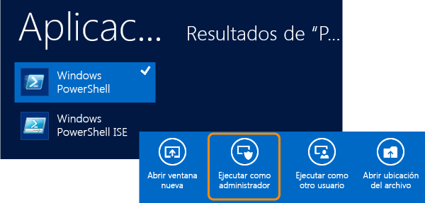
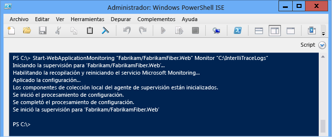
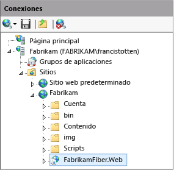
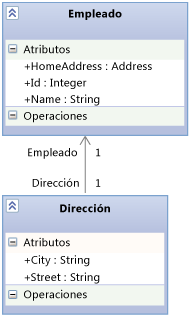

# <a name="using-the-microsoft-monitoring-agent-c-visual-basic"></a>Uso de Microsoft Monitoring Agent (C#, Visual Basic)

Puede usar **Microsoft Monitoring Agent**para supervisar localmente las aplicaciones web ASP.NET hospedadas en IIS y las aplicaciones de SharePoint 2010 o 2013 y comprobar si tienen errores, problemas de rendimiento u otro tipo de problemas. Puede guardar eventos de diagnóstico del agente en un archivo de registro de IntelliTrace (.iTrace). Después podrá abrir el registro en Visual Studio Enterprise (pero no en las versiones de Visual Studio Professional o Community) para depurar los problemas con todas las herramientas de diagnóstico de Visual Studio. También puede recopilar datos de diagnóstico de IntelliTrace y datos sobre métodos si ejecuta el agente en modo **Trace** . El agente de supervisión de Microsoft puede integrarse con [Application Insights](/azure/application-insights/) y [System Center Operation Manager](/previous-versions/system-center/system-center-2012-R2/hh205987(v=sc.12)). Microsoft Monitoring Agent sí modifica el entorno del sistema de destino cuando se instala.

> [!NOTE]
> También puede recopilar datos de diagnóstico y de método de IntelliTrace para aplicaciones web, de Sharepoint, de WPF y de Windows Forms en equipos remotos sin cambiar el entorno de destino; para ello, use el **recolector independiente IntelliTrace**. El recolector independiente tiene un mayor impacto en el rendimiento que Microsoft Monitoring Agent en modo **Monitor** . Vea [Uso del recopilador independiente de IntelliTrace](../debugger/using-the-intellitrace-stand-alone-collector.md).

 Si usa System Center 2012, utilice Microsoft Monitoring Agent con Operations Manager para obtener alertas sobre los problemas y crear elementos de trabajo de Team Foundation Server con vínculos a los registros de IntelliTrace guardados. Luego podrá asignar estos elementos de trabajo a otros para una depuración más exhaustiva. Vea [Integración de Operations Manager con procesos de desarrollo](/previous-versions/system-center/system-center-2012-R2/jj614609(v=sc.12)) y la página de [Supervisión con el Agente de Microsoft Monitoring](/previous-versions/system-center/system-center-2012-R2/dn465153(v=sc.12)).

 Antes de empezar, compruebe que tiene el código fuente y los símbolos correspondientes para el código compilado e implementado. Esto le ayudará a ir directamente al código de la aplicación al iniciar la depuración y examinar los eventos de diagnóstico en el registro de IntelliTrace. [Configure las compilaciones](../debugger/diagnose-problems-after-deployment.md) para que Visual Studio puede encontrar y abrir automáticamente el código fuente correspondiente para el código implementado.

1. [Paso 1: Configuración de Microsoft Monitoring Agent](#SetUpMonitoring)

2. [Paso 2: Inicio de la supervisión de la aplicación](#MonitorEvents)

3. [Paso 3: Guardar los eventos registrados](#SaveEvents)

## <a name="step-1-set-up-microsoft-monitoring-agent"></a><a name="SetUpMonitoring"></a> Paso 1: Configuración de Microsoft Monitoring Agent

 Configure el agente independiente en el servidor web para realizar la supervisión local sin modificar la aplicación. Si usa System Center 2012, vea [Instalar Microsoft Monitoring Agent](/previous-versions/system-center/system-center-2012-R2/dn465156(v=sc.12)).

### <a name="set-up-the-standalone-agent"></a><a name="SetUpStandaloneMMA"></a> Configurar el agente independiente

1. Asegúrese de que:

    - El servidor web ejecuta [versiones compatibles de Internet Information Services (IIS)](/previous-versions/system-center/system-center-2012-R2/dn465154(v=sc.12)).

    - El servidor web tiene .NET Framework 3.5, 4 o 4.5.

    - El servidor web está ejecutando Windows PowerShell 3.0 o posterior. [P: ¿Qué ocurre si uso Windows PowerShell 2.0?](#PowerShell2)

    - Tiene permisos administrativos en el servidor web para ejecutar comandos de PowerShell y para reciclar el grupo de aplicaciones al iniciar la supervisión.

    - Ha desinstalado cualquier versión anterior de Microsoft Monitoring Agent.

2. [Descargue la aplicación gratuita Microsoft Monitoring Agent](https://www.microsoft.com/download/details.aspx?id=40316), bien la versión de 32 bits **MMASetup-i386.exe** o la de 64 bits **MMASetup-AMD64.exe**, del Centro de descarga de Microsoft al servidor web.

3. Ejecute el ejecutable descargado para iniciar el asistente para la instalación.

4. Cree un directorio seguro en el servidor web para almacenar los registros de IntelliTrace, por ejemplo, **C:\IntelliTraceLogs**.

     Asegúrese de crear este directorio antes de iniciar la supervisión. Para evitar ralentizar la aplicación, elija una ubicación en un disco de alta velocidad local que no sea muy activo.

    > [!IMPORTANT]
    > Los registros de IntelliTrace podrían contener datos personales y confidenciales. Restrinja el acceso a este directorio a las identidades que deben usar los archivos. Compruebe las directivas de privacidad de su compañía.

5. Para ejecutar una supervisión detallada en el nivel de función o supervisar las aplicaciones de SharePoint, asigne al grupo de aplicaciones que hospeda la aplicación web o la aplicación de SharePoint permisos de lectura y escritura al directorio del registro de IntelliTrace. [P: ¿Cómo configuro permisos para el grupo de aplicaciones?](#FullPermissionsITLog)

### <a name="q--a"></a>Preguntas y respuestas

#### <a name="q-what-if-i-have-windows-powershell-20"></a><a name="PowerShell2"></a> P: ¿Qué ocurre si uso Windows PowerShell 2.0?
 **R:** Recomendamos encarecidamente el uso de PowerShell 3.0. De lo contrario, tendrá que importar los cmdlets de PowerShell de Microsoft Monitoring Agent cada vez que ejecute PowerShell. Tampoco tendrá acceso al contenido de la Ayuda descargable.

1. Abra una ventana de símbolo del sistema de **Windows PowerShell** o **Windows PowerShell ISE** como administrador.

2. Importe el módulo de PowerShell de Microsoft Monitoring Agent desde la ubicación de instalación predeterminada:

     **PS C:>Import-Module "C:\Program Files\Microsoft Monitoring Agent\Agent\PowerShell\Microsoft.MonitoringAgent.PowerShell\Microsoft.MonitoringAgent.PowerShell.dll"**

3. [Para obtener el contenido de Ayuda más reciente, visite TechNet](/previous-versions/system-center/developer/cc817313(v=msdn.10)) .

#### <a name="q-how-do-i-set-up-permissions-for-the-application-pool"></a><a name="FullPermissionsITLog"></a> P: ¿Cómo configuro permisos para el grupo de aplicaciones?
 **R:** Use el comando **icacls** de Windows o el Explorador de Windows (o Explorador de archivos). Por ejemplo:

- Para configurar permisos con el comando **icacls** de Windows:

  - Para una aplicación web en el grupo de aplicaciones **DefaultAppPool** :

     `icacls "C:\IntelliTraceLogs" /grant "IIS APPPOOL\DefaultAppPool":RX`

  - Para una aplicación de SharePoint en el grupo de aplicaciones **SharePoint - 80** :

     `icacls "C:\IntelliTraceLogs" /grant "IIS APPPOOL\SharePoint - 80":RX`

    o bien

- Para configurar permisos con el Explorador de Windows (o el Explorador de archivos):

  1. Abra **Propiedades** para el directorio del registro de IntelliTrace.

  2. En la pestaña **Seguridad** , elija **Editar** **Agregar**.

  3. Asegúrese de que **Entidades de seguridad integradas** aparezca en el cuadro **Seleccionar este tipo de objeto** . Si no está allí, elija **Tipos de objeto** para agregarlo.

  4. Asegúrese de que el equipo local aparece en el cuadro **Desde esta ubicación** . Si no está allí, elija **Ubicaciones** para cambiarlo.

  5. En el cuadro **Escriba los nombres de objeto que desea seleccionar** , agregue el grupo de aplicaciones para la aplicación web o la aplicación de SharePoint.

  6. Elija **Comprobar nombres** para resolver el nombre. Elija **Aceptar**.

  7. Asegúrese de que el grupo de aplicaciones tenga permisos de **lectura y ejecución**.

## <a name="step-2-start-monitoring-your-app"></a><a name="MonitorEvents"></a> Paso 2: Inicio de la supervisión de la aplicación
 Use el comando [Start-WebApplicationMonitoring](/previous-versions/system-center/powershell/system-center-2012-r2/dn472749(v=sc.20)) de Windows PowerShell para iniciar la supervisión de la aplicación. Si usa System Center 2012, vea la página [Supervisión con el Agente de Microsoft Monitoring](/previous-versions/system-center/system-center-2012-R2/dn465157(v=sc.12)).

1. En el servidor web, abra una ventana de símbolo del sistema de **Windows PowerShell** o **Windows PowerShell ISE** como administrador.

     

2. Ejecute el comando [Start-WebApplicationMonitoring](/previous-versions/system-center/powershell/system-center-2012-r2/dn472749(v=sc.20)) para empezar a supervisar la aplicación. Esto reiniciará todas las aplicaciones web del servidor web.

     Esta es la sintaxis abreviada:

     **Start-WebApplicationMonitoring** *"\<appName>"* *\<monitoringMode>* *"\<outputPath>"* *\<UInt32>* *"\<collectionPlanPathAndFileName>"*

     En el ejemplo siguiente se usa únicamente el nombre de la aplicación y el modo ligero **Monitor** :

     **PS C:>Start-WebApplicationMonitoring "FabrikamFabrikamFiber.Web" Monitor "C:IntelliTraceLogs"**

     En el ejemplo siguiente se usa la ruta de acceso de IIS y el modo ligero **Monitor** :

     **PS C:>Start-WebApplicationMonitoring "IIS:sitesFabrikamFabrikamFiber.Web" Monitor "C:IntelliTraceLogs"**

     Una vez iniciada la supervisión, es posible que Microsoft Monitoring Agent haga una pausa mientras se reinician las aplicaciones.

     

    |NOMBRE|Descripción|
    |-|-|
    |*"\<appName>"*|Especifique la ruta de acceso al sitio web y el nombre de la aplicación en IIS. Puede incluir también la ruta de acceso de IIS, si lo prefiere.<br /><br /> *"\<IISWebsiteName>\\<IISWebAppName\>"*<br /><br /> o bien<br /><br /> **"IIS:\sites** *\\<IISWebsiteName\>\\<IISWebAppName\>"*<br /><br /> Puede encontrarla en el Administrador de IIS. Por ejemplo:<br /><br /> <br /><br /> También puede usar los comandos [Get-WebSite](/previous-versions/windows/it-pro/windows-server-2008-R2-and-2008/ee807832(v=technet.10)) y [Get WebApplication](/previous-versions/windows/it-pro/windows-server-2008-R2-and-2008/ee790554(v=technet.10)) .|
    |*\<monitoringMode>*|Especifique el modo de supervisión:<br /><br /> <ul><li>**Supervisión**: registra detalles mínimos sobre eventos de excepción y de rendimiento. Este modo usa el plan de recolección predeterminado.</li><li>**Seguimiento**: registra detalles en el nivel de función o supervisa aplicaciones de SharePoint 2010 y SharePoint 2013 mediante el plan de recolección especificado. Este modo puede ralentizar la ejecución de la aplicación.<br /><br /> <ul><li>[P: ¿Cómo configuro permisos para el grupo de aplicaciones?](#FullPermissionsITLog)</li><li>[P: ¿Cómo puedo obtener la mayoría de los datos sin ralentizar la aplicación?](#Minimizing)</li></ul><br />     En este ejemplo se registran eventos para una aplicación de SharePoint hospedada en un sitio de SharePoint:<br /><br />     **Start-WebApplicationMonitoring "FabrikamSharePointSite\FabrikamSharePointApp" Trace "C:\Program Files\Microsoft Monitoring Agent\Agent\IntelliTraceCollector\collection_plan.ASP.NET.default.xml" "C:\IntelliTraceLogs"**</li><li>**Personalizada**: registra detalles personalizados mediante el plan de recolección personalizado especificado. Si edita el plan de recolección una vez iniciada la supervisión, tendrá que reiniciar esta.</li></ul>|
    |*"\<outputPath>"*|Especifique la ruta de acceso completa al directorio para almacenar los registros de IntelliTrace. Asegúrese de crear este directorio antes de iniciar la supervisión.|
    |*\<UInt32>*|Especifique el tamaño máximo del registro de IntelliTrace. El tamaño máximo predeterminado de registro de IntelliTrace es 250 MB.<br /><br /> Cuando el registro alcanza este límite, el agente sobrescribe las entradas más antiguas para conseguir espacio para más entradas. Para cambiar este límite, use la opción **-MaximumFileSizeInMegabytes** o modifique el atributo `MaximumLogFileSize` del plan de recolección.|
    |*"\<collectionPlanPathAndFileName>"*|Especifique la ruta de acceso completa o relativa y el nombre de archivo del plan de recolección. Este plan es un archivo .xml que permite configurar el agente.<br /><br /> Estos planes se incluyen con el agente y se pueden usar con aplicaciones web y aplicaciones de SharePoint:<br /><br /> -   **collection_plan.ASP.NET.default.xml**<br />     Obtiene solo eventos, como excepciones, eventos de rendimiento, llamadas a la base de datos y solicitudes del servidor web.<br />-   **collection_plan.ASP.NET.trace.xml**<br />     Recopila llamadas en el nivel de función, así como todos los datos del plan de recolección predeterminado. Este plan es práctico para el análisis detallado, pero podría ralentizar la aplicación.<br /><br /> Puede encontrar versiones localizadas de estos planes en las subcarpetas del agente. También puede [personalizar estos planes o crear los suyos propios](https://devblogs.microsoft.com/devops/modifying-an-intellitrace-collection-plan-for-the-stand-alone-collector/) para evitar ralentizar la aplicación. Coloque los planes personalizados en la misma ubicación segura que el agente.<br /><br /> [P: ¿Cómo puedo obtener la mayoría de los datos sin ralentizar la aplicación?](#Minimizing)|

     Para obtener más información sobre la sintaxis completa y otros ejemplos, ejecute el comando **get-help Start-WebApplicationMonitoring –detailed** o **get-help Start-WebApplicationMonitoring –examples**.

3. Para comprobar el estado de todas las aplicaciones web supervisadas, ejecute el comando [Get-WebApplicationMonitoringStatus](/previous-versions/system-center/powershell/system-center-2012-r2/dn472751(v=sc.20)) .

### <a name="q--a"></a>Preguntas y respuestas

#### <a name="q-how-do-i-get-the-most-data-without-slowing-down-my-app"></a><a name="Minimizing"></a> P: ¿Cómo puedo obtener la mayoría de los datos sin ralentizar la aplicación?
 **R:** Microsoft Monitoring Agent puede recopilar grandes cantidades de datos y el efecto que tendrá en el rendimiento de la aplicación dependerá de los datos que decida recopilar y de cómo se recopilen. A continuación, se muestran algunas maneras de obtener la mayoría de los datos sin ralentizar la aplicación:

- En las aplicaciones web y de SharePoint, el agente registra los datos para cada aplicación web que comparte el grupo de aplicaciones especificado. Esto puede ralentizar cualquier aplicación que comparte el mismo grupo de aplicaciones, aunque puede restringir la recopilación únicamente a los módulos para una sola aplicación. Para evitar ralentizar otras aplicaciones, hospede cada aplicación en su propio grupo de aplicaciones.

- Revise los eventos para los que el agente recopila datos en el plan de recolección. Edite el plan de recolección para deshabilitar los eventos que no son pertinentes o no le interesan. Esto puede mejorar el rendimiento de inicio y el rendimiento en tiempo de ejecución.

   Para deshabilitar un evento, establezca el atributo `enabled` para el elemento `<DiagnosticEventSpecification>` en `false`:

   `<DiagnosticEventSpecification enabled="false">`

   Si no existe el atributo `enabled` , el evento está habilitado.

   Por ejemplo:

  - Deshabilite los eventos de Windows Workflow en las aplicaciones que no usan Windows Workflow.

  - Deshabilite los eventos de registro en aplicaciones que tienen acceso al registro pero no interfieren con la configuración de este.

- Revise los módulos para los que el agente recopila datos en el plan de recolección. Edite el plan de colección para incluir solo los módulos que le interesen.

   Esto reduce la cantidad de información de llamadas a métodos y otros datos de instrumentación que el agente recopila cuando se inicia la aplicación y se ejecuta. Estos datos le ayudan a recorrer el código paso a paso al depurar y revisar los valores pasados a las llamadas a funciones y los valores devueltos de estas.

  1. Abra el plan de recolección. Busque el elemento `<ModuleList>` .

  2. En `<ModuleList>`establezca el atributo `isExclusionList` en `false`.

  3. Use el elemento `<Name>` para especificar cada módulo con uno de los siguientes valores: nombre de archivo, valor de cadena para incluir cualquier módulo cuyo nombre contenga esa cadena o clave pública.

     En este ejemplo se crea una lista que recopila datos solo del módulo principal de la aplicación web Fabrikam Fibra:

  ```xml
  <ModuleList isExclusionList="false">
     <Name>FabrikamFiber.Web.dll</Name>
  </ModuleList>

  ```

   Para recopilar datos de cualquier módulo cuyo nombre incluya “Fabrikam”, cree una lista como esta:

  ```xml
  <ModuleList isExclusionList="false">
     <Name>Fabrikam</Name>
  </ModuleList>

  ```

   Para recopilar datos de módulos especificando sus tokens de clave pública, cree una lista como esta:

  ```xml
  <ModuleList isExclusionList="false">
     <Name>PublicKeyToken:B77A5C561934E089</Name>
     <Name>PublicKeyToken:B03F5F7F11D50A3A</Name>
     <Name>PublicKeyToken:31BF3856AD364E35</Name>
     <Name>PublicKeyToken:89845DCD8080CC91</Name>
     <Name>PublicKeyToken:71E9BCE111E9429C</Name>
  </ModuleList>

  ```

   **P: ¿Por qué no excluir simplemente módulos en su lugar?**

   **R:** Los planes de recolección excluyen módulos de forma predeterminada estableciendo el atributo `isExclusionList` en `true`. Sin embargo, esto podría dar lugar a que se recopilen datos de módulos que no cumplen los criterios de lista o que no interesen, como los módulos de terceros o de código abierto.

#### <a name="q-what-values-does-the-agent-collect"></a>P: ¿Qué valores recopila el agente?

**R:** Para reducir el impacto en el rendimiento, el agente recopila solo estos valores:

- Tipos de datos primitivos que se pasan a los métodos y son devueltos por estos

- Tipos de datos primitivos en campos de objetos de nivel superior que se pasan a los métodos y son devueltos por estos

Por ejemplo, suponga que tiene una signatura de método `AlterEmployee` que acepta un entero `id` y un objeto `Employee` de `oldemployee`:

`public Employee AlterEmployee(int id, Employee oldemployee)`

El tipo `Employee` tiene los atributos siguientes: `Id`, `Name`y `HomeAddress`. Existe una relación de asociación entre `Employee` y el tipo `Address` .



El agente registra los valores de `id`, `Employee.Id`, `Employee.Name` y el objeto `Employee` devuelto del método `AlterEmployee` . Sin embargo, el agente únicamente registra información sobre si es null o no el objeto `Address` . El agente tampoco registra datos sobre variables locales del método `AlterEmployee` a menos que otros métodos utilicen esas variables locales como parámetros en el punto en el que se registran como parámetros de método.

## <a name="step-3-save-recorded-events"></a><a name="SaveEvents"></a> Paso 3: Guardar los eventos registrados
 Si encuentra un error o un problema de rendimiento, guarde los eventos registrados en un registro de IntelliTrace. El agente crea el registro solo si se registró algún evento. Si usa System Center 2012, vea la página [Supervisión con el Agente de Microsoft Monitoring](/previous-versions/system-center/system-center-2012-R2/dn465157(v=sc.12)).

### <a name="save-recorded-events-but-continue-monitoring"></a>Guardar los eventos registrados pero seguir supervisando
 Siga estos pasos si desea crear el registro de IntelliTrace pero no desea reiniciar la aplicación o detener la supervisión. El agente continúa supervisando aunque el servidor o la aplicación se reinicie.

1. En el servidor web, abra una ventana del símbolo del sistema de Windows PowerShell como administrador.

2. Ejecute el comando [Checkpoint-WebApplicationMonitoring](/previous-versions/system-center/powershell/system-center-2012-r2/dn472750(v=sc.20)) para guardar una instantánea del registro de IntelliTrace:

    **Checkpoint-WebApplicationMonitoring** *"\<IISWebsiteName>\\<IISWebAppName\>"*

    \- o -

    **Checkpoint-WebApplicationMonitoring "IIS:\sites** *\\<IISWebsiteName\>\\<IISWebAppName\>"*

    Por ejemplo:

    **PS C:\\>Checkpoint-WebApplicationMonitoring "Fabrikam\FabrikamFiber.Web"**

    o bien

    **PS C:>Checkpoint-WebApplicationMonitoring "IIS:sitesFabrikamFabrikamFiber.Web"**

    Para obtener más información, ejecute el comando **get-help Checkpoint-WebApplicationMonitoring –detailed** o **get-help Checkpoint-WebApplicationMonitoring –examples**.

3. Copie el registro en una carpeta compartida segura y después abra el registro desde un equipo con Visual Studio Enterprise (pero no con las versiones Professional o Community).

   > [!IMPORTANT]
   > Tenga cuidado cuando comparta registros de IntelliTrace porque podrían contener datos personales y confidenciales. Asegúrese de que quienquiera que pueda obtener acceso a estos registros tenga permisos para consultar esos datos. Compruebe las directivas de privacidad de su compañía.

   **Siguiente:** [Diagnosticar eventos registrados en Visual Studio Enterprise](../debugger/diagnose-problems-after-deployment.md#InvestigateEvents)

### <a name="save-recorded-events-and-stop-monitoring"></a>Guardar los eventos registrados y detener la supervisión
 Siga estos pasos si únicamente desea obtener información de diagnóstico mientras se reproduce un problema concreto. Esto reiniciará todas las aplicaciones web del servidor web.

1. En el servidor web, abra una ventana del símbolo del sistema de Windows PowerShell como administrador.

2. Ejecute el comando [Stop-WebApplicationMonitoring](/previous-versions/system-center/powershell/system-center-2012-r2/dn472753(v=sc.20)) para crear el registro de IntelliTrace y detener la supervisión de una aplicación web determinada:

    **Stop-WebApplicationMonitoring** *"\<IISWebsiteName>\\<IISWebAppName\>"*

    \- o -

    **Stop-WebApplicationMonitoring "IIS:\sites** *\\<IISWebsiteName\>\\<IISWebAppName\>"*

    O para detener la supervisión de todas las aplicaciones web:

    **Stop-WebApplicationMonitoring -All**

    Por ejemplo:

    **PS C:\\>Stop-WebApplicationMonitoring "Fabrikam\iFabrikamFiber.Web"**

    \- o -

    **PS C:\\>Stop-WebApplicationMonitoring "IIS:\sites\Fabrikam\FabrikamFiber.Web"**

    Para obtener más información, ejecute el comando **get-help Stop-WebApplicationMonitoring –detailed** o **get-help Stop-WebApplicationMonitoring –examples**.

3. Copie el registro en una carpeta compartida segura y después abra el registro desde un equipo con Visual Studio Enterprise.

   **Siguiente:** [Diagnosticar eventos registrados en Visual Studio Enterprise](../debugger/diagnose-problems-after-deployment.md#InvestigateEvents)

## <a name="q--a"></a>Preguntas y respuestas

### <a name="q-where-can-i-get-more-information"></a>P: ¿Dónde puedo obtener más información?

#### <a name="blogs"></a>Blogs
 [Introducción a Microsoft Monitoring Agent](https://devblogs.microsoft.com/devops/introducing-microsoft-monitoring-agent/)

 [Optimizar la recolección de IntelliTrace en servidores de producción](https://devblogs.microsoft.com/devops/optimizing-intellitrace-collection-on-production-server/)

#### <a name="forums"></a>Foros
 [Diagnósticos de Visual Studio](https://social.msdn.microsoft.com/Forums/en-US/home)